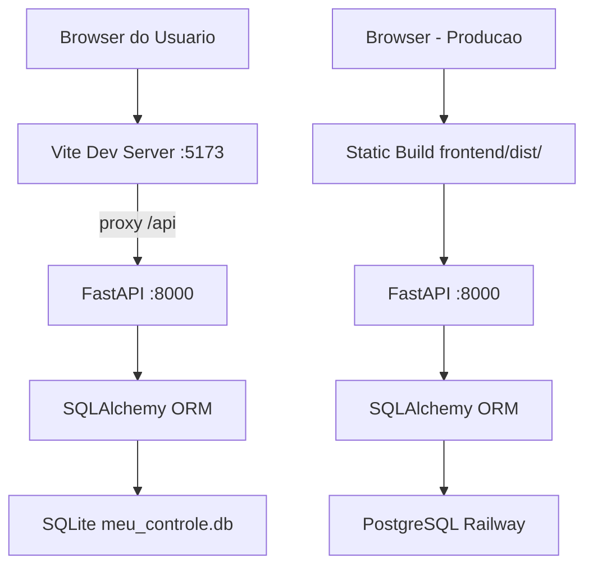
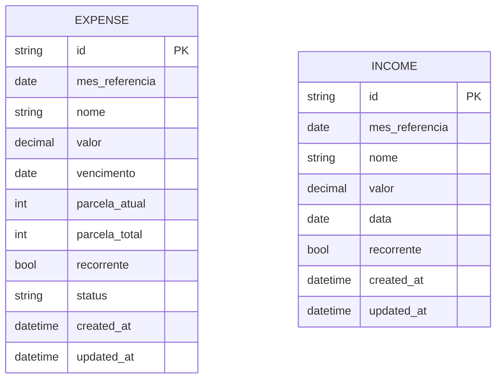

# Arquitetura — Meu Controle

**Versao:** 1.0
**Data:** 2026-02-06
**PRD Ref:** 01-PRD v1.0

---

## 1. Stack Tecnologica

| Camada         | Tecnologia                  | Versao    | Justificativa |
|----------------|-----------------------------|-----------|---------------|
| Frontend       | React + TypeScript          | React 19  | Ecossistema robusto, tipagem forte com TS |
| Build/Dev      | Vite                        | 6.x       | Hot reload rapido, proxy integrado para API backend |
| Estilizacao    | Tailwind CSS                | 4.x       | Plugin Vite nativo, utility-first, sem config extra (v4) |
| State/Fetch    | TanStack Query              | 5.62+     | Cache inteligente, invalidation-based refresh, staleTime configuravel |
| HTTP Client    | fetch nativo                | —         | Suficiente para a API REST; evita dependencia extra |
| Backend        | Python + FastAPI            | FastAPI 0.115 | Framework async com validacao Pydantic nativa, Swagger auto |
| ORM            | SQLAlchemy                  | 2.0+      | ORM maduro; modo sincrono (SQLite nao suporta async I/O real) |
| Banco de Dados | PostgreSQL (prod) + SQLite (dev) | —   | PostgreSQL via Railway add-on em producao; SQLite local para desenvolvimento (CR-001) |
| Migrations     | Alembic                     | 1.14+     | Gerenciamento de schema versionado (CR-001) |
| Validacao      | Pydantic                    | 2.x       | Integrado ao FastAPI, validacao declarativa de schemas |
| Arquitetura    | Monorepo                    | —         | Frontend e backend no mesmo repositorio, deploy simplificado |

---

## 2. Arquitetura Geral

Aplicacao web monolitica com frontend SPA (Single Page Application) e backend REST API. Sem autenticacao, sem API gateway, sem servicos externos na Fase 1.



**Fluxo em desenvolvimento:**
1. Browser acessa `localhost:5173` (Vite dev server)
2. Vite serve o frontend React e faz proxy de `/api/*` para `localhost:8000`
3. FastAPI processa requests, interage com SQLite via SQLAlchemy
4. Response JSON retorna ao frontend via proxy

**Fluxo em producao (Railway):**
1. Frontend compilado como static files servidos junto ao backend
2. FastAPI serve tanto a API quanto os arquivos estaticos
3. Alembic executa migrations antes do startup (`alembic upgrade head`)
4. SQLAlchemy conecta ao PostgreSQL via DATABASE_URL (CR-001)

---

## 3. Estrutura de Pastas

```
Personal Finance/
├── docs/
│   ├── PRD_MeuControle.md
│   ├── SPEC.md
│   ├── 01-PRD.md
│   ├── 02-ARCHITECTURE.md
│   ├── 03-SPEC.md
│   ├── 04-IMPLEMENTATION-PLAN.md
│   └── templates/
│       ├── 00-template-change-request.md
│       ├── 01-template-prd.md
│       ├── 02-template-architecture.md
│       ├── 03-template-spec.md
│       └── 04-template-implementation-plan.md
├── backend/
│   ├── requirements.txt
│   ├── alembic.ini
│   ├── alembic/
│   │   ├── env.py
│   │   ├── script.py.mako
│   │   └── versions/
│   │       └── 001_initial_schema.py
│   └── app/
│       ├── __init__.py
│       ├── main.py
│       ├── database.py
│       ├── models.py
│       ├── schemas.py
│       ├── crud.py
│       ├── services.py
│       └── routers/
│           ├── __init__.py
│           ├── expenses.py
│           ├── incomes.py
│           └── months.py
├── frontend/
│   ├── package.json
│   ├── tsconfig.json
│   ├── tsconfig.app.json
│   ├── vite.config.ts
│   ├── index.html
│   └── src/
│       ├── main.tsx
│       ├── App.tsx
│       ├── index.css
│       ├── types.ts
│       ├── utils/
│       │   ├── format.ts
│       │   └── date.ts
│       ├── services/
│       │   └── api.ts
│       ├── hooks/
│       │   ├── useExpenses.ts
│       │   ├── useIncomes.ts
│       │   └── useMonthTransition.ts
│       ├── components/
│       │   ├── MonthNavigator.tsx
│       │   ├── IncomeTable.tsx
│       │   ├── ExpenseTable.tsx
│       │   ├── SaldoLivre.tsx
│       │   ├── StatusBadge.tsx
│       │   ├── ExpenseFormModal.tsx
│       │   ├── IncomeFormModal.tsx
│       │   └── ConfirmDialog.tsx
│       └── pages/
│           └── MonthlyView.tsx
└── .gitignore
```

---

## 4. Modelagem de Dados



> O mes de referencia nao e uma entidade separada; e representado pelo campo `mes_referencia` em cada registro. A visao mensal e construida via consulta filtrada por esse campo.

### Detalhamento das Entidades

#### Expense (`expenses`)

| Campo          | Tipo          | Restricoes                        | Descricao                                         |
|----------------|---------------|-----------------------------------|----------------------------------------------------|
| id             | String(36)    | PK, auto-gerado (UUID)           | Identificador unico                                |
| mes_referencia | Date          | NOT NULL, INDEX                   | Mes/ano de referencia (ex: 2026-02-01)             |
| nome           | String(255)   | NOT NULL                          | Nome da despesa (ex: "Conta Luz")                  |
| valor          | Numeric(10,2) | NOT NULL                          | Valor em reais                                     |
| vencimento     | Date          | NOT NULL                          | Data de vencimento                                 |
| parcela_atual  | Integer       | Nullable                          | Numero da parcela atual (X em "X de Y")            |
| parcela_total  | Integer       | Nullable                          | Total de parcelas (Y em "X de Y")                  |
| recorrente     | Boolean       | NOT NULL, default True            | Se a despesa e recorrente (replicada todo mes)     |
| status         | String(20)    | NOT NULL, default "Pendente"      | Pendente, Pago, Atrasado                           |
| created_at     | DateTime      | NOT NULL, default now()           | Data de criacao do registro                        |
| updated_at     | DateTime      | NOT NULL, default now(), onupdate | Data da ultima atualizacao                         |

> **Regra de integridade:** Se `parcela_atual` e `parcela_total` forem preenchidos, ambos devem ser inteiros positivos e `parcela_atual <= parcela_total`. Se preenchidos, o campo `recorrente` e ignorado na logica de transicao (parcelas tem regra propria).

#### Income (`incomes`)

| Campo          | Tipo          | Restricoes                        | Descricao                                         |
|----------------|---------------|-----------------------------------|----------------------------------------------------|
| id             | String(36)    | PK, auto-gerado (UUID)           | Identificador unico                                |
| mes_referencia | Date          | NOT NULL, INDEX                   | Mes/ano de referencia                              |
| nome           | String(255)   | NOT NULL                          | Nome da receita (ex: "Salario")                    |
| valor          | Numeric(10,2) | NOT NULL                          | Valor em reais                                     |
| data           | Date          | Nullable                          | Data de recebimento                                |
| recorrente     | Boolean       | NOT NULL, default True            | Se a receita se repete mensalmente                 |
| created_at     | DateTime      | NOT NULL, default now()           | Data de criacao do registro                        |
| updated_at     | DateTime      | NOT NULL, default now(), onupdate | Data da ultima atualizacao                         |

### Relacionamentos

```
Despesa (N) ---- pertence a ----> Mes de referencia (1)
Receita (N) ---- pertence a ----> Mes de referencia (1)
```

---

## 5. Padroes e Convencoes

### Nomenclatura

| Item              | Padrao        | Exemplo                 |
|-------------------|---------------|-------------------------|
| Arquivos Python   | snake_case    | `services.py`           |
| Arquivos TS/TSX   | camelCase     | `useExpenses.ts`        |
| Componentes React | PascalCase    | `ExpenseTable.tsx`      |
| Classes Python    | PascalCase    | `ExpenseStatus`         |
| Funcoes Python    | snake_case    | `get_expenses_by_month` |
| Funcoes TS        | camelCase     | `formatBRL`             |
| Variaveis         | camelCase/snake_case | Conforme linguagem |
| Tabelas BD        | snake_case    | `expenses`, `incomes`   |
| Rotas API         | kebab-case    | `/api/expenses/{id}`    |

### Git

- **Commits:** Conventional Commits (`feat:`, `fix:`, `docs:`, `refactor:`)
- **Branch principal:** `master`

### API

- Todas as rotas sob prefixo `/api/`.
- PATCH para atualizacao parcial (apenas campos enviados sao alterados).
- 201 Created para criacao, 204 No Content para exclusao.
- `mes_referencia` derivado do path parameter da URL, nunca do body.
- Endpoint principal `GET /api/months/{year}/{month}` retorna tudo em uma chamada.

### Estilo de Codigo

- TypeScript em modo strict (`strict: true` no tsconfig).
- Sem linter/formatter configurado na Fase 1 (MVP).

---

## 6. Integracoes Externas

Nenhuma integracao externa na Fase 1. Veja Roadmap Fase 7 no PRD para integracao com Open Finance.

---

## 7. Estrategia de Testes

Fase 1 nao inclui testes automatizados. Verificacao manual conforme checklist definida na SPEC (03-SPEC.md, Secao 6).

| Tipo       | Ferramenta | Cobertura | Escopo |
|------------|------------|-----------|--------|
| Manual     | Browser + Swagger UI | Fluxos criticos | Backend isolado, frontend isolado, fluxo completo |

---

## 8. ADRs (Architecture Decision Records)

### ADR-001: Fetch nativo ao inves de Axios
- **Status:** Aceita
- **Data:** 2026-02-06
- **Contexto:** Precisamos de um HTTP client no frontend para chamadas a API REST.
- **Decisao:** Usar `fetch` nativo do browser ao inves de instalar Axios.
- **Alternativas Consideradas:**
  - Axios: Descartado porque fetch nativo e suficiente para a API simples e evita dependencia extra.
- **Consequencias:**
  - Positivas: Zero dependencias adicionais, API padrao do browser.
  - Negativas: Necessidade de wrapper manual para tratamento de erros e parsing JSON (implementado em `api.ts`).

### ADR-002: SPA sem react-router
- **Status:** Aceita
- **Data:** 2026-02-06
- **Contexto:** A Fase 1 tem exatamente uma pagina (visao mensal). O mes atual e gerenciado como estado React.
- **Decisao:** Nao usar react-router. O mes e gerenciado via `useState` no hook `useMonthlyView`.
- **Alternativas Consideradas:**
  - react-router com rota `/month/:year/:month`: Descartado porque adiciona complexidade sem beneficio para SPA de pagina unica.
- **Consequencias:**
  - Positivas: Menos dependencias, setup mais simples.
  - Negativas: URLs nao refletem o mes visualizado (sem deep linking). Aceitavel para Fase 1.

### ADR-003: create_all sem Alembic
- **Status:** Substituida por ADR-014 (CR-001)
- **Data:** 2026-02-06
- **Contexto:** Precisamos criar as tabelas do banco de dados. O projeto e MVP single-user.
- **Decisao:** ~~Usar `Base.metadata.create_all()` no startup da aplicacao ao inves de Alembic para migrations.~~ Substituida: Alembic adotado em CR-001 para suportar PostgreSQL em producao.
- **Alternativas Consideradas:**
  - Alembic: Descartado inicialmente porque adicionava complexidade de migrations para um MVP onde o schema era estavel e podia ser recriado livremente.
- **Consequencias:**
  - Positivas: Setup mais simples, sem arquivos de migration.
  - Negativas: Alteracoes de schema exigiam recriar o banco. Tornou-se inviavel com PostgreSQL em producao.

### ADR-004: SQLAlchemy sincrono (sem async)
- **Status:** Aceita
- **Data:** 2026-02-06
- **Contexto:** FastAPI suporta tanto sync quanto async. SQLite e o banco escolhido.
- **Decisao:** Usar SQLAlchemy sincrono ao inves de `aiosqlite` + async sessions.
- **Alternativas Consideradas:**
  - SQLAlchemy async com aiosqlite: Descartado porque SQLite nao suporta async I/O real — o driver async apenas wrapa operacoes sync em threads. Adiciona complexidade sem ganho de performance.
- **Consequencias:**
  - Positivas: Codigo mais simples, sem `await` em operacoes de banco.
  - Negativas: ~~Se migrar para PostgreSQL no futuro, precisara reescrever para async.~~ Migracao para PostgreSQL feita (CR-001) mantendo modo sincrono via psycopg2.

### ADR-005: check_same_thread=False para SQLite
- **Status:** Aceita (aplicacao condicional apos CR-001)
- **Data:** 2026-02-06
- **Contexto:** SQLite por padrao so permite acesso da thread que criou a conexao. FastAPI serve requests de multiplas threads.
- **Decisao:** Configurar `connect_args={"check_same_thread": False}` no engine SQLAlchemy. Apos CR-001, aplicado condicionalmente apenas quando DATABASE_URL aponta para SQLite.
- **Alternativas Consideradas:**
  - Nenhuma pratica — e a solucao padrao para SQLite + FastAPI.
- **Consequencias:**
  - Positivas: FastAPI funciona normalmente com SQLite.
  - Negativas: SQLite e single-writer, entao escrita concorrente pode bloquear. Seguro para app single-user. Nao se aplica a PostgreSQL em producao.

### ADR-006: Tipos SQLite-compativeis (UUID como String, Status como String)
- **Status:** Aceita
- **Data:** 2026-02-06
- **Contexto:** SQLite nao tem tipos UUID nem ENUM nativos.
- **Decisao:** Armazenar UUID como `String(36)` e status como `String(20)`. Validacao feita na camada de aplicacao com o enum Python `ExpenseStatus`.
- **Alternativas Consideradas:**
  - SQLAlchemy `Enum` type: Descartado porque gera complicacoes com SQLite (cria CHECK constraints que podem quebrar em alteracoes de schema).
  - Integer ID: Descartado porque UUIDs evitam colisoes e sao melhores para APIs REST.
- **Consequencias:**
  - Positivas: Simplicidade, compatibilidade total com SQLite.
  - Negativas: Sem validacao a nivel de banco para status. Mitigado pela validacao Pydantic.

### ADR-007: mes_referencia via path parameter + MonthlySummary unica resposta
- **Status:** Aceita
- **Data:** 2026-02-06
- **Contexto:** O frontend precisa de despesas, receitas e totalizadores para um mes especifico.
- **Decisao:** URL RESTful `/api/months/{year}/{month}` retorna `MonthlySummary` com tudo em uma chamada. O `mes_referencia` para criacao de despesas/receitas tambem vem do path (`POST /api/expenses/{year}/{month}`).
- **Alternativas Consideradas:**
  - Query parameters (`?year=2026&month=2`): Descartado porque path params sao mais RESTful e produzem URLs mais limpas.
  - Tres chamadas separadas (expenses, incomes, totais): Descartado porque multiplica latencia e complexidade no frontend.
- **Consequencias:**
  - Positivas: Uma chamada carrega toda a pagina. URL limpa e cacheavel.
  - Negativas: Payload maior que chamadas individuais, mas irrelevante para < 100 lancamentos.

### ADR-008: PATCH semantico com exclude_unset
- **Status:** Aceita
- **Data:** 2026-02-06
- **Contexto:** Precisamos de atualizacao parcial (ex: mudar apenas o status de uma despesa).
- **Decisao:** Usar PATCH com `model_dump(exclude_unset=True)` do Pydantic V2 para aplicar apenas campos explicitamente enviados.
- **Alternativas Consideradas:**
  - PUT com body completo: Descartado porque exigiria o frontend enviar todos os campos mesmo para toggle simples de status.
- **Consequencias:**
  - Positivas: Toggle de status e uma chamada com `{ "status": "Pago" }` — minimalista.
  - Negativas: Nenhuma significativa.

### ADR-009: Tailwind CSS v4 via plugin Vite
- **Status:** Aceita
- **Data:** 2026-02-06
- **Contexto:** Tailwind CSS v4 mudou a forma de configuracao em relacao a v3.
- **Decisao:** Usar `@tailwindcss/vite` plugin ao inves de PostCSS. CSS usa `@import "tailwindcss"` e `@theme` block ao inves das diretivas v3 (`@tailwind base/components/utilities`). Nao precisa de `tailwind.config.js`.
- **Alternativas Consideradas:**
  - Tailwind v3 com PostCSS: Descartado porque v4 com plugin Vite e mais simples e moderno.
- **Consequencias:**
  - Positivas: Sem arquivo de config extra, integracao nativa com Vite.
  - Negativas: Documentacao/exemplos online ainda majoritariamente v3 (pode gerar confusao).

### ADR-010: TanStack Query com staleTime 5min, sem optimistic updates
- **Status:** Aceita
- **Data:** 2026-02-06
- **Contexto:** Precisamos gerenciar estado do servidor (dados mensais) no frontend.
- **Decisao:** TanStack Query v5 com `staleTime: 5 minutos` e `retry: 1`. Sem optimistic updates — toda mutacao invalida a query key e faz refetch completo.
- **Alternativas Consideradas:**
  - Optimistic updates: Descartado para Fase 1 porque a abordagem de refetch e mais simples e garante que a UI sempre reflete o estado do servidor.
  - SWR: Descartado porque TanStack Query tem API mais rica para mutations e invalidacao.
- **Consequencias:**
  - Positivas: Simplicidade, UI sempre consistente com servidor.
  - Negativas: Leve delay apos mutacoes (refetch). Imperceptivel para API local.

### ADR-011: Vite proxy /api para FastAPI em dev
- **Status:** Aceita
- **Data:** 2026-02-06
- **Contexto:** Frontend (Vite :5173) e backend (FastAPI :8000) rodam em portas diferentes durante desenvolvimento.
- **Decisao:** Configurar proxy no `vite.config.ts`: `/api` redireciona para `http://localhost:8000`.
- **Alternativas Consideradas:**
  - CORS sem proxy: Descartado porque o proxy elimina problemas de CORS durante dev e permite usar URLs relativas (`/api/...`).
- **Consequencias:**
  - Positivas: Frontend usa mesmas URLs em dev e prod. Zero configuracao de CORS no frontend.
  - Negativas: Backend ainda configura CORS (para acesso direto ao Swagger UI).

### ADR-012: Lifespan async context manager (nao on_event)
- **Status:** Aceita
- **Data:** 2026-02-06
- **Contexto:** Precisamos executar `create_all()` no startup do FastAPI.
- **Decisao:** Usar `@asynccontextmanager` com `lifespan` parameter conforme recomendado pelo FastAPI. O decorator `@app.on_event("startup")` esta deprecado. Apos CR-001, o lifespan nao executa mais `create_all()` (Alembic assume).
- **Alternativas Consideradas:**
  - `@app.on_event("startup")`: Descartado porque esta deprecado no FastAPI moderno.
- **Consequencias:**
  - Positivas: Segue best practice atual do FastAPI, suporte a cleanup no shutdown.
  - Negativas: Nenhuma.

### ADR-013: PostgreSQL em producao, SQLite em desenvolvimento (CR-001)
- **Status:** Aceita
- **Data:** 2026-02-08
- **Contexto:** Railway usa containers efemeros, destruindo o banco SQLite a cada deploy. Dados eram perdidos a cada implantacao.
- **Decisao:** Usar PostgreSQL (add-on Railway) em producao e manter SQLite para desenvolvimento local. DATABASE_URL via variavel de ambiente com fallback SQLite.
- **Alternativas Consideradas:**
  - Volume persistente no Railway: Nao suportado nativamente.
  - PostgreSQL em dev tambem: Adiciona complexidade de setup local sem beneficio para MVP single-user.
- **Consequencias:**
  - Positivas: Dados persistem entre deploys; dev local permanece zero-config.
  - Negativas: Necessidade de testar em ambos os bancos; pequenas diferencas de comportamento possiveis.

### ADR-014: Adotar Alembic para migrations (CR-001, substitui ADR-003)
- **Status:** Aceita
- **Data:** 2026-02-08
- **Contexto:** Com PostgreSQL em producao, `create_all()` nao e suficiente para evolucao segura do schema. Alteracoes de schema exigiam recriar o banco.
- **Decisao:** Adotar Alembic para gerenciar migrations. Migration inicial criada a partir do schema existente. Alembic e executado antes do uvicorn no Dockerfile (`alembic upgrade head`).
- **Alternativas Consideradas:**
  - Manter `create_all()`: Funciona para criacao, mas nao para alteracoes incrementais de schema.
- **Consequencias:**
  - Positivas: Schema versionado, migrations reversiveis, suporte a alteracoes incrementais.
  - Negativas: Complexidade adicional; devs precisam rodar `alembic upgrade head` apos pull.

---

*Documento criado em 2026-02-08. Baseado em SPEC.md v1.0 e PRD_MeuControle.md v1.0.*
