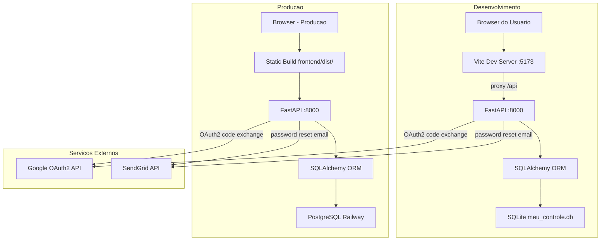
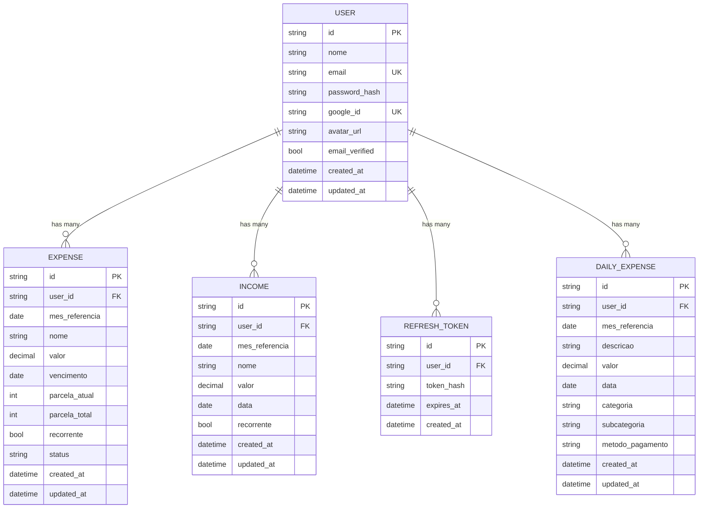
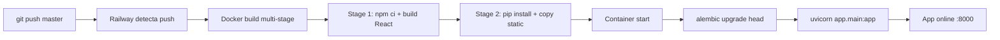

# Arquitetura — Meu Controle

**Versao:** 2.4
**Data:** 2026-02-17
**PRD Ref:** 01-PRD v2.2
**CR Ref:** CR-002 (Multi-usuario e Autenticacao), CR-005 (Gastos Diarios)

---

## 1. Stack Tecnologica

| Camada              | Tecnologia                       | Versao        | Justificativa |
|---------------------|----------------------------------|---------------|---------------|
| Frontend            | React + TypeScript               | React 19      | Ecossistema robusto, tipagem forte com TS |
| Build/Dev           | Vite                             | 6.x           | Hot reload rapido, proxy integrado para API backend |
| Estilizacao         | Tailwind CSS                     | 4.x           | Plugin Vite nativo, utility-first, sem config extra (v4) |
| State/Fetch         | TanStack Query                   | 5.62+         | Cache inteligente, invalidation-based refresh, staleTime configuravel |
| HTTP Client         | fetch nativo                     | —             | Suficiente para a API REST; evita dependencia extra |
| Frontend Routing    | react-router-dom                 | 7.x           | Rotas client-side para paginas de auth e app (CR-002, ADR-017) |
| Token Decode        | jwt-decode                       | 4.x           | Decode de JWT no frontend para extrair expiry e user info (CR-002) |
| Backend             | Python + FastAPI                 | FastAPI 0.115 | Framework async com validacao Pydantic nativa, Swagger auto |
| ORM                 | SQLAlchemy                       | 2.0+          | ORM maduro; modo sincrono (SQLite nao suporta async I/O real) |
| Banco de Dados      | PostgreSQL (prod) + SQLite (dev) | —             | PostgreSQL via Railway add-on em producao; SQLite local para desenvolvimento (CR-001) |
| Migrations          | Alembic                          | 1.14+         | Gerenciamento de schema versionado (CR-001) |
| Validacao           | Pydantic                         | 2.x           | Integrado ao FastAPI, validacao declarativa de schemas |
| Autenticacao (JWT)  | python-jose[cryptography]        | 3.3+          | Criacao e validacao de JWT com HS256 (CR-002, ADR-015) |
| Password Hash       | passlib[bcrypt]                  | 1.7+          | Hashing seguro de senhas com bcrypt (CR-002) |
| HTTP Client (back)  | httpx                            | 0.27+         | Chamadas backend→Google para OAuth2 token exchange (CR-002, ADR-016) |
| Email               | SendGrid (sendgrid)              | 6.11+         | Envio de emails de recuperacao de senha (CR-002) |
| Form Data           | python-multipart                 | 0.0.9+        | Parsing de form data para OAuth2PasswordBearer do FastAPI (CR-002) |
| Env Loading         | python-dotenv                    | 1.0+          | Carrega variaveis de `.env` no backend para desenvolvimento local |
| Arquitetura         | Monorepo                         | —             | Frontend e backend no mesmo repositorio, deploy simplificado |

---

## 2. Arquitetura Geral

Aplicacao web monolitica com frontend SPA (Single Page Application) e backend REST API. Com autenticacao JWT (access + refresh tokens) e login social Google OAuth2 (CR-002). Integracao com SendGrid para envio de emails de recuperacao de senha.



**Fluxo em desenvolvimento:**
1. Browser acessa `localhost:5173` (Vite dev server)
2. Vite serve o frontend React e faz proxy de `/api/*` para `localhost:8000`
3. Requests autenticados enviam `Authorization: Bearer <token>` via header
4. FastAPI valida o JWT, extrai `user_id`, processa request com dados do usuario
5. SQLAlchemy filtra dados por `user_id` e interage com SQLite
6. Response JSON retorna ao frontend via proxy

**Fluxo em producao (Railway):**
1. Frontend compilado como static files servidos junto ao backend
2. FastAPI serve tanto a API quanto os arquivos estaticos
3. Alembic executa migrations antes do startup (`alembic upgrade head`)
4. SQLAlchemy conecta ao PostgreSQL via DATABASE_URL (CR-001)
5. Variaveis de ambiente obrigatorias: `SECRET_KEY`, `DATABASE_URL`. Opcionais: `GOOGLE_CLIENT_ID`, `GOOGLE_CLIENT_SECRET`, `GOOGLE_REDIRECT_URI`, `SENDGRID_API_KEY`
6. `GOOGLE_CLIENT_ID` e servido ao frontend em runtime via `GET /api/config` (nao depende de build-time injection)

**Fluxo de autenticacao (CR-002):**
1. Usuario se registra via `/api/auth/register` (email/senha) ou `/api/auth/google` (Google OAuth2)
2. Backend retorna access token (15min) + refresh token (7 dias)
3. Frontend armazena tokens em localStorage e inclui access token em todas requisicoes
4. Quando access token expira, frontend usa refresh token para obter novo par de tokens
5. Quando refresh token expira, usuario e redirecionado para tela de login

---

## 3. Estrutura de Pastas

```
Personal Finance/
├── docs/
│   ├── PRD_MeuControle.md
│   ├── SPEC.md
│   ├── 01-PRD.md
│   ├── 02-ARCHITECTURE.md
│   ├── 03-SPEC.md
│   ├── 04-IMPLEMENTATION-PLAN.md
│   ├── changes/                    # Change Requests (CR-XXX)
│   │   ├── CR-001-migracao-postgresql-railway.md
│   │   ├── CR-002-multi-usuario-autenticacao.md
│   │   └── CR-005-gastos-diarios.md
│   └── templates/
│       ├── 00-template-change-request.md
│       ├── 01-template-prd.md
│       ├── 02-template-architecture.md
│       ├── 03-template-spec.md
│       └── 04-template-implementation-plan.md
├── backend/
│   ├── requirements.txt
│   ├── alembic.ini
│   ├── alembic/
│   │   ├── env.py
│   │   ├── script.py.mako
│   │   └── versions/
│   │       ├── 001_initial_schema.py
│   │       ├── 002_add_users_and_auth.py    # CR-002
│   │       └── 004_add_daily_expenses.py    # CR-005
│   └── app/
│       ├── __init__.py
│       ├── main.py
│       ├── database.py
│       ├── models.py
│       ├── schemas.py
│       ├── crud.py
│       ├── services.py
│       ├── auth.py                          # CR-002: JWT, password hashing, get_current_user
│       ├── categories.py                    # CR-005: Categorias + metodos pagamento + helpers
│       ├── email_service.py                 # CR-002: SendGrid integration
│       └── routers/
│           ├── __init__.py
│           ├── expenses.py
│           ├── incomes.py
│           ├── months.py
│           ├── auth.py                      # CR-002: register, login, Google, refresh, logout, forgot/reset password
│           ├── users.py                     # CR-002: GET/PATCH /me, change password
│           └── daily_expenses.py            # CR-005: CRUD gastos diarios (5 endpoints)
├── frontend/
│   ├── package.json
│   ├── tsconfig.json
│   ├── tsconfig.app.json
│   ├── vite.config.ts
│   ├── index.html
│   └── src/
│       ├── main.tsx
│       ├── App.tsx
│       ├── index.css
│       ├── types.ts
│       ├── utils/
│       │   ├── format.ts
│       │   └── date.ts
│       ├── contexts/                        # CR-002
│       │   └── AuthContext.tsx               # Auth state provider
│       ├── services/
│       │   ├── api.ts
│       │   └── authApi.ts                   # CR-002: Auth API functions
│       ├── hooks/
│       │   ├── useExpenses.ts
│       │   ├── useIncomes.ts
│       │   ├── useMonthTransition.ts
│       │   ├── useAuth.ts                   # CR-002: Auth convenience hook
│       │   ├── useDailyExpenses.ts          # CR-005: TanStack Query hooks gastos diarios
│       │   └── useDailyExpensesView.ts      # CR-005: Navegacao mensal gastos diarios
│       ├── components/
│       │   ├── MonthNavigator.tsx
│       │   ├── IncomeTable.tsx
│       │   ├── ExpenseTable.tsx
│       │   ├── SaldoLivre.tsx
│       │   ├── StatusBadge.tsx
│       │   ├── ExpenseFormModal.tsx
│       │   ├── IncomeFormModal.tsx
│       │   ├── ConfirmDialog.tsx
│       │   ├── ProtectedRoute.tsx           # CR-002: Route guard
│       │   ├── UserMenu.tsx                 # CR-002: Dropdown perfil/logout
│       │   ├── DailyExpenseTable.tsx        # CR-005: Tabela gastos agrupada por dia
│       │   ├── DailyExpenseFormModal.tsx    # CR-005: Modal formulario gasto diario
│       │   └── ViewSelector.tsx            # CR-005: Seletor Planejados/Diarios
│       └── pages/
│           ├── MonthlyView.tsx
│           ├── LoginPage.tsx                # CR-002
│           ├── RegisterPage.tsx             # CR-002
│           ├── ForgotPasswordPage.tsx       # CR-002
│           ├── ResetPasswordPage.tsx        # CR-002
│           ├── ProfilePage.tsx              # CR-002
│           └── DailyExpensesView.tsx       # CR-005: Pagina gastos diarios
└── .gitignore
```

---

## 4. Modelagem de Dados



> O mes de referencia nao e uma entidade separada; e representado pelo campo `mes_referencia` em cada registro. A visao mensal e construida via consulta filtrada por `user_id` + `mes_referencia`.

### Detalhamento das Entidades

#### User (`users`) — CR-002

| Campo          | Tipo          | Restricoes                        | Descricao                                         |
|----------------|---------------|-----------------------------------|----------------------------------------------------|
| id             | String(36)    | PK, auto-gerado (UUID)           | Identificador unico                                |
| nome           | String(255)   | NOT NULL                          | Nome do usuario                                    |
| email          | String(255)   | NOT NULL, UNIQUE                  | Email do usuario (login)                           |
| password_hash  | String(255)   | Nullable                          | Hash bcrypt da senha. Nullable para usuarios Google-only |
| google_id      | String(255)   | Nullable, UNIQUE                  | ID da conta Google (para login social)             |
| avatar_url     | String(500)   | Nullable                          | URL do avatar (preenchido via Google)              |
| email_verified | Boolean       | NOT NULL, default False           | Se o email foi verificado                          |
| created_at     | DateTime      | NOT NULL, default now()           | Data de criacao do registro                        |
| updated_at     | DateTime      | NOT NULL, default now(), onupdate | Data da ultima atualizacao                         |

> **Regra de integridade:** Um usuario deve ter `password_hash` OU `google_id` preenchido (ou ambos). Usuario sem nenhum dos dois nao pode autenticar.

#### RefreshToken (`refresh_tokens`) — CR-002

| Campo          | Tipo          | Restricoes                        | Descricao                                         |
|----------------|---------------|-----------------------------------|----------------------------------------------------|
| id             | String(36)    | PK, auto-gerado (UUID)           | Identificador unico                                |
| user_id        | String(36)    | NOT NULL, FK→users.id, CASCADE   | Usuario dono do token                              |
| token_hash     | String(255)   | NOT NULL, INDEX                   | Hash do refresh token (nao armazenado em texto plano) |
| expires_at     | DateTime      | NOT NULL                          | Data de expiracao do token                         |
| created_at     | DateTime      | NOT NULL, default now()           | Data de criacao do registro                        |

> **Rotacao de tokens:** Ao usar um refresh token, o antigo e invalidado (deletado) e um novo e gerado. Isso limita o impacto de tokens vazados.

#### Expense (`expenses`)

| Campo          | Tipo          | Restricoes                        | Descricao                                         |
|----------------|---------------|-----------------------------------|----------------------------------------------------|
| id             | String(36)    | PK, auto-gerado (UUID)           | Identificador unico                                |
| user_id        | String(36)    | NOT NULL, FK→users.id, CASCADE   | Usuario dono da despesa (CR-002)                   |
| mes_referencia | Date          | NOT NULL                          | Mes/ano de referencia (ex: 2026-02-01)             |
| nome           | String(255)   | NOT NULL                          | Nome da despesa (ex: "Conta Luz")                  |
| valor          | Numeric(10,2) | NOT NULL                          | Valor em reais                                     |
| vencimento     | Date          | NOT NULL                          | Data de vencimento                                 |
| parcela_atual  | Integer       | Nullable                          | Numero da parcela atual (X em "X de Y")            |
| parcela_total  | Integer       | Nullable                          | Total de parcelas (Y em "X de Y")                  |
| recorrente     | Boolean       | NOT NULL, default True            | Se a despesa e recorrente (replicada todo mes)     |
| status         | String(20)    | NOT NULL, default "Pendente"      | Pendente, Pago, Atrasado                           |
| created_at     | DateTime      | NOT NULL, default now()           | Data de criacao do registro                        |
| updated_at     | DateTime      | NOT NULL, default now(), onupdate | Data da ultima atualizacao                         |

> **Regra de integridade:** Se `parcela_atual` e `parcela_total` forem preenchidos, ambos devem ser inteiros positivos e `parcela_atual <= parcela_total`. Se preenchidos, o campo `recorrente` e ignorado na logica de transicao (parcelas tem regra propria).

> **Indice composto (CR-002):** `ix_expenses_user_month (user_id, mes_referencia)` substitui o indice antigo `ix_expenses_mes_referencia` para otimizar consultas por usuario + mes.

#### Income (`incomes`)

| Campo          | Tipo          | Restricoes                        | Descricao                                         |
|----------------|---------------|-----------------------------------|----------------------------------------------------|
| id             | String(36)    | PK, auto-gerado (UUID)           | Identificador unico                                |
| user_id        | String(36)    | NOT NULL, FK→users.id, CASCADE   | Usuario dono da receita (CR-002)                   |
| mes_referencia | Date          | NOT NULL                          | Mes/ano de referencia                              |
| nome           | String(255)   | NOT NULL                          | Nome da receita (ex: "Salario")                    |
| valor          | Numeric(10,2) | NOT NULL                          | Valor em reais                                     |
| data           | Date          | Nullable                          | Data de recebimento                                |
| recorrente     | Boolean       | NOT NULL, default True            | Se a receita se repete mensalmente                 |
| created_at     | DateTime      | NOT NULL, default now()           | Data de criacao do registro                        |
| updated_at     | DateTime      | NOT NULL, default now(), onupdate | Data da ultima atualizacao                         |

> **Indice composto (CR-002):** `ix_incomes_user_month (user_id, mes_referencia)` substitui o indice antigo `ix_incomes_mes_referencia`.

#### DailyExpense (`daily_expenses`) — CR-005

| Campo              | Tipo           | Restricoes                        | Descricao                                         |
|--------------------|----------------|-----------------------------------|----------------------------------------------------|
| id                 | String(36)     | PK, auto-gerado (UUID)           | Identificador unico                                |
| user_id            | String(36)     | NOT NULL, FK→users.id, CASCADE   | Usuario dono do gasto diario                       |
| mes_referencia     | Date           | NOT NULL                          | Mes/ano de referencia (ex: 2026-02-01)             |
| descricao          | String(255)    | NOT NULL                          | Descricao do gasto (ex: "Compras no mercado")      |
| valor              | Numeric(10,2)  | NOT NULL                          | Valor em reais                                     |
| data               | Date           | NOT NULL                          | Data em que o gasto ocorreu                        |
| categoria          | String(50)     | NOT NULL                          | Categoria auto-derivada da subcategoria            |
| subcategoria       | String(50)     | NOT NULL                          | Subcategoria escolhida pelo usuario                |
| metodo_pagamento   | String(30)     | NOT NULL                          | Metodo de pagamento utilizado                      |
| created_at         | DateTime       | NOT NULL, default now()           | Data de criacao do registro                        |
| updated_at         | DateTime       | NOT NULL, default now(), onupdate | Data da ultima atualizacao                         |

> **Indice composto:** `ix_daily_expenses_user_month (user_id, mes_referencia)` para consultas por usuario + mes. Indice adicional `ix_daily_expenses_data` no campo `data`.

> **Categorias:** 14 categorias fixas + "Outros" definidas em `backend/app/categories.py`. A categoria e derivada automaticamente da subcategoria via `get_category_for_subcategory()`.

### Relacionamentos

```
Usuario (1) ---- possui ----> Despesa (N)
Usuario (1) ---- possui ----> Receita (N)
Usuario (1) ---- possui ----> RefreshToken (N)
Usuario (1) ---- possui ----> GastoDiario (N)
Despesa (N) ---- pertence a ----> Mes de referencia (1)
Receita (N) ---- pertence a ----> Mes de referencia (1)
GastoDiario (N) ---- pertence a ----> Mes de referencia (1)
```

> **Isolamento de dados (CR-002):** Cada usuario so pode ver, criar, editar e deletar seus proprios dados. Todas as queries CRUD filtram por `user_id`. Operacoes de update/delete verificam ownership antes de executar.

> **Cascade delete:** Se um usuario for deletado, todas suas despesas, receitas, gastos diarios e refresh tokens sao automaticamente removidos (`ON DELETE CASCADE`).

---

## 5. Padroes e Convencoes

### Nomenclatura

| Item              | Padrao        | Exemplo                 |
|-------------------|---------------|-------------------------|
| Arquivos Python   | snake_case    | `services.py`, `email_service.py` |
| Arquivos TS/TSX   | camelCase     | `useExpenses.ts`, `useAuth.ts` |
| Componentes React | PascalCase    | `ExpenseTable.tsx`, `ProtectedRoute.tsx` |
| Classes Python    | PascalCase    | `ExpenseStatus`, `User` |
| Funcoes Python    | snake_case    | `get_expenses_by_month`, `get_current_user` |
| Funcoes TS        | camelCase     | `formatBRL`, `loginUser` |
| Variaveis         | camelCase/snake_case | Conforme linguagem |
| Tabelas BD        | snake_case    | `expenses`, `incomes`, `users`, `refresh_tokens`, `daily_expenses` |
| Rotas API         | kebab-case    | `/api/expenses/{id}`, `/api/auth/forgot-password`, `/api/daily-expenses/{id}` |

### Git

- **Commits:** Conventional Commits (`feat:`, `fix:`, `docs:`, `refactor:`)
- **Branch principal:** `master`

### API

- Todas as rotas sob prefixo `/api/`.
- PATCH para atualizacao parcial (apenas campos enviados sao alterados).
- 201 Created para criacao, 204 No Content para exclusao.
- `mes_referencia` derivado do path parameter da URL, nunca do body.
- Endpoint principal `GET /api/months/{year}/{month}` retorna tudo em uma chamada.
- Endpoints protegidos requerem header `Authorization: Bearer <access_token>` (CR-002).
- Endpoints publicos (`/api/auth/*` exceto logout) nao requerem token (CR-002).
- Ownership verification: operacoes em expense/income/daily-expense verificam `user_id` antes de permitir (CR-002, CR-005).
- 401 Unauthorized para token invalido, expirado, ou ausente (CR-002).
- Endpoints de gastos diarios `/api/daily-expenses/*` seguem o mesmo padrao: auth required, ownership check, PATCH parcial (CR-005).
- Endpoint `/api/daily-expenses/categories` e publico (nao requer auth) — retorna categorias e metodos de pagamento.

### Autenticacao (CR-002)

- **JWT access token:** Vida util de 15 minutos. Contem `sub` (user_id) e `email` no payload. Assinado com HS256 usando `SECRET_KEY`.
- **JWT refresh token:** Vida util de 7 dias. Armazenado como hash no banco (`refresh_tokens`). Rotacao obrigatoria: token antigo invalidado ao usar.
- **Bearer token:** Enviado no header `Authorization: Bearer <token>` em todas requisicoes autenticadas.
- **Password hashing:** bcrypt via passlib. Nunca armazenar senha em texto plano.
- **Dependency injection:** `get_current_user` como `Depends()` do FastAPI — extrai e valida token do header, retorna instancia `User`.
- **Google OAuth2:** Authorization Code flow. Frontend redireciona para Google, backend troca `code` por tokens via httpx.
- **Armazenamento frontend:** Tokens em `localStorage`. Access token incluso automaticamente via wrapper `request()` em `api.ts`.

### Estilo de Codigo

- TypeScript em modo strict (`strict: true` no tsconfig).
- Sem linter/formatter configurado na Fase 1 (MVP).

---

## 6. Integracoes Externas

### Google OAuth2 (CR-002, ADR-016)

| Item             | Valor |
|------------------|-------|
| Servico          | Google Identity Platform |
| Proposito        | Login social com conta Google |
| Protocolo        | OAuth 2.0 Authorization Code flow |
| Vars de Ambiente | `GOOGLE_CLIENT_ID`, `GOOGLE_CLIENT_SECRET`, `GOOGLE_REDIRECT_URI` |
| Config Frontend  | `GET /api/config` retorna `google_client_id` em runtime |

**Fluxo:**
1. Frontend busca `google_client_id` de `GET /api/config` e abre tela de consentimento Google (redirect com `client_id`, `redirect_uri`, `scope=openid email profile`)
2. Google redireciona de volta com `code` na URL
3. Frontend envia `code` para `POST /api/auth/google`
4. Backend troca `code` por tokens Google via httpx (`https://oauth2.googleapis.com/token`)
5. Backend extrai info do usuario (email, nome, avatar) do ID token
6. Backend cria/vincula usuario local e retorna JWT tokens proprios

### SendGrid (CR-002)

| Item             | Valor |
|------------------|-------|
| Servico          | SendGrid Email API |
| Proposito        | Envio de emails de recuperacao de senha |
| Vars de Ambiente | `SENDGRID_API_KEY`, `SENDGRID_FROM_EMAIL`, `FRONTEND_URL` |

**Fluxo:**
1. Usuario solicita recuperacao via `POST /api/auth/forgot-password` com email
2. Backend gera token temporario (JWT com 1h de expiracao)
3. Backend envia email via SendGrid com link: `{FRONTEND_URL}/reset-password?token={token}`
4. Usuario clica no link, frontend abre `ResetPasswordPage`
5. Usuario define nova senha, frontend envia para `POST /api/auth/reset-password`

**Degradacao graciosa:** Se `SENDGRID_API_KEY` nao estiver configurada, o endpoint loga um warning mas nao retorna erro (por seguranca, nao revela se o email existe). Em desenvolvimento, o token de reset e logado no console do servidor.

---

## 7. Estrategia de Testes

Fase 1 nao inclui testes automatizados. Verificacao manual conforme checklist definida na SPEC (03-SPEC.md, Secao 6). Testes de autenticacao definidos no CR-002 (tarefas CR-T-34 a CR-T-39).

| Tipo       | Ferramenta | Cobertura | Escopo |
|------------|------------|-----------|--------|
| Manual     | Browser + Swagger UI | Fluxos criticos | Backend isolado, frontend isolado, fluxo completo |

---

## 8. ADRs (Architecture Decision Records)

### ADR-001: Fetch nativo ao inves de Axios
- **Status:** Aceita
- **Data:** 2026-02-06
- **Contexto:** Precisamos de um HTTP client no frontend para chamadas a API REST.
- **Decisao:** Usar `fetch` nativo do browser ao inves de instalar Axios.
- **Alternativas Consideradas:**
  - Axios: Descartado porque fetch nativo e suficiente para a API simples e evita dependencia extra.
- **Consequencias:**
  - Positivas: Zero dependencias adicionais, API padrao do browser.
  - Negativas: Necessidade de wrapper manual para tratamento de erros e parsing JSON (implementado em `api.ts`).

### ADR-002: SPA sem react-router
- **Status:** Substituida por ADR-017 (CR-002)
- **Data:** 2026-02-06
- **Contexto:** A Fase 1 tem exatamente uma pagina (visao mensal). O mes atual e gerenciado como estado React.
- **Decisao:** ~~Nao usar react-router. O mes e gerenciado via `useState` no hook `useMonthlyView`.~~ Substituida: Com autenticacao (CR-002), multiplas paginas sao necessarias (login, register, forgot-password, reset-password, profile, dashboard). React Router adotado via ADR-017.
- **Alternativas Consideradas:**
  - react-router com rota `/month/:year/:month`: Descartado na Fase 1 porque adiciona complexidade sem beneficio para SPA de pagina unica.
- **Consequencias:**
  - Positivas: Menos dependencias, setup mais simples.
  - Negativas: URLs nao refletem o mes visualizado (sem deep linking). Tornou-se insuficiente com autenticacao.

### ADR-003: create_all sem Alembic
- **Status:** Substituida por ADR-014 (CR-001)
- **Data:** 2026-02-06
- **Contexto:** Precisamos criar as tabelas do banco de dados. O projeto e MVP single-user.
- **Decisao:** ~~Usar `Base.metadata.create_all()` no startup da aplicacao ao inves de Alembic para migrations.~~ Substituida: Alembic adotado em CR-001 para suportar PostgreSQL em producao.
- **Alternativas Consideradas:**
  - Alembic: Descartado inicialmente porque adicionava complexidade de migrations para um MVP onde o schema era estavel e podia ser recriado livremente.
- **Consequencias:**
  - Positivas: Setup mais simples, sem arquivos de migration.
  - Negativas: Alteracoes de schema exigiam recriar o banco. Tornou-se inviavel com PostgreSQL em producao.

### ADR-004: SQLAlchemy sincrono (sem async)
- **Status:** Aceita
- **Data:** 2026-02-06
- **Contexto:** FastAPI suporta tanto sync quanto async. SQLite e o banco escolhido.
- **Decisao:** Usar SQLAlchemy sincrono ao inves de `aiosqlite` + async sessions.
- **Alternativas Consideradas:**
  - SQLAlchemy async com aiosqlite: Descartado porque SQLite nao suporta async I/O real — o driver async apenas wrapa operacoes sync em threads. Adiciona complexidade sem ganho de performance.
- **Consequencias:**
  - Positivas: Codigo mais simples, sem `await` em operacoes de banco.
  - Negativas: ~~Se migrar para PostgreSQL no futuro, precisara reescrever para async.~~ Migracao para PostgreSQL feita (CR-001) mantendo modo sincrono via psycopg2.

### ADR-005: check_same_thread=False para SQLite
- **Status:** Aceita (aplicacao condicional apos CR-001)
- **Data:** 2026-02-06
- **Contexto:** SQLite por padrao so permite acesso da thread que criou a conexao. FastAPI serve requests de multiplas threads.
- **Decisao:** Configurar `connect_args={"check_same_thread": False}` no engine SQLAlchemy. Apos CR-001, aplicado condicionalmente apenas quando DATABASE_URL aponta para SQLite.
- **Alternativas Consideradas:**
  - Nenhuma pratica — e a solucao padrao para SQLite + FastAPI.
- **Consequencias:**
  - Positivas: FastAPI funciona normalmente com SQLite.
  - Negativas: SQLite e single-writer, entao escrita concorrente pode bloquear. Seguro para app single-user. Nao se aplica a PostgreSQL em producao.

### ADR-006: Tipos SQLite-compativeis (UUID como String, Status como String)
- **Status:** Aceita
- **Data:** 2026-02-06
- **Contexto:** SQLite nao tem tipos UUID nem ENUM nativos.
- **Decisao:** Armazenar UUID como `String(36)` e status como `String(20)`. Validacao feita na camada de aplicacao com o enum Python `ExpenseStatus`.
- **Alternativas Consideradas:**
  - SQLAlchemy `Enum` type: Descartado porque gera complicacoes com SQLite (cria CHECK constraints que podem quebrar em alteracoes de schema).
  - Integer ID: Descartado porque UUIDs evitam colisoes e sao melhores para APIs REST.
- **Consequencias:**
  - Positivas: Simplicidade, compatibilidade total com SQLite.
  - Negativas: Sem validacao a nivel de banco para status. Mitigado pela validacao Pydantic.

### ADR-007: mes_referencia via path parameter + MonthlySummary unica resposta
- **Status:** Aceita
- **Data:** 2026-02-06
- **Contexto:** O frontend precisa de despesas, receitas e totalizadores para um mes especifico.
- **Decisao:** URL RESTful `/api/months/{year}/{month}` retorna `MonthlySummary` com tudo em uma chamada. O `mes_referencia` para criacao de despesas/receitas tambem vem do path (`POST /api/expenses/{year}/{month}`).
- **Alternativas Consideradas:**
  - Query parameters (`?year=2026&month=2`): Descartado porque path params sao mais RESTful e produzem URLs mais limpas.
  - Tres chamadas separadas (expenses, incomes, totais): Descartado porque multiplica latencia e complexidade no frontend.
- **Consequencias:**
  - Positivas: Uma chamada carrega toda a pagina. URL limpa e cacheavel.
  - Negativas: Payload maior que chamadas individuais, mas irrelevante para < 100 lancamentos.

### ADR-008: PATCH semantico com exclude_unset
- **Status:** Aceita
- **Data:** 2026-02-06
- **Contexto:** Precisamos de atualizacao parcial (ex: mudar apenas o status de uma despesa).
- **Decisao:** Usar PATCH com `model_dump(exclude_unset=True)` do Pydantic V2 para aplicar apenas campos explicitamente enviados.
- **Alternativas Consideradas:**
  - PUT com body completo: Descartado porque exigiria o frontend enviar todos os campos mesmo para toggle simples de status.
- **Consequencias:**
  - Positivas: Toggle de status e uma chamada com `{ "status": "Pago" }` — minimalista.
  - Negativas: Nenhuma significativa.

### ADR-009: Tailwind CSS v4 via plugin Vite + Design System
- **Status:** Aceita (expandida em CR-003)
- **Data:** 2026-02-06 (expandida 2026-02-11)
- **Contexto:** Tailwind CSS v4 mudou a forma de configuracao em relacao a v3. Em CR-003, um design system coeso foi adotado sobre essa base.
- **Decisao:** Usar `@tailwindcss/vite` plugin ao inves de PostCSS. CSS usa `@import "tailwindcss"` e `@theme` block ao inves das diretivas v3 (`@tailwind base/components/utilities`). Nao precisa de `tailwind.config.js`.
- **Design System (CR-003):**
  - Tipografia: Outfit (Google Fonts) importada via `@import url()` no `index.css`, definida como `--font-sans` no `@theme`.
  - Tokens de cor semanticos no bloco `@theme`: `surface`, `background`, `text`, `text-muted`, `border`, `primary-50`, `primary-light`, `accent`, `accent-light`, status (`pendente`, `pago`, `atrasado` com variantes `-bg`).
  - Animacoes CSS customizadas: `float`, `float-reverse`, `fade-in-up`, `pulse-soft` — usadas em paginas de autenticacao para micro-interacoes decorativas.
  - Convencoes de classes: cards `rounded-2xl`, inputs `rounded-xl`, modais com `backdrop-blur-[2px]`, botoes com `active:scale-[0.98]`.
  - Documento de referencia visual: `docs/design-brief.md`.
  - Detalhamento completo dos tokens e padroes: `docs/03-SPEC.md` Secao 3 (Design System).
- **Alternativas Consideradas:**
  - Tailwind v3 com PostCSS: Descartado porque v4 com plugin Vite e mais simples e moderno.
  - CSS Modules ou styled-components: Descartado porque Tailwind v4 com `@theme` oferece design tokens nativos sem dependencia extra.
- **Consequencias:**
  - Positivas: Sem arquivo de config extra, integracao nativa com Vite, design system via CSS puro (sem JS runtime).
  - Negativas: Documentacao/exemplos online ainda majoritariamente v3 (pode gerar confusao).

### ADR-010: TanStack Query com staleTime 5min, sem optimistic updates
- **Status:** Aceita
- **Data:** 2026-02-06
- **Contexto:** Precisamos gerenciar estado do servidor (dados mensais) no frontend.
- **Decisao:** TanStack Query v5 com `staleTime: 5 minutos` e `retry: 1`. Sem optimistic updates — toda mutacao invalida a query key e faz refetch completo.
- **Alternativas Consideradas:**
  - Optimistic updates: Descartado para Fase 1 porque a abordagem de refetch e mais simples e garante que a UI sempre reflete o estado do servidor.
  - SWR: Descartado porque TanStack Query tem API mais rica para mutations e invalidacao.
- **Consequencias:**
  - Positivas: Simplicidade, UI sempre consistente com servidor.
  - Negativas: Leve delay apos mutacoes (refetch). Imperceptivel para API local.

### ADR-011: Vite proxy /api para FastAPI em dev
- **Status:** Aceita
- **Data:** 2026-02-06
- **Contexto:** Frontend (Vite :5173) e backend (FastAPI :8000) rodam em portas diferentes durante desenvolvimento.
- **Decisao:** Configurar proxy no `vite.config.ts`: `/api` redireciona para `http://localhost:8000`.
- **Alternativas Consideradas:**
  - CORS sem proxy: Descartado porque o proxy elimina problemas de CORS durante dev e permite usar URLs relativas (`/api/...`).
- **Consequencias:**
  - Positivas: Frontend usa mesmas URLs em dev e prod. Zero configuracao de CORS no frontend.
  - Negativas: Backend ainda configura CORS (para acesso direto ao Swagger UI).

### ADR-012: Lifespan async context manager (nao on_event)
- **Status:** Aceita
- **Data:** 2026-02-06
- **Contexto:** Precisamos executar `create_all()` no startup do FastAPI.
- **Decisao:** Usar `@asynccontextmanager` com `lifespan` parameter conforme recomendado pelo FastAPI. O decorator `@app.on_event("startup")` esta deprecado. Apos CR-001, o lifespan nao executa mais `create_all()` (Alembic assume).
- **Alternativas Consideradas:**
  - `@app.on_event("startup")`: Descartado porque esta deprecado no FastAPI moderno.
- **Consequencias:**
  - Positivas: Segue best practice atual do FastAPI, suporte a cleanup no shutdown.
  - Negativas: Nenhuma.

### ADR-013: PostgreSQL em producao, SQLite em desenvolvimento (CR-001)
- **Status:** Aceita
- **Data:** 2026-02-08
- **Contexto:** Railway usa containers efemeros, destruindo o banco SQLite a cada deploy. Dados eram perdidos a cada implantacao.
- **Decisao:** Usar PostgreSQL (add-on Railway) em producao e manter SQLite para desenvolvimento local. DATABASE_URL via variavel de ambiente com fallback SQLite.
- **Alternativas Consideradas:**
  - Volume persistente no Railway: Nao suportado nativamente.
  - PostgreSQL em dev tambem: Adiciona complexidade de setup local sem beneficio para MVP single-user.
- **Consequencias:**
  - Positivas: Dados persistem entre deploys; dev local permanece zero-config.
  - Negativas: Necessidade de testar em ambos os bancos; pequenas diferencas de comportamento possiveis.

### ADR-014: Adotar Alembic para migrations (CR-001, substitui ADR-003)
- **Status:** Aceita
- **Data:** 2026-02-08
- **Contexto:** Com PostgreSQL em producao, `create_all()` nao e suficiente para evolucao segura do schema. Alteracoes de schema exigiam recriar o banco.
- **Decisao:** Adotar Alembic para gerenciar migrations. Migration inicial criada a partir do schema existente. Alembic e executado antes do uvicorn no Dockerfile (`alembic upgrade head`).
- **Alternativas Consideradas:**
  - Manter `create_all()`: Funciona para criacao, mas nao para alteracoes incrementais de schema.
- **Consequencias:**
  - Positivas: Schema versionado, migrations reversiveis, suporte a alteracoes incrementais.
  - Negativas: Complexidade adicional; devs precisam rodar `alembic upgrade head` apos pull.

### ADR-015: JWT tokens em localStorage (CR-002)
- **Status:** Aceita
- **Data:** 2026-02-09
- **Contexto:** O frontend SPA precisa armazenar tokens JWT para autenticacao stateless. As opcoes sao localStorage, sessionStorage, ou httpOnly cookies.
- **Decisao:** Usar `localStorage` para armazenar access token (15 minutos) e refresh token (7 dias). Tokens sao lidos pelo wrapper `request()` em `api.ts` e incluidos automaticamente como header `Authorization: Bearer`.
- **Alternativas Consideradas:**
  - httpOnly cookies: Mais seguro contra XSS, mas adiciona complexidade de protecao CSRF e complica o setup do proxy Vite. Tokens em cookies exigem configuracao `SameSite`, `Secure`, e `Domain` — mais complexo para dev/prod.
  - sessionStorage: Tokens perdidos ao fechar a aba do browser. Experiencia ruim para o usuario.
- **Consequencias:**
  - Positivas: Implementacao simples, funciona bem com Vite proxy e fetch nativo, persiste entre sessoes.
  - Negativas: Vulneravel a XSS. Mitigado pela ausencia de conteudo HTML gerado por usuario (UGC) e pela curta vida util do access token (15min). Documentado como limitacao conhecida para futura melhoria.

### ADR-016: Google OAuth2 direto, sem Firebase/Auth0 (CR-002)
- **Status:** Aceita
- **Data:** 2026-02-09
- **Contexto:** O app precisa oferecer login social com Google alem do cadastro com email/senha. As opcoes sao implementar OAuth2 diretamente ou usar um servico intermediario.
- **Decisao:** Implementar Google OAuth2 via Authorization Code flow diretamente. Frontend redireciona para Google consent screen. Backend troca `code` por tokens Google usando `httpx` e extrai dados do usuario (email, nome, avatar) do ID token.
- **Alternativas Consideradas:**
  - Firebase Authentication: Descartado para manter controle total da autenticacao e evitar dependencia de servico externo pago/limitado.
  - Auth0 / Clerk: Descartado pelo mesmo motivo — adiciona custo mensal e dependencia que pode ser evitada.
- **Consequencias:**
  - Positivas: Controle total do fluxo, sem custos de servico externo, dados de usuario no proprio banco, sem vendor lock-in.
  - Negativas: Mais codigo para implementar e manter. Requer configurar app no Google Cloud Console. Futuras integracoes sociais (Facebook, GitHub) exigirao implementacao individual.

### ADR-017: Adotar React Router, substituindo ADR-002 (CR-002)
- **Status:** Aceita (substitui ADR-002)
- **Data:** 2026-02-09
- **Contexto:** Com autenticacao, o app precisa de multiplas paginas: login, registro, recuperacao de senha (forgot + reset), perfil, e dashboard. Alem disso, a pagina de reset-password recebe um token via query parameter na URL, exigindo deep-linking funcional.
- **Decisao:** Adotar `react-router-dom` v7+ para gerenciar rotas client-side. Rotas publicas (`/login`, `/register`, `/forgot-password`, `/reset-password`) e rotas protegidas (`/`, `/profile`) com componente `ProtectedRoute`.
- **Alternativas Consideradas:**
  - Manter renderizacao condicional sem router (como na Fase 1): Inviavel com 6+ paginas e necessidade de deep-linking (link de reset-password por email precisa abrir diretamente a pagina correta com token na URL).
- **Consequencias:**
  - Positivas: URLs semanticas, deep-linking funcional, layout aninhado com `<Outlet />` e `ProtectedRoute`. SPA fallback do backend (`serve_spa` em `main.py`) ja funciona — serve `index.html` para todas rotas nao-API.
  - Negativas: Dependencia adicional (`react-router-dom`). Configuracao de rotas requer reestruturacao do `App.tsx`.

---

## 9. Deploy e Infraestrutura

### 9.1 Plataforma de Producao

| Item | Valor |
|------|-------|
| Hosting | Railway (container Docker) |
| Banco de dados | PostgreSQL (Railway add-on) |
| Build trigger | Push para branch `master` (auto-deploy) |
| Container base | `python:3.12-slim` (backend) + `node:20-alpine` (frontend build) |

### 9.2 Pipeline de Deploy



1. Push para `master` aciona build automatico no Railway
2. Dockerfile multi-stage: Stage 1 compila frontend (Node 20), Stage 2 prepara backend (Python 3.12)
3. Container inicia: `alembic upgrade head` executa migrations pendentes
4. `uvicorn` inicia o servidor FastAPI na porta 8000
5. FastAPI serve API (`/api/*`) e arquivos estaticos do frontend (SPA fallback)

### 9.3 Verificacao e Rollback

Procedimentos detalhados de checklist pre-deploy, rollback (codigo, migration, variaveis), backup de banco e verificacao pos-deploy estao documentados em:

> **`/docs/05-DEPLOY-GUIDE.md`**

### 9.4 Health Check

- **Endpoint:** `GET /api/config` retorna `{"google_client_id": "..."}` (confirma que app esta respondendo)
- **Uso:** Verificacao manual pos-deploy
- **Futuro:** Adicionar `HEALTHCHECK` no Dockerfile (ver Plano de Evolucao P1)

---

## 10. Gestao de Dependencias

### 10.1 Politica de Pinning

| Ecossistema | Estrategia | Formato | Exemplo | Justificativa |
|-------------|------------|---------|---------|---------------|
| Backend (pip) | Major.Minor fixo, patch livre | `==X.Y.*` | `fastapi==0.115.*` | Permite bug fixes automaticos, bloqueia breaking changes |
| Frontend (npm) | Caret ranges | `^X.Y.Z` | `"react": "^19.0.0"` | Padrao npm, permite minor+patch, bloqueia major |
| Lock files | Backend: nenhum; Frontend: `package-lock.json` | — | — | Frontend usa lock para builds reprodutiveis; backend depende dos ranges em `requirements.txt` |

**Pins criticos (nao alterar sem testar):**

| Dependencia | Pin | Motivo |
|-------------|-----|--------|
| `bcrypt` | `==4.0.*` | passlib 1.7.x incompativel com bcrypt >= 4.1 (ver Troubleshooting no CLAUDE.md) |

### 10.2 Processo de Auditoria

Executar periodicamente (recomendado: antes de cada CR ou mensalmente):

**Backend:**
```bash
cd backend
pip audit                          # Verifica vulnerabilidades conhecidas
pip list --outdated                # Lista pacotes com versao mais nova disponivel
```

**Frontend:**
```bash
cd frontend
npm audit                          # Verifica vulnerabilidades conhecidas
npm outdated                       # Lista pacotes com versao mais nova disponivel
```

### 10.3 Processo de Atualizacao

1. **Verificar:** Executar auditoria (10.2) e identificar dependencias a atualizar
2. **Avaliar impacto:** Consultar changelog da dependencia para breaking changes
3. **Atualizar:** Alterar versao em `requirements.txt` ou `package.json`
4. **Testar localmente:**
   - Backend: `pip install -r requirements.txt && alembic upgrade head && python -m uvicorn app.main:app --reload`
   - Frontend: `npm install && npm run build`
5. **Validar:** Executar testes existentes e verificar funcionalidades afetadas
6. **Commit:** `chore: update [dependencia] to X.Y.Z`

**Regras:**
- Nunca atualizar multiplas dependencias em um unico commit
- Atualizar pin critico (`bcrypt`) requer teste explicito do fluxo de autenticacao
- Se a atualizacao introduzir um problema, documentar em "Troubleshooting" no `CLAUDE.md`

---

*Documento criado em 2026-02-08. Atualizado para v2.0 em 2026-02-09 (CR-002: Multi-usuario e Autenticacao). Atualizado para v2.1 em 2026-02-11 (Adicionada secao Deploy e Infraestrutura). Atualizado para v2.2 em 2026-02-11 (P2-2: Secao Gestao de Dependencias). Atualizado para v2.3 em 2026-02-11 (CR-003: Design System no ADR-009). Atualizado para v2.4 em 2026-02-17 (CR-005: Gastos Diarios — DailyExpense model, ER diagram, folder structure, novos arquivos). Baseado em SPEC.md v1.0, PRD_MeuControle.md v1.0, CR-002, CR-003 e CR-005.*
