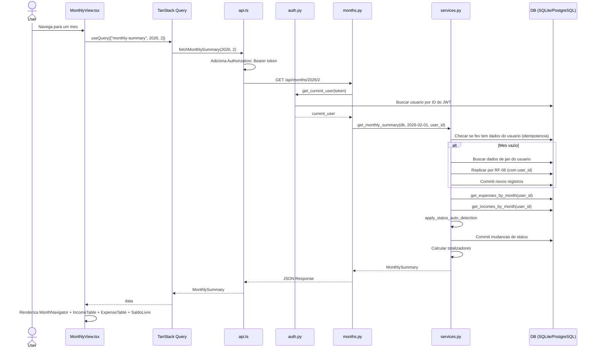
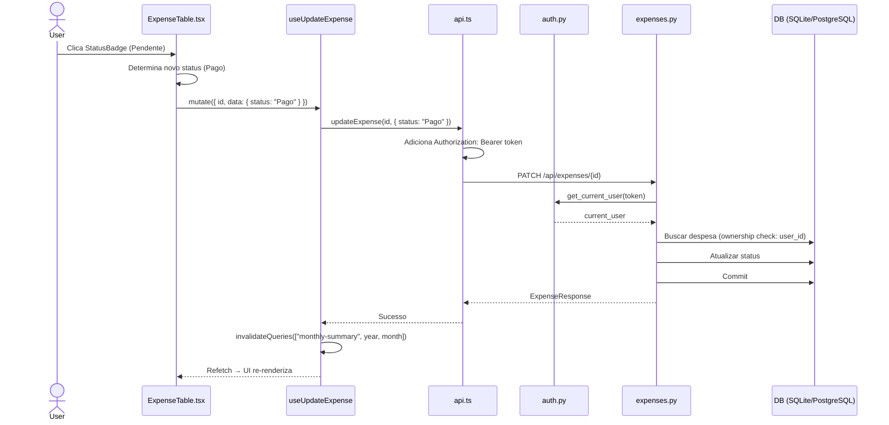
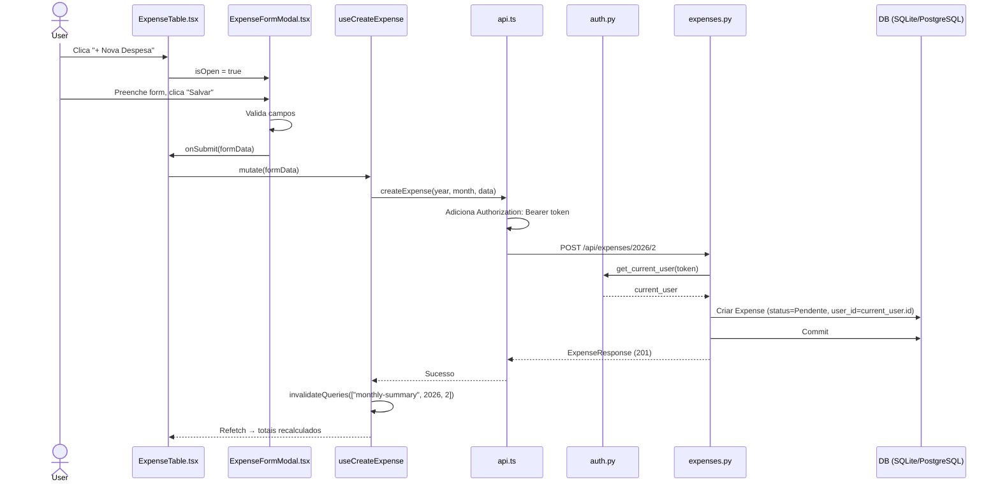
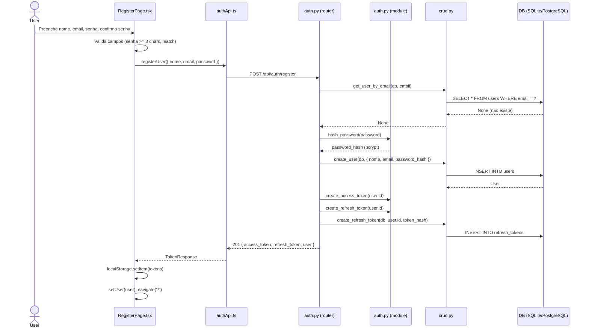
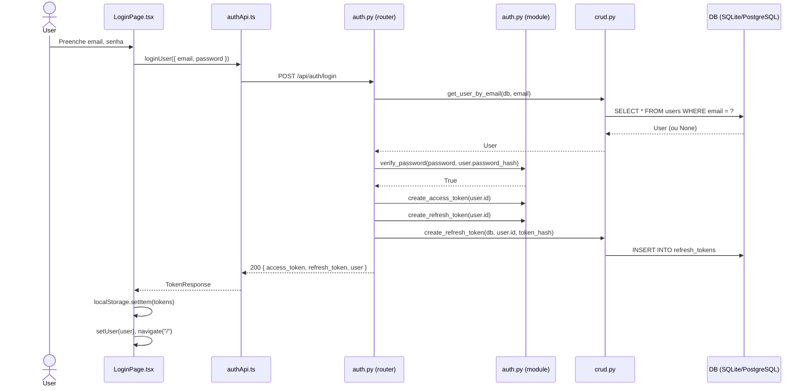
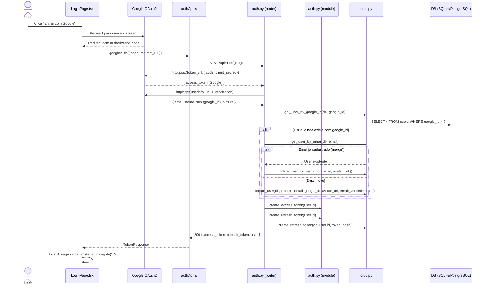
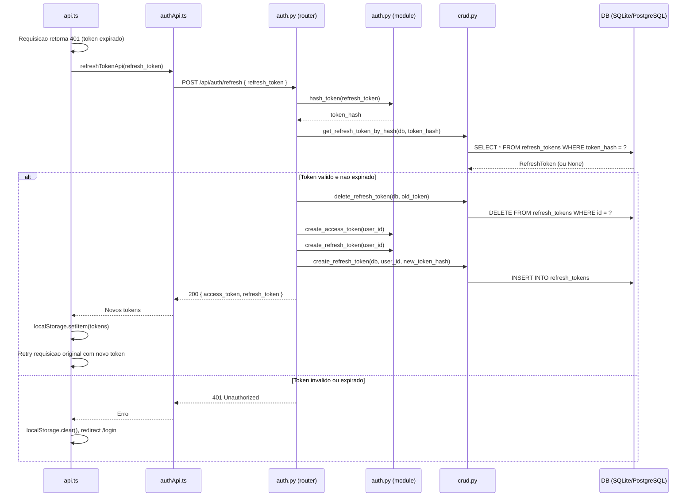
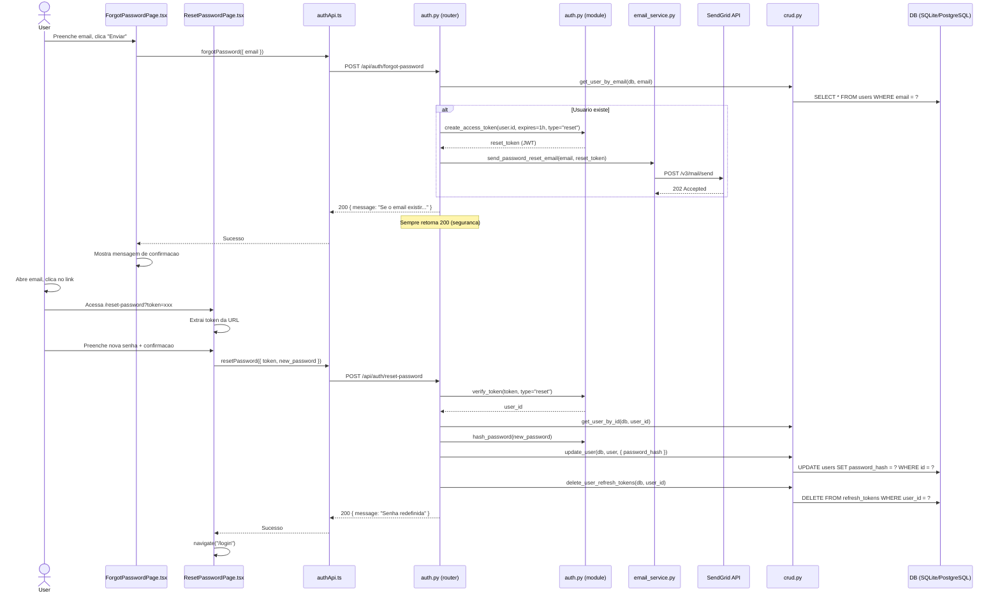

# Especificacao Tecnica — Meu Controle (Fase 1 + 3 + Gastos Diarios)

**Versao:** 2.2
**Data:** 2026-02-17
**PRD Ref:** 01-PRD v2.2
**Arquitetura Ref:** 02-ARCHITECTURE v2.4
**CR Ref:** CR-002 (Multi-usuario e Autenticacao), CR-005 (Gastos Diarios), CR-007 (Consulta Parcelas)

---

## 1. Resumo das Mudancas

Fase 1 implementa o MVP completo do Meu Controle: aplicacao web para controle financeiro pessoal mensal com CRUD de despesas e receitas, visao mensal consolidada com totalizadores, transicao automatica de mes e gestao de status de pagamento. Fase 3 (CR-002) adiciona autenticacao multi-usuario com JWT, login social Google OAuth2, recuperacao de senha via email, perfil de usuario e isolamento de dados por `user_id`. CR-005 adiciona Gastos Diarios: CRUD de gastos nao planejados com categorias fixas, visao mensal agrupada por dia e navegacao via ViewSelector.

### 3.2. Parcelamento (CR-007 Atualizado)

- **Criação**: No endpoint `POST /expenses`, se `parcela_total > 1`:
  - O backend deve iterar de `i=0` até `parcela_total - 1`.
  - Calcular `mes_referencia` e `vencimento` incrementando `i` meses.
  - Criar e persistir `Expense` para cada mês.
  - Isso substitui a estratégia anterior de "Lazy Creation".

- **Consulta**: O endpoint `GET /expenses/installments` agrupa registros existentes baseando-se em `nome` e `parcela_total`. Como agora todos os registros existem, o cálculo de `valor_restante` e `total_pendente` será preciso imediatamente.

### Escopo desta Iteracao

**Fase 1 — Features base:**
- Infraestrutura (backend FastAPI + frontend React/Vite)
- CRUD de Despesas (RF-01) com gestao de status (RF-05) e duplicacao (RF-07)
- CRUD de Receitas (RF-02)
- Visao Mensal com totalizadores (RF-03, RF-04)
- Transicao Automatica de Mes (RF-06)

**Fase 3 — Autenticacao e Multi-usuario (CR-002):**
- Cadastro e login com email/senha (RF-08, RF-09)
- Login social com Google OAuth2 (RF-09)
- Gestao de sessao com JWT access/refresh tokens (RF-10)
- Isolamento de dados por usuario — `user_id` FK em expenses/incomes (RF-10, RN-015)
- Recuperacao de senha via email SendGrid (RF-11)
- Perfil de usuario — visualizar/editar (RF-12)
- React Router para paginas de auth (ADR-017)
- Retrofit de features existentes com auth dependency e user scoping

**Gastos Diarios (CR-005):**
- CRUD de gastos diarios nao planejados (RF-13)
- Categorias fixas (14 + Outros) com subcategorias, definidas em `categories.py`
- 6 metodos de pagamento (Dinheiro, Cartao de Credito/Debito, Pix, Vale Alimentacao/Refeicao)
- Visao mensal agrupada por dia com subtotais e total do mes
- ViewSelector para alternar entre Gastos Planejados e Gastos Diarios
- Rota `/daily-expenses` protegida com autenticacao

**Consulta de Parcelas (CR-007):**
- Endpoint `/api/expenses/installments` para listar todas as parcelas de compras parceladas (`parcela_total > 1`)
- Nova tela `InstallmentsView` acessivel pelo ViewSelector ou Menu
- Exibicao de cards totalizadores: Total Gasto, Total Pago, Total Pendente, Total Atrasado

---

## 2. Detalhamento Tecnico

### Contratos da API (Visao Geral)

| Metodo   | Path                                   | Auth? | Body                    | Resposta                | Descricao                                      |
|----------|----------------------------------------|-------|-------------------------|-------------------------|-------------------------------------------------|
| `GET`    | `/api/months/{year}/{month}`           | Sim   | —                       | `MonthlySummary`        | Visao mensal completa. Dispara RF-06 + RF-05.   |
| `POST`   | `/api/expenses/{year}/{month}`         | Sim   | `ExpenseCreate`         | `ExpenseResponse` (201) | Criar despesa no mes                            |
| `PATCH`  | `/api/expenses/{expense_id}`           | Sim   | `ExpenseUpdate`         | `ExpenseResponse`       | Atualizar campos da despesa                     |
| `DELETE` | `/api/expenses/{expense_id}`           | Sim   | —                       | 204 No Content          | Excluir despesa                                 |
| `POST`   | `/api/expenses/{expense_id}/duplicate` | Sim   | —                       | `ExpenseResponse` (201) | RF-07: Duplicar despesa                         |
| `POST`   | `/api/incomes/{year}/{month}`          | Sim   | `IncomeCreate`          | `IncomeResponse` (201)  | Criar receita no mes                            |
| `PATCH`  | `/api/incomes/{income_id}`             | Sim   | `IncomeUpdate`          | `IncomeResponse`        | Atualizar campos da receita                     |
| `DELETE` | `/api/incomes/{income_id}`             | Sim   | —                       | 204 No Content          | Excluir receita                                 |
| `POST`   | `/api/auth/register`                   | Nao   | `UserCreate`            | `TokenResponse` (201)   | CR-002: Cadastro de usuario (RF-08)             |
| `POST`   | `/api/auth/login`                      | Nao   | `LoginRequest`          | `TokenResponse`         | CR-002: Login email/senha (RF-09)               |
| `POST`   | `/api/auth/google`                     | Nao   | `GoogleAuthRequest`     | `TokenResponse`         | CR-002: Login Google OAuth2 (RF-09)             |
| `POST`   | `/api/auth/refresh`                    | Nao   | `RefreshTokenRequest`   | `TokenResponse`         | CR-002: Renovar tokens (RF-10)                  |
| `POST`   | `/api/auth/logout`                     | Sim   | `RefreshTokenRequest`   | `{"message": "..."}`    | CR-002: Invalidar refresh token (RF-10)         |
| `POST`   | `/api/auth/forgot-password`            | Nao   | `ForgotPasswordRequest` | `{"message": "..."}`    | CR-002: Solicitar reset de senha (RF-11)        |
| `POST`   | `/api/auth/reset-password`             | Nao   | `ResetPasswordRequest`  | `{"message": "..."}`    | CR-002: Redefinir senha (RF-11)                 |
| `GET`    | `/api/users/me`                        | Sim   | —                       | `UserResponse`          | CR-002: Perfil do usuario (RF-12)               |
| `PATCH`  | `/api/users/me`                        | Sim   | `UserUpdate`            | `UserResponse`          | CR-002: Atualizar perfil (RF-12)                |
| `PATCH`  | `/api/users/me/password`               | Sim   | `ChangePasswordRequest` | `{"message": "..."}`    | CR-002: Trocar senha (RF-12)                    |
| `GET`    | `/api/config`                          | Nao   | —                       | `{ google_client_id: string }` | Configuracao publica (Google Client ID runtime) |
| `GET`    | `/api/daily-expenses/categories`       | Nao   | —                       | `CategoriesResponse`    | CR-005: Categorias + metodos de pagamento       |
| `GET`    | `/api/expenses/installments`           | Sim   | —                       | `InstallmentsSummary`   | CR-007: Lista de parcelas + totalizadores       |
| `GET`    | `/api/daily-expenses/{year}/{month}`   | Sim   | —                       | `DailyExpenseMonthlySummary` | CR-005: Visao mensal agrupada por dia      |
| `POST`   | `/api/daily-expenses/{year}/{month}`   | Sim   | `DailyExpenseCreate`    | `DailyExpenseResponse` (201) | CR-005: Criar gasto diario               |
| `PATCH`  | `/api/daily-expenses/{id}`             | Sim   | `DailyExpenseUpdate`    | `DailyExpenseResponse`  | CR-005: Atualizar gasto diario                  |
| `DELETE` | `/api/daily-expenses/{id}`             | Sim   | —                       | 204 No Content          | CR-005: Excluir gasto diario                    |
| `GET`    | `/api/health`                          | Nao   | —                       | `{"status": "ok"}`      | Health check                                    |

**Nota:** O endpoint principal e `GET /api/months/{year}/{month}`. Ele retorna tudo que o frontend precisa em uma unica chamada: despesas, receitas e totalizadores. Tambem dispara a geracao automatica de mes (RF-06) e a auto-deteccao de status (RF-05).

**Nota (CR-002):** Endpoints marcados com `Auth: Sim` requerem header `Authorization: Bearer <access_token>`. Requisicoes sem token ou com token invalido/expirado retornam 401 Unauthorized. Endpoints de expenses/incomes/months tambem verificam ownership — um usuario so acessa seus proprios dados (RN-015).

---

### Feature: Infraestrutura e Setup

#### 2.1 Descricao Tecnica

Configuracao base do projeto: backend FastAPI com SQLAlchemy/SQLite e frontend React com Vite, Tailwind CSS v4 e TanStack Query. Para decisoes arquiteturais, ver ADRs em 02-ARCHITECTURE.md.

#### 2.2 Arquivos

| Acao  | Caminho                           | Descricao                                         |
|-------|-----------------------------------|----------------------------------------------------|
| Criar | `backend/requirements.txt`        | Dependencias Python pinadas                        |
| Criar | `backend/app/__init__.py`         | Pacote Python (vazio)                              |
| Criar | `backend/app/database.py`         | Engine SQLAlchemy, sessoes, Base, dependency injection |
| Criar | `backend/app/main.py`             | Entry point FastAPI: lifespan, CORS, routers       |
| Criar | `backend/app/routers/__init__.py` | Pacote routers (vazio)                             |
| Criar | `frontend/package.json`           | Dependencias e scripts npm                         |
| Criar | `frontend/vite.config.ts`         | Build config + proxy /api                          |
| Criar | `frontend/tsconfig.json`          | Config raiz TypeScript                             |
| Criar | `frontend/tsconfig.app.json`      | Opcoes do compilador TS                            |
| Criar | `frontend/index.html`             | HTML entry point da SPA                            |
| Criar | `frontend/src/index.css`          | Tailwind v4 import + tema customizado              |
| Criar | `frontend/src/main.tsx`           | Bootstrap React + QueryClient                      |
| Criar | `frontend/src/App.tsx`            | Shell da aplicacao com header                      |
| Criar | `.gitignore`                      | Exclusoes para Python, Node, SQLite, IDE           |

#### 2.3 Codigo

**`backend/requirements.txt`**

```
fastapi==0.115.*
uvicorn[standard]==0.34.*
sqlalchemy==2.0.*
pydantic==2.*
psycopg2-binary==2.9.*
alembic==1.14.*
python-jose[cryptography]==3.3.*
passlib[bcrypt]==1.7.*
python-multipart==0.0.*
httpx==0.27.*
sendgrid==6.11.*
```

> **CR-002:** 5 novas dependencias para autenticacao (JWT, hashing, form data, Google OAuth HTTP client, email).

**`backend/app/database.py`** (CR-001: DATABASE_URL via env var, engine condicional)

```python
import os

from sqlalchemy import create_engine
from sqlalchemy.orm import DeclarativeBase, sessionmaker, Session
from typing import Generator

DATABASE_URL = os.environ.get("DATABASE_URL", "sqlite:///meu_controle.db")

# Railway PostgreSQL usa "postgres://" mas SQLAlchemy exige "postgresql://"
if DATABASE_URL.startswith("postgres://"):
    DATABASE_URL = DATABASE_URL.replace("postgres://", "postgresql://", 1)

connect_args = {}
if DATABASE_URL.startswith("sqlite"):
    connect_args["check_same_thread"] = False

engine = create_engine(DATABASE_URL, connect_args=connect_args)

SessionLocal = sessionmaker(autocommit=False, autoflush=False, bind=engine)


class Base(DeclarativeBase):
    pass


def get_db() -> Generator[Session, None, None]:
    """Dependency injection: fornece sessao do banco e garante cleanup."""
    db = SessionLocal()
    try:
        yield db
    finally:
        db.close()
```

**`backend/app/main.py`** (CR-001: Alembic gerencia migrations; CR-002: routers auth e users)

```python
from pathlib import Path
from contextlib import asynccontextmanager

from fastapi import FastAPI
from fastapi.middleware.cors import CORSMiddleware
from fastapi.staticfiles import StaticFiles
from fastapi.responses import FileResponse

from app.routers import expenses, incomes, months, auth, users  # CR-002: auth, users


@asynccontextmanager
async def lifespan(app: FastAPI):
    # Startup: migrations gerenciadas pelo Alembic (ver CR-001)
    yield


app = FastAPI(
    title="Meu Controle API",
    version="2.0.0",  # CR-002
    lifespan=lifespan,
)

app.add_middleware(
    CORSMiddleware,
    allow_origins=["http://localhost:5173"],  # Vite dev server
    allow_credentials=True,
    allow_methods=["*"],
    allow_headers=["*"],
)

app.include_router(auth.router)    # CR-002: autenticacao (register, login, Google, refresh, logout, forgot/reset password)
app.include_router(users.router)   # CR-002: perfil de usuario (GET/PATCH /me, change password)
app.include_router(months.router)
app.include_router(expenses.router)
app.include_router(incomes.router)


@app.get("/api/health")
def health_check():
    return {"status": "ok"}


@app.get("/api/config")
def get_public_config():
    """Return public configuration (no secrets)."""
    import os
    return {
        "google_client_id": os.environ.get("GOOGLE_CLIENT_ID", ""),
    }


# Serve frontend static files in production
STATIC_DIR = Path(__file__).resolve().parent.parent / "static"
if STATIC_DIR.is_dir():
    app.mount("/assets", StaticFiles(directory=STATIC_DIR / "assets"), name="assets")

    @app.get("/{full_path:path}")
    async def serve_spa(full_path: str):
        """Serve index.html for all non-API routes (SPA fallback)."""
        file_path = STATIC_DIR / full_path
        if file_path.is_file():
            return FileResponse(file_path)
        return FileResponse(STATIC_DIR / "index.html")
```

**Comandos para rodar (desenvolvimento):**
1. `alembic upgrade head` — aplica migrations (a partir do diretorio `backend/`)
2. `uvicorn app.main:app --reload` — inicia o servidor

**`frontend/package.json`**

```json
{
  "name": "meu-controle-frontend",
  "private": true,
  "version": "1.0.0",
  "type": "module",
  "scripts": {
    "dev": "vite",
    "build": "tsc -b && vite build",
    "preview": "vite preview"
  },
  "dependencies": {
    "react": "^19.0.0",
    "react-dom": "^19.0.0",
    "@tanstack/react-query": "^5.62.0",
    "react-router-dom": "^7.0.0",
    "jwt-decode": "^4.0.0"
  },
  "devDependencies": {
    "@types/react": "^19.0.0",
    "@types/react-dom": "^19.0.0",
    "@vitejs/plugin-react": "^4.3.0",
    "@tailwindcss/vite": "^4.0.0",
    "tailwindcss": "^4.0.0",
    "typescript": "^5.6.0",
    "vite": "^6.0.0"
  }
}
```

**`frontend/vite.config.ts`**

```typescript
import { defineConfig } from "vite";
import react from "@vitejs/plugin-react";
import tailwindcss from "@tailwindcss/vite";

export default defineConfig({
  plugins: [react(), tailwindcss()],
  server: {
    proxy: {
      "/api": {
        target: "http://localhost:8000",
        changeOrigin: true,
      },
    },
  },
});
```

**`frontend/tsconfig.json`**

```json
{
  "files": [],
  "references": [{ "path": "./tsconfig.app.json" }]
}
```

**`frontend/tsconfig.app.json`**

```json
{
  "compilerOptions": {
    "target": "ES2022",
    "lib": ["ES2023", "DOM", "DOM.Iterable"],
    "module": "ESNext",
    "moduleResolution": "bundler",
    "jsx": "react-jsx",
    "strict": true,
    "noUnusedLocals": true,
    "noUnusedParameters": true,
    "noFallthroughCasesInSwitch": true,
    "isolatedModules": true,
    "skipLibCheck": true
  },
  "include": ["src"]
}
```

**`frontend/index.html`**

```html
<!DOCTYPE html>
<html lang="pt-BR">
  <head>
    <meta charset="UTF-8" />
    <meta name="viewport" content="width=device-width, initial-scale=1.0" />
    <title>Meu Controle</title>
  </head>
  <body>
    <div id="root"></div>
    <script type="module" src="/src/main.tsx"></script>
  </body>
</html>
```

**`frontend/src/index.css`**

```css
@import "tailwindcss";

@theme {
  --color-primary: #2563eb;
  --color-primary-hover: #1d4ed8;
  --color-danger: #dc2626;
  --color-success: #16a34a;
  --color-warning: #d97706;
  --color-pendente: #eab308;
  --color-pago: #16a34a;
  --color-atrasado: #dc2626;
  --color-google: #4285f4;
}
```

**`frontend/src/main.tsx`** (CR-002: BrowserRouter para rotas client-side)

```typescript
import { StrictMode } from "react";
import { createRoot } from "react-dom/client";
import { QueryClient, QueryClientProvider } from "@tanstack/react-query";
import { BrowserRouter } from "react-router-dom";  // CR-002: ADR-017
import App from "./App";
import "./index.css";

const queryClient = new QueryClient({
  defaultOptions: {
    queries: {
      staleTime: 1000 * 60 * 5, // 5 minutos
      retry: 1,
    },
  },
});

createRoot(document.getElementById("root")!).render(
  <StrictMode>
    <QueryClientProvider client={queryClient}>
      <BrowserRouter>
        <App />
      </BrowserRouter>
    </QueryClientProvider>
  </StrictMode>
);
```

**`frontend/src/App.tsx`** (CR-002: AuthProvider, React Router, ProtectedRoute, UserMenu)

```typescript
import { Routes, Route, Navigate } from "react-router-dom";
import { AuthProvider } from "./contexts/AuthContext";
import { useAuth } from "./hooks/useAuth";
import ProtectedRoute from "./components/ProtectedRoute";
import UserMenu from "./components/UserMenu";
import MonthlyView from "./pages/MonthlyView";
import LoginPage from "./pages/LoginPage";
import RegisterPage from "./pages/RegisterPage";
import ForgotPasswordPage from "./pages/ForgotPasswordPage";
import ResetPasswordPage from "./pages/ResetPasswordPage";
import ProfilePage from "./pages/ProfilePage";

function AppHeader() {
  const { isAuthenticated } = useAuth();
  return (
    <header className="bg-primary text-white py-4 px-6 shadow-md flex justify-between items-center">
      <h1 className="text-xl font-bold tracking-wide">MEU CONTROLE</h1>
      {isAuthenticated && <UserMenu />}
    </header>
  );
}

export default function App() {
  return (
    <AuthProvider>
      <div className="min-h-screen bg-gray-50">
        <AppHeader />
        <main>
          <Routes>
            {/* Rotas publicas */}
            <Route path="/login" element={<LoginPage />} />
            <Route path="/register" element={<RegisterPage />} />
            <Route path="/forgot-password" element={<ForgotPasswordPage />} />
            <Route path="/reset-password" element={<ResetPasswordPage />} />

            {/* Rotas protegidas */}
            <Route element={<ProtectedRoute />}>
              <Route path="/" element={<MonthlyView />} />
              <Route path="/profile" element={<ProfilePage />} />
            </Route>

            {/* Fallback */}
            <Route path="*" element={<Navigate to="/" replace />} />
          </Routes>
        </main>
      </div>
    </AuthProvider>
  );
}
```

**`.gitignore`**

```
# Python
__pycache__/
*.py[cod]
*.egg-info/
*.egg
dist/
build/
.venv/
venv/

# SQLite
*.db

# Node
node_modules/
frontend/dist/

# IDE
.vscode/
.idea/

# OS
.DS_Store
Thumbs.db

# Env
.env
.env.local
```

---

### Feature: [RF-01] CRUD de Despesas

#### 2.1 Descricao Tecnica

Implementa criacao, leitura, edicao e exclusao de despesas mensais. Cada despesa pertence a um mes de referencia e possui status de pagamento, campos opcionais de parcelamento e flag de recorrencia.

#### 2.2 Arquivos

| Acao  | Caminho                              | Descricao                              |
|-------|--------------------------------------|----------------------------------------|
| Criar | `backend/app/models.py`              | Modelo ORM Expense + enum ExpenseStatus |
| Criar | `backend/app/schemas.py`             | Schemas Pydantic: ExpenseCreate, ExpenseUpdate, ExpenseResponse |
| Criar | `backend/app/crud.py`                | Funcoes de acesso a dados para expenses |
| Criar | `backend/app/routers/expenses.py`    | Endpoints POST, PATCH, DELETE          |
| Criar | `frontend/src/types.ts`              | Types TypeScript: Expense, ExpenseCreate, ExpenseUpdate |
| Criar | `frontend/src/services/api.ts`       | Funcoes HTTP: createExpense, updateExpense, deleteExpense |
| Criar | `frontend/src/hooks/useExpenses.ts`  | Hooks TanStack Query para mutations    |

#### 2.3 Interfaces / Types

**Backend — Models (`backend/app/models.py`):**

```python
import uuid
import enum
from datetime import date, datetime

from sqlalchemy import String, Date, Boolean, Integer, Numeric, ForeignKey, Index
from sqlalchemy.orm import Mapped, mapped_column, relationship

from app.database import Base


class ExpenseStatus(str, enum.Enum):
    PENDENTE = "Pendente"
    PAGO = "Pago"
    ATRASADO = "Atrasado"


class Expense(Base):
    __tablename__ = "expenses"
    __table_args__ = (
        Index("ix_expenses_user_month", "user_id", "mes_referencia"),  # CR-002: indice composto
    )

    id: Mapped[str] = mapped_column(
        String(36), primary_key=True, default=lambda: str(uuid.uuid4())
    )
    user_id: Mapped[str] = mapped_column(
        String(36), ForeignKey("users.id", ondelete="CASCADE"), nullable=False
    )  # CR-002: FK para isolamento de dados (RN-015)
    mes_referencia: Mapped[date] = mapped_column(Date, nullable=False)
    nome: Mapped[str] = mapped_column(String(255), nullable=False)
    valor: Mapped[float] = mapped_column(Numeric(10, 2), nullable=False)
    vencimento: Mapped[date] = mapped_column(Date, nullable=False)
    parcela_atual: Mapped[int | None] = mapped_column(Integer, nullable=True)
    parcela_total: Mapped[int | None] = mapped_column(Integer, nullable=True)
    recorrente: Mapped[bool] = mapped_column(Boolean, default=True, nullable=False)
    status: Mapped[str] = mapped_column(
        String(20), default=ExpenseStatus.PENDENTE.value, nullable=False
    )
    created_at: Mapped[datetime] = mapped_column(default=datetime.now)
    updated_at: Mapped[datetime] = mapped_column(
        default=datetime.now, onupdate=datetime.now
    )

    user = relationship("User", back_populates="expenses")  # CR-002
```

**Backend — Schemas (`backend/app/schemas.py` — secao Expense):**

> **Nota (CR-002):** Os schemas de input (`ExpenseCreate`, `ExpenseUpdate`) nao incluem `user_id` — ele e setado pelo router a partir do usuario autenticado (`current_user.id`). Os schemas permanecem inalterados.

```python
from pydantic import BaseModel, Field, model_validator
from datetime import date, datetime
from typing import Optional

from app.models import ExpenseStatus


class ExpenseCreate(BaseModel):
    """Schema para criacao de despesa. mes_referencia vem da URL, status padrao Pendente. user_id setado pelo router (CR-002)."""
    nome: str = Field(..., min_length=1, max_length=255)
    valor: float = Field(..., gt=0)
    vencimento: date
    parcela_atual: Optional[int] = Field(None, ge=1)
    parcela_total: Optional[int] = Field(None, ge=1)
    recorrente: bool = True

    @model_validator(mode="after")
    def validate_parcelas(self) -> "ExpenseCreate":
        """Regra de integridade do PRD: ambos os campos de parcela devem estar
        presentes ou ausentes, e parcela_atual <= parcela_total."""
        atual = self.parcela_atual
        total = self.parcela_total
        if (atual is None) != (total is None):
            raise ValueError(
                "parcela_atual e parcela_total devem ambos ser preenchidos ou ambos nulos"
            )
        if atual is not None and total is not None and atual > total:
            raise ValueError("parcela_atual deve ser <= parcela_total")
        return self


class ExpenseUpdate(BaseModel):
    """Schema para atualizacao parcial (PATCH). Apenas campos enviados sao alterados."""
    nome: Optional[str] = Field(None, min_length=1, max_length=255)
    valor: Optional[float] = Field(None, gt=0)
    vencimento: Optional[date] = None
    parcela_atual: Optional[int] = Field(None, ge=1)
    parcela_total: Optional[int] = Field(None, ge=1)
    recorrente: Optional[bool] = None
    status: Optional[ExpenseStatus] = None


class ExpenseResponse(BaseModel):
    """Schema de resposta para despesa."""
    model_config = {"from_attributes": True}

    id: str
    mes_referencia: date
    nome: str
    valor: float
    vencimento: date
    parcela_atual: Optional[int]
    parcela_total: Optional[int]
    recorrente: bool
    status: str
    created_at: datetime
    updated_at: datetime
```

**Frontend — Types (`frontend/src/types.ts` — secao Expense):**

```typescript
export type ExpenseStatus = "Pendente" | "Pago" | "Atrasado";

export interface Expense {
  id: string;
  mes_referencia: string;
  nome: string;
  valor: number;
  vencimento: string;
  parcela_atual: number | null;
  parcela_total: number | null;
  recorrente: boolean;
  status: ExpenseStatus;
  created_at: string;
  updated_at: string;
}

export interface ExpenseCreate {
  nome: string;
  valor: number;
  vencimento: string;
  parcela_atual?: number | null;
  parcela_total?: number | null;
  recorrente: boolean;
}

export interface ExpenseUpdate {
  nome?: string;
  valor?: number;
  vencimento?: string;
  parcela_atual?: number | null;
  parcela_total?: number | null;
  recorrente?: boolean;
  status?: ExpenseStatus;
}
```

#### 2.4 Logica de Negocio

**CRUD — Camada de acesso a dados (`backend/app/crud.py` — secao Expenses):**

> **CR-002:** Funcoes de leitura agora recebem `user_id` para filtrar por usuario (RN-015). Funcoes de escrita (create/update/delete) nao recebem `user_id` — ownership e verificada pelo router antes de chamar.

```python
from sqlalchemy.orm import Session
from sqlalchemy import select
from datetime import date

from app.models import Expense, Income


# ========== Expenses ==========

def get_expenses_by_month(db: Session, mes_referencia: date, user_id: str) -> list[Expense]:
    """Retorna despesas de um usuario em um mes, ordenadas por vencimento. (CR-002: user_id)"""
    stmt = (
        select(Expense)
        .where(Expense.user_id == user_id, Expense.mes_referencia == mes_referencia)
        .order_by(Expense.vencimento)
    )
    return list(db.scalars(stmt).all())


def get_expense_by_id(db: Session, expense_id: str, user_id: str) -> Expense | None:
    """Retorna uma despesa por ID se pertence ao usuario, ou None. (CR-002: ownership check)"""
    stmt = (
        select(Expense)
        .where(Expense.id == expense_id, Expense.user_id == user_id)
    )
    return db.scalars(stmt).first()


def create_expense(db: Session, expense: Expense) -> Expense:
    """Persiste uma nova despesa. user_id ja deve estar setado na instancia."""
    db.add(expense)
    db.commit()
    db.refresh(expense)
    return expense


def update_expense(db: Session, expense: Expense) -> Expense:
    """Persiste alteracoes em uma despesa existente."""
    db.commit()
    db.refresh(expense)
    return expense


def delete_expense(db: Session, expense: Expense) -> None:
    """Remove uma despesa."""
    db.delete(expense)
    db.commit()


def count_expenses_by_month(db: Session, mes_referencia: date, user_id: str) -> int:
    """Conta despesas do usuario no mes (check de idempotencia da transicao). (CR-002: user_id)"""
    stmt = (
        select(Expense)
        .where(Expense.user_id == user_id, Expense.mes_referencia == mes_referencia)
    )
    return len(list(db.scalars(stmt).all()))
```

**Criar Despesa:**
1. Receber `ExpenseCreate` do body + `year/month` do path
2. Construir `mes_referencia = date(year, month, 1)`
3. Criar instancia `Expense` com `status = "Pendente"`
4. Persistir via `crud.create_expense()`
5. Retornar `ExpenseResponse` (201)

**Atualizar Despesa (PATCH):**
1. Receber `expense_id` do path + `ExpenseUpdate` do body
2. Buscar despesa por ID — se nao existe: 404
3. Aplicar `model_dump(exclude_unset=True)` para obter apenas campos enviados
4. Para campo `status`: converter enum `.value` antes de `setattr`
5. Persistir via `crud.update_expense()`
6. Retornar `ExpenseResponse` atualizado

**Excluir Despesa:**
1. Receber `expense_id` do path
2. Buscar despesa por ID — se nao existe: 404
3. Remover via `crud.delete_expense()`
4. Retornar 204 No Content

#### 2.5 API Endpoints

**`backend/app/routers/expenses.py`** (CR-002: auth dependency + user scoping)

```python
from fastapi import APIRouter, Depends, HTTPException
from sqlalchemy.orm import Session
from datetime import date

from app.database import get_db
from app.auth import get_current_user  # CR-002
from app.models import Expense, ExpenseStatus, User  # CR-002: User
from app.schemas import ExpenseCreate, ExpenseUpdate, ExpenseResponse
from app import crud

router = APIRouter(prefix="/api/expenses", tags=["expenses"])


@router.post("/{year}/{month}", response_model=ExpenseResponse, status_code=201)
def create_expense(
    year: int,
    month: int,
    data: ExpenseCreate,
    db: Session = Depends(get_db),
    current_user: User = Depends(get_current_user),  # CR-002
):
    """Criar nova despesa no mes especificado. user_id setado automaticamente."""
    mes_referencia = date(year, month, 1)
    expense = Expense(
        user_id=current_user.id,  # CR-002: isolamento de dados (RN-015)
        mes_referencia=mes_referencia,
        nome=data.nome,
        valor=data.valor,
        vencimento=data.vencimento,
        parcela_atual=data.parcela_atual,
        parcela_total=data.parcela_total,
        recorrente=data.recorrente,
        status=ExpenseStatus.PENDENTE.value,
    )
    return crud.create_expense(db, expense)


@router.patch("/{expense_id}", response_model=ExpenseResponse)
def update_expense(
    expense_id: str,
    data: ExpenseUpdate,
    db: Session = Depends(get_db),
    current_user: User = Depends(get_current_user),  # CR-002
):
    """Atualizar despesa existente. PATCH: apenas campos enviados sao alterados."""
    expense = crud.get_expense_by_id(db, expense_id, current_user.id)  # CR-002: ownership check
    if not expense:
        raise HTTPException(status_code=404, detail="Despesa nao encontrada")

    update_data = data.model_dump(exclude_unset=True)
    for field, value in update_data.items():
        if field == "status" and value is not None:
            setattr(expense, field, value.value)
        else:
            setattr(expense, field, value)

    return crud.update_expense(db, expense)


@router.delete("/{expense_id}", status_code=204)
def delete_expense(
    expense_id: str,
    db: Session = Depends(get_db),
    current_user: User = Depends(get_current_user),  # CR-002
):
    """Excluir despesa por ID."""
    expense = crud.get_expense_by_id(db, expense_id, current_user.id)  # CR-002: ownership check
    if not expense:
        raise HTTPException(status_code=404, detail="Despesa nao encontrada")
    crud.delete_expense(db, expense)
```

**Frontend — HTTP Client (`frontend/src/services/api.ts` — secao Expenses):**

> **CR-002:** A funcao `request()` agora inclui `Authorization: Bearer` automaticamente e trata respostas 401 tentando refresh do token.

```typescript
import type {
  MonthlySummary,
  ExpenseCreate,
  ExpenseUpdate,
  Expense,
  IncomeCreate,
  IncomeUpdate,
  Income,
} from "../types";

const BASE_URL = "/api";

async function request<T>(url: string, options?: RequestInit): Promise<T> {
  // CR-002: incluir token de auth se disponivel
  const token = localStorage.getItem("access_token");
  const headers: Record<string, string> = {
    "Content-Type": "application/json",
  };
  if (token) {
    headers["Authorization"] = `Bearer ${token}`;
  }

  const response = await fetch(`${BASE_URL}${url}`, {
    headers,
    ...options,
  });

  // CR-002: interceptar 401 para tentar refresh
  if (response.status === 401 && token) {
    const refreshToken = localStorage.getItem("refresh_token");
    if (refreshToken) {
      try {
        const refreshResponse = await fetch(`${BASE_URL}/auth/refresh`, {
          method: "POST",
          headers: { "Content-Type": "application/json" },
          body: JSON.stringify({ refresh_token: refreshToken }),
        });
        if (refreshResponse.ok) {
          const tokens = await refreshResponse.json();
          localStorage.setItem("access_token", tokens.access_token);
          localStorage.setItem("refresh_token", tokens.refresh_token);
          // Retry original request com novo token
          headers["Authorization"] = `Bearer ${tokens.access_token}`;
          const retryResponse = await fetch(`${BASE_URL}${url}`, {
            headers,
            ...options,
          });
          if (!retryResponse.ok) {
            const error = await retryResponse.json().catch(() => ({}));
            throw new Error(error.detail || `HTTP ${retryResponse.status}`);
          }
          if (retryResponse.status === 204) return undefined as T;
          return retryResponse.json();
        }
      } catch {
        // Refresh falhou — limpar tokens e redirecionar
      }
    }
    // Refresh token invalido ou ausente
    localStorage.removeItem("access_token");
    localStorage.removeItem("refresh_token");
    window.location.href = "/login";
    throw new Error("Sessao expirada");
  }

  if (!response.ok) {
    const error = await response.json().catch(() => ({}));
    throw new Error(error.detail || `HTTP ${response.status}`);
  }
  if (response.status === 204) return undefined as T;
  return response.json();
}

export function createExpense(
  year: number,
  month: number,
  data: ExpenseCreate
): Promise<Expense> {
  return request<Expense>(`/expenses/${year}/${month}`, {
    method: "POST",
    body: JSON.stringify(data),
  });
}

export function updateExpense(
  id: string,
  data: ExpenseUpdate
): Promise<Expense> {
  return request<Expense>(`/expenses/${id}`, {
    method: "PATCH",
    body: JSON.stringify(data),
  });
}

export function deleteExpense(id: string): Promise<void> {
  return request<void>(`/expenses/${id}`, { method: "DELETE" });
}
```

**Frontend — Hooks (`frontend/src/hooks/useExpenses.ts`):**

```typescript
import { useMutation, useQueryClient } from "@tanstack/react-query";
import * as api from "../services/api";
import type { ExpenseCreate, ExpenseUpdate } from "../types";

function monthQueryKey(year: number, month: number) {
  return ["monthly-summary", year, month];
}

export function useCreateExpense(year: number, month: number) {
  const queryClient = useQueryClient();
  return useMutation({
    mutationFn: (data: ExpenseCreate) => api.createExpense(year, month, data),
    onSuccess: () => {
      queryClient.invalidateQueries({ queryKey: monthQueryKey(year, month) });
    },
  });
}

export function useUpdateExpense(year: number, month: number) {
  const queryClient = useQueryClient();
  return useMutation({
    mutationFn: ({ id, data }: { id: string; data: ExpenseUpdate }) =>
      api.updateExpense(id, data),
    onSuccess: () => {
      queryClient.invalidateQueries({ queryKey: monthQueryKey(year, month) });
    },
  });
}

export function useDeleteExpense(year: number, month: number) {
  const queryClient = useQueryClient();
  return useMutation({
    mutationFn: (id: string) => api.deleteExpense(id),
    onSuccess: () => {
      queryClient.invalidateQueries({ queryKey: monthQueryKey(year, month) });
    },
  });
}
```

#### 2.6 Validacoes

| Campo         | Regra                                              | Mensagem de Erro                                                  |
|---------------|----------------------------------------------------|--------------------------------------------------------------------|
| nome          | Obrigatorio, 1-255 chars                           | Validacao Pydantic Field                                           |
| valor         | Obrigatorio, > 0                                   | Validacao Pydantic Field(gt=0)                                     |
| vencimento    | Obrigatorio, tipo date                             | Validacao Pydantic                                                 |
| parcela_atual | Opcional, >= 1                                     | Validacao Pydantic Field(ge=1)                                     |
| parcela_total | Opcional, >= 1                                     | Validacao Pydantic Field(ge=1)                                     |
| parcelas      | Ambos presentes ou ambos nulos                     | "parcela_atual e parcela_total devem ambos ser preenchidos ou ambos nulos" |
| parcelas      | parcela_atual <= parcela_total                     | "parcela_atual deve ser <= parcela_total"                          |

---

### Feature: [RF-02] CRUD de Receitas

#### 2.1 Descricao Tecnica

Implementa criacao, leitura, edicao e exclusao de receitas mensais. Mesma estrutura de RF-01, porem mais simples (sem parcelas, sem status).

#### 2.2 Arquivos

| Acao  | Caminho                             | Descricao                              |
|-------|-------------------------------------|----------------------------------------|
| Criar | `backend/app/models.py`             | Modelo ORM Income (mesmo arquivo de Expense) |
| Criar | `backend/app/schemas.py`            | Schemas: IncomeCreate, IncomeUpdate, IncomeResponse |
| Criar | `backend/app/crud.py`               | Funcoes de acesso a dados para incomes |
| Criar | `backend/app/routers/incomes.py`    | Endpoints POST, PATCH, DELETE          |
| Criar | `frontend/src/types.ts`             | Types: Income, IncomeCreate, IncomeUpdate |
| Criar | `frontend/src/services/api.ts`      | Funcoes HTTP: createIncome, updateIncome, deleteIncome |
| Criar | `frontend/src/hooks/useIncomes.ts`  | Hooks TanStack Query para mutations    |

#### 2.3 Interfaces / Types

**Backend — Model (`backend/app/models.py` — secao Income):**

```python
class Income(Base):
    __tablename__ = "incomes"
    __table_args__ = (
        Index("ix_incomes_user_month", "user_id", "mes_referencia"),  # CR-002: indice composto
    )

    id: Mapped[str] = mapped_column(
        String(36), primary_key=True, default=lambda: str(uuid.uuid4())
    )
    user_id: Mapped[str] = mapped_column(
        String(36), ForeignKey("users.id", ondelete="CASCADE"), nullable=False
    )  # CR-002: FK para isolamento de dados (RN-015)
    mes_referencia: Mapped[date] = mapped_column(Date, nullable=False)
    nome: Mapped[str] = mapped_column(String(255), nullable=False)
    valor: Mapped[float] = mapped_column(Numeric(10, 2), nullable=False)
    data: Mapped[date | None] = mapped_column(Date, nullable=True)
    recorrente: Mapped[bool] = mapped_column(Boolean, default=True, nullable=False)
    created_at: Mapped[datetime] = mapped_column(default=datetime.now)
    updated_at: Mapped[datetime] = mapped_column(
        default=datetime.now, onupdate=datetime.now
    )

    user = relationship("User", back_populates="incomes")  # CR-002
```

**Backend — Schemas (`backend/app/schemas.py` — secao Income):**

```python
class IncomeCreate(BaseModel):
    """Schema para criacao de receita."""
    nome: str = Field(..., min_length=1, max_length=255)
    valor: float = Field(..., gt=0)
    data: Optional[date] = None
    recorrente: bool = True


class IncomeUpdate(BaseModel):
    """Schema para atualizacao parcial de receita."""
    nome: Optional[str] = Field(None, min_length=1, max_length=255)
    valor: Optional[float] = Field(None, gt=0)
    data: Optional[date] = None
    recorrente: Optional[bool] = None


class IncomeResponse(BaseModel):
    """Schema de resposta para receita."""
    model_config = {"from_attributes": True}

    id: str
    mes_referencia: date
    nome: str
    valor: float
    data: Optional[date]
    recorrente: bool
    created_at: datetime
    updated_at: datetime
```

**Frontend — Types (`frontend/src/types.ts` — secao Income):**

```typescript
export interface Income {
  id: string;
  mes_referencia: string;
  nome: string;
  valor: number;
  data: string | null;
  recorrente: boolean;
  created_at: string;
  updated_at: string;
}

export interface IncomeCreate {
  nome: string;
  valor: number;
  data?: string | null;
  recorrente: boolean;
}

export interface IncomeUpdate {
  nome?: string;
  valor?: number;
  data?: string | null;
  recorrente?: boolean;
}
```

#### 2.4 Logica de Negocio

**CRUD — Camada de acesso a dados (`backend/app/crud.py` — secao Incomes):**

```python
# ========== Incomes ==========

def get_incomes_by_month(db: Session, mes_referencia: date, user_id: str) -> list[Income]:
    """Retorna receitas de um usuario em um mes, ordenadas por data. (CR-002: user_id)"""
    stmt = (
        select(Income)
        .where(Income.user_id == user_id, Income.mes_referencia == mes_referencia)
        .order_by(Income.data)
    )
    return list(db.scalars(stmt).all())


def get_income_by_id(db: Session, income_id: str, user_id: str) -> Income | None:
    """Retorna uma receita por ID se pertence ao usuario, ou None. (CR-002: ownership check)"""
    stmt = (
        select(Income)
        .where(Income.id == income_id, Income.user_id == user_id)
    )
    return db.scalars(stmt).first()


def create_income(db: Session, income: Income) -> Income:
    """Persiste uma nova receita. user_id ja deve estar setado na instancia."""
    db.add(income)
    db.commit()
    db.refresh(income)
    return income


def update_income(db: Session, income: Income) -> Income:
    """Persiste alteracoes em uma receita existente."""
    db.commit()
    db.refresh(income)
    return income


def delete_income(db: Session, income: Income) -> None:
    """Remove uma receita."""
    db.delete(income)
    db.commit()
```

#### 2.5 API Endpoints

**`backend/app/routers/incomes.py`** (CR-002: auth dependency + user scoping)

```python
from fastapi import APIRouter, Depends, HTTPException
from sqlalchemy.orm import Session
from datetime import date

from app.database import get_db
from app.auth import get_current_user  # CR-002
from app.models import Income, User  # CR-002: User
from app.schemas import IncomeCreate, IncomeUpdate, IncomeResponse
from app import crud

router = APIRouter(prefix="/api/incomes", tags=["incomes"])


@router.post("/{year}/{month}", response_model=IncomeResponse, status_code=201)
def create_income(
    year: int,
    month: int,
    data: IncomeCreate,
    db: Session = Depends(get_db),
    current_user: User = Depends(get_current_user),  # CR-002
):
    """Criar nova receita no mes especificado. user_id setado automaticamente."""
    mes_referencia = date(year, month, 1)
    income = Income(
        user_id=current_user.id,  # CR-002: isolamento de dados (RN-015)
        mes_referencia=mes_referencia,
        nome=data.nome,
        valor=data.valor,
        data=data.data,
        recorrente=data.recorrente,
    )
    return crud.create_income(db, income)


@router.patch("/{income_id}", response_model=IncomeResponse)
def update_income(
    income_id: str,
    data: IncomeUpdate,
    db: Session = Depends(get_db),
    current_user: User = Depends(get_current_user),  # CR-002
):
    """Atualizar receita existente."""
    income = crud.get_income_by_id(db, income_id, current_user.id)  # CR-002: ownership check
    if not income:
        raise HTTPException(status_code=404, detail="Receita nao encontrada")

    update_data = data.model_dump(exclude_unset=True)
    for field, value in update_data.items():
        setattr(income, field, value)

    return crud.update_income(db, income)


@router.delete("/{income_id}", status_code=204)
def delete_income(
    income_id: str,
    db: Session = Depends(get_db),
    current_user: User = Depends(get_current_user),  # CR-002
):
    """Excluir receita por ID."""
    income = crud.get_income_by_id(db, income_id, current_user.id)  # CR-002: ownership check
    if not income:
        raise HTTPException(status_code=404, detail="Receita nao encontrada")
    crud.delete_income(db, income)
```

**Frontend — HTTP Client (`frontend/src/services/api.ts` — secao Incomes):**

```typescript
export function createIncome(
  year: number,
  month: number,
  data: IncomeCreate
): Promise<Income> {
  return request<Income>(`/incomes/${year}/${month}`, {
    method: "POST",
    body: JSON.stringify(data),
  });
}

export function updateIncome(
  id: string,
  data: IncomeUpdate
): Promise<Income> {
  return request<Income>(`/incomes/${id}`, {
    method: "PATCH",
    body: JSON.stringify(data),
  });
}

export function deleteIncome(id: string): Promise<void> {
  return request<void>(`/incomes/${id}`, { method: "DELETE" });
}
```

**Frontend — Hooks (`frontend/src/hooks/useIncomes.ts`):**

```typescript
import { useMutation, useQueryClient } from "@tanstack/react-query";
import * as api from "../services/api";
import type { IncomeCreate, IncomeUpdate } from "../types";

function monthQueryKey(year: number, month: number) {
  return ["monthly-summary", year, month];
}

export function useCreateIncome(year: number, month: number) {
  const queryClient = useQueryClient();
  return useMutation({
    mutationFn: (data: IncomeCreate) => api.createIncome(year, month, data),
    onSuccess: () => {
      queryClient.invalidateQueries({ queryKey: monthQueryKey(year, month) });
    },
  });
}

export function useUpdateIncome(year: number, month: number) {
  const queryClient = useQueryClient();
  return useMutation({
    mutationFn: ({ id, data }: { id: string; data: IncomeUpdate }) =>
      api.updateIncome(id, data),
    onSuccess: () => {
      queryClient.invalidateQueries({ queryKey: monthQueryKey(year, month) });
    },
  });
}

export function useDeleteIncome(year: number, month: number) {
  const queryClient = useQueryClient();
  return useMutation({
    mutationFn: (id: string) => api.deleteIncome(id),
    onSuccess: () => {
      queryClient.invalidateQueries({ queryKey: monthQueryKey(year, month) });
    },
  });
}
```

#### 2.6 Validacoes

| Campo | Regra                    | Mensagem de Erro               |
|-------|--------------------------|--------------------------------|
| nome  | Obrigatorio, 1-255 chars | Validacao Pydantic Field       |
| valor | Obrigatorio, > 0         | Validacao Pydantic Field(gt=0) |
| data  | Opcional, tipo date      | Validacao Pydantic             |

---

### Feature: [RF-03/RF-04] Visao Mensal e Totalizadores

#### 2.1 Descricao Tecnica

Endpoint principal que alimenta toda a pagina. Retorna despesas, receitas e totalizadores em uma unica chamada. Dispara automaticamente a geracao de mes (RF-06) e auto-deteccao de status (RF-05).

#### 2.2 Arquivos

| Acao  | Caminho                                    | Descricao                              |
|-------|--------------------------------------------|----------------------------------------|
| Criar | `backend/app/schemas.py`                   | Schema MonthlySummary                  |
| Criar | `backend/app/services.py`                  | Funcao get_monthly_summary             |
| Criar | `backend/app/routers/months.py`            | Endpoint GET /api/months/{year}/{month}|
| Criar | `frontend/src/types.ts`                    | Type MonthlySummary                    |
| Criar | `frontend/src/services/api.ts`             | Funcao fetchMonthlySummary             |
| Criar | `frontend/src/hooks/useMonthTransition.ts` | Hook useMonthlyView                    |
| Criar | `frontend/src/utils/format.ts`             | Formatacao BRL, parcela, data          |
| Criar | `frontend/src/utils/date.ts`               | Navegacao entre meses                  |

#### 2.3 Interfaces / Types

**Backend — Schema (`backend/app/schemas.py` — secao Summary):**

```python
class MonthlySummary(BaseModel):
    """Resposta composta da visao mensal: despesas + receitas + totalizadores."""
    mes_referencia: date
    total_despesas: float
    total_receitas: float
    saldo_livre: float
    total_pago: float       # CR-004: total despesas com status Pago
    total_pendente: float   # CR-004: total despesas com status Pendente
    total_atrasado: float   # CR-004: total despesas com status Atrasado
    expenses: list[ExpenseResponse]
    incomes: list[IncomeResponse]
```

**Invariante (CR-004):** `total_pago + total_pendente + total_atrasado == total_despesas` (sempre).

**Frontend — Type (`frontend/src/types.ts` — secao Summary):**

```typescript
export interface MonthlySummary {
  mes_referencia: string;
  total_despesas: number;
  total_receitas: number;
  saldo_livre: number;
  total_pago: number;       // CR-004
  total_pendente: number;   // CR-004
  total_atrasado: number;   // CR-004
  expenses: Expense[];
  incomes: Income[];
}
```

#### 2.4 Logica de Negocio

**`backend/app/services.py` — get_monthly_summary:** (CR-002: user_id propagado)

```python
def get_monthly_summary(db: Session, mes_referencia: date, user_id: str) -> dict:
    """
    Constroi a visao mensal completa para um usuario especifico. (CR-002: user_id)
    Passos:
    1. Tenta gerar dados do mes se vazio (RF-06)
    2. Busca despesas e receitas do usuario
    3. Aplica auto-deteccao de status (RF-05)
    4. Calcula totalizadores (RF-04)
    5. Calcula totalizadores por status (CR-004)
    """
    # Passo 1: Auto-gerar se necessario (escopo por usuario)
    generate_month_data(db, mes_referencia, user_id)  # CR-002

    # Passo 2: Buscar dados do usuario
    expenses = crud.get_expenses_by_month(db, mes_referencia, user_id)  # CR-002
    incomes = crud.get_incomes_by_month(db, mes_referencia, user_id)  # CR-002

    # Passo 3: Auto-detectar status de atraso
    today = date.today()
    apply_status_auto_detection(expenses, today)
    db.commit()  # Persiste mudancas de status

    # Passo 4: Calcular totalizadores
    total_despesas = sum(float(e.valor) for e in expenses)
    total_receitas = sum(float(i.valor) for i in incomes)

    # Passo 5: Totalizadores por status (CR-004)
    total_pago = sum(float(e.valor) for e in expenses if e.status == ExpenseStatus.PAGO.value)
    total_pendente = sum(float(e.valor) for e in expenses if e.status == ExpenseStatus.PENDENTE.value)
    total_atrasado = sum(float(e.valor) for e in expenses if e.status == ExpenseStatus.ATRASADO.value)

    return {
        "mes_referencia": mes_referencia,
        "total_despesas": round(total_despesas, 2),
        "total_receitas": round(total_receitas, 2),
        "saldo_livre": round(total_receitas - total_despesas, 2),
        "total_pago": round(total_pago, 2),          # CR-004
        "total_pendente": round(total_pendente, 2),    # CR-004
        "total_atrasado": round(total_atrasado, 2),    # CR-004
        "expenses": expenses,
        "incomes": incomes,
    }
```

#### 2.5 API Endpoints

**`backend/app/routers/months.py`** (CR-002: auth dependency + user scoping)

```python
from fastapi import APIRouter, Depends
from sqlalchemy.orm import Session
from datetime import date

from app.database import get_db
from app.auth import get_current_user  # CR-002
from app.models import User  # CR-002
from app.schemas import MonthlySummary
from app import services

router = APIRouter(prefix="/api/months", tags=["months"])


@router.get("/{year}/{month}", response_model=MonthlySummary)
def get_monthly_view(
    year: int,
    month: int,
    db: Session = Depends(get_db),
    current_user: User = Depends(get_current_user),  # CR-002
):
    """
    GET /api/months/2026/2 → visao mensal completa de fevereiro 2026.
    Dispara geracao de mes se vazio (RF-06).
    Aplica auto-deteccao de status (RF-05).
    Retorna despesas, receitas e totalizadores.
    Dados filtrados por usuario autenticado (CR-002, RN-015).
    """
    mes_referencia = date(year, month, 1)
    summary = services.get_monthly_summary(db, mes_referencia, current_user.id)  # CR-002
    return summary
```

**Frontend — HTTP Client:**

```typescript
export function fetchMonthlySummary(
  year: number,
  month: number
): Promise<MonthlySummary> {
  return request<MonthlySummary>(`/months/${year}/${month}`);
}
```

**Frontend — Hook (`frontend/src/hooks/useMonthTransition.ts`):**

```typescript
import { useQuery } from "@tanstack/react-query";
import { useState } from "react";
import { fetchMonthlySummary } from "../services/api";
import {
  getCurrentMonthRef,
  getNextMonth,
  getPreviousMonth,
} from "../utils/date";
import type { MonthlySummary } from "../types";

export function useMonthlyView() {
  const [monthRef, setMonthRef] = useState(getCurrentMonthRef);

  const query = useQuery<MonthlySummary>({
    queryKey: ["monthly-summary", monthRef.year, monthRef.month],
    queryFn: () => fetchMonthlySummary(monthRef.year, monthRef.month),
  });

  function goToPreviousMonth() {
    setMonthRef((prev) => getPreviousMonth(prev.year, prev.month));
  }

  function goToNextMonth() {
    setMonthRef((prev) => getNextMonth(prev.year, prev.month));
  }

  return {
    year: monthRef.year,
    month: monthRef.month,
    data: query.data,
    isLoading: query.isLoading,
    isError: query.isError,
    error: query.error,
    goToPreviousMonth,
    goToNextMonth,
  };
}
```

**Frontend — Utilitarios (`frontend/src/utils/format.ts`):**

```typescript
const brlFormatter = new Intl.NumberFormat("pt-BR", {
  style: "currency",
  currency: "BRL",
});

/** Formata numero como moeda brasileira: R$ 1.234,56 */
export function formatBRL(value: number): string {
  return brlFormatter.format(value);
}

/** Formata parcela como "X de Y" ou string vazia se nao aplicavel */
export function formatParcela(
  atual: number | null,
  total: number | null
): string {
  if (atual === null || total === null) return "";
  return `${atual} de ${total}`;
}

/** Formata data ISO (YYYY-MM-DD) para DD/MM */
export function formatDateBR(isoDate: string | null): string {
  if (!isoDate) return "";
  const [, month, day] = isoDate.split("-");
  return `${day}/${month}`;
}
```

**Frontend — Utilitarios (`frontend/src/utils/date.ts`):**

```typescript
const MONTH_NAMES = [
  "Janeiro", "Fevereiro", "Marco", "Abril", "Maio", "Junho",
  "Julho", "Agosto", "Setembro", "Outubro", "Novembro", "Dezembro",
];

export function getCurrentMonthRef(): { year: number; month: number } {
  const now = new Date();
  return { year: now.getFullYear(), month: now.getMonth() + 1 };
}

export function getMonthName(month: number): string {
  return MONTH_NAMES[month - 1];
}

export function getMonthLabel(year: number, month: number): string {
  return `${getMonthName(month)} ${year}`;
}

export function getPreviousMonth(
  year: number,
  month: number
): { year: number; month: number } {
  if (month === 1) return { year: year - 1, month: 12 };
  return { year, month: month - 1 };
}

export function getNextMonth(
  year: number,
  month: number
): { year: number; month: number } {
  if (month === 12) return { year: year + 1, month: 1 };
  return { year, month: month + 1 };
}
```

---

### Feature: [RF-05] Gestao de Status

#### 2.1 Descricao Tecnica

Auto-deteccao de atraso no servidor e toggle de status via UI. Despesas com vencimento passado e status "Pendente" sao automaticamente marcadas como "Atrasado". O usuario pode alternar entre Pendente e Pago clicando no badge de status.

#### 2.2 Arquivos

| Acao  | Caminho                    | Descricao                              |
|-------|----------------------------|----------------------------------------|
| Criar | `backend/app/services.py`  | Funcao apply_status_auto_detection     |
| Usar  | `backend/app/routers/expenses.py` | PATCH para toggle de status     |
| Usar  | `frontend/src/hooks/useExpenses.ts` | useUpdateExpense para status  |

#### 2.3 Logica de Negocio

**`backend/app/services.py` — apply_status_auto_detection:**

```python
def apply_status_auto_detection(
    expenses: list[Expense], today: date
) -> list[Expense]:
    """
    RF-05: Para despesas com status "Pendente" e vencimento < hoje,
    marca como "Atrasado". Modifica as instancias in-place.
    O chamador decide se persiste as mudancas.
    """
    for expense in expenses:
        if (
            expense.status == ExpenseStatus.PENDENTE.value
            and expense.vencimento < today
        ):
            expense.status = ExpenseStatus.ATRASADO.value
    return expenses
```

**Toggle de status na UI:**
- Clicar em `Pendente` → muda para `Pago` (via PATCH `{ "status": "Pago" }`)
- Clicar em `Atrasado` → muda para `Pago` (usuario pagou despesa atrasada)
- Clicar em `Pago` → muda para `Pendente` (via PATCH `{ "status": "Pendente" }`)

---

### Feature: [RF-06] Transicao Automatica de Mes

#### 2.1 Descricao Tecnica

Algoritmo mais complexo do sistema. Quando o usuario navega para um mes sem dados, gera automaticamente lancamentos a partir do mes anterior seguindo regras de replicacao para despesas recorrentes, parceladas e receitas.

#### 2.2 Arquivos

| Acao  | Caminho                   | Descricao                              |
|-------|---------------------------|----------------------------------------|
| Criar | `backend/app/services.py` | generate_month_data, helpers de data   |

#### 2.3 Logica de Negocio

**`backend/app/services.py` — Funcoes auxiliares + Algoritmo de Transicao:**

```python
import calendar
from datetime import date

from sqlalchemy.orm import Session

from app import crud
from app.models import Expense, ExpenseStatus, Income


def get_next_month(current: date) -> date:
    """Dado um mes_referencia (1o dia do mes), retorna 1o dia do proximo mes."""
    if current.month == 12:
        return date(current.year + 1, 1, 1)
    return date(current.year, current.month + 1, 1)


def get_previous_month(current: date) -> date:
    """Dado um mes_referencia (1o dia do mes), retorna 1o dia do mes anterior."""
    if current.month == 1:
        return date(current.year - 1, 12, 1)
    return date(current.year, current.month - 1, 1)


def adjust_vencimento_to_month(original_date: date, target_mes: date) -> date:
    """
    Move uma data para o mes-alvo mantendo o mesmo dia.
    Se o dia nao existe no mes-alvo (ex: 31 jan -> fev), clamp para o ultimo dia.
    """
    last_day = calendar.monthrange(target_mes.year, target_mes.month)[1]
    day = min(original_date.day, last_day)
    return date(target_mes.year, target_mes.month, day)


def generate_month_data(db: Session, target_mes: date, user_id: str) -> bool:
    """
    RF-06: Algoritmo de Transicao de Mes. (CR-002: user_id para isolamento)

    Chamado quando o usuario navega para um mes sem dados.
    Olha os dados do mes anterior DO MESMO USUARIO e gera entradas para target_mes
    seguindo as regras de replicacao.

    Retorna True se dados foram gerados, False se o mes-alvo ja tinha dados
    ou o mes anterior nao tinha dados (nada a replicar).

    Algoritmo:
    1. Checar se target_mes ja tem dados do usuario → se sim, return False (idempotente)
    2. Buscar despesas e receitas do usuario no mes anterior
    3. Para cada despesa:
       a. Tem parcela (parcela_atual e parcela_total preenchidos)?
          - Se parcela_atual < parcela_total: replicar com parcela_atual + 1
          - Se parcela_atual == parcela_total: NAO replicar (ultima parcela)
       b. Nao tem parcela?
          - Se recorrente == True: replicar com mesmos dados
          - Se recorrente == False: NAO replicar (despesa avulsa)
    4. Para cada receita:
       - Se recorrente == True: replicar
       - Se recorrente == False: NAO replicar
    5. Todas as novas entradas recebem status = Pendente, novos UUIDs e user_id do usuario.
    """
    # Passo 1: Check de idempotencia (escopo por usuario)
    existing_expenses = crud.count_expenses_by_month(db, target_mes, user_id)  # CR-002
    existing_incomes = len(crud.get_incomes_by_month(db, target_mes, user_id))  # CR-002
    if existing_expenses > 0 or existing_incomes > 0:
        return False

    # Passo 2: Buscar dados do usuario no mes anterior
    prev_mes = get_previous_month(target_mes)
    prev_expenses = crud.get_expenses_by_month(db, prev_mes, user_id)  # CR-002
    prev_incomes = crud.get_incomes_by_month(db, prev_mes, user_id)  # CR-002

    if not prev_expenses and not prev_incomes:
        return False

    # Passo 3: Replicar despesas
    for exp in prev_expenses:
        if exp.parcela_atual is not None and exp.parcela_total is not None:
            # Despesa parcelada
            if exp.parcela_atual < exp.parcela_total:
                new_exp = Expense(
                    user_id=user_id,  # CR-002
                    mes_referencia=target_mes,
                    nome=exp.nome,
                    valor=exp.valor,
                    vencimento=adjust_vencimento_to_month(
                        exp.vencimento, target_mes
                    ),
                    parcela_atual=exp.parcela_atual + 1,
                    parcela_total=exp.parcela_total,
                    recorrente=exp.recorrente,
                    status=ExpenseStatus.PENDENTE.value,
                )
                db.add(new_exp)
            # else: ultima parcela, NAO replica
        else:
            # Despesa sem parcela
            if exp.recorrente:
                new_exp = Expense(
                    user_id=user_id,  # CR-002
                    mes_referencia=target_mes,
                    nome=exp.nome,
                    valor=exp.valor,
                    vencimento=adjust_vencimento_to_month(
                        exp.vencimento, target_mes
                    ),
                    parcela_atual=None,
                    parcela_total=None,
                    recorrente=True,
                    status=ExpenseStatus.PENDENTE.value,
                )
                db.add(new_exp)
            # else: nao recorrente, NAO replica

    # Passo 4: Replicar receitas
    for inc in prev_incomes:
        if inc.recorrente:
            new_inc = Income(
                user_id=user_id,  # CR-002
                mes_referencia=target_mes,
                nome=inc.nome,
                valor=inc.valor,
                data=(
                    adjust_vencimento_to_month(inc.data, target_mes)
                    if inc.data
                    else None
                ),
                recorrente=True,
            )
            db.add(new_inc)
        # else: nao recorrente, NAO replica

    db.commit()
    return True
```

---

### Feature: [RF-07] Cadastro Rapido (Duplicar)

#### 2.1 Descricao Tecnica

Permite duplicar uma despesa existente no mesmo mes, copiando todos os campos e resetando o status para "Pendente" com novo UUID.

#### 2.2 Arquivos

| Acao  | Caminho                              | Descricao                 |
|-------|--------------------------------------|---------------------------|
| Usar  | `backend/app/routers/expenses.py`    | Endpoint POST /duplicate  |
| Criar | `frontend/src/services/api.ts`       | Funcao duplicateExpense   |
| Criar | `frontend/src/hooks/useExpenses.ts`  | Hook useDuplicateExpense  |

#### 2.3 Codigo

**Backend — Endpoint de duplicacao (em `routers/expenses.py`):** (CR-002: auth + user_id)

```python
@router.post(
    "/{expense_id}/duplicate", response_model=ExpenseResponse, status_code=201
)
def duplicate_expense(
    expense_id: str,
    db: Session = Depends(get_db),
    current_user: User = Depends(get_current_user),  # CR-002
):
    """RF-07: Duplicar despesa existente no mesmo mes."""
    original = crud.get_expense_by_id(db, expense_id, current_user.id)  # CR-002: ownership check
    if not original:
        raise HTTPException(status_code=404, detail="Despesa nao encontrada")

    new_expense = Expense(
        user_id=current_user.id,  # CR-002: isolamento de dados
        mes_referencia=original.mes_referencia,
        nome=original.nome,
        valor=original.valor,
        vencimento=original.vencimento,
        parcela_atual=original.parcela_atual,
        parcela_total=original.parcela_total,
        recorrente=original.recorrente,
        status=ExpenseStatus.PENDENTE.value,
    )
    return crud.create_expense(db, new_expense)
```

**Frontend — HTTP + Hook:**

```typescript
// api.ts
export function duplicateExpense(id: string): Promise<Expense> {
  return request<Expense>(`/expenses/${id}/duplicate`, { method: "POST" });
}

// useExpenses.ts
export function useDuplicateExpense(year: number, month: number) {
  const queryClient = useQueryClient();
  return useMutation({
    mutationFn: (id: string) => api.duplicateExpense(id),
    onSuccess: () => {
      queryClient.invalidateQueries({ queryKey: monthQueryKey(year, month) });
    },
  });
}
```

---

### Feature: [RF-13] Gastos Diarios (CR-005)

#### 2.1 Descricao Tecnica

CRUD de gastos diarios nao planejados com categorias fixas (14 + Outros), visao mensal agrupada por dia e navegacao via ViewSelector. A categoria e auto-derivada da subcategoria escolhida pelo usuario. Gastos diarios sao completamente independentes dos gastos planejados — nao participam da transicao automatica de mes e tem modelo de dados proprio (`DailyExpense`).

#### 2.2 Arquivos

**Novos:**

| Acao  | Caminho                                           | Descricao                                       |
|-------|---------------------------------------------------|-------------------------------------------------|
| Criar | `backend/app/categories.py`                       | Categorias fixas + metodos pagamento + helpers  |
| Criar | `backend/alembic/versions/004_add_daily_expenses.py` | Migration: cria tabela daily_expenses         |
| Criar | `backend/app/routers/daily_expenses.py`           | Router com 5 endpoints                          |
| Criar | `frontend/src/hooks/useDailyExpenses.ts`          | 5 hooks TanStack Query                          |
| Criar | `frontend/src/hooks/useDailyExpensesView.ts`      | Hook navegacao mensal                           |
| Criar | `frontend/src/components/DailyExpenseTable.tsx`    | Tabela agrupada por dia                         |
| Criar | `frontend/src/components/DailyExpenseFormModal.tsx`| Modal formulario gasto diario                   |
| Criar | `frontend/src/components/ViewSelector.tsx`         | Seletor Planejados/Diarios                      |
| Criar | `frontend/src/pages/DailyExpensesView.tsx`         | Pagina principal gastos diarios                 |

**Modificados:**

| Acao      | Caminho                              | Descricao                                       |
|-----------|--------------------------------------|-------------------------------------------------|
| Atualizar | `backend/app/models.py`              | +DailyExpense model, +User.daily_expenses rel   |
| Atualizar | `backend/app/schemas.py`             | +6 schemas Pydantic                             |
| Atualizar | `backend/app/crud.py`                | +5 funcoes CRUD                                 |
| Atualizar | `backend/app/services.py`            | +get_daily_expenses_monthly_summary()           |
| Atualizar | `backend/app/main.py`                | +include_router(daily_expenses)                 |
| Atualizar | `frontend/src/types.ts`              | +6 interfaces TypeScript                        |
| Atualizar | `frontend/src/services/api.ts`       | +5 funcoes API                                  |
| Atualizar | `frontend/src/utils/format.ts`       | +formatDateFull()                               |
| Atualizar | `frontend/src/App.tsx`               | +rota /daily-expenses                           |
| Atualizar | `frontend/src/pages/MonthlyView.tsx`  | +ViewSelector no topo                           |

#### 2.3 Codigo

**`backend/app/categories.py` — Categorias e Metodos de Pagamento:**

```python
DAILY_EXPENSE_CATEGORIES = {
    "Alimentacao": ["Supermercado", "Feira/Sacolao", "Acougue/Peixaria", "Padaria", "Restaurante/Lanchonete", "Delivery/App de Comida", "Cafeteria", "Loja de Conveniencia", "Outros Alimentacao"],
    "Transporte": ["Combustivel", "Estacionamento", "Pedagio", "Transporte Publico", "Aplicativo de Transporte", "Manutencao Veiculo", "Lavagem Veiculo", "Outros Transporte"],
    "Saude": ["Farmacia", "Consulta Medica", "Exames", "Dentista", "Otica", "Outros Saude"],
    "Higiene e Beleza": ["Cabeleireiro/Barbearia", "Produtos de Higiene", "Cosmeticos", "Outros Higiene"],
    "Casa e Manutencao": ["Material de Limpeza", "Manutencao Residencial", "Utensilios Domesticos", "Decoracao", "Outros Casa"],
    "Educacao": ["Material Escolar", "Livros", "Cursos Extras", "Outros Educacao"],
    "Lazer e Entretenimento": ["Cinema/Teatro", "Streaming/Assinatura", "Jogos", "Passeios/Viagens", "Hobbies", "Outros Lazer"],
    "Vestuario": ["Roupas", "Calcados", "Acessorios", "Outros Vestuario"],
    "Pet": ["Racao/Petiscos", "Veterinario", "Acessorios Pet", "Banho/Tosa", "Outros Pet"],
    "Presentes e Doacoes": ["Presentes", "Doacoes", "Outros Presentes"],
    "Tecnologia": ["Eletronicos", "Acessorios Tech", "Apps/Software", "Outros Tecnologia"],
    "Servicos": ["Correios/Entregas", "Cartorio", "Impressao/Xerox", "Chaveiro/Reparos", "Outros Servicos"],
    "Filhos/Dependentes": ["Escola/Creche Extras", "Brinquedos", "Roupas Infantis", "Atividades Extracurriculares", "Outros Filhos"],
    "Impostos e Taxas": ["IPVA", "IPTU", "Multas", "Taxas Diversas", "Outros Impostos"],
    "Outros": ["Outros"],
}

PAYMENT_METHODS = [
    "Dinheiro", "Cartao de Credito", "Cartao de Debito",
    "Pix", "Vale Alimentacao", "Vale Refeicao",
]

def get_category_for_subcategory(subcategoria: str) -> str | None:
    """Retorna a categoria pai de uma subcategoria."""
    for cat, subs in DAILY_EXPENSE_CATEGORIES.items():
        if subcategoria in subs:
            return cat
    return None

def is_valid_subcategory(subcategoria: str) -> bool:
    return get_category_for_subcategory(subcategoria) is not None

def is_valid_payment_method(metodo: str) -> bool:
    return metodo in PAYMENT_METHODS
```

**Schemas (em `schemas.py`):**

```python
class DailyExpenseCreate(BaseModel):
    descricao: str = Field(min_length=1, max_length=255)
    valor: float = Field(gt=0)
    data: date
    subcategoria: str = Field(min_length=1, max_length=50)
    metodo_pagamento: str = Field(min_length=1, max_length=30)

class DailyExpenseUpdate(BaseModel):
    descricao: str | None = Field(None, min_length=1, max_length=255)
    valor: float | None = Field(None, gt=0)
    data: date | None = None
    subcategoria: str | None = Field(None, min_length=1, max_length=50)
    metodo_pagamento: str | None = Field(None, min_length=1, max_length=30)

class DailyExpenseResponse(BaseModel):
    id: str
    user_id: str
    mes_referencia: date
    descricao: str
    valor: float
    data: date
    categoria: str
    subcategoria: str
    metodo_pagamento: str
    created_at: datetime
    updated_at: datetime
    model_config = ConfigDict(from_attributes=True)

class DailyExpenseDaySummary(BaseModel):
    data: str
    gastos: list[DailyExpenseResponse]
    subtotal: float

class DailyExpenseMonthlySummary(BaseModel):
    mes_referencia: date
    total_mes: float
    dias: list[DailyExpenseDaySummary]

class CategoriesResponse(BaseModel):
    categorias: dict[str, list[str]]
    metodos_pagamento: list[str]
```

**Router (`backend/app/routers/daily_expenses.py`):**

```python
router = APIRouter(prefix="/api/daily-expenses", tags=["daily-expenses"])

@router.get("/categories", response_model=CategoriesResponse)
def get_categories():
    """Retorna categorias e metodos de pagamento (publico)."""

@router.get("/{year}/{month}", response_model=DailyExpenseMonthlySummary)
def get_monthly_daily_expenses(year: int, month: int, db, current_user):
    """Visao mensal agrupada por dia."""

@router.post("/{year}/{month}", response_model=DailyExpenseResponse, status_code=201)
def create_daily_expense(year: int, month: int, data: DailyExpenseCreate, db, current_user):
    """Criar gasto diario. Valida subcategoria e metodo_pagamento. Auto-deriva categoria."""

@router.patch("/{daily_expense_id}", response_model=DailyExpenseResponse)
def update_daily_expense(daily_expense_id: str, data: DailyExpenseUpdate, db, current_user):
    """Atualizar gasto diario. Ownership check + validacao."""

@router.delete("/{daily_expense_id}", status_code=204)
def delete_daily_expense(daily_expense_id: str, db, current_user):
    """Excluir gasto diario. Ownership check."""
```

**Frontend — Tipos (em `types.ts`):**

```typescript
export interface DailyExpense {
  id: string; user_id: string; mes_referencia: string;
  descricao: string; valor: number; data: string;
  categoria: string; subcategoria: string; metodo_pagamento: string;
  created_at: string; updated_at: string;
}
export interface DailyExpenseCreate {
  descricao: string; valor: number; data: string;
  subcategoria: string; metodo_pagamento: string;
}
export interface DailyExpenseUpdate { /* todos opcionais */ }
export interface DailyExpenseDaySummary {
  data: string; gastos: DailyExpense[]; subtotal: number;
}
export interface DailyExpenseMonthlySummary {
  mes_referencia: string; total_mes: number; dias: DailyExpenseDaySummary[];
}
export interface CategoriesData {
  categorias: Record<string, string[]>; metodos_pagamento: string[];
}
```

**Frontend — Hooks (em `useDailyExpenses.ts`):**

- `useDailyExpensesMonthly(year, month)` — query key `["daily-expenses-summary", year, month]`
- `useDailyExpensesCategories()` — query key `["daily-expenses-categories"]`, staleTime: Infinity
- `useCreateDailyExpense(year, month)` — invalida `["daily-expenses-summary"]`
- `useUpdateDailyExpense()` — invalida `["daily-expenses-summary"]`
- `useDeleteDailyExpense()` — invalida `["daily-expenses-summary"]`

**Frontend — Componentes:**

- `ViewSelector.tsx` — Pills/tabs usando `useNavigate` e `useLocation`. Alterna entre `/` (Gastos Planejados) e `/daily-expenses` (Gastos Diarios). Integrado no topo de `MonthlyView` e `DailyExpensesView`.
- `DailyExpenseFormModal.tsx` — Modal com 5 campos: descricao, valor, data (default=hoje), categoria+subcategoria (selects cascateados), metodo_pagamento (select). Suporta criacao e edicao via prop `initialData`.
- `DailyExpenseTable.tsx` — Tabela agrupada por dia com sub-componente `DayGroup`. Header do dia com data formatada (`formatDateFull`) + subtotal. Rows com descricao, valor, subcategoria (badge), metodo_pagamento, acoes (Editar/Excluir). Footer com "Total do Mes". Estado vazio com mensagem.
- `DailyExpensesView.tsx` — Pagina principal: ViewSelector + MonthNavigator + DailyExpenseTable. Loading/error states.

**Frontend — Utilidade (em `format.ts`):**

```typescript
export function formatDateFull(dateStr: string): string {
  const [year, month, day] = dateStr.split("-").map(Number);
  const date = new Date(year, month - 1, day);
  const dd = String(day).padStart(2, "0");
  const mm = String(month).padStart(2, "0");
  const weekday = date.toLocaleDateString("pt-BR", { weekday: "long" });
  const capitalized = weekday.charAt(0).toUpperCase() + weekday.slice(1);
  return `${dd}/${mm} - ${capitalized}`;
}
```

---

## 3. Componentes de UI

### Wireframe de Referencia

```
+------------------------------------------------------------------------+
|  MEU CONTROLE                                     [UserMenu ▼]        |
+------------------------------------------------------------------------+
|                                                                        |
|   [<  Anterior]     Fevereiro 2026      [Proximo  >]                   |
|                                                                        |
+------------------------------------------------------------------------+
|                                                                        |
|  RECEITAS                                          [+ Nova Receita]    |
|  +------------------------------------------------------------------+  |
|  | Nome                  | Valor          | Data       | Acoes      |  |
|  |------------------------------------------------------------------+  |
|  | Salario               | R$ 8.500,00    | 05/02      | [E] [X]    |  |
|  | Freelance             | R$ 1.200,00    | 15/02      | [E] [X]    |  |
|  +------------------------------------------------------------------+  |
|  | TOTAL RECEITAS                          R$ 9.700,00               |  |
|  +------------------------------------------------------------------+  |
|                                                                        |
|  DESPESAS                                          [+ Nova Despesa]    |
|  +------------------------------------------------------------------+  |
|  | Nome           | Valor      | Parcela  | Venc.  | Status  | Acoes|  |
|  |------------------------------------------------------------------+  |
|  | Aluguel        | R$ 2.500,00|          | 05/02  | [Pago]  |[E][X]|  |
|  | Escola Gu      | R$ 1.800,00| 2 de 12  | 10/02  |[Pendente]|[E][X]| |
|  | Conta Luz      | R$   280,00|          | 15/02  |[Pendente]|[E][X]| |
|  | Emp Picpay     | R$   450,00| 9 de 48  | 20/02  |[Pendente]|[E][X]| |
|  | Internet       | R$   120,00|          | 20/02  |[Pendente]|[E][X]| |
|  | Cartao Credito | R$ 1.350,00|          | 25/02  |[Atrasado]|[E][X]| |
|  +------------------------------------------------------------------+  |
|  | TOTAL DESPESAS                          R$ 6.500,00               |  |
|  +------------------------------------------------------------------+  |
|                                                                        |
|  +------------------------------------------------------------------+  |
|  |  SALDO LIVRE:   R$ 9.700,00 - R$ 6.500,00 =     R$ 3.200,00     |  |
|  +------------------------------------------------------------------+  |
|                                                                        |
+------------------------------------------------------------------------+

Legenda:
  [E] = Editar    [X] = Excluir
  Status e clicavel para alternar entre Pendente / Pago
  [UserMenu ▼] = CR-002: Dropdown com nome do usuario, icones SVG, link Perfil, botao Sair
```

> **Nota (CR-003):** O wireframe acima representa a estrutura funcional. O header usa gradiente (`bg-gradient-to-r from-blue-600 to-blue-800`) com greeting "Ola, {nome}". Consulte a subsecao "Design System" abaixo para os padroes visuais detalhados.

### Design System (CR-003)

Documento de referencia visual: `docs/design-brief.md`

#### Tipografia

| Item | Valor |
|------|-------|
| Font family | Outfit (Google Fonts) — geometrica, moderna, amigavel |
| Import | `@import url('https://fonts.googleapis.com/css2?family=Outfit:wght@300;400;500;600;700;800&display=swap')` |
| Token CSS | `--font-sans: 'Outfit', system-ui, -apple-system, sans-serif` |
| Fallback | `system-ui, -apple-system, sans-serif` |

#### Tokens de Cor

Definidos no bloco `@theme` do `frontend/src/index.css`. Geram utilidades Tailwind automaticamente (ex: `--color-surface` → `bg-surface`).

| Token | Hex | Uso |
|-------|-----|-----|
| `--color-primary` | `#2563eb` | Botoes primarios, links, headers de tabela |
| `--color-primary-hover` | `#1d4ed8` | Hover de botoes primarios |
| `--color-primary-light` | `#dbeafe` | Bordas de headers de tabela |
| `--color-primary-50` | `#eff6ff` | Background de headers de tabela, hover de menu |
| `--color-accent` | `#8b5cf6` | Destaques secundarios (branding panel) |
| `--color-accent-light` | `#ede9fe` | Background de destaques secundarios |
| `--color-danger` | `#dc2626` | Botao excluir, status Atrasado, saldo negativo |
| `--color-danger-hover` | `#b91c1c` | Hover de botao excluir |
| `--color-success` | `#16a34a` | Receitas, status Pago, saldo positivo |
| `--color-success-dark` | `#15803d` | Texto saldo positivo |
| `--color-warning` | `#d97706` | Alertas de aviso |
| `--color-pendente` | `#ca8a04` | Status Pendente (texto) |
| `--color-pendente-bg` | `#fef9c3` | Status Pendente (background) |
| `--color-pago` | `#16a34a` | Status Pago (texto) |
| `--color-pago-bg` | `#dcfce7` | Status Pago (background) |
| `--color-atrasado` | `#dc2626` | Status Atrasado (texto) |
| `--color-atrasado-bg` | `#fee2e2` | Status Atrasado (background) |
| `--color-google` | `#4285f4` | Botao Google OAuth |
| `--color-surface` | `#ffffff` | Cards, modais, dropdowns |
| `--color-background` | `#f8fafc` | Background da pagina |
| `--color-text` | `#1e293b` | Texto principal |
| `--color-text-muted` | `#64748b` | Texto secundario, labels |
| `--color-border` | `#e2e8f0` | Bordas de inputs, cards |

#### Padroes de Componentes

| Elemento | Classes Tailwind |
|----------|-----------------|
| Card | `bg-surface rounded-2xl shadow-lg shadow-black/[0.04] border border-slate-100/80` |
| Input | `border border-border rounded-xl px-4 py-3 text-text bg-slate-50/50 placeholder:text-slate-400 focus:outline-none focus:ring-2 focus:ring-primary/20 focus:border-primary focus:bg-white transition-all duration-200` |
| Label | `text-sm font-semibold text-text-muted mb-1.5` |
| Botao primario | `bg-primary text-white rounded-xl font-semibold hover:bg-primary-hover hover:shadow-md hover:shadow-primary/20 active:scale-[0.98] transition-all duration-150` |
| Botao secundario | `text-text-muted border border-border rounded-xl font-semibold hover:bg-slate-50 active:bg-slate-100 active:scale-[0.98] transition-all duration-150` |
| Modal overlay | `fixed inset-0 bg-black/40 backdrop-blur-[2px] flex items-center justify-center z-50` |
| Modal card | `bg-surface rounded-2xl shadow-2xl shadow-black/10 border border-slate-100/80 p-7` |
| Alert erro | `bg-red-50 border-l-4 border-red-500 text-red-700 p-3 rounded-r-xl text-sm font-medium` |
| Alert sucesso | `bg-green-50 border-l-4 border-green-500 text-green-700 p-3 rounded-r-xl text-sm font-medium` |
| Header tabela | `bg-primary-50 border-y border-primary-light` com `text-xs font-bold text-primary uppercase tracking-wide` |

#### Animacoes CSS

Definidas em `frontend/src/index.css` como `@keyframes` + classes utilitarias:

| Animacao | Classe | Uso |
|----------|--------|-----|
| `float` | `.animate-float` | Formas decorativas no branding panel (6s) |
| `float-reverse` | `.animate-float-reverse` | Formas decorativas alternativas (8s) |
| `float` (lento) | `.animate-float-slow` | Formas decorativas lentas (10s) |
| `fade-in-up` | `.animate-fade-in-up` | Entrada de cards e forms (0.6s) |
| `pulse-soft` | `.animate-pulse-soft` | Pulsacao sutil em elementos decorativos (3s) |

#### Layout de Paginas de Autenticacao

| Pagina | Layout Desktop | Layout Mobile |
|--------|---------------|---------------|
| LoginPage | Split: branding panel (gradiente + mesh + formas animadas) a esquerda, form a direita | Branding compacto (wallet SVG + titulo) acima do form |
| RegisterPage | Split: branding panel a esquerda, form a direita | Branding compacto acima do form |
| ForgotPasswordPage | Centered: card unico com wallet SVG + titulo acima | Mesmo layout |
| ResetPasswordPage | Centered: card unico com wallet SVG + titulo acima | Mesmo layout |

### Componente: MonthNavigator

| Prop       | Tipo         | Obrigatorio | Descricao              |
|------------|--------------|-------------|------------------------|
| year       | number       | Sim         | Ano atual              |
| month      | number       | Sim         | Mes atual (1-12)       |
| onPrevious | () => void   | Sim         | Callback mes anterior  |
| onNext     | () => void   | Sim         | Callback proximo mes   |

**Renderiza:** Card (`bg-surface rounded-2xl shadow-lg border border-slate-100/80`) com flex row: botao "← Anterior" (`rounded-xl hover:bg-primary/10 active:scale-[0.97]`), label do mes (`text-xl font-bold text-text`), botao "Proximo →".

**Dependencias:** `utils/date.ts` (getMonthLabel)

### Componente: StatusBadge

| Prop    | Tipo           | Obrigatorio | Descricao                 |
|---------|----------------|-------------|---------------------------|
| status  | ExpenseStatus  | Sim         | Status atual da despesa   |
| onClick | () => void     | Sim         | Callback ao clicar        |

**Estados visuais (CR-003):**
- `Pendente` → `bg-pendente-bg text-pendente border border-pendente/30` (amarelado)
- `Pago` → `bg-pago-bg text-pago border border-pago/30` (esverdeado)
- `Atrasado` → `bg-atrasado-bg text-atrasado border border-atrasado/30` (avermelhado)

**Comportamento:** Elemento `<button>` estilizado como pill badge (`rounded-full px-3.5 py-1 text-xs font-bold`) com `cursor-pointer`, `hover:shadow-md hover:scale-105`, `active:scale-95`, `focus:ring-2 focus:ring-primary/30`.

### Componente: ExpenseFormModal

| Prop        | Tipo                        | Obrigatorio | Descricao                           |
|-------------|-----------------------------|-------------|--------------------------------------|
| isOpen      | boolean                     | Sim         | Controla visibilidade do modal       |
| onClose     | () => void                  | Sim         | Callback fechar modal                |
| onSubmit    | (data: ExpenseCreate) => void | Sim       | Callback ao salvar                   |
| initialData | Expense \| null             | Nao         | Se fornecido, modo edicao            |

**Campos:** nome (text, obrigatorio), valor (number, step="0.01"), vencimento (date), parcela_atual (number, opcional), parcela_total (number, opcional), recorrente (checkbox, default true).

**Comportamento:**
- Em modo edicao, campos pre-populados com `initialData`.
- Campos de parcela aparecem/desaparecem juntos.
- Checkbox `recorrente` desabilitado quando parcelas estao preenchidas.
- Validacao client-side: `parcela_atual <= parcela_total`.
- Overlay com backdrop blur (`bg-black/40 backdrop-blur-[2px]`) com modal centralizado (`bg-surface rounded-2xl shadow-2xl`).
- Inputs seguem padrao do Design System (`rounded-xl px-4 py-3 bg-slate-50/50`).

### Componente: IncomeFormModal

| Prop        | Tipo                       | Obrigatorio | Descricao                           |
|-------------|----------------------------|-------------|--------------------------------------|
| isOpen      | boolean                    | Sim         | Controla visibilidade do modal       |
| onClose     | () => void                 | Sim         | Callback fechar modal                |
| onSubmit    | (data: IncomeCreate) => void | Sim       | Callback ao salvar                   |
| initialData | Income \| null             | Nao         | Se fornecido, modo edicao            |

**Campos:** nome (text, obrigatorio), valor (number, step="0.01"), data (date, opcional), recorrente (checkbox, default true).

### Componente: ConfirmDialog

| Prop      | Tipo       | Obrigatorio | Descricao              |
|-----------|------------|-------------|------------------------|
| isOpen    | boolean    | Sim         | Controla visibilidade  |
| title     | string     | Sim         | Titulo do dialogo      |
| message   | string     | Sim         | Mensagem de confirmacao|
| onConfirm | () => void | Sim         | Callback confirmar     |
| onCancel  | () => void | Sim         | Callback cancelar      |

**Renderiza:** Overlay com backdrop blur (`bg-black/40 backdrop-blur-[2px]`), card `bg-surface rounded-2xl shadow-2xl p-7`. Botoes: "Cancelar" (secundario `rounded-xl`) e "Excluir" (`bg-danger rounded-xl hover:shadow-md hover:shadow-danger/20`).

### Componente: IncomeTable

| Prop          | Tipo      | Obrigatorio | Descricao              |
|---------------|-----------|-------------|------------------------|
| incomes       | Income[]  | Sim         | Lista de receitas      |
| totalReceitas | number    | Sim         | Total de receitas      |
| year          | number    | Sim         | Ano (para mutations)   |
| month         | number    | Sim         | Mes (para mutations)   |

**Renderiza:** Card (`bg-surface rounded-2xl shadow-lg border border-slate-100/80`). Header "RECEITAS" (`text-base font-bold uppercase tracking-wide`) com botao "+ Nova Receita" (`bg-primary rounded-xl`). Tabela com headers `bg-primary-50 border-y border-primary-light text-primary`. Linhas alternadas (`bg-slate-50/50`), hover `bg-primary-50/50`. Footer com total em `font-bold`.

**Comportamento:** Gerencia estado de modal (criar/editar) e dialogo de confirmacao (excluir). Usa hooks `useCreateIncome`, `useUpdateIncome`, `useDeleteIncome`.

### Componente: ExpenseTable

| Prop           | Tipo      | Obrigatorio | Descricao                          |
|----------------|-----------|-------------|------------------------------------|
| expenses       | Expense[] | Sim         | Lista de despesas                  |
| totalDespesas  | number    | Sim         | Total de despesas                  |
| totalPago      | number    | Sim         | Total despesas com status Pago (CR-004)     |
| totalPendente  | number    | Sim         | Total despesas com status Pendente (CR-004) |
| totalAtrasado  | number    | Sim         | Total despesas com status Atrasado (CR-004) |
| year           | number    | Sim         | Ano (para mutations)               |
| month          | number    | Sim         | Mes (para mutations)               |

**Renderiza:** Card (`bg-surface rounded-2xl shadow-lg border border-slate-100/80`). Header "DESPESAS" (`text-base font-bold uppercase tracking-wide`) com botao "+ Nova Despesa" (`bg-primary rounded-xl`). Tabela com headers `bg-primary-50 border-y border-primary-light text-primary`. Colunas: Nome | Valor | Parcela | Venc. | Status | Acoes. Linhas alternadas, hover `bg-primary-50/50`. Footer com 3 linhas de resumo por status (CR-004) seguidas de total em `font-bold`.

**Footer — Linhas de resumo por status (CR-004):** 3 linhas acima do "Total Despesas", cada uma com cor do Design System:
- Pago: `bg-pago-bg/50 text-pago text-sm font-semibold`
- Pendente: `bg-pendente-bg/50 text-pendente text-sm font-semibold`
- Atrasado: `bg-atrasado-bg/50 text-atrasado text-sm font-semibold`

Hierarquia visual: linhas de status usam `text-sm font-semibold py-2.5`, total geral usa `font-bold py-3.5`.

**Comportamento:**
- `StatusBadge` clicavel para toggle de status (Pendente/Atrasado → Pago, Pago → Pendente)
- Botao Duplicar chama `useDuplicateExpense`
- Gerencia modal (criar/editar) e dialogo de confirmacao (excluir)
- Usa 4 hooks: `useCreateExpense`, `useUpdateExpense`, `useDeleteExpense`, `useDuplicateExpense`

### Componente: SaldoLivre

| Prop          | Tipo   | Obrigatorio | Descricao           |
|---------------|--------|-------------|---------------------|
| totalReceitas | number | Sim         | Total receitas      |
| totalDespesas | number | Sim         | Total despesas      |
| saldoLivre    | number | Sim         | Saldo calculado     |

**Renderiza:** Card (`bg-surface rounded-2xl shadow-lg border border-slate-100/80`). Secao superior: Receitas em `text-success font-semibold` e Despesas em `text-danger font-semibold` (com "- " prefixo). Secao inferior separada por `border-t-2`: saldo em `text-2xl font-extrabold`. Background condicional: `bg-success/[0.06] text-success-dark border-success/20` se >= 0, `bg-danger/[0.06] text-danger border-danger/20` se < 0.

### Componente: MonthlyView (Pagina)

**Responsabilidade:** Pagina principal (e unica). Compoe todos os componentes.

```typescript
import { useMonthlyView } from "../hooks/useMonthTransition";
import MonthNavigator from "../components/MonthNavigator";
import IncomeTable from "../components/IncomeTable";
import ExpenseTable from "../components/ExpenseTable";
import SaldoLivre from "../components/SaldoLivre";

export default function MonthlyView() {
  const {
    year,
    month,
    data,
    isLoading,
    isError,
    error,
    goToPreviousMonth,
    goToNextMonth,
  } = useMonthlyView();

  if (isLoading) {
    return (
      <div className="flex flex-col justify-center items-center py-24 gap-3">
        <div className="h-8 w-8 border-4 border-primary/30 border-t-primary rounded-full animate-spin" />
        <p className="text-text-muted text-sm font-medium">Carregando dados...</p>
      </div>
    );
  }

  if (isError) {
    return (
      <div className="flex flex-col justify-center items-center py-24 gap-2">
        <p className="text-danger font-bold text-lg">
          Erro ao carregar dados
        </p>
        <p className="text-text-muted text-sm">
          {error?.message || "Verifique sua conexao e tente novamente."}
        </p>
      </div>
    );
  }

  if (!data) return null;

  return (
    <div className="max-w-4xl mx-auto px-4 py-6 pb-12 space-y-6">
      <MonthNavigator
        year={year}
        month={month}
        onPrevious={goToPreviousMonth}
        onNext={goToNextMonth}
      />
      <IncomeTable
        incomes={data.incomes}
        totalReceitas={data.total_receitas}
        year={year}
        month={month}
      />
      <ExpenseTable
        expenses={data.expenses}
        totalDespesas={data.total_despesas}
        totalPago={data.total_pago}
        totalPendente={data.total_pendente}
        totalAtrasado={data.total_atrasado}
        year={year}
        month={month}
      />
      <SaldoLivre
        totalReceitas={data.total_receitas}
        totalDespesas={data.total_despesas}
        saldoLivre={data.saldo_livre}
      />
    </div>
  );
}
```

**Estados:** Loading (spinner `border-t-primary` com texto `text-text-muted`), Error (titulo `text-danger font-bold` + subtitulo `text-text-muted`), Empty (null), Data (renderiza componentes).

### Componente: ProtectedRoute (CR-002)

| Prop | Tipo | Obrigatorio | Descricao |
|------|------|-------------|-----------|
| — | — | — | Nao recebe props; usa AuthContext internamente |

**Comportamento:** Checa `isAuthenticated` do AuthContext. Se `isLoading` = true, renderiza spinner. Se nao autenticado, redireciona para `/login` via `<Navigate>`. Se autenticado, renderiza `<Outlet />` (children routes).

```typescript
import { Navigate, Outlet } from "react-router-dom";
import { useAuth } from "../hooks/useAuth";

export default function ProtectedRoute() {
  const { isAuthenticated, isLoading } = useAuth();

  if (isLoading) {
    return (
      <div className="flex justify-center items-center py-20">
        <p className="text-gray-500 text-lg">Carregando...</p>
      </div>
    );
  }

  if (!isAuthenticated) {
    return <Navigate to="/login" replace />;
  }

  return <Outlet />;
}
```

### Componente: UserMenu (CR-002)

| Prop | Tipo | Obrigatorio | Descricao |
|------|------|-------------|-----------|
| — | — | — | Nao recebe props; usa AuthContext internamente |

**Comportamento:** Dropdown no header. Botao com nome do usuario + chevron SVG animado (`rotate-180` quando aberto), hover `bg-white/10`. Click-outside handler via overlay invisivel (`fixed inset-0 z-40`). Menu dropdown (`bg-surface rounded-xl shadow-xl shadow-black/10 border border-slate-100/80`):
- Link "Perfil" com icone SVG de usuario, hover `bg-primary-50`
- Separador `border-t border-slate-100`
- Botao "Sair" com icone SVG de logout, hover `text-danger bg-red-50`

```typescript
import { useState } from "react";
import { Link } from "react-router-dom";
import { useAuth } from "../hooks/useAuth";

export default function UserMenu() {
  const { user, logout } = useAuth();
  const [isOpen, setIsOpen] = useState(false);

  if (!user) return null;

  return (
    <div className="relative">
      <button
        onClick={() => setIsOpen(!isOpen)}
        className="text-white hover:text-gray-200 font-medium"
      >
        {user.nome} ▼
      </button>
      {isOpen && (
        <div className="absolute right-0 mt-2 w-48 bg-white rounded-md shadow-lg py-1 z-50">
          <Link
            to="/profile"
            className="block px-4 py-2 text-gray-700 hover:bg-gray-100"
            onClick={() => setIsOpen(false)}
          >
            Perfil
          </Link>
          <button
            onClick={() => { logout(); setIsOpen(false); }}
            className="block w-full text-left px-4 py-2 text-gray-700 hover:bg-gray-100"
          >
            Sair
          </button>
        </div>
      )}
    </div>
  );
}
```

---

## 2b. Detalhamento Tecnico — Autenticacao e Multi-usuario (CR-002)

### Feature: [RF-08/RF-09/RF-10] Autenticacao Backend

#### 2b.1 Descricao Tecnica

Implementa sistema completo de autenticacao: cadastro com email/senha, login com email/senha e Google OAuth2, gestao de sessao com JWT (access token 15min + refresh token 7 dias com rotacao), e isolamento de dados por usuario. Inclui recuperacao de senha via email SendGrid (RF-11).

#### 2b.2 Arquivos

| Acao      | Caminho                                              | Descricao                                                    |
|-----------|------------------------------------------------------|--------------------------------------------------------------|
| Criar     | `backend/app/auth.py`                               | JWT logic, password hashing, get_current_user dependency      |
| Criar     | `backend/app/routers/auth.py`                       | 7 endpoints de autenticacao                                   |
| Criar     | `backend/app/email_service.py`                      | Integracao SendGrid para password reset                       |
| Modificar | `backend/app/models.py`                             | Modelos User e RefreshToken                                   |
| Modificar | `backend/app/schemas.py`                            | Schemas de auth                                               |
| Modificar | `backend/app/crud.py`                               | Funcoes CRUD para User e RefreshToken                         |

#### 2b.3 Interfaces / Types

**Backend — Models (`backend/app/models.py` — secao User e RefreshToken):**

```python
class User(Base):
    __tablename__ = "users"

    id: Mapped[str] = mapped_column(
        String(36), primary_key=True, default=lambda: str(uuid.uuid4())
    )
    nome: Mapped[str] = mapped_column(String(255), nullable=False)
    email: Mapped[str] = mapped_column(String(255), nullable=False, unique=True)
    password_hash: Mapped[str | None] = mapped_column(String(255), nullable=True)  # Nullable para Google-only users
    google_id: Mapped[str | None] = mapped_column(String(255), nullable=True, unique=True)
    avatar_url: Mapped[str | None] = mapped_column(String(500), nullable=True)
    email_verified: Mapped[bool] = mapped_column(Boolean, default=False, nullable=False)
    created_at: Mapped[datetime] = mapped_column(default=datetime.now)
    updated_at: Mapped[datetime] = mapped_column(
        default=datetime.now, onupdate=datetime.now
    )

    expenses = relationship("Expense", back_populates="user", cascade="all, delete-orphan")
    incomes = relationship("Income", back_populates="user", cascade="all, delete-orphan")
    refresh_tokens = relationship("RefreshToken", back_populates="user", cascade="all, delete-orphan")


class RefreshToken(Base):
    __tablename__ = "refresh_tokens"

    id: Mapped[str] = mapped_column(
        String(36), primary_key=True, default=lambda: str(uuid.uuid4())
    )
    user_id: Mapped[str] = mapped_column(
        String(36), ForeignKey("users.id", ondelete="CASCADE"), nullable=False, index=True
    )
    token_hash: Mapped[str] = mapped_column(String(255), nullable=False, index=True)
    expires_at: Mapped[datetime] = mapped_column(nullable=False)
    created_at: Mapped[datetime] = mapped_column(default=datetime.now)

    user = relationship("User", back_populates="refresh_tokens")
```

**Backend — Schemas (`backend/app/schemas.py` — secao Auth):**

```python
# ========== Auth Schemas (CR-002) ==========

class UserCreate(BaseModel):
    """Schema para cadastro de usuario."""
    nome: str = Field(..., min_length=1, max_length=255)
    email: str = Field(..., max_length=255)
    password: str = Field(..., min_length=6)


class UserUpdate(BaseModel):
    """Schema para atualizacao de perfil."""
    nome: Optional[str] = Field(None, min_length=1, max_length=255)
    email: Optional[str] = Field(None, max_length=255)


class UserResponse(BaseModel):
    """Schema de resposta para usuario."""
    model_config = {"from_attributes": True}

    id: str
    nome: str
    email: str
    avatar_url: Optional[str]
    email_verified: bool
    created_at: datetime
    updated_at: datetime


class LoginRequest(BaseModel):
    """Schema para login com email/senha."""
    email: str
    password: str


class GoogleAuthRequest(BaseModel):
    """Schema para login com Google OAuth2."""
    code: str


class RefreshTokenRequest(BaseModel):
    """Schema para refresh de token."""
    refresh_token: str


class TokenResponse(BaseModel):
    """Schema de resposta com tokens JWT."""
    access_token: str
    refresh_token: str
    token_type: str = "bearer"
    user: Optional[UserResponse] = None


class ForgotPasswordRequest(BaseModel):
    """Schema para solicitar reset de senha."""
    email: str


class ResetPasswordRequest(BaseModel):
    """Schema para redefinir senha."""
    token: str
    new_password: str = Field(..., min_length=6)


class ChangePasswordRequest(BaseModel):
    """Schema para trocar senha pelo perfil."""
    current_password: str
    new_password: str = Field(..., min_length=6)
```

#### 2b.4 Logica de Negocio

**`backend/app/auth.py` — Modulo de autenticacao:**

```python
import os
import hashlib
from datetime import datetime, timedelta

from fastapi import Depends, HTTPException, status
from fastapi.security import OAuth2PasswordBearer
from jose import JWTError, jwt
from passlib.context import CryptContext
from sqlalchemy.orm import Session

from app.database import get_db
from app import crud

# Configuracao
SECRET_KEY = os.environ.get("SECRET_KEY", "dev-secret-key-change-in-production")
ALGORITHM = os.environ.get("ALGORITHM", "HS256")
ACCESS_TOKEN_EXPIRE_MINUTES = int(os.environ.get("ACCESS_TOKEN_EXPIRE_MINUTES", "15"))
REFRESH_TOKEN_EXPIRE_DAYS = int(os.environ.get("REFRESH_TOKEN_EXPIRE_DAYS", "7"))

pwd_context = CryptContext(schemes=["bcrypt"], deprecated="auto")
oauth2_scheme = OAuth2PasswordBearer(tokenUrl="/api/auth/login")


def hash_password(password: str) -> str:
    """Hash de senha com bcrypt (RN-012)."""
    return pwd_context.hash(password)


def verify_password(plain_password: str, hashed_password: str) -> bool:
    """Verifica senha contra hash bcrypt."""
    return pwd_context.verify(plain_password, hashed_password)


def create_access_token(data: dict) -> str:
    """Cria JWT access token com expiracao de 15 minutos (RN-013)."""
    to_encode = data.copy()
    expire = datetime.utcnow() + timedelta(minutes=ACCESS_TOKEN_EXPIRE_MINUTES)
    to_encode.update({"exp": expire, "type": "access"})
    return jwt.encode(to_encode, SECRET_KEY, algorithm=ALGORITHM)


def create_refresh_token(data: dict) -> str:
    """Cria JWT refresh token com expiracao de 7 dias (RN-013)."""
    to_encode = data.copy()
    expire = datetime.utcnow() + timedelta(days=REFRESH_TOKEN_EXPIRE_DAYS)
    to_encode.update({"exp": expire, "type": "refresh"})
    return jwt.encode(to_encode, SECRET_KEY, algorithm=ALGORITHM)


def verify_token(token: str) -> dict | None:
    """Decodifica e valida um JWT. Retorna payload ou None se invalido."""
    try:
        payload = jwt.decode(token, SECRET_KEY, algorithms=[ALGORITHM])
        return payload
    except JWTError:
        return None


def hash_token(token: str) -> str:
    """Hash SHA-256 de um refresh token para armazenamento seguro no banco."""
    return hashlib.sha256(token.encode()).hexdigest()


def get_current_user(
    token: str = Depends(oauth2_scheme),
    db: Session = Depends(get_db),
):
    """
    FastAPI dependency: extrai usuario do JWT access token.
    Usado como Depends(get_current_user) nos endpoints protegidos.
    Retorna instancia User ou lanca HTTPException 401.
    """
    credentials_exception = HTTPException(
        status_code=status.HTTP_401_UNAUTHORIZED,
        detail="Token invalido ou expirado",
        headers={"WWW-Authenticate": "Bearer"},
    )

    payload = verify_token(token)
    if payload is None or payload.get("type") != "access":
        raise credentials_exception

    user_id: str = payload.get("sub")
    if user_id is None:
        raise credentials_exception

    user = crud.get_user_by_id(db, user_id)
    if user is None:
        raise credentials_exception

    return user
```

**`backend/app/email_service.py` — Integracao SendGrid:**

```python
import os
import logging

logger = logging.getLogger(__name__)

SENDGRID_API_KEY = os.environ.get("SENDGRID_API_KEY")
SENDGRID_FROM_EMAIL = os.environ.get("SENDGRID_FROM_EMAIL")
FRONTEND_URL = os.environ.get("FRONTEND_URL", "http://localhost:5173")


def send_password_reset_email(to_email: str, reset_token: str, user_name: str) -> bool:
    """
    Envia email de recuperacao de senha via SendGrid.
    Degradacao graciosa: se SENDGRID_API_KEY nao configurada, loga token e retorna True.
    """
    reset_link = f"{FRONTEND_URL}/reset-password?token={reset_token}"

    if not SENDGRID_API_KEY:
        logger.warning(
            f"SendGrid nao configurado. Token de reset para {to_email}: {reset_token}"
        )
        logger.warning(f"Link de reset: {reset_link}")
        return True

    try:
        from sendgrid import SendGridAPIClient
        from sendgrid.helpers.mail import Mail

        message = Mail(
            from_email=SENDGRID_FROM_EMAIL,
            to_emails=to_email,
            subject="Meu Controle - Recuperacao de Senha",
            html_content=f"""
            <h2>Recuperacao de Senha</h2>
            <p>Ola {user_name},</p>
            <p>Voce solicitou a recuperacao de senha. Clique no link abaixo para redefinir:</p>
            <p><a href="{reset_link}">Redefinir minha senha</a></p>
            <p>Este link expira em 1 hora.</p>
            <p>Se voce nao solicitou esta recuperacao, ignore este email.</p>
            """,
        )

        sg = SendGridAPIClient(SENDGRID_API_KEY)
        sg.send(message)
        return True

    except Exception as e:
        logger.error(f"Erro ao enviar email via SendGrid: {e}")
        return False
```

**CRUD — Funcoes para User e RefreshToken (`backend/app/crud.py` — secao User/RefreshToken):**

```python
from app.models import Expense, Income, User, RefreshToken  # CR-002: User, RefreshToken

# ========== Users (CR-002) ==========

def get_user_by_email(db: Session, email: str) -> User | None:
    """Retorna usuario por email ou None."""
    stmt = select(User).where(User.email == email)
    return db.scalars(stmt).first()


def get_user_by_id(db: Session, user_id: str) -> User | None:
    """Retorna usuario por ID ou None."""
    return db.get(User, user_id)


def get_user_by_google_id(db: Session, google_id: str) -> User | None:
    """Retorna usuario por Google ID ou None."""
    stmt = select(User).where(User.google_id == google_id)
    return db.scalars(stmt).first()


def create_user(db: Session, user: User) -> User:
    """Persiste um novo usuario."""
    db.add(user)
    db.commit()
    db.refresh(user)
    return user


def update_user(db: Session, user: User) -> User:
    """Persiste alteracoes em um usuario existente."""
    db.commit()
    db.refresh(user)
    return user


# ========== Refresh Tokens (CR-002) ==========

def create_refresh_token(db: Session, token: RefreshToken) -> RefreshToken:
    """Persiste um novo refresh token."""
    db.add(token)
    db.commit()
    db.refresh(token)
    return token


def get_refresh_token_by_hash(db: Session, token_hash: str) -> RefreshToken | None:
    """Retorna refresh token pelo hash ou None."""
    stmt = select(RefreshToken).where(RefreshToken.token_hash == token_hash)
    return db.scalars(stmt).first()


def delete_refresh_token(db: Session, token: RefreshToken) -> None:
    """Remove um refresh token (rotacao)."""
    db.delete(token)
    db.commit()


def delete_user_refresh_tokens(db: Session, user_id: str) -> None:
    """Remove todos os refresh tokens de um usuario (logout total)."""
    stmt = select(RefreshToken).where(RefreshToken.user_id == user_id)
    tokens = list(db.scalars(stmt).all())
    for token in tokens:
        db.delete(token)
    db.commit()
```

#### 2b.5 API Endpoints

**`backend/app/routers/auth.py`**

```python
import os

from fastapi import APIRouter, Depends, HTTPException, status
from sqlalchemy.orm import Session
from datetime import datetime, timedelta
import httpx

from app.database import get_db
from app.auth import (
    hash_password, verify_password,
    create_access_token, create_refresh_token,
    verify_token, hash_token, get_current_user,
    SECRET_KEY, ALGORITHM,
)
from app.models import User, RefreshToken
from app.schemas import (
    UserCreate, TokenResponse, LoginRequest, GoogleAuthRequest,
    RefreshTokenRequest, ForgotPasswordRequest, ResetPasswordRequest, UserResponse,
)
from app import crud
from app.email_service import send_password_reset_email

router = APIRouter(prefix="/api/auth", tags=["auth"])

GOOGLE_CLIENT_ID = os.environ.get("GOOGLE_CLIENT_ID")
GOOGLE_CLIENT_SECRET = os.environ.get("GOOGLE_CLIENT_SECRET")
GOOGLE_REDIRECT_URI = os.environ.get("GOOGLE_REDIRECT_URI")

REFRESH_TOKEN_EXPIRE_DAYS = int(os.environ.get("REFRESH_TOKEN_EXPIRE_DAYS", "7"))


def _create_tokens_for_user(db: Session, user: User) -> dict:
    """Helper: gera par de tokens e persiste refresh token no banco."""
    access_token = create_access_token({"sub": user.id, "email": user.email})
    refresh_token = create_refresh_token({"sub": user.id})

    # Armazenar hash do refresh token no banco (RN-014)
    token_record = RefreshToken(
        user_id=user.id,
        token_hash=hash_token(refresh_token),
        expires_at=datetime.utcnow() + timedelta(days=REFRESH_TOKEN_EXPIRE_DAYS),
    )
    crud.create_refresh_token(db, token_record)

    return {
        "access_token": access_token,
        "refresh_token": refresh_token,
        "token_type": "bearer",
    }


@router.post("/register", response_model=TokenResponse, status_code=201)
def register(data: UserCreate, db: Session = Depends(get_db)):
    """RF-08: Cadastro de usuario com nome, email e senha."""
    existing = crud.get_user_by_email(db, data.email)
    if existing:
        raise HTTPException(status_code=409, detail="Email ja cadastrado")  # RN-011

    user = User(
        nome=data.nome,
        email=data.email,
        password_hash=hash_password(data.password),  # RN-012
    )
    user = crud.create_user(db, user)
    tokens = _create_tokens_for_user(db, user)
    return {**tokens, "user": user}


@router.post("/login", response_model=TokenResponse)
def login(data: LoginRequest, db: Session = Depends(get_db)):
    """RF-09: Login com email e senha."""
    user = crud.get_user_by_email(db, data.email)
    if not user or not user.password_hash or not verify_password(data.password, user.password_hash):
        raise HTTPException(status_code=401, detail="Credenciais invalidas")  # Mensagem generica

    tokens = _create_tokens_for_user(db, user)
    return {**tokens, "user": user}


@router.post("/google", response_model=TokenResponse)
async def google_auth(data: GoogleAuthRequest, db: Session = Depends(get_db)):
    """RF-09: Login com Google OAuth2 (Authorization Code flow)."""
    if not GOOGLE_CLIENT_ID or not GOOGLE_CLIENT_SECRET:
        raise HTTPException(status_code=400, detail="Google OAuth nao configurado")

    # Trocar code por tokens Google via httpx
    async with httpx.AsyncClient() as client:
        token_response = await client.post(
            "https://oauth2.googleapis.com/token",
            data={
                "code": data.code,
                "client_id": GOOGLE_CLIENT_ID,
                "client_secret": GOOGLE_CLIENT_SECRET,
                "redirect_uri": GOOGLE_REDIRECT_URI,
                "grant_type": "authorization_code",
            },
        )

    if token_response.status_code != 200:
        raise HTTPException(status_code=400, detail="Codigo Google invalido")

    google_data = token_response.json()
    id_token = google_data.get("id_token")

    # Decodificar ID token (sem verificacao de assinatura — ja validado pelo Google)
    from jose import jwt as jose_jwt
    user_info = jose_jwt.get_unverified_claims(id_token)

    google_id = user_info.get("sub")
    email = user_info.get("email")
    nome = user_info.get("name", "")
    avatar_url = user_info.get("picture")

    # Buscar usuario existente por google_id ou email (RN-017: merge)
    user = crud.get_user_by_google_id(db, google_id)
    if not user:
        user = crud.get_user_by_email(db, email)
        if user:
            # Vincular Google a conta existente (merge)
            user.google_id = google_id
            if avatar_url:
                user.avatar_url = avatar_url
            crud.update_user(db, user)
        else:
            # Criar novo usuario via Google
            user = User(
                nome=nome,
                email=email,
                google_id=google_id,
                avatar_url=avatar_url,
                email_verified=True,  # Email verificado pelo Google
            )
            user = crud.create_user(db, user)

    tokens = _create_tokens_for_user(db, user)
    return {**tokens, "user": user}


@router.post("/refresh", response_model=TokenResponse)
def refresh_tokens(data: RefreshTokenRequest, db: Session = Depends(get_db)):
    """RF-10: Renovar tokens via refresh token (com rotacao — RN-014)."""
    payload = verify_token(data.refresh_token)
    if not payload or payload.get("type") != "refresh":
        raise HTTPException(status_code=401, detail="Refresh token invalido")

    # Verificar se token existe no banco (nao foi revogado)
    token_hash = hash_token(data.refresh_token)
    stored_token = crud.get_refresh_token_by_hash(db, token_hash)
    if not stored_token or stored_token.expires_at < datetime.utcnow():
        raise HTTPException(status_code=401, detail="Refresh token expirado ou revogado")

    # Rotacao: invalidar token antigo
    crud.delete_refresh_token(db, stored_token)

    # Gerar novo par de tokens
    user = crud.get_user_by_id(db, payload["sub"])
    if not user:
        raise HTTPException(status_code=401, detail="Usuario nao encontrado")

    tokens = _create_tokens_for_user(db, user)
    return tokens


@router.post("/logout")
def logout(
    data: RefreshTokenRequest,
    db: Session = Depends(get_db),
    current_user: User = Depends(get_current_user),
):
    """RF-10: Logout — invalida refresh token no banco."""
    token_hash = hash_token(data.refresh_token)
    stored_token = crud.get_refresh_token_by_hash(db, token_hash)
    if stored_token:
        crud.delete_refresh_token(db, stored_token)
    return {"message": "Logout realizado com sucesso"}


@router.post("/forgot-password")
def forgot_password(data: ForgotPasswordRequest, db: Session = Depends(get_db)):
    """RF-11: Solicitar email de recuperacao de senha (RN-016)."""
    # Sempre retorna 200 por seguranca (nao revela se email existe)
    user = crud.get_user_by_email(db, data.email)
    if user and user.password_hash:
        # Gerar token de reset (JWT com 1h de expiracao)
        from jose import jwt as jose_jwt
        reset_token = jose_jwt.encode(
            {"sub": user.id, "type": "reset", "exp": datetime.utcnow() + timedelta(hours=1)},
            SECRET_KEY,
            algorithm=ALGORITHM,
        )
        send_password_reset_email(user.email, reset_token, user.nome)

    return {"message": "Se o email estiver cadastrado, voce recebera um link de recuperacao"}


@router.post("/reset-password")
def reset_password(data: ResetPasswordRequest, db: Session = Depends(get_db)):
    """RF-11: Redefinir senha com token de reset (RN-016)."""
    payload = verify_token(data.token)
    if not payload or payload.get("type") != "reset":
        raise HTTPException(status_code=400, detail="Token de reset invalido ou expirado")

    user = crud.get_user_by_id(db, payload["sub"])
    if not user:
        raise HTTPException(status_code=400, detail="Token de reset invalido")

    user.password_hash = hash_password(data.new_password)
    crud.update_user(db, user)

    # Invalidar todos os refresh tokens do usuario (seguranca)
    crud.delete_user_refresh_tokens(db, user.id)

    return {"message": "Senha redefinida com sucesso"}
```

#### 2b.6 Validacoes

| Campo           | Regra                                          | Mensagem de Erro / Status                            |
|-----------------|-------------------------------------------------|------------------------------------------------------|
| email (register)| Deve ser unico no sistema                      | 409 "Email ja cadastrado" (RN-011)                   |
| password        | Minimo 6 caracteres                            | Validacao Pydantic Field(min_length=6)               |
| nome            | Obrigatorio, 1-255 chars                       | Validacao Pydantic Field                             |
| email/password (login) | Devem corresponder a usuario existente   | 401 "Credenciais invalidas" (generico)               |
| Google code     | Deve ser valido para troca por tokens          | 400 "Codigo Google invalido"                         |
| refresh_token   | Deve ser valido, nao expirado, existente no DB | 401 "Refresh token invalido"                         |
| reset token     | Deve ser valido e nao expirado (1h)            | 400 "Token de reset invalido ou expirado" (RN-016)   |

---

### Feature: [RF-12] Perfil de Usuario

#### 2b.1 Descricao Tecnica

Endpoints para visualizar e editar perfil do usuario autenticado, incluindo troca de senha.

#### 2b.2 Arquivos

| Acao  | Caminho                          | Descricao                               |
|-------|----------------------------------|-----------------------------------------|
| Criar | `backend/app/routers/users.py`  | 3 endpoints de perfil                    |

#### 2b.3 API Endpoints

**`backend/app/routers/users.py`**

```python
from fastapi import APIRouter, Depends, HTTPException
from sqlalchemy.orm import Session

from app.database import get_db
from app.auth import get_current_user, hash_password, verify_password
from app.models import User
from app.schemas import UserResponse, UserUpdate, ChangePasswordRequest
from app import crud

router = APIRouter(prefix="/api/users", tags=["users"])


@router.get("/me", response_model=UserResponse)
def get_profile(current_user: User = Depends(get_current_user)):
    """RF-12: Visualizar perfil do usuario autenticado."""
    return current_user


@router.patch("/me", response_model=UserResponse)
def update_profile(
    data: UserUpdate,
    db: Session = Depends(get_db),
    current_user: User = Depends(get_current_user),
):
    """RF-12: Atualizar perfil (nome e/ou email)."""
    update_data = data.model_dump(exclude_unset=True)

    # Verificar unicidade do email se alterado
    if "email" in update_data and update_data["email"] != current_user.email:
        existing = crud.get_user_by_email(db, update_data["email"])
        if existing:
            raise HTTPException(status_code=409, detail="Email ja esta em uso")

    for field, value in update_data.items():
        setattr(current_user, field, value)

    return crud.update_user(db, current_user)


@router.patch("/me/password")
def change_password(
    data: ChangePasswordRequest,
    db: Session = Depends(get_db),
    current_user: User = Depends(get_current_user),
):
    """RF-12: Trocar senha (RN-018: rejeita Google-only)."""
    if not current_user.password_hash:
        raise HTTPException(
            status_code=400,
            detail="Usuario cadastrado via Google nao possui senha para alterar"  # RN-018
        )

    if not verify_password(data.current_password, current_user.password_hash):
        raise HTTPException(status_code=400, detail="Senha atual incorreta")

    current_user.password_hash = hash_password(data.new_password)
    crud.update_user(db, current_user)

    return {"message": "Senha alterada com sucesso"}
```

#### 2b.4 Validacoes

| Campo            | Regra                                    | Mensagem de Erro / Status                                |
|------------------|------------------------------------------|----------------------------------------------------------|
| nome             | Opcional, 1-255 chars se fornecido       | Validacao Pydantic Field                                 |
| email            | Opcional, unico se alterado              | 409 "Email ja esta em uso"                               |
| current_password | Deve corresponder ao hash armazenado     | 400 "Senha atual incorreta"                              |
| new_password     | Minimo 6 caracteres                      | Validacao Pydantic Field(min_length=6)                   |
| Google-only user | Nao pode trocar senha                    | 400 "Usuario cadastrado via Google nao possui senha..." (RN-018) |

---

### Feature: [RF-08 a RF-12] Frontend Auth

#### 2b.1 Descricao Tecnica

Implementa o frontend de autenticacao completo: contexto de auth, paginas de login/registro/recuperacao/perfil, rotas protegidas e gerenciamento de tokens em localStorage.

#### 2b.2 Arquivos

| Acao  | Caminho                                          | Descricao                               |
|-------|--------------------------------------------------|-----------------------------------------|
| Criar | `frontend/src/contexts/AuthContext.tsx`          | AuthProvider: estado do usuario, tokens  |
| Criar | `frontend/src/hooks/useAuth.ts`                 | Hook de conveniencia                     |
| Criar | `frontend/src/services/authApi.ts`              | Funcoes de API de auth                   |
| Criar | `frontend/src/pages/LoginPage.tsx`              | Formulario login + Google                |
| Criar | `frontend/src/pages/RegisterPage.tsx`           | Formulario cadastro                      |
| Criar | `frontend/src/pages/ForgotPasswordPage.tsx`     | Input email recuperacao                  |
| Criar | `frontend/src/pages/ResetPasswordPage.tsx`      | Nova senha (token via query param)       |
| Criar | `frontend/src/pages/ProfilePage.tsx`            | Visualizar/editar perfil + trocar senha  |

#### 2b.3 Interfaces / Types

**Frontend — Types (`frontend/src/types.ts` — secao Auth, CR-002):**

```typescript
// ========== Auth Types (CR-002) ==========

export interface User {
  id: string;
  nome: string;
  email: string;
  avatar_url: string | null;
  email_verified: boolean;
  created_at: string;
  updated_at: string;
}

export interface AuthTokens {
  access_token: string;
  refresh_token: string;
  token_type: string;
}

export interface LoginCredentials {
  email: string;
  password: string;
}

export interface RegisterData {
  nome: string;
  email: string;
  password: string;
}

export interface TokenResponse extends AuthTokens {
  user?: User;
}
```

#### 2b.4 Codigo

**`frontend/src/services/authApi.ts`**

```typescript
import type { TokenResponse, LoginCredentials, RegisterData, User } from "../types";

const BASE_URL = "/api";

async function authRequest<T>(url: string, options?: RequestInit): Promise<T> {
  const response = await fetch(`${BASE_URL}${url}`, {
    headers: { "Content-Type": "application/json" },
    ...options,
  });
  if (!response.ok) {
    const error = await response.json().catch(() => ({}));
    throw new Error(error.detail || `HTTP ${response.status}`);
  }
  return response.json();
}

export function loginUser(credentials: LoginCredentials): Promise<TokenResponse> {
  return authRequest<TokenResponse>("/auth/login", {
    method: "POST",
    body: JSON.stringify(credentials),
  });
}

export function registerUser(data: RegisterData): Promise<TokenResponse> {
  return authRequest<TokenResponse>("/auth/register", {
    method: "POST",
    body: JSON.stringify(data),
  });
}

export function googleAuth(code: string): Promise<TokenResponse> {
  return authRequest<TokenResponse>("/auth/google", {
    method: "POST",
    body: JSON.stringify({ code }),
  });
}

export function refreshTokenApi(refreshToken: string): Promise<TokenResponse> {
  return authRequest<TokenResponse>("/auth/refresh", {
    method: "POST",
    body: JSON.stringify({ refresh_token: refreshToken }),
  });
}

export function logoutUser(refreshToken: string, accessToken: string): Promise<void> {
  return authRequest<void>("/auth/logout", {
    method: "POST",
    headers: {
      "Content-Type": "application/json",
      "Authorization": `Bearer ${accessToken}`,
    },
    body: JSON.stringify({ refresh_token: refreshToken }),
  });
}

export function forgotPassword(email: string): Promise<{ message: string }> {
  return authRequest<{ message: string }>("/auth/forgot-password", {
    method: "POST",
    body: JSON.stringify({ email }),
  });
}

export function resetPassword(token: string, newPassword: string): Promise<{ message: string }> {
  return authRequest<{ message: string }>("/auth/reset-password", {
    method: "POST",
    body: JSON.stringify({ token, new_password: newPassword }),
  });
}

export function getProfile(accessToken: string): Promise<User> {
  return authRequest<User>("/users/me", {
    headers: {
      "Content-Type": "application/json",
      "Authorization": `Bearer ${accessToken}`,
    },
  });
}

export function updateProfile(
  data: { nome?: string; email?: string },
  accessToken: string
): Promise<User> {
  return authRequest<User>("/users/me", {
    method: "PATCH",
    headers: {
      "Content-Type": "application/json",
      "Authorization": `Bearer ${accessToken}`,
    },
    body: JSON.stringify(data),
  });
}

export function changePassword(
  currentPassword: string,
  newPassword: string,
  accessToken: string
): Promise<{ message: string }> {
  return authRequest<{ message: string }>("/users/me/password", {
    method: "PATCH",
    headers: {
      "Content-Type": "application/json",
      "Authorization": `Bearer ${accessToken}`,
    },
    body: JSON.stringify({ current_password: currentPassword, new_password: newPassword }),
  });
}
```

**`frontend/src/contexts/AuthContext.tsx`**

```typescript
import { createContext, useState, useEffect, useCallback, type ReactNode } from "react";
import { jwtDecode } from "jwt-decode";
import type { User, LoginCredentials, RegisterData } from "../types";
import * as authApi from "../services/authApi";

interface AuthContextType {
  user: User | null;
  isAuthenticated: boolean;
  isLoading: boolean;
  login: (credentials: LoginCredentials) => Promise<void>;
  register: (data: RegisterData) => Promise<void>;
  loginWithGoogle: (code: string) => Promise<void>;
  logout: () => Promise<void>;
  updateUser: (user: User) => void;
}

export const AuthContext = createContext<AuthContextType | null>(null);

export function AuthProvider({ children }: { children: ReactNode }) {
  const [user, setUser] = useState<User | null>(null);
  const [isLoading, setIsLoading] = useState(true);

  const isAuthenticated = user !== null;

  // Verificar tokens no mount
  useEffect(() => {
    const accessToken = localStorage.getItem("access_token");
    if (accessToken) {
      try {
        const decoded = jwtDecode<{ exp: number; sub: string }>(accessToken);
        if (decoded.exp * 1000 > Date.now()) {
          // Token valido — buscar perfil
          authApi.getProfile(accessToken).then(setUser).catch(() => {
            localStorage.removeItem("access_token");
            localStorage.removeItem("refresh_token");
          });
        } else {
          // Token expirado — tentar refresh
          const refreshToken = localStorage.getItem("refresh_token");
          if (refreshToken) {
            authApi.refreshTokenApi(refreshToken).then((tokens) => {
              localStorage.setItem("access_token", tokens.access_token);
              localStorage.setItem("refresh_token", tokens.refresh_token);
              if (tokens.user) setUser(tokens.user);
              else authApi.getProfile(tokens.access_token).then(setUser);
            }).catch(() => {
              localStorage.removeItem("access_token");
              localStorage.removeItem("refresh_token");
            });
          }
        }
      } catch {
        localStorage.removeItem("access_token");
        localStorage.removeItem("refresh_token");
      }
    }
    setIsLoading(false);
  }, []);

  const login = useCallback(async (credentials: LoginCredentials) => {
    const response = await authApi.loginUser(credentials);
    localStorage.setItem("access_token", response.access_token);
    localStorage.setItem("refresh_token", response.refresh_token);
    if (response.user) setUser(response.user);
  }, []);

  const register = useCallback(async (data: RegisterData) => {
    const response = await authApi.registerUser(data);
    localStorage.setItem("access_token", response.access_token);
    localStorage.setItem("refresh_token", response.refresh_token);
    if (response.user) setUser(response.user);
  }, []);

  const loginWithGoogle = useCallback(async (code: string) => {
    const response = await authApi.googleAuth(code);
    localStorage.setItem("access_token", response.access_token);
    localStorage.setItem("refresh_token", response.refresh_token);
    if (response.user) setUser(response.user);
  }, []);

  const logout = useCallback(async () => {
    const accessToken = localStorage.getItem("access_token");
    const refreshToken = localStorage.getItem("refresh_token");
    if (accessToken && refreshToken) {
      try {
        await authApi.logoutUser(refreshToken, accessToken);
      } catch {
        // Ignorar erro — limpar tokens localmente de qualquer forma
      }
    }
    localStorage.removeItem("access_token");
    localStorage.removeItem("refresh_token");
    setUser(null);
  }, []);

  const updateUser = useCallback((updatedUser: User) => {
    setUser(updatedUser);
  }, []);

  return (
    <AuthContext.Provider value={{
      user, isAuthenticated, isLoading,
      login, register, loginWithGoogle, logout, updateUser,
    }}>
      {children}
    </AuthContext.Provider>
  );
}
```

**`frontend/src/hooks/useAuth.ts`**

```typescript
import { useContext } from "react";
import { AuthContext } from "../contexts/AuthContext";

export function useAuth() {
  const context = useContext(AuthContext);
  if (!context) {
    throw new Error("useAuth deve ser usado dentro de um AuthProvider");
  }
  return context;
}
```

**Nota:** Os componentes de pagina (LoginPage, RegisterPage, ForgotPasswordPage, ResetPasswordPage, ProfilePage) seguem padrao de formulario simples com Tailwind CSS. Cada pagina usa `useAuth()` para funcoes de auth e `useNavigate()` para redirecionamento. Ver CR-002 tarefas CR-T-25 a CR-T-29 para detalhes de comportamento de cada pagina.

---

### Feature: Migration 002 (CR-002)

#### 2b.1 Descricao Tecnica

Migration Alembic que cria tabelas de autenticacao, limpa dados existentes (clean slate) e adiciona FK `user_id` nas tabelas existentes.

#### 2b.2 Arquivos

| Acao  | Caminho                                                    | Descricao                                              |
|-------|------------------------------------------------------------|--------------------------------------------------------|
| Criar | `backend/alembic/versions/002_add_users_and_auth.py`      | Criar users/refresh_tokens, limpar dados, add user_id  |

#### 2b.3 Codigo

```python
"""002: Add users and auth tables (CR-002)

Revision ID: 002
Revises: 001
Create Date: 2026-02-09
"""
from alembic import op
import sqlalchemy as sa

revision = "002"
down_revision = "001"
branch_labels = None
depends_on = None


def upgrade():
    # 1. Criar tabela users
    op.create_table(
        "users",
        sa.Column("id", sa.String(36), primary_key=True),
        sa.Column("nome", sa.String(255), nullable=False),
        sa.Column("email", sa.String(255), nullable=False, unique=True),
        sa.Column("password_hash", sa.String(255), nullable=True),
        sa.Column("google_id", sa.String(255), nullable=True, unique=True),
        sa.Column("avatar_url", sa.String(500), nullable=True),
        sa.Column("email_verified", sa.Boolean(), nullable=False, server_default="0"),
        sa.Column("created_at", sa.DateTime(), nullable=True),
        sa.Column("updated_at", sa.DateTime(), nullable=True),
    )

    # 2. Criar tabela refresh_tokens
    op.create_table(
        "refresh_tokens",
        sa.Column("id", sa.String(36), primary_key=True),
        sa.Column("user_id", sa.String(36), sa.ForeignKey("users.id", ondelete="CASCADE"), nullable=False),
        sa.Column("token_hash", sa.String(255), nullable=False),
        sa.Column("expires_at", sa.DateTime(), nullable=False),
        sa.Column("created_at", sa.DateTime(), nullable=True),
    )
    op.create_index("ix_refresh_tokens_user_id", "refresh_tokens", ["user_id"])
    op.create_index("ix_refresh_tokens_token_hash", "refresh_tokens", ["token_hash"])

    # 3. Clean slate: apagar dados existentes (sem user_id nao podem ser associados)
    op.execute("DELETE FROM expenses")
    op.execute("DELETE FROM incomes")

    # 4. Remover indices antigos de mes_referencia
    op.drop_index("ix_expenses_mes_referencia", table_name="expenses")
    op.drop_index("ix_incomes_mes_referencia", table_name="incomes")

    # 5. Adicionar user_id FK em expenses e incomes
    op.add_column("expenses", sa.Column("user_id", sa.String(36),
        sa.ForeignKey("users.id", ondelete="CASCADE"), nullable=False))
    op.add_column("incomes", sa.Column("user_id", sa.String(36),
        sa.ForeignKey("users.id", ondelete="CASCADE"), nullable=False))

    # 6. Criar indices compostos (user_id, mes_referencia)
    op.create_index("ix_expenses_user_month", "expenses", ["user_id", "mes_referencia"])
    op.create_index("ix_incomes_user_month", "incomes", ["user_id", "mes_referencia"])


def downgrade():
    op.drop_index("ix_incomes_user_month", table_name="incomes")
    op.drop_index("ix_expenses_user_month", table_name="expenses")
    op.drop_column("incomes", "user_id")
    op.drop_column("expenses", "user_id")
    op.create_index("ix_incomes_mes_referencia", "incomes", ["mes_referencia"])
    op.create_index("ix_expenses_mes_referencia", "expenses", ["mes_referencia"])
    op.drop_table("refresh_tokens")
    op.drop_table("users")
```

---

## 4. Fluxos Criticos

### Fluxo: Carregamento da Visao Mensal



### Fluxo: Toggle de Status



### Fluxo: Criar Despesa



### Fluxo: Registro de Usuario (CR-002)



### Fluxo: Login Email/Senha (CR-002)



### Fluxo: Login Google OAuth2 (CR-002)



### Fluxo: Refresh Token (CR-002)



### Fluxo: Recuperacao de Senha (CR-002)



---

## 5. Casos de Borda

| # | Cenario                                          | Comportamento Esperado                                              |
|---|--------------------------------------------------|----------------------------------------------------------------------|
| 1 | Vencimento dia 31 para mes com menos dias        | `adjust_vencimento_to_month` faz clamp (ex: 31/jan → 28/fev)       |
| 2 | Navegar 2+ meses para frente sem visitar intermediarios | So olha mes anterior; se vazio, nada gerado. Visitar em sequencia. |
| 3 | Usuario cria dados manualmente em mes futuro     | Check de idempotencia: mes com dados nao e sobrescrito              |
| 4 | parcela_atual sem parcela_total (ou vice-versa)  | Validacao Pydantic rejeita: ambos devem estar presentes ou ausentes |
| 5 | parcela_atual > parcela_total                    | Validacao Pydantic rejeita: "parcela_atual deve ser <= parcela_total" |
| 6 | Valor negativo ou zero                           | Validacao Pydantic rejeita: Field(gt=0)                             |
| 7 | Nome vazio                                       | Validacao Pydantic rejeita: Field(min_length=1)                     |
| 8 | Despesa parcelada "11 de 11" na transicao        | NAO e replicada para proximo mes (ultima parcela)                   |
| 9 | Despesa avulsa (recorrente=false, sem parcela)   | NAO e replicada na transicao                                        |
| 10| Despesa com status "Pago" e vencimento passado   | Permanece "Pago" (auto-deteccao so afeta "Pendente")                |
| 11| Cadastro com email ja existente (CR-002)         | 409 Conflict — "Email ja cadastrado"                                |
| 12| Login com credenciais invalidas (CR-002)         | 401 generico — nao revela se email existe ou se senha esta errada   |
| 13| Google login com email ja cadastrado via email/senha (CR-002) | Vincula google_id a conta existente (merge), acessa mesmos dados |
| 14| Refresh token expirado >7 dias (CR-002)          | 401 → frontend limpa tokens, redireciona para /login               |
| 15| Refresh token ja usado (rotacao) (CR-002)        | 401 → token antigo invalido apos rotacao                           |
| 16| Token de reset expirado >1h (CR-002)             | 400 Bad Request — "Token expirado ou invalido"                     |
| 17| Trocar senha em usuario Google-only (CR-002)     | 400 — "Usuario nao possui senha cadastrada"                        |
| 18| Acessar expense de outro usuario via ID (CR-002) | 404 Not Found (ownership check retorna None, nao 403)              |
| 19| Requisicao sem header Authorization (CR-002)     | 401 Unauthorized — "Not authenticated"                             |
| 20| SendGrid nao configurado — sem API key (CR-002)  | Log warning no backend, endpoint retorna 200 (seguranca)           |
| 21| Subcategoria invalida em gasto diario (CR-005)   | 422 Validation Error — "Subcategoria invalida"                     |
| 22| Metodo de pagamento invalido em gasto diario (CR-005) | 422 Validation Error — "Metodo de pagamento invalido"         |
| 23| Acessar gasto diario de outro usuario (CR-005)   | 404 Not Found (ownership check, mesmo padrao de expenses)          |
| 24| Valor negativo ou zero em gasto diario (CR-005)  | Validacao Pydantic rejeita: Field(gt=0)                            |
| 25| Gasto diario sem campos obrigatorios (CR-005)    | 422 Validation Error — campos required                             |

---

## 6. Plano de Testes

### Backend isolado

| ID     | Cenario                        | Metodo/Rota                  | Status Esperado |
|--------|--------------------------------|------------------------------|-----------------|
| BT-001 | Health check                   | GET /api/health              | 200             |
| BT-002 | Swagger UI acessivel           | GET /docs                    | 200 (HTML)      |
| BT-003 | Registro com dados validos (CR-002)    | POST /api/auth/register      | 201             |
| BT-004 | Registro com email duplicado (CR-002)  | POST /api/auth/register      | 409             |
| BT-005 | Login com credenciais validas (CR-002) | POST /api/auth/login         | 200             |
| BT-006 | Login com senha errada (CR-002)        | POST /api/auth/login         | 401             |
| BT-007 | Refresh token valido (CR-002)          | POST /api/auth/refresh       | 200             |
| BT-008 | Refresh token expirado (CR-002)        | POST /api/auth/refresh       | 401             |
| BT-009 | Endpoint protegido sem token (CR-002)  | GET /api/months/2026/2       | 401             |
| BT-010 | Acessar expense de outro user (CR-002) | PATCH /api/expenses/{id}     | 404             |
| BT-011 | Listar categorias e metodos (CR-005)           | GET /api/daily-expenses/categories | 200       |
| BT-012 | Criar gasto diario com dados validos (CR-005)  | POST /api/daily-expenses/2026/2    | 201       |
| BT-013 | Criar gasto diario com subcategoria invalida (CR-005) | POST /api/daily-expenses/2026/2 | 422    |
| BT-014 | Listar gastos diarios do mes (CR-005)          | GET /api/daily-expenses/2026/2     | 200       |
| BT-015 | Excluir gasto diario (CR-005)                  | DELETE /api/daily-expenses/{id}    | 204       |

### Fluxo completo (backend + frontend)

| ID     | Cenario                                                      | Resultado Esperado                                    |
|--------|--------------------------------------------------------------|-------------------------------------------------------|
| FT-001 | Criar receita via "+ Nova Receita"                           | Aparece na tabela, total atualiza                     |
| FT-002 | Criar despesa via "+ Nova Despesa"                           | Aparece na tabela, total e saldo atualizam            |
| FT-003 | Clicar no status "Pendente"                                  | Muda para "Pago"                                      |
| FT-004 | Clicar no status "Pago"                                      | Volta para "Pendente"                                 |
| FT-005 | Editar despesa                                               | Valores atualizam na tabela e totalizadores           |
| FT-006 | Excluir despesa                                              | Some da tabela, totalizadores recalculam              |
| FT-007 | Duplicar despesa                                             | Nova entrada identica com status Pendente             |
| FT-008 | Navegar para proximo mes (sem dados)                         | Dados gerados automaticamente do mes anterior         |
| FT-009 | Despesa recorrente do mes anterior                           | Aparece no proximo mes                                |
| FT-010 | Despesa parcelada "5 de 11"                                  | Proximo mes mostra "6 de 11"                          |
| FT-011 | Despesa parcelada "11 de 11"                                 | NAO aparece no proximo mes                            |
| FT-012 | Despesa nao recorrente                                       | NAO aparece no proximo mes                            |
| FT-013 | Receita recorrente                                           | Aparece no proximo mes                                |
| FT-014 | Receita nao recorrente                                       | NAO aparece no proximo mes                            |
| FT-015 | Despesa com vencimento passado e status Pendente             | Exibida como "Atrasado"                               |
| FT-016 | Formato monetario                                            | R$ 1.234,56 em todos os valores                       |
| FT-017 | Interface responsiva em mobile                               | Funciona em DevTools mobile                           |
| FT-018 | Registrar novo usuario (CR-002)                              | Redireciona para dashboard vazio                      |
| FT-019 | Login com email/senha (CR-002)                               | Dashboard mostra dados do usuario                     |
| FT-020 | Logout (CR-002)                                              | Redireciona para /login, token invalidado             |
| FT-021 | Rota protegida sem autenticacao (CR-002)                     | Redireciona para /login                               |
| FT-022 | User A nao ve dados de User B (CR-002)                       | Isolamento completo de dados por user_id              |
| FT-023 | Transicao de mes so replica dados do usuario (CR-002)        | Dados de outros usuarios nao sao replicados           |
| FT-024 | Refresh token auto-renew (CR-002)                            | Sessao continua sem intervencao apos expiry do access |
| FT-025 | Editar perfil — nome e email (CR-002)                        | Dados atualizados, UserMenu reflete mudanca           |
| FT-026 | Trocar senha (CR-002)                                        | Nova senha funciona no proximo login                  |
| FT-027 | Recuperacao de senha via email (CR-002)                      | Link funciona, senha redefinida, login OK             |
| FT-028 | Login Google — novo usuario (CR-002)                         | Conta criada, dashboard acessivel                     |
| FT-029 | Login Google — email ja cadastrado (CR-002)                  | Vincula Google, acessa mesmos dados existentes        |
| FT-030 | Criar gasto diario via modal (CR-005)                        | Aparece na tabela agrupado pelo dia correto           |
| FT-031 | Visualizar gastos agrupados por dia (CR-005)                 | Dias com header formatado, subtotal e total do mes    |
| FT-032 | Editar gasto diario (CR-005)                                 | Valores atualizam na tabela e totalizadores           |
| FT-033 | Excluir gasto diario (CR-005)                                | Some da tabela, totalizadores recalculam              |
| FT-034 | Navegar entre meses em Gastos Diarios (CR-005)               | Mes anterior/proximo carrega gastos corretos          |
| FT-035 | Alternar entre Planejados e Diarios via ViewSelector (CR-005)| Visao muda sem erro, dados carregam corretamente      |

---

## 7. Checklist de Implementacao

- [x] Criar `backend/requirements.txt`
- [x] Criar `backend/app/__init__.py`
- [x] Criar `backend/app/database.py`
- [x] Criar `backend/app/models.py`
- [x] Criar `backend/app/schemas.py`
- [x] Criar `backend/app/crud.py`
- [x] Criar `backend/app/services.py`
- [x] Criar `backend/app/routers/__init__.py`
- [x] Criar `backend/app/routers/months.py`
- [x] Criar `backend/app/routers/expenses.py`
- [x] Criar `backend/app/routers/incomes.py`
- [x] Criar `backend/app/main.py`
- [x] Criar `frontend/package.json`
- [x] Criar `frontend/tsconfig.json` + `frontend/tsconfig.app.json`
- [x] Criar `frontend/vite.config.ts`
- [x] Criar `frontend/index.html`
- [x] Criar `frontend/src/index.css`
- [x] Criar `frontend/src/main.tsx`
- [x] Criar `frontend/src/types.ts`
- [x] Criar `frontend/src/utils/format.ts`
- [x] Criar `frontend/src/utils/date.ts`
- [x] Criar `frontend/src/services/api.ts`
- [x] Criar `frontend/src/hooks/useExpenses.ts`
- [x] Criar `frontend/src/hooks/useIncomes.ts`
- [x] Criar `frontend/src/hooks/useMonthTransition.ts`
- [x] Criar `frontend/src/components/ConfirmDialog.tsx`
- [x] Criar `frontend/src/components/StatusBadge.tsx`
- [x] Criar `frontend/src/components/MonthNavigator.tsx`
- [x] Criar `frontend/src/components/SaldoLivre.tsx`
- [x] Criar `frontend/src/components/ExpenseFormModal.tsx`
- [x] Criar `frontend/src/components/IncomeFormModal.tsx`
- [x] Criar `frontend/src/components/IncomeTable.tsx`
- [x] Criar `frontend/src/components/ExpenseTable.tsx`
- [x] Criar `frontend/src/pages/MonthlyView.tsx`
- [x] Criar `frontend/src/App.tsx`
- [x] Criar `.gitignore`

### CR-002: Multi-usuario e Autenticacao

**Backend — Novos arquivos:**
- [ ] Criar `backend/app/auth.py`
- [ ] Criar `backend/app/email_service.py`
- [ ] Criar `backend/app/routers/auth.py`
- [ ] Criar `backend/app/routers/users.py`
- [ ] Criar `backend/alembic/versions/002_add_users_and_auth.py`

**Backend — Atualizacoes:**
- [ ] Atualizar `backend/app/models.py` (User, RefreshToken, user_id FK em Expense/Income)
- [ ] Atualizar `backend/app/schemas.py` (auth schemas)
- [ ] Atualizar `backend/app/crud.py` (user_id em funcoes existentes + 9 novas funcoes)
- [ ] Atualizar `backend/app/services.py` (user_id em get_monthly_summary e generate_month_data)
- [ ] Atualizar `backend/app/main.py` (registrar routers auth e users)
- [ ] Atualizar `backend/app/routers/expenses.py` (auth dependency + ownership)
- [ ] Atualizar `backend/app/routers/incomes.py` (auth dependency + ownership)
- [ ] Atualizar `backend/app/routers/months.py` (auth dependency + user_id)
- [ ] Atualizar `backend/requirements.txt` (5 novas dependencias)
- [ ] Atualizar `backend/alembic/env.py` (importar novos modelos)

**Frontend — Novos arquivos:**
- [ ] Criar `frontend/src/contexts/AuthContext.tsx`
- [ ] Criar `frontend/src/hooks/useAuth.ts`
- [ ] Criar `frontend/src/services/authApi.ts`
- [ ] Criar `frontend/src/components/ProtectedRoute.tsx`
- [ ] Criar `frontend/src/components/UserMenu.tsx`
- [ ] Criar `frontend/src/pages/LoginPage.tsx`
- [ ] Criar `frontend/src/pages/RegisterPage.tsx`
- [ ] Criar `frontend/src/pages/ForgotPasswordPage.tsx`
- [ ] Criar `frontend/src/pages/ResetPasswordPage.tsx`
- [ ] Criar `frontend/src/pages/ProfilePage.tsx`

**Frontend — Atualizacoes:**
- [ ] Atualizar `frontend/src/main.tsx` (BrowserRouter)
- [ ] Atualizar `frontend/src/App.tsx` (AuthProvider + Routes)
- [ ] Atualizar `frontend/src/types.ts` (auth types)
- [ ] Atualizar `frontend/src/services/api.ts` (auth header + 401 interceptor)
- [ ] Atualizar `frontend/src/index.css` (--color-google)
- [ ] Atualizar `frontend/package.json` (2 novas dependencias)

### CR-005: Gastos Diarios

**Backend — Novos arquivos:**
- [x] Criar `backend/app/categories.py`
- [x] Criar `backend/app/routers/daily_expenses.py`
- [x] Criar `backend/alembic/versions/004_add_daily_expenses.py`

**Backend — Atualizacoes:**
- [x] Atualizar `backend/app/models.py` (DailyExpense model + User.daily_expenses relationship)
- [x] Atualizar `backend/app/schemas.py` (6 novos schemas)
- [x] Atualizar `backend/app/crud.py` (5 funcoes CRUD)
- [x] Atualizar `backend/app/services.py` (get_daily_expenses_monthly_summary)
- [x] Atualizar `backend/app/main.py` (include_router daily_expenses)
- [x] Atualizar `backend/alembic/env.py` (importar DailyExpense)

**Frontend — Novos arquivos:**
- [x] Criar `frontend/src/hooks/useDailyExpenses.ts`
- [x] Criar `frontend/src/hooks/useDailyExpensesView.ts`
- [x] Criar `frontend/src/components/DailyExpenseTable.tsx`
- [x] Criar `frontend/src/components/DailyExpenseFormModal.tsx`
- [x] Criar `frontend/src/components/ViewSelector.tsx`
- [x] Criar `frontend/src/pages/DailyExpensesView.tsx`

**Frontend — Atualizacoes:**
- [x] Atualizar `frontend/src/types.ts` (6 interfaces)
- [x] Atualizar `frontend/src/services/api.ts` (5 funcoes API)
- [x] Atualizar `frontend/src/utils/format.ts` (formatDateFull)
- [x] Atualizar `frontend/src/App.tsx` (rota /daily-expenses)
- [x] Atualizar `frontend/src/pages/MonthlyView.tsx` (ViewSelector)

---

*Documento migrado em 2026-02-08. Baseado em SPEC.md v1.0 (2026-02-06).*
*Atualizado para v2.0 em 2026-02-09 — CR-002: Multi-usuario e Autenticacao (RF-08 a RF-12).*
*Atualizado para v2.1 em 2026-02-11 — CR-003: Design System e descricoes visuais dos componentes.*
*Atualizado para v2.2 em 2026-02-17 — CR-005: Gastos Diarios (RF-13) — API contracts, feature section, testes, checklist.*
