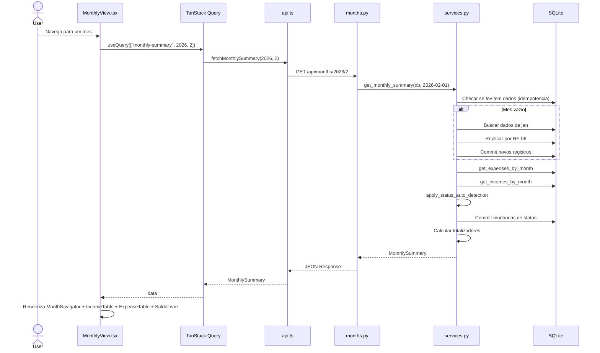
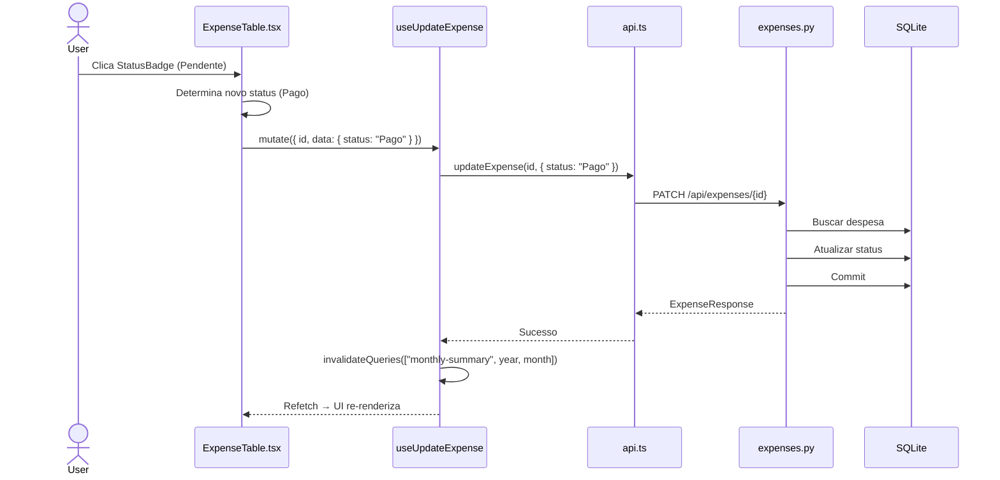
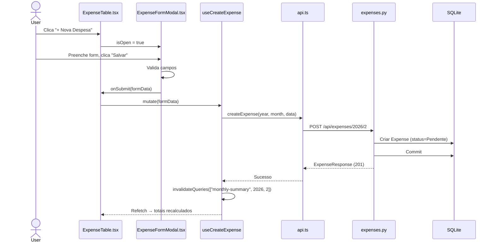

# Especificacao Tecnica — Meu Controle (Fase 1)

**Versao:** 1.0
**Data:** 2026-02-06
**PRD Ref:** 01-PRD v1.0
**Arquitetura Ref:** 02-ARCHITECTURE v1.0

---

## 1. Resumo das Mudancas

Fase 1 implementa o MVP completo do Meu Controle: aplicacao web para controle financeiro pessoal mensal com CRUD de despesas e receitas, visao mensal consolidada com totalizadores, transicao automatica de mes e gestao de status de pagamento.

### Escopo desta Iteracao

- Infraestrutura (backend FastAPI + frontend React/Vite)
- CRUD de Despesas (RF-01) com gestao de status (RF-05) e duplicacao (RF-07)
- CRUD de Receitas (RF-02)
- Visao Mensal com totalizadores (RF-03, RF-04)
- Transicao Automatica de Mes (RF-06)

---

## 2. Detalhamento Tecnico

### Contratos da API (Visao Geral)

| Metodo   | Path                                   | Body             | Resposta                | Descricao                                      |
|----------|----------------------------------------|------------------|-------------------------|-------------------------------------------------|
| `GET`    | `/api/months/{year}/{month}`           | —                | `MonthlySummary`        | Visao mensal completa. Dispara RF-06 + RF-05.   |
| `POST`   | `/api/expenses/{year}/{month}`         | `ExpenseCreate`  | `ExpenseResponse` (201) | Criar despesa no mes                            |
| `PATCH`  | `/api/expenses/{expense_id}`           | `ExpenseUpdate`  | `ExpenseResponse`       | Atualizar campos da despesa                     |
| `DELETE` | `/api/expenses/{expense_id}`           | —                | 204 No Content          | Excluir despesa                                 |
| `POST`   | `/api/expenses/{expense_id}/duplicate` | —                | `ExpenseResponse` (201) | RF-07: Duplicar despesa                         |
| `POST`   | `/api/incomes/{year}/{month}`          | `IncomeCreate`   | `IncomeResponse` (201)  | Criar receita no mes                            |
| `PATCH`  | `/api/incomes/{income_id}`             | `IncomeUpdate`   | `IncomeResponse`        | Atualizar campos da receita                     |
| `DELETE` | `/api/incomes/{income_id}`             | —                | 204 No Content          | Excluir receita                                 |
| `GET`    | `/api/health`                          | —                | `{"status": "ok"}`      | Health check                                    |

**Nota:** O endpoint principal e `GET /api/months/{year}/{month}`. Ele retorna tudo que o frontend precisa em uma unica chamada: despesas, receitas e totalizadores. Tambem dispara a geracao automatica de mes (RF-06) e a auto-deteccao de status (RF-05).

---

### Feature: Infraestrutura e Setup

#### 2.1 Descricao Tecnica

Configuracao base do projeto: backend FastAPI com SQLAlchemy/SQLite e frontend React com Vite, Tailwind CSS v4 e TanStack Query. Para decisoes arquiteturais, ver ADRs em 02-ARCHITECTURE.md.

#### 2.2 Arquivos

| Acao  | Caminho                           | Descricao                                         |
|-------|-----------------------------------|----------------------------------------------------|
| Criar | `backend/requirements.txt`        | Dependencias Python pinadas                        |
| Criar | `backend/app/__init__.py`         | Pacote Python (vazio)                              |
| Criar | `backend/app/database.py`         | Engine SQLAlchemy, sessoes, Base, dependency injection |
| Criar | `backend/app/main.py`             | Entry point FastAPI: lifespan, CORS, routers       |
| Criar | `backend/app/routers/__init__.py` | Pacote routers (vazio)                             |
| Criar | `frontend/package.json`           | Dependencias e scripts npm                         |
| Criar | `frontend/vite.config.ts`         | Build config + proxy /api                          |
| Criar | `frontend/tsconfig.json`          | Config raiz TypeScript                             |
| Criar | `frontend/tsconfig.app.json`      | Opcoes do compilador TS                            |
| Criar | `frontend/index.html`             | HTML entry point da SPA                            |
| Criar | `frontend/src/index.css`          | Tailwind v4 import + tema customizado              |
| Criar | `frontend/src/main.tsx`           | Bootstrap React + QueryClient                      |
| Criar | `frontend/src/App.tsx`            | Shell da aplicacao com header                      |
| Criar | `.gitignore`                      | Exclusoes para Python, Node, SQLite, IDE           |

#### 2.3 Codigo

**`backend/requirements.txt`**

```
fastapi==0.115.*
uvicorn[standard]==0.34.*
sqlalchemy==2.0.*
pydantic==2.*
psycopg2-binary==2.9.*
alembic==1.14.*
```

**`backend/app/database.py`** (CR-001: DATABASE_URL via env var, engine condicional)

```python
import os

from sqlalchemy import create_engine
from sqlalchemy.orm import DeclarativeBase, sessionmaker, Session
from typing import Generator

DATABASE_URL = os.environ.get("DATABASE_URL", "sqlite:///meu_controle.db")

# Railway PostgreSQL usa "postgres://" mas SQLAlchemy exige "postgresql://"
if DATABASE_URL.startswith("postgres://"):
    DATABASE_URL = DATABASE_URL.replace("postgres://", "postgresql://", 1)

connect_args = {}
if DATABASE_URL.startswith("sqlite"):
    connect_args["check_same_thread"] = False

engine = create_engine(DATABASE_URL, connect_args=connect_args)

SessionLocal = sessionmaker(autocommit=False, autoflush=False, bind=engine)


class Base(DeclarativeBase):
    pass


def get_db() -> Generator[Session, None, None]:
    """Dependency injection: fornece sessao do banco e garante cleanup."""
    db = SessionLocal()
    try:
        yield db
    finally:
        db.close()
```

**`backend/app/main.py`** (CR-001: create_all removido, Alembic gerencia migrations)

```python
from pathlib import Path
from contextlib import asynccontextmanager

from fastapi import FastAPI
from fastapi.middleware.cors import CORSMiddleware
from fastapi.staticfiles import StaticFiles
from fastapi.responses import FileResponse

from app.routers import expenses, incomes, months


@asynccontextmanager
async def lifespan(app: FastAPI):
    # Startup: migrations gerenciadas pelo Alembic (ver CR-001)
    yield


app = FastAPI(
    title="Meu Controle API",
    version="1.0.0",
    lifespan=lifespan,
)

app.add_middleware(
    CORSMiddleware,
    allow_origins=["http://localhost:5173"],  # Vite dev server
    allow_credentials=True,
    allow_methods=["*"],
    allow_headers=["*"],
)

app.include_router(months.router)
app.include_router(expenses.router)
app.include_router(incomes.router)


@app.get("/api/health")
def health_check():
    return {"status": "ok"}


# Serve frontend static files in production
STATIC_DIR = Path(__file__).resolve().parent.parent / "static"
if STATIC_DIR.is_dir():
    app.mount("/assets", StaticFiles(directory=STATIC_DIR / "assets"), name="assets")

    @app.get("/{full_path:path}")
    async def serve_spa(full_path: str):
        """Serve index.html for all non-API routes (SPA fallback)."""
        file_path = STATIC_DIR / full_path
        if file_path.is_file():
            return FileResponse(file_path)
        return FileResponse(STATIC_DIR / "index.html")
```

**Comandos para rodar (desenvolvimento):**
1. `alembic upgrade head` — aplica migrations (a partir do diretorio `backend/`)
2. `uvicorn app.main:app --reload` — inicia o servidor

**`frontend/package.json`**

```json
{
  "name": "meu-controle-frontend",
  "private": true,
  "version": "1.0.0",
  "type": "module",
  "scripts": {
    "dev": "vite",
    "build": "tsc -b && vite build",
    "preview": "vite preview"
  },
  "dependencies": {
    "react": "^19.0.0",
    "react-dom": "^19.0.0",
    "@tanstack/react-query": "^5.62.0"
  },
  "devDependencies": {
    "@types/react": "^19.0.0",
    "@types/react-dom": "^19.0.0",
    "@vitejs/plugin-react": "^4.3.0",
    "@tailwindcss/vite": "^4.0.0",
    "tailwindcss": "^4.0.0",
    "typescript": "^5.6.0",
    "vite": "^6.0.0"
  }
}
```

**`frontend/vite.config.ts`**

```typescript
import { defineConfig } from "vite";
import react from "@vitejs/plugin-react";
import tailwindcss from "@tailwindcss/vite";

export default defineConfig({
  plugins: [react(), tailwindcss()],
  server: {
    proxy: {
      "/api": {
        target: "http://localhost:8000",
        changeOrigin: true,
      },
    },
  },
});
```

**`frontend/tsconfig.json`**

```json
{
  "files": [],
  "references": [{ "path": "./tsconfig.app.json" }]
}
```

**`frontend/tsconfig.app.json`**

```json
{
  "compilerOptions": {
    "target": "ES2022",
    "lib": ["ES2023", "DOM", "DOM.Iterable"],
    "module": "ESNext",
    "moduleResolution": "bundler",
    "jsx": "react-jsx",
    "strict": true,
    "noUnusedLocals": true,
    "noUnusedParameters": true,
    "noFallthroughCasesInSwitch": true,
    "isolatedModules": true,
    "skipLibCheck": true
  },
  "include": ["src"]
}
```

**`frontend/index.html`**

```html
<!DOCTYPE html>
<html lang="pt-BR">
  <head>
    <meta charset="UTF-8" />
    <meta name="viewport" content="width=device-width, initial-scale=1.0" />
    <title>Meu Controle</title>
  </head>
  <body>
    <div id="root"></div>
    <script type="module" src="/src/main.tsx"></script>
  </body>
</html>
```

**`frontend/src/index.css`**

```css
@import "tailwindcss";

@theme {
  --color-primary: #2563eb;
  --color-primary-hover: #1d4ed8;
  --color-danger: #dc2626;
  --color-success: #16a34a;
  --color-warning: #d97706;
  --color-pendente: #eab308;
  --color-pago: #16a34a;
  --color-atrasado: #dc2626;
}
```

**`frontend/src/main.tsx`**

```typescript
import { StrictMode } from "react";
import { createRoot } from "react-dom/client";
import { QueryClient, QueryClientProvider } from "@tanstack/react-query";
import App from "./App";
import "./index.css";

const queryClient = new QueryClient({
  defaultOptions: {
    queries: {
      staleTime: 1000 * 60 * 5, // 5 minutos
      retry: 1,
    },
  },
});

createRoot(document.getElementById("root")!).render(
  <StrictMode>
    <QueryClientProvider client={queryClient}>
      <App />
    </QueryClientProvider>
  </StrictMode>
);
```

**`frontend/src/App.tsx`**

```typescript
import MonthlyView from "./pages/MonthlyView";

export default function App() {
  return (
    <div className="min-h-screen bg-gray-50">
      <header className="bg-primary text-white py-4 px-6 shadow-md">
        <h1 className="text-xl font-bold tracking-wide">MEU CONTROLE</h1>
      </header>
      <main>
        <MonthlyView />
      </main>
    </div>
  );
}
```

**`.gitignore`**

```
# Python
__pycache__/
*.py[cod]
*.egg-info/
*.egg
dist/
build/
.venv/
venv/

# SQLite
*.db

# Node
node_modules/
frontend/dist/

# IDE
.vscode/
.idea/

# OS
.DS_Store
Thumbs.db

# Env
.env
.env.local
```

---

### Feature: [RF-01] CRUD de Despesas

#### 2.1 Descricao Tecnica

Implementa criacao, leitura, edicao e exclusao de despesas mensais. Cada despesa pertence a um mes de referencia e possui status de pagamento, campos opcionais de parcelamento e flag de recorrencia.

#### 2.2 Arquivos

| Acao  | Caminho                              | Descricao                              |
|-------|--------------------------------------|----------------------------------------|
| Criar | `backend/app/models.py`              | Modelo ORM Expense + enum ExpenseStatus |
| Criar | `backend/app/schemas.py`             | Schemas Pydantic: ExpenseCreate, ExpenseUpdate, ExpenseResponse |
| Criar | `backend/app/crud.py`                | Funcoes de acesso a dados para expenses |
| Criar | `backend/app/routers/expenses.py`    | Endpoints POST, PATCH, DELETE          |
| Criar | `frontend/src/types.ts`              | Types TypeScript: Expense, ExpenseCreate, ExpenseUpdate |
| Criar | `frontend/src/services/api.ts`       | Funcoes HTTP: createExpense, updateExpense, deleteExpense |
| Criar | `frontend/src/hooks/useExpenses.ts`  | Hooks TanStack Query para mutations    |

#### 2.3 Interfaces / Types

**Backend — Models (`backend/app/models.py`):**

```python
import uuid
import enum
from datetime import date, datetime

from sqlalchemy import String, Date, Boolean, Integer, Numeric
from sqlalchemy.orm import Mapped, mapped_column

from app.database import Base


class ExpenseStatus(str, enum.Enum):
    PENDENTE = "Pendente"
    PAGO = "Pago"
    ATRASADO = "Atrasado"


class Expense(Base):
    __tablename__ = "expenses"

    id: Mapped[str] = mapped_column(
        String(36), primary_key=True, default=lambda: str(uuid.uuid4())
    )
    mes_referencia: Mapped[date] = mapped_column(Date, nullable=False, index=True)
    nome: Mapped[str] = mapped_column(String(255), nullable=False)
    valor: Mapped[float] = mapped_column(Numeric(10, 2), nullable=False)
    vencimento: Mapped[date] = mapped_column(Date, nullable=False)
    parcela_atual: Mapped[int | None] = mapped_column(Integer, nullable=True)
    parcela_total: Mapped[int | None] = mapped_column(Integer, nullable=True)
    recorrente: Mapped[bool] = mapped_column(Boolean, default=True, nullable=False)
    status: Mapped[str] = mapped_column(
        String(20), default=ExpenseStatus.PENDENTE.value, nullable=False
    )
    created_at: Mapped[datetime] = mapped_column(default=datetime.now)
    updated_at: Mapped[datetime] = mapped_column(
        default=datetime.now, onupdate=datetime.now
    )
```

**Backend — Schemas (`backend/app/schemas.py` — secao Expense):**

```python
from pydantic import BaseModel, Field, model_validator
from datetime import date, datetime
from typing import Optional

from app.models import ExpenseStatus


class ExpenseCreate(BaseModel):
    """Schema para criacao de despesa. mes_referencia vem da URL, status padrao Pendente."""
    nome: str = Field(..., min_length=1, max_length=255)
    valor: float = Field(..., gt=0)
    vencimento: date
    parcela_atual: Optional[int] = Field(None, ge=1)
    parcela_total: Optional[int] = Field(None, ge=1)
    recorrente: bool = True

    @model_validator(mode="after")
    def validate_parcelas(self) -> "ExpenseCreate":
        """Regra de integridade do PRD: ambos os campos de parcela devem estar
        presentes ou ausentes, e parcela_atual <= parcela_total."""
        atual = self.parcela_atual
        total = self.parcela_total
        if (atual is None) != (total is None):
            raise ValueError(
                "parcela_atual e parcela_total devem ambos ser preenchidos ou ambos nulos"
            )
        if atual is not None and total is not None and atual > total:
            raise ValueError("parcela_atual deve ser <= parcela_total")
        return self


class ExpenseUpdate(BaseModel):
    """Schema para atualizacao parcial (PATCH). Apenas campos enviados sao alterados."""
    nome: Optional[str] = Field(None, min_length=1, max_length=255)
    valor: Optional[float] = Field(None, gt=0)
    vencimento: Optional[date] = None
    parcela_atual: Optional[int] = Field(None, ge=1)
    parcela_total: Optional[int] = Field(None, ge=1)
    recorrente: Optional[bool] = None
    status: Optional[ExpenseStatus] = None


class ExpenseResponse(BaseModel):
    """Schema de resposta para despesa."""
    model_config = {"from_attributes": True}

    id: str
    mes_referencia: date
    nome: str
    valor: float
    vencimento: date
    parcela_atual: Optional[int]
    parcela_total: Optional[int]
    recorrente: bool
    status: str
    created_at: datetime
    updated_at: datetime
```

**Frontend — Types (`frontend/src/types.ts` — secao Expense):**

```typescript
export type ExpenseStatus = "Pendente" | "Pago" | "Atrasado";

export interface Expense {
  id: string;
  mes_referencia: string;
  nome: string;
  valor: number;
  vencimento: string;
  parcela_atual: number | null;
  parcela_total: number | null;
  recorrente: boolean;
  status: ExpenseStatus;
  created_at: string;
  updated_at: string;
}

export interface ExpenseCreate {
  nome: string;
  valor: number;
  vencimento: string;
  parcela_atual?: number | null;
  parcela_total?: number | null;
  recorrente: boolean;
}

export interface ExpenseUpdate {
  nome?: string;
  valor?: number;
  vencimento?: string;
  parcela_atual?: number | null;
  parcela_total?: number | null;
  recorrente?: boolean;
  status?: ExpenseStatus;
}
```

#### 2.4 Logica de Negocio

**CRUD — Camada de acesso a dados (`backend/app/crud.py` — secao Expenses):**

```python
from sqlalchemy.orm import Session
from sqlalchemy import select
from datetime import date

from app.models import Expense, Income


# ========== Expenses ==========

def get_expenses_by_month(db: Session, mes_referencia: date) -> list[Expense]:
    """Retorna todas as despesas de um mes, ordenadas por vencimento."""
    stmt = (
        select(Expense)
        .where(Expense.mes_referencia == mes_referencia)
        .order_by(Expense.vencimento)
    )
    return list(db.scalars(stmt).all())


def get_expense_by_id(db: Session, expense_id: str) -> Expense | None:
    """Retorna uma despesa por ID ou None."""
    return db.get(Expense, expense_id)


def create_expense(db: Session, expense: Expense) -> Expense:
    """Persiste uma nova despesa."""
    db.add(expense)
    db.commit()
    db.refresh(expense)
    return expense


def update_expense(db: Session, expense: Expense) -> Expense:
    """Persiste alteracoes em uma despesa existente."""
    db.commit()
    db.refresh(expense)
    return expense


def delete_expense(db: Session, expense: Expense) -> None:
    """Remove uma despesa."""
    db.delete(expense)
    db.commit()


def count_expenses_by_month(db: Session, mes_referencia: date) -> int:
    """Conta despesas no mes (usado pelo check de idempotencia da transicao)."""
    stmt = select(Expense).where(Expense.mes_referencia == mes_referencia)
    return len(list(db.scalars(stmt).all()))
```

**Criar Despesa:**
1. Receber `ExpenseCreate` do body + `year/month` do path
2. Construir `mes_referencia = date(year, month, 1)`
3. Criar instancia `Expense` com `status = "Pendente"`
4. Persistir via `crud.create_expense()`
5. Retornar `ExpenseResponse` (201)

**Atualizar Despesa (PATCH):**
1. Receber `expense_id` do path + `ExpenseUpdate` do body
2. Buscar despesa por ID — se nao existe: 404
3. Aplicar `model_dump(exclude_unset=True)` para obter apenas campos enviados
4. Para campo `status`: converter enum `.value` antes de `setattr`
5. Persistir via `crud.update_expense()`
6. Retornar `ExpenseResponse` atualizado

**Excluir Despesa:**
1. Receber `expense_id` do path
2. Buscar despesa por ID — se nao existe: 404
3. Remover via `crud.delete_expense()`
4. Retornar 204 No Content

#### 2.5 API Endpoints

**`backend/app/routers/expenses.py`**

```python
from fastapi import APIRouter, Depends, HTTPException
from sqlalchemy.orm import Session
from datetime import date

from app.database import get_db
from app.models import Expense, ExpenseStatus
from app.schemas import ExpenseCreate, ExpenseUpdate, ExpenseResponse
from app import crud

router = APIRouter(prefix="/api/expenses", tags=["expenses"])


@router.post("/{year}/{month}", response_model=ExpenseResponse, status_code=201)
def create_expense(
    year: int, month: int, data: ExpenseCreate, db: Session = Depends(get_db)
):
    """Criar nova despesa no mes especificado."""
    mes_referencia = date(year, month, 1)
    expense = Expense(
        mes_referencia=mes_referencia,
        nome=data.nome,
        valor=data.valor,
        vencimento=data.vencimento,
        parcela_atual=data.parcela_atual,
        parcela_total=data.parcela_total,
        recorrente=data.recorrente,
        status=ExpenseStatus.PENDENTE.value,
    )
    return crud.create_expense(db, expense)


@router.patch("/{expense_id}", response_model=ExpenseResponse)
def update_expense(
    expense_id: str, data: ExpenseUpdate, db: Session = Depends(get_db)
):
    """Atualizar despesa existente. PATCH: apenas campos enviados sao alterados."""
    expense = crud.get_expense_by_id(db, expense_id)
    if not expense:
        raise HTTPException(status_code=404, detail="Despesa nao encontrada")

    update_data = data.model_dump(exclude_unset=True)
    for field, value in update_data.items():
        if field == "status" and value is not None:
            setattr(expense, field, value.value)
        else:
            setattr(expense, field, value)

    return crud.update_expense(db, expense)


@router.delete("/{expense_id}", status_code=204)
def delete_expense(expense_id: str, db: Session = Depends(get_db)):
    """Excluir despesa por ID."""
    expense = crud.get_expense_by_id(db, expense_id)
    if not expense:
        raise HTTPException(status_code=404, detail="Despesa nao encontrada")
    crud.delete_expense(db, expense)
```

**Frontend — HTTP Client (`frontend/src/services/api.ts` — secao Expenses):**

```typescript
import type {
  MonthlySummary,
  ExpenseCreate,
  ExpenseUpdate,
  Expense,
  IncomeCreate,
  IncomeUpdate,
  Income,
} from "../types";

const BASE_URL = "/api";

async function request<T>(url: string, options?: RequestInit): Promise<T> {
  const response = await fetch(`${BASE_URL}${url}`, {
    headers: { "Content-Type": "application/json" },
    ...options,
  });
  if (!response.ok) {
    const error = await response.json().catch(() => ({}));
    throw new Error(error.detail || `HTTP ${response.status}`);
  }
  if (response.status === 204) return undefined as T;
  return response.json();
}

export function createExpense(
  year: number,
  month: number,
  data: ExpenseCreate
): Promise<Expense> {
  return request<Expense>(`/expenses/${year}/${month}`, {
    method: "POST",
    body: JSON.stringify(data),
  });
}

export function updateExpense(
  id: string,
  data: ExpenseUpdate
): Promise<Expense> {
  return request<Expense>(`/expenses/${id}`, {
    method: "PATCH",
    body: JSON.stringify(data),
  });
}

export function deleteExpense(id: string): Promise<void> {
  return request<void>(`/expenses/${id}`, { method: "DELETE" });
}
```

**Frontend — Hooks (`frontend/src/hooks/useExpenses.ts`):**

```typescript
import { useMutation, useQueryClient } from "@tanstack/react-query";
import * as api from "../services/api";
import type { ExpenseCreate, ExpenseUpdate } from "../types";

function monthQueryKey(year: number, month: number) {
  return ["monthly-summary", year, month];
}

export function useCreateExpense(year: number, month: number) {
  const queryClient = useQueryClient();
  return useMutation({
    mutationFn: (data: ExpenseCreate) => api.createExpense(year, month, data),
    onSuccess: () => {
      queryClient.invalidateQueries({ queryKey: monthQueryKey(year, month) });
    },
  });
}

export function useUpdateExpense(year: number, month: number) {
  const queryClient = useQueryClient();
  return useMutation({
    mutationFn: ({ id, data }: { id: string; data: ExpenseUpdate }) =>
      api.updateExpense(id, data),
    onSuccess: () => {
      queryClient.invalidateQueries({ queryKey: monthQueryKey(year, month) });
    },
  });
}

export function useDeleteExpense(year: number, month: number) {
  const queryClient = useQueryClient();
  return useMutation({
    mutationFn: (id: string) => api.deleteExpense(id),
    onSuccess: () => {
      queryClient.invalidateQueries({ queryKey: monthQueryKey(year, month) });
    },
  });
}
```

#### 2.6 Validacoes

| Campo         | Regra                                              | Mensagem de Erro                                                  |
|---------------|----------------------------------------------------|--------------------------------------------------------------------|
| nome          | Obrigatorio, 1-255 chars                           | Validacao Pydantic Field                                           |
| valor         | Obrigatorio, > 0                                   | Validacao Pydantic Field(gt=0)                                     |
| vencimento    | Obrigatorio, tipo date                             | Validacao Pydantic                                                 |
| parcela_atual | Opcional, >= 1                                     | Validacao Pydantic Field(ge=1)                                     |
| parcela_total | Opcional, >= 1                                     | Validacao Pydantic Field(ge=1)                                     |
| parcelas      | Ambos presentes ou ambos nulos                     | "parcela_atual e parcela_total devem ambos ser preenchidos ou ambos nulos" |
| parcelas      | parcela_atual <= parcela_total                     | "parcela_atual deve ser <= parcela_total"                          |

---

### Feature: [RF-02] CRUD de Receitas

#### 2.1 Descricao Tecnica

Implementa criacao, leitura, edicao e exclusao de receitas mensais. Mesma estrutura de RF-01, porem mais simples (sem parcelas, sem status).

#### 2.2 Arquivos

| Acao  | Caminho                             | Descricao                              |
|-------|-------------------------------------|----------------------------------------|
| Criar | `backend/app/models.py`             | Modelo ORM Income (mesmo arquivo de Expense) |
| Criar | `backend/app/schemas.py`            | Schemas: IncomeCreate, IncomeUpdate, IncomeResponse |
| Criar | `backend/app/crud.py`               | Funcoes de acesso a dados para incomes |
| Criar | `backend/app/routers/incomes.py`    | Endpoints POST, PATCH, DELETE          |
| Criar | `frontend/src/types.ts`             | Types: Income, IncomeCreate, IncomeUpdate |
| Criar | `frontend/src/services/api.ts`      | Funcoes HTTP: createIncome, updateIncome, deleteIncome |
| Criar | `frontend/src/hooks/useIncomes.ts`  | Hooks TanStack Query para mutations    |

#### 2.3 Interfaces / Types

**Backend — Model (`backend/app/models.py` — secao Income):**

```python
class Income(Base):
    __tablename__ = "incomes"

    id: Mapped[str] = mapped_column(
        String(36), primary_key=True, default=lambda: str(uuid.uuid4())
    )
    mes_referencia: Mapped[date] = mapped_column(Date, nullable=False, index=True)
    nome: Mapped[str] = mapped_column(String(255), nullable=False)
    valor: Mapped[float] = mapped_column(Numeric(10, 2), nullable=False)
    data: Mapped[date | None] = mapped_column(Date, nullable=True)
    recorrente: Mapped[bool] = mapped_column(Boolean, default=True, nullable=False)
    created_at: Mapped[datetime] = mapped_column(default=datetime.now)
    updated_at: Mapped[datetime] = mapped_column(
        default=datetime.now, onupdate=datetime.now
    )
```

**Backend — Schemas (`backend/app/schemas.py` — secao Income):**

```python
class IncomeCreate(BaseModel):
    """Schema para criacao de receita."""
    nome: str = Field(..., min_length=1, max_length=255)
    valor: float = Field(..., gt=0)
    data: Optional[date] = None
    recorrente: bool = True


class IncomeUpdate(BaseModel):
    """Schema para atualizacao parcial de receita."""
    nome: Optional[str] = Field(None, min_length=1, max_length=255)
    valor: Optional[float] = Field(None, gt=0)
    data: Optional[date] = None
    recorrente: Optional[bool] = None


class IncomeResponse(BaseModel):
    """Schema de resposta para receita."""
    model_config = {"from_attributes": True}

    id: str
    mes_referencia: date
    nome: str
    valor: float
    data: Optional[date]
    recorrente: bool
    created_at: datetime
    updated_at: datetime
```

**Frontend — Types (`frontend/src/types.ts` — secao Income):**

```typescript
export interface Income {
  id: string;
  mes_referencia: string;
  nome: string;
  valor: number;
  data: string | null;
  recorrente: boolean;
  created_at: string;
  updated_at: string;
}

export interface IncomeCreate {
  nome: string;
  valor: number;
  data?: string | null;
  recorrente: boolean;
}

export interface IncomeUpdate {
  nome?: string;
  valor?: number;
  data?: string | null;
  recorrente?: boolean;
}
```

#### 2.4 Logica de Negocio

**CRUD — Camada de acesso a dados (`backend/app/crud.py` — secao Incomes):**

```python
# ========== Incomes ==========

def get_incomes_by_month(db: Session, mes_referencia: date) -> list[Income]:
    """Retorna todas as receitas de um mes, ordenadas por data."""
    stmt = (
        select(Income)
        .where(Income.mes_referencia == mes_referencia)
        .order_by(Income.data)
    )
    return list(db.scalars(stmt).all())


def get_income_by_id(db: Session, income_id: str) -> Income | None:
    """Retorna uma receita por ID ou None."""
    return db.get(Income, income_id)


def create_income(db: Session, income: Income) -> Income:
    """Persiste uma nova receita."""
    db.add(income)
    db.commit()
    db.refresh(income)
    return income


def update_income(db: Session, income: Income) -> Income:
    """Persiste alteracoes em uma receita existente."""
    db.commit()
    db.refresh(income)
    return income


def delete_income(db: Session, income: Income) -> None:
    """Remove uma receita."""
    db.delete(income)
    db.commit()
```

#### 2.5 API Endpoints

**`backend/app/routers/incomes.py`**

```python
from fastapi import APIRouter, Depends, HTTPException
from sqlalchemy.orm import Session
from datetime import date

from app.database import get_db
from app.models import Income
from app.schemas import IncomeCreate, IncomeUpdate, IncomeResponse
from app import crud

router = APIRouter(prefix="/api/incomes", tags=["incomes"])


@router.post("/{year}/{month}", response_model=IncomeResponse, status_code=201)
def create_income(
    year: int, month: int, data: IncomeCreate, db: Session = Depends(get_db)
):
    """Criar nova receita no mes especificado."""
    mes_referencia = date(year, month, 1)
    income = Income(
        mes_referencia=mes_referencia,
        nome=data.nome,
        valor=data.valor,
        data=data.data,
        recorrente=data.recorrente,
    )
    return crud.create_income(db, income)


@router.patch("/{income_id}", response_model=IncomeResponse)
def update_income(
    income_id: str, data: IncomeUpdate, db: Session = Depends(get_db)
):
    """Atualizar receita existente."""
    income = crud.get_income_by_id(db, income_id)
    if not income:
        raise HTTPException(status_code=404, detail="Receita nao encontrada")

    update_data = data.model_dump(exclude_unset=True)
    for field, value in update_data.items():
        setattr(income, field, value)

    return crud.update_income(db, income)


@router.delete("/{income_id}", status_code=204)
def delete_income(income_id: str, db: Session = Depends(get_db)):
    """Excluir receita por ID."""
    income = crud.get_income_by_id(db, income_id)
    if not income:
        raise HTTPException(status_code=404, detail="Receita nao encontrada")
    crud.delete_income(db, income)
```

**Frontend — HTTP Client (`frontend/src/services/api.ts` — secao Incomes):**

```typescript
export function createIncome(
  year: number,
  month: number,
  data: IncomeCreate
): Promise<Income> {
  return request<Income>(`/incomes/${year}/${month}`, {
    method: "POST",
    body: JSON.stringify(data),
  });
}

export function updateIncome(
  id: string,
  data: IncomeUpdate
): Promise<Income> {
  return request<Income>(`/incomes/${id}`, {
    method: "PATCH",
    body: JSON.stringify(data),
  });
}

export function deleteIncome(id: string): Promise<void> {
  return request<void>(`/incomes/${id}`, { method: "DELETE" });
}
```

**Frontend — Hooks (`frontend/src/hooks/useIncomes.ts`):**

```typescript
import { useMutation, useQueryClient } from "@tanstack/react-query";
import * as api from "../services/api";
import type { IncomeCreate, IncomeUpdate } from "../types";

function monthQueryKey(year: number, month: number) {
  return ["monthly-summary", year, month];
}

export function useCreateIncome(year: number, month: number) {
  const queryClient = useQueryClient();
  return useMutation({
    mutationFn: (data: IncomeCreate) => api.createIncome(year, month, data),
    onSuccess: () => {
      queryClient.invalidateQueries({ queryKey: monthQueryKey(year, month) });
    },
  });
}

export function useUpdateIncome(year: number, month: number) {
  const queryClient = useQueryClient();
  return useMutation({
    mutationFn: ({ id, data }: { id: string; data: IncomeUpdate }) =>
      api.updateIncome(id, data),
    onSuccess: () => {
      queryClient.invalidateQueries({ queryKey: monthQueryKey(year, month) });
    },
  });
}

export function useDeleteIncome(year: number, month: number) {
  const queryClient = useQueryClient();
  return useMutation({
    mutationFn: (id: string) => api.deleteIncome(id),
    onSuccess: () => {
      queryClient.invalidateQueries({ queryKey: monthQueryKey(year, month) });
    },
  });
}
```

#### 2.6 Validacoes

| Campo | Regra                    | Mensagem de Erro               |
|-------|--------------------------|--------------------------------|
| nome  | Obrigatorio, 1-255 chars | Validacao Pydantic Field       |
| valor | Obrigatorio, > 0         | Validacao Pydantic Field(gt=0) |
| data  | Opcional, tipo date      | Validacao Pydantic             |

---

### Feature: [RF-03/RF-04] Visao Mensal e Totalizadores

#### 2.1 Descricao Tecnica

Endpoint principal que alimenta toda a pagina. Retorna despesas, receitas e totalizadores em uma unica chamada. Dispara automaticamente a geracao de mes (RF-06) e auto-deteccao de status (RF-05).

#### 2.2 Arquivos

| Acao  | Caminho                                    | Descricao                              |
|-------|--------------------------------------------|----------------------------------------|
| Criar | `backend/app/schemas.py`                   | Schema MonthlySummary                  |
| Criar | `backend/app/services.py`                  | Funcao get_monthly_summary             |
| Criar | `backend/app/routers/months.py`            | Endpoint GET /api/months/{year}/{month}|
| Criar | `frontend/src/types.ts`                    | Type MonthlySummary                    |
| Criar | `frontend/src/services/api.ts`             | Funcao fetchMonthlySummary             |
| Criar | `frontend/src/hooks/useMonthTransition.ts` | Hook useMonthlyView                    |
| Criar | `frontend/src/utils/format.ts`             | Formatacao BRL, parcela, data          |
| Criar | `frontend/src/utils/date.ts`               | Navegacao entre meses                  |

#### 2.3 Interfaces / Types

**Backend — Schema (`backend/app/schemas.py` — secao Summary):**

```python
class MonthlySummary(BaseModel):
    """Resposta composta da visao mensal: despesas + receitas + totalizadores."""
    mes_referencia: date
    total_despesas: float
    total_receitas: float
    saldo_livre: float
    expenses: list[ExpenseResponse]
    incomes: list[IncomeResponse]
```

**Frontend — Type (`frontend/src/types.ts` — secao Summary):**

```typescript
export interface MonthlySummary {
  mes_referencia: string;
  total_despesas: number;
  total_receitas: number;
  saldo_livre: number;
  expenses: Expense[];
  incomes: Income[];
}
```

#### 2.4 Logica de Negocio

**`backend/app/services.py` — get_monthly_summary:**

```python
def get_monthly_summary(db: Session, mes_referencia: date) -> dict:
    """
    Constroi a visao mensal completa.
    Passos:
    1. Tenta gerar dados do mes se vazio (RF-06)
    2. Busca despesas e receitas
    3. Aplica auto-deteccao de status (RF-05)
    4. Calcula totalizadores (RF-04)
    """
    # Passo 1: Auto-gerar se necessario
    generate_month_data(db, mes_referencia)

    # Passo 2: Buscar dados
    expenses = crud.get_expenses_by_month(db, mes_referencia)
    incomes = crud.get_incomes_by_month(db, mes_referencia)

    # Passo 3: Auto-detectar status de atraso
    today = date.today()
    apply_status_auto_detection(expenses, today)
    db.commit()  # Persiste mudancas de status

    # Passo 4: Calcular totalizadores
    total_despesas = sum(float(e.valor) for e in expenses)
    total_receitas = sum(float(i.valor) for i in incomes)

    return {
        "mes_referencia": mes_referencia,
        "total_despesas": round(total_despesas, 2),
        "total_receitas": round(total_receitas, 2),
        "saldo_livre": round(total_receitas - total_despesas, 2),
        "expenses": expenses,
        "incomes": incomes,
    }
```

#### 2.5 API Endpoints

**`backend/app/routers/months.py`**

```python
from fastapi import APIRouter, Depends
from sqlalchemy.orm import Session
from datetime import date

from app.database import get_db
from app.schemas import MonthlySummary
from app import services

router = APIRouter(prefix="/api/months", tags=["months"])


@router.get("/{year}/{month}", response_model=MonthlySummary)
def get_monthly_view(year: int, month: int, db: Session = Depends(get_db)):
    """
    GET /api/months/2026/2 → visao mensal completa de fevereiro 2026.
    Dispara geracao de mes se vazio (RF-06).
    Aplica auto-deteccao de status (RF-05).
    Retorna despesas, receitas e totalizadores.
    """
    mes_referencia = date(year, month, 1)
    summary = services.get_monthly_summary(db, mes_referencia)
    return summary
```

**Frontend — HTTP Client:**

```typescript
export function fetchMonthlySummary(
  year: number,
  month: number
): Promise<MonthlySummary> {
  return request<MonthlySummary>(`/months/${year}/${month}`);
}
```

**Frontend — Hook (`frontend/src/hooks/useMonthTransition.ts`):**

```typescript
import { useQuery } from "@tanstack/react-query";
import { useState } from "react";
import { fetchMonthlySummary } from "../services/api";
import {
  getCurrentMonthRef,
  getNextMonth,
  getPreviousMonth,
} from "../utils/date";
import type { MonthlySummary } from "../types";

export function useMonthlyView() {
  const [monthRef, setMonthRef] = useState(getCurrentMonthRef);

  const query = useQuery<MonthlySummary>({
    queryKey: ["monthly-summary", monthRef.year, monthRef.month],
    queryFn: () => fetchMonthlySummary(monthRef.year, monthRef.month),
  });

  function goToPreviousMonth() {
    setMonthRef((prev) => getPreviousMonth(prev.year, prev.month));
  }

  function goToNextMonth() {
    setMonthRef((prev) => getNextMonth(prev.year, prev.month));
  }

  return {
    year: monthRef.year,
    month: monthRef.month,
    data: query.data,
    isLoading: query.isLoading,
    isError: query.isError,
    error: query.error,
    goToPreviousMonth,
    goToNextMonth,
  };
}
```

**Frontend — Utilitarios (`frontend/src/utils/format.ts`):**

```typescript
const brlFormatter = new Intl.NumberFormat("pt-BR", {
  style: "currency",
  currency: "BRL",
});

/** Formata numero como moeda brasileira: R$ 1.234,56 */
export function formatBRL(value: number): string {
  return brlFormatter.format(value);
}

/** Formata parcela como "X de Y" ou string vazia se nao aplicavel */
export function formatParcela(
  atual: number | null,
  total: number | null
): string {
  if (atual === null || total === null) return "";
  return `${atual} de ${total}`;
}

/** Formata data ISO (YYYY-MM-DD) para DD/MM */
export function formatDateBR(isoDate: string | null): string {
  if (!isoDate) return "";
  const [, month, day] = isoDate.split("-");
  return `${day}/${month}`;
}
```

**Frontend — Utilitarios (`frontend/src/utils/date.ts`):**

```typescript
const MONTH_NAMES = [
  "Janeiro", "Fevereiro", "Marco", "Abril", "Maio", "Junho",
  "Julho", "Agosto", "Setembro", "Outubro", "Novembro", "Dezembro",
];

export function getCurrentMonthRef(): { year: number; month: number } {
  const now = new Date();
  return { year: now.getFullYear(), month: now.getMonth() + 1 };
}

export function getMonthName(month: number): string {
  return MONTH_NAMES[month - 1];
}

export function getMonthLabel(year: number, month: number): string {
  return `${getMonthName(month)} ${year}`;
}

export function getPreviousMonth(
  year: number,
  month: number
): { year: number; month: number } {
  if (month === 1) return { year: year - 1, month: 12 };
  return { year, month: month - 1 };
}

export function getNextMonth(
  year: number,
  month: number
): { year: number; month: number } {
  if (month === 12) return { year: year + 1, month: 1 };
  return { year, month: month + 1 };
}
```

---

### Feature: [RF-05] Gestao de Status

#### 2.1 Descricao Tecnica

Auto-deteccao de atraso no servidor e toggle de status via UI. Despesas com vencimento passado e status "Pendente" sao automaticamente marcadas como "Atrasado". O usuario pode alternar entre Pendente e Pago clicando no badge de status.

#### 2.2 Arquivos

| Acao  | Caminho                    | Descricao                              |
|-------|----------------------------|----------------------------------------|
| Criar | `backend/app/services.py`  | Funcao apply_status_auto_detection     |
| Usar  | `backend/app/routers/expenses.py` | PATCH para toggle de status     |
| Usar  | `frontend/src/hooks/useExpenses.ts` | useUpdateExpense para status  |

#### 2.3 Logica de Negocio

**`backend/app/services.py` — apply_status_auto_detection:**

```python
def apply_status_auto_detection(
    expenses: list[Expense], today: date
) -> list[Expense]:
    """
    RF-05: Para despesas com status "Pendente" e vencimento < hoje,
    marca como "Atrasado". Modifica as instancias in-place.
    O chamador decide se persiste as mudancas.
    """
    for expense in expenses:
        if (
            expense.status == ExpenseStatus.PENDENTE.value
            and expense.vencimento < today
        ):
            expense.status = ExpenseStatus.ATRASADO.value
    return expenses
```

**Toggle de status na UI:**
- Clicar em `Pendente` → muda para `Pago` (via PATCH `{ "status": "Pago" }`)
- Clicar em `Atrasado` → muda para `Pago` (usuario pagou despesa atrasada)
- Clicar em `Pago` → muda para `Pendente` (via PATCH `{ "status": "Pendente" }`)

---

### Feature: [RF-06] Transicao Automatica de Mes

#### 2.1 Descricao Tecnica

Algoritmo mais complexo do sistema. Quando o usuario navega para um mes sem dados, gera automaticamente lancamentos a partir do mes anterior seguindo regras de replicacao para despesas recorrentes, parceladas e receitas.

#### 2.2 Arquivos

| Acao  | Caminho                   | Descricao                              |
|-------|---------------------------|----------------------------------------|
| Criar | `backend/app/services.py` | generate_month_data, helpers de data   |

#### 2.3 Logica de Negocio

**`backend/app/services.py` — Funcoes auxiliares + Algoritmo de Transicao:**

```python
import calendar
from datetime import date

from sqlalchemy.orm import Session

from app import crud
from app.models import Expense, ExpenseStatus, Income


def get_next_month(current: date) -> date:
    """Dado um mes_referencia (1o dia do mes), retorna 1o dia do proximo mes."""
    if current.month == 12:
        return date(current.year + 1, 1, 1)
    return date(current.year, current.month + 1, 1)


def get_previous_month(current: date) -> date:
    """Dado um mes_referencia (1o dia do mes), retorna 1o dia do mes anterior."""
    if current.month == 1:
        return date(current.year - 1, 12, 1)
    return date(current.year, current.month - 1, 1)


def adjust_vencimento_to_month(original_date: date, target_mes: date) -> date:
    """
    Move uma data para o mes-alvo mantendo o mesmo dia.
    Se o dia nao existe no mes-alvo (ex: 31 jan -> fev), clamp para o ultimo dia.
    """
    last_day = calendar.monthrange(target_mes.year, target_mes.month)[1]
    day = min(original_date.day, last_day)
    return date(target_mes.year, target_mes.month, day)


def generate_month_data(db: Session, target_mes: date) -> bool:
    """
    RF-06: Algoritmo de Transicao de Mes.

    Chamado quando o usuario navega para um mes sem dados.
    Olha os dados do mes anterior e gera entradas para target_mes
    seguindo as regras de replicacao.

    Retorna True se dados foram gerados, False se o mes-alvo ja tinha dados
    ou o mes anterior nao tinha dados (nada a replicar).

    Algoritmo:
    1. Checar se target_mes ja tem dados → se sim, return False (idempotente)
    2. Buscar despesas e receitas do mes anterior
    3. Para cada despesa:
       a. Tem parcela (parcela_atual e parcela_total preenchidos)?
          - Se parcela_atual < parcela_total: replicar com parcela_atual + 1
          - Se parcela_atual == parcela_total: NAO replicar (ultima parcela)
       b. Nao tem parcela?
          - Se recorrente == True: replicar com mesmos dados
          - Se recorrente == False: NAO replicar (despesa avulsa)
    4. Para cada receita:
       - Se recorrente == True: replicar
       - Se recorrente == False: NAO replicar
    5. Todas as novas entradas recebem status = Pendente e novos UUIDs.
    """
    # Passo 1: Check de idempotencia
    existing_expenses = crud.count_expenses_by_month(db, target_mes)
    existing_incomes = len(crud.get_incomes_by_month(db, target_mes))
    if existing_expenses > 0 or existing_incomes > 0:
        return False

    # Passo 2: Buscar dados do mes anterior
    prev_mes = get_previous_month(target_mes)
    prev_expenses = crud.get_expenses_by_month(db, prev_mes)
    prev_incomes = crud.get_incomes_by_month(db, prev_mes)

    if not prev_expenses and not prev_incomes:
        return False

    # Passo 3: Replicar despesas
    for exp in prev_expenses:
        if exp.parcela_atual is not None and exp.parcela_total is not None:
            # Despesa parcelada
            if exp.parcela_atual < exp.parcela_total:
                new_exp = Expense(
                    mes_referencia=target_mes,
                    nome=exp.nome,
                    valor=exp.valor,
                    vencimento=adjust_vencimento_to_month(
                        exp.vencimento, target_mes
                    ),
                    parcela_atual=exp.parcela_atual + 1,
                    parcela_total=exp.parcela_total,
                    recorrente=exp.recorrente,
                    status=ExpenseStatus.PENDENTE.value,
                )
                db.add(new_exp)
            # else: ultima parcela, NAO replica
        else:
            # Despesa sem parcela
            if exp.recorrente:
                new_exp = Expense(
                    mes_referencia=target_mes,
                    nome=exp.nome,
                    valor=exp.valor,
                    vencimento=adjust_vencimento_to_month(
                        exp.vencimento, target_mes
                    ),
                    parcela_atual=None,
                    parcela_total=None,
                    recorrente=True,
                    status=ExpenseStatus.PENDENTE.value,
                )
                db.add(new_exp)
            # else: nao recorrente, NAO replica

    # Passo 4: Replicar receitas
    for inc in prev_incomes:
        if inc.recorrente:
            new_inc = Income(
                mes_referencia=target_mes,
                nome=inc.nome,
                valor=inc.valor,
                data=(
                    adjust_vencimento_to_month(inc.data, target_mes)
                    if inc.data
                    else None
                ),
                recorrente=True,
            )
            db.add(new_inc)
        # else: nao recorrente, NAO replica

    db.commit()
    return True
```

---

### Feature: [RF-07] Cadastro Rapido (Duplicar)

#### 2.1 Descricao Tecnica

Permite duplicar uma despesa existente no mesmo mes, copiando todos os campos e resetando o status para "Pendente" com novo UUID.

#### 2.2 Arquivos

| Acao  | Caminho                              | Descricao                 |
|-------|--------------------------------------|---------------------------|
| Usar  | `backend/app/routers/expenses.py`    | Endpoint POST /duplicate  |
| Criar | `frontend/src/services/api.ts`       | Funcao duplicateExpense   |
| Criar | `frontend/src/hooks/useExpenses.ts`  | Hook useDuplicateExpense  |

#### 2.3 Codigo

**Backend — Endpoint de duplicacao (em `routers/expenses.py`):**

```python
@router.post(
    "/{expense_id}/duplicate", response_model=ExpenseResponse, status_code=201
)
def duplicate_expense(expense_id: str, db: Session = Depends(get_db)):
    """RF-07: Duplicar despesa existente no mesmo mes."""
    original = crud.get_expense_by_id(db, expense_id)
    if not original:
        raise HTTPException(status_code=404, detail="Despesa nao encontrada")

    new_expense = Expense(
        mes_referencia=original.mes_referencia,
        nome=original.nome,
        valor=original.valor,
        vencimento=original.vencimento,
        parcela_atual=original.parcela_atual,
        parcela_total=original.parcela_total,
        recorrente=original.recorrente,
        status=ExpenseStatus.PENDENTE.value,
    )
    return crud.create_expense(db, new_expense)
```

**Frontend — HTTP + Hook:**

```typescript
// api.ts
export function duplicateExpense(id: string): Promise<Expense> {
  return request<Expense>(`/expenses/${id}/duplicate`, { method: "POST" });
}

// useExpenses.ts
export function useDuplicateExpense(year: number, month: number) {
  const queryClient = useQueryClient();
  return useMutation({
    mutationFn: (id: string) => api.duplicateExpense(id),
    onSuccess: () => {
      queryClient.invalidateQueries({ queryKey: monthQueryKey(year, month) });
    },
  });
}
```

---

## 3. Componentes de UI

### Wireframe de Referencia

```
+------------------------------------------------------------------------+
|  MEU CONTROLE                                            [Usuario]     |
+------------------------------------------------------------------------+
|                                                                        |
|   [<  Anterior]     Fevereiro 2026      [Proximo  >]                   |
|                                                                        |
+------------------------------------------------------------------------+
|                                                                        |
|  RECEITAS                                          [+ Nova Receita]    |
|  +------------------------------------------------------------------+  |
|  | Nome                  | Valor          | Data       | Acoes      |  |
|  |------------------------------------------------------------------+  |
|  | Salario               | R$ 8.500,00    | 05/02      | [E] [X]    |  |
|  | Freelance             | R$ 1.200,00    | 15/02      | [E] [X]    |  |
|  +------------------------------------------------------------------+  |
|  | TOTAL RECEITAS                          R$ 9.700,00               |  |
|  +------------------------------------------------------------------+  |
|                                                                        |
|  DESPESAS                                          [+ Nova Despesa]    |
|  +------------------------------------------------------------------+  |
|  | Nome           | Valor      | Parcela  | Venc.  | Status  | Acoes|  |
|  |------------------------------------------------------------------+  |
|  | Aluguel        | R$ 2.500,00|          | 05/02  | [Pago]  |[E][X]|  |
|  | Escola Gu      | R$ 1.800,00| 2 de 12  | 10/02  |[Pendente]|[E][X]| |
|  | Conta Luz      | R$   280,00|          | 15/02  |[Pendente]|[E][X]| |
|  | Emp Picpay     | R$   450,00| 9 de 48  | 20/02  |[Pendente]|[E][X]| |
|  | Internet       | R$   120,00|          | 20/02  |[Pendente]|[E][X]| |
|  | Cartao Credito | R$ 1.350,00|          | 25/02  |[Atrasado]|[E][X]| |
|  +------------------------------------------------------------------+  |
|  | TOTAL DESPESAS                          R$ 6.500,00               |  |
|  +------------------------------------------------------------------+  |
|                                                                        |
|  +------------------------------------------------------------------+  |
|  |  SALDO LIVRE:   R$ 9.700,00 - R$ 6.500,00 =     R$ 3.200,00     |  |
|  +------------------------------------------------------------------+  |
|                                                                        |
+------------------------------------------------------------------------+

Legenda:
  [E] = Editar    [X] = Excluir
  Status e clicavel para alternar entre Pendente / Pago
```

### Componente: MonthNavigator

| Prop       | Tipo         | Obrigatorio | Descricao              |
|------------|--------------|-------------|------------------------|
| year       | number       | Sim         | Ano atual              |
| month      | number       | Sim         | Mes atual (1-12)       |
| onPrevious | () => void   | Sim         | Callback mes anterior  |
| onNext     | () => void   | Sim         | Callback proximo mes   |

**Renderiza:** Flex row com botao "< Anterior", label do mes (ex: "Fevereiro 2026"), botao "Proximo >".

**Dependencias:** `utils/date.ts` (getMonthLabel)

### Componente: StatusBadge

| Prop    | Tipo           | Obrigatorio | Descricao                 |
|---------|----------------|-------------|---------------------------|
| status  | ExpenseStatus  | Sim         | Status atual da despesa   |
| onClick | () => void     | Sim         | Callback ao clicar        |

**Estados visuais:**
- `Pendente` → `bg-pendente/20 text-pendente` (amarelado)
- `Pago` → `bg-pago/20 text-pago` (esverdeado)
- `Atrasado` → `bg-atrasado/20 text-atrasado` (avermelhado)

**Comportamento:** Elemento `<button>` estilizado como pill badge com `cursor-pointer`.

### Componente: ExpenseFormModal

| Prop        | Tipo                        | Obrigatorio | Descricao                           |
|-------------|-----------------------------|-------------|--------------------------------------|
| isOpen      | boolean                     | Sim         | Controla visibilidade do modal       |
| onClose     | () => void                  | Sim         | Callback fechar modal                |
| onSubmit    | (data: ExpenseCreate) => void | Sim       | Callback ao salvar                   |
| initialData | Expense \| null             | Nao         | Se fornecido, modo edicao            |

**Campos:** nome (text, obrigatorio), valor (number, step="0.01"), vencimento (date), parcela_atual (number, opcional), parcela_total (number, opcional), recorrente (checkbox, default true).

**Comportamento:**
- Em modo edicao, campos pre-populados com `initialData`.
- Campos de parcela aparecem/desaparecem juntos.
- Checkbox `recorrente` desabilitado quando parcelas estao preenchidas.
- Validacao client-side: `parcela_atual <= parcela_total`.
- Overlay escuro (`bg-black/50`) com modal centralizado.

### Componente: IncomeFormModal

| Prop        | Tipo                       | Obrigatorio | Descricao                           |
|-------------|----------------------------|-------------|--------------------------------------|
| isOpen      | boolean                    | Sim         | Controla visibilidade do modal       |
| onClose     | () => void                 | Sim         | Callback fechar modal                |
| onSubmit    | (data: IncomeCreate) => void | Sim       | Callback ao salvar                   |
| initialData | Income \| null             | Nao         | Se fornecido, modo edicao            |

**Campos:** nome (text, obrigatorio), valor (number, step="0.01"), data (date, opcional), recorrente (checkbox, default true).

### Componente: ConfirmDialog

| Prop      | Tipo       | Obrigatorio | Descricao              |
|-----------|------------|-------------|------------------------|
| isOpen    | boolean    | Sim         | Controla visibilidade  |
| title     | string     | Sim         | Titulo do dialogo      |
| message   | string     | Sim         | Mensagem de confirmacao|
| onConfirm | () => void | Sim         | Callback confirmar     |
| onCancel  | () => void | Sim         | Callback cancelar      |

**Renderiza:** Overlay modal com titulo, mensagem e botoes "Cancelar" (secundario) e "Confirmar" (vermelho/danger).

### Componente: IncomeTable

| Prop          | Tipo      | Obrigatorio | Descricao              |
|---------------|-----------|-------------|------------------------|
| incomes       | Income[]  | Sim         | Lista de receitas      |
| totalReceitas | number    | Sim         | Total de receitas      |
| year          | number    | Sim         | Ano (para mutations)   |
| month         | number    | Sim         | Mes (para mutations)   |

**Renderiza:** Header "RECEITAS" com botao "+ Nova Receita", tabela (Nome | Valor | Data | Acoes), linha footer com total.

**Comportamento:** Gerencia estado de modal (criar/editar) e dialogo de confirmacao (excluir). Usa hooks `useCreateIncome`, `useUpdateIncome`, `useDeleteIncome`.

### Componente: ExpenseTable

| Prop          | Tipo      | Obrigatorio | Descricao              |
|---------------|-----------|-------------|------------------------|
| expenses      | Expense[] | Sim         | Lista de despesas      |
| totalDespesas | number    | Sim         | Total de despesas      |
| year          | number    | Sim         | Ano (para mutations)   |
| month         | number    | Sim         | Mes (para mutations)   |

**Renderiza:** Header "DESPESAS" com botao "+ Nova Despesa", tabela (Nome | Valor | Parcela | Venc. | Status | Acoes), linha footer com total.

**Comportamento:**
- `StatusBadge` clicavel para toggle de status (Pendente/Atrasado → Pago, Pago → Pendente)
- Botao Duplicar chama `useDuplicateExpense`
- Gerencia modal (criar/editar) e dialogo de confirmacao (excluir)
- Usa 4 hooks: `useCreateExpense`, `useUpdateExpense`, `useDeleteExpense`, `useDuplicateExpense`

### Componente: SaldoLivre

| Prop          | Tipo   | Obrigatorio | Descricao           |
|---------------|--------|-------------|---------------------|
| totalReceitas | number | Sim         | Total receitas      |
| totalDespesas | number | Sim         | Total despesas      |
| saldoLivre    | number | Sim         | Saldo calculado     |

**Renderiza:** Card com `SALDO LIVRE: R$ {receitas} - R$ {despesas} = R$ {saldo}`. Background verde se saldo >= 0, vermelho se < 0.

### Componente: MonthlyView (Pagina)

**Responsabilidade:** Pagina principal (e unica). Compoe todos os componentes.

```typescript
import { useMonthlyView } from "../hooks/useMonthTransition";
import MonthNavigator from "../components/MonthNavigator";
import IncomeTable from "../components/IncomeTable";
import ExpenseTable from "../components/ExpenseTable";
import SaldoLivre from "../components/SaldoLivre";

export default function MonthlyView() {
  const {
    year,
    month,
    data,
    isLoading,
    isError,
    error,
    goToPreviousMonth,
    goToNextMonth,
  } = useMonthlyView();

  if (isLoading) {
    return (
      <div className="flex justify-center items-center py-20">
        <p className="text-gray-500 text-lg">Carregando...</p>
      </div>
    );
  }

  if (isError) {
    return (
      <div className="flex justify-center items-center py-20">
        <p className="text-danger text-lg">
          Erro ao carregar dados: {error?.message}
        </p>
      </div>
    );
  }

  if (!data) return null;

  return (
    <div className="max-w-4xl mx-auto px-4 py-6 space-y-6">
      <MonthNavigator
        year={year}
        month={month}
        onPrevious={goToPreviousMonth}
        onNext={goToNextMonth}
      />
      <IncomeTable
        incomes={data.incomes}
        totalReceitas={data.total_receitas}
        year={year}
        month={month}
      />
      <ExpenseTable
        expenses={data.expenses}
        totalDespesas={data.total_despesas}
        year={year}
        month={month}
      />
      <SaldoLivre
        totalReceitas={data.total_receitas}
        totalDespesas={data.total_despesas}
        saldoLivre={data.saldo_livre}
      />
    </div>
  );
}
```

**Estados:** Loading (spinner), Error (mensagem vermelha), Empty (null), Data (renderiza componentes).

---

## 4. Fluxos Criticos

### Fluxo: Carregamento da Visao Mensal



### Fluxo: Toggle de Status



### Fluxo: Criar Despesa



---

## 5. Casos de Borda

| # | Cenario                                          | Comportamento Esperado                                              |
|---|--------------------------------------------------|----------------------------------------------------------------------|
| 1 | Vencimento dia 31 para mes com menos dias        | `adjust_vencimento_to_month` faz clamp (ex: 31/jan → 28/fev)       |
| 2 | Navegar 2+ meses para frente sem visitar intermediarios | So olha mes anterior; se vazio, nada gerado. Visitar em sequencia. |
| 3 | Usuario cria dados manualmente em mes futuro     | Check de idempotencia: mes com dados nao e sobrescrito              |
| 4 | parcela_atual sem parcela_total (ou vice-versa)  | Validacao Pydantic rejeita: ambos devem estar presentes ou ausentes |
| 5 | parcela_atual > parcela_total                    | Validacao Pydantic rejeita: "parcela_atual deve ser <= parcela_total" |
| 6 | Valor negativo ou zero                           | Validacao Pydantic rejeita: Field(gt=0)                             |
| 7 | Nome vazio                                       | Validacao Pydantic rejeita: Field(min_length=1)                     |
| 8 | Despesa parcelada "11 de 11" na transicao        | NAO e replicada para proximo mes (ultima parcela)                   |
| 9 | Despesa avulsa (recorrente=false, sem parcela)   | NAO e replicada na transicao                                        |
| 10| Despesa com status "Pago" e vencimento passado   | Permanece "Pago" (auto-deteccao so afeta "Pendente")                |

---

## 6. Plano de Testes

### Backend isolado

| ID     | Cenario                        | Metodo/Rota                  | Status Esperado |
|--------|--------------------------------|------------------------------|-----------------|
| BT-001 | Health check                   | GET /api/health              | 200             |
| BT-002 | Swagger UI acessivel           | GET /docs                    | 200 (HTML)      |

### Fluxo completo (backend + frontend)

| ID     | Cenario                                                      | Resultado Esperado                                    |
|--------|--------------------------------------------------------------|-------------------------------------------------------|
| FT-001 | Criar receita via "+ Nova Receita"                           | Aparece na tabela, total atualiza                     |
| FT-002 | Criar despesa via "+ Nova Despesa"                           | Aparece na tabela, total e saldo atualizam            |
| FT-003 | Clicar no status "Pendente"                                  | Muda para "Pago"                                      |
| FT-004 | Clicar no status "Pago"                                      | Volta para "Pendente"                                 |
| FT-005 | Editar despesa                                               | Valores atualizam na tabela e totalizadores           |
| FT-006 | Excluir despesa                                              | Some da tabela, totalizadores recalculam              |
| FT-007 | Duplicar despesa                                             | Nova entrada identica com status Pendente             |
| FT-008 | Navegar para proximo mes (sem dados)                         | Dados gerados automaticamente do mes anterior         |
| FT-009 | Despesa recorrente do mes anterior                           | Aparece no proximo mes                                |
| FT-010 | Despesa parcelada "5 de 11"                                  | Proximo mes mostra "6 de 11"                          |
| FT-011 | Despesa parcelada "11 de 11"                                 | NAO aparece no proximo mes                            |
| FT-012 | Despesa nao recorrente                                       | NAO aparece no proximo mes                            |
| FT-013 | Receita recorrente                                           | Aparece no proximo mes                                |
| FT-014 | Receita nao recorrente                                       | NAO aparece no proximo mes                            |
| FT-015 | Despesa com vencimento passado e status Pendente             | Exibida como "Atrasado"                               |
| FT-016 | Formato monetario                                            | R$ 1.234,56 em todos os valores                       |
| FT-017 | Interface responsiva em mobile                               | Funciona em DevTools mobile                           |

---

## 7. Checklist de Implementacao

- [x] Criar `backend/requirements.txt`
- [x] Criar `backend/app/__init__.py`
- [x] Criar `backend/app/database.py`
- [x] Criar `backend/app/models.py`
- [x] Criar `backend/app/schemas.py`
- [x] Criar `backend/app/crud.py`
- [x] Criar `backend/app/services.py`
- [x] Criar `backend/app/routers/__init__.py`
- [x] Criar `backend/app/routers/months.py`
- [x] Criar `backend/app/routers/expenses.py`
- [x] Criar `backend/app/routers/incomes.py`
- [x] Criar `backend/app/main.py`
- [x] Criar `frontend/package.json`
- [x] Criar `frontend/tsconfig.json` + `frontend/tsconfig.app.json`
- [x] Criar `frontend/vite.config.ts`
- [x] Criar `frontend/index.html`
- [x] Criar `frontend/src/index.css`
- [x] Criar `frontend/src/main.tsx`
- [x] Criar `frontend/src/types.ts`
- [x] Criar `frontend/src/utils/format.ts`
- [x] Criar `frontend/src/utils/date.ts`
- [x] Criar `frontend/src/services/api.ts`
- [x] Criar `frontend/src/hooks/useExpenses.ts`
- [x] Criar `frontend/src/hooks/useIncomes.ts`
- [x] Criar `frontend/src/hooks/useMonthTransition.ts`
- [x] Criar `frontend/src/components/ConfirmDialog.tsx`
- [x] Criar `frontend/src/components/StatusBadge.tsx`
- [x] Criar `frontend/src/components/MonthNavigator.tsx`
- [x] Criar `frontend/src/components/SaldoLivre.tsx`
- [x] Criar `frontend/src/components/ExpenseFormModal.tsx`
- [x] Criar `frontend/src/components/IncomeFormModal.tsx`
- [x] Criar `frontend/src/components/IncomeTable.tsx`
- [x] Criar `frontend/src/components/ExpenseTable.tsx`
- [x] Criar `frontend/src/pages/MonthlyView.tsx`
- [x] Criar `frontend/src/App.tsx`
- [x] Criar `.gitignore`

---

*Documento migrado em 2026-02-08. Baseado em SPEC.md v1.0 (2026-02-06).*
