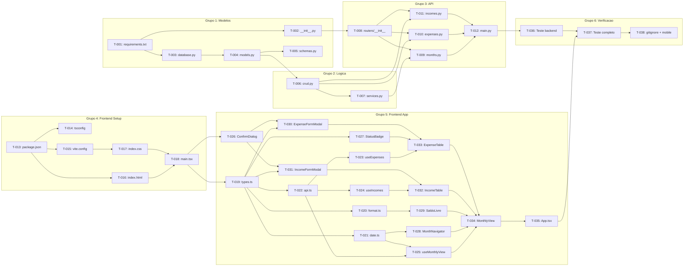

# Plano de Implementacao — Meu Controle (Fase 1 + 3)

**Versao:** 2.2
**Data:** 2026-02-17
**PRD Ref:** 01-PRD v2.1
**Arquitetura Ref:** 02-ARCHITECTURE v2.0
**Spec Ref:** 03-SPEC v2.2
**CR Ref:** CR-002 (Multi-usuario e Autenticacao), CR-004 (Totalizadores por Status), CR-005 (Gastos Diarios)

---

## Visao Geral

| Grupo | Descricao                | Tarefas       | Status    |
|-------|--------------------------|---------------|-----------|
| 1     | Backend: Modelos e Dados | T-001 a T-005 | Concluido |
| 2     | Backend: Logica de Negocio | T-006 a T-007 | Concluido |
| 3     | Backend: API / Routers   | T-008 a T-012 | Concluido |
| 4     | Frontend: Setup e Infra  | T-013 a T-018 | Concluido |
| 5     | Frontend: Aplicacao      | T-019 a T-035 | Concluido |
| 6     | Verificacao              | T-036 a T-038 | Concluido |
| CR-001 | Migracao PostgreSQL + Alembic | CR-T-01 a CR-T-09 | Concluido |
| CR-002-AR | Arquitetura: Auth Foundation (Backend + Frontend) | CR2-AR-01 a CR2-AR-18 | Pendente |
| CR-002-FN | Funcionalidade: Endpoints, Paginas, Integracao    | CR2-FN-01 a CR2-FN-15 | Pendente |
| CR-002-VL | Validacao: Regressao, Testes, Documentacao         | CR2-VL-01 a CR2-VL-11 | Pendente |
| CR-004 | Totalizadores de Despesa por Status                       | CR4-T-01 a CR4-T-06   | Concluido |
| CR-005 | Gastos Diarios (Daily Expenses)                           | CR5-T-01 a CR5-T-21   | Concluido |
| CR-007 | Consulta de Despesas Parceladas                           | CR7-T-01 a CR7-T-08   | Pendente |
| CR-009 | Exclusão em Série (Parcelas)                              | CR9-T-01 a CR9-T-05   | Pendente |

---

## Grupo 1: Backend — Modelos e Dados

| ID    | Tarefa | Arquivos | Ref | Depende de | Done When |
|-------|--------|----------|-----|------------|-----------|
| T-001 | Criar arquivo de dependencias Python | `backend/requirements.txt` | — | — | `pip install -r requirements.txt` sem erros |
| T-002 | Criar pacote app | `backend/app/__init__.py` | — | T-001 | Arquivo vazio criado |
| T-003 | Configurar engine SQLAlchemy e sessoes | `backend/app/database.py` | ADR-004, ADR-005 | T-001 | Engine cria arquivo SQLite |
| T-004 | Criar modelos ORM (Expense + Income) | `backend/app/models.py` | RF-01, RF-02, ADR-006 | T-003 | Tabelas expenses e incomes criadas via create_all |
| T-005 | Criar schemas Pydantic (request/response) | `backend/app/schemas.py` | RF-01, RF-02, RN-008 | T-004 | Schemas validam corretamente, model_validator funciona |

---

## Grupo 2: Backend — Logica de Negocio

| ID    | Tarefa | Arquivos | Ref | Depende de | Done When |
|-------|--------|----------|-----|------------|-----------|
| T-006 | Implementar camada CRUD (acesso a dados) | `backend/app/crud.py` | RF-01, RF-02, ADR-014 | T-004 | Funcoes CRUD para expenses e incomes operam corretamente |
| T-007 | Implementar servicos (transicao de mes + auto-status) | `backend/app/services.py` | RF-04, RF-05, RF-06 | T-006 | generate_month_data replica corretamente; apply_status_auto_detection funciona |

---

## Grupo 3: Backend — API / Routers

| ID    | Tarefa | Arquivos | Ref | Depende de | Done When |
|-------|--------|----------|-----|------------|-----------|
| T-008 | Criar pacote routers | `backend/app/routers/__init__.py` | — | T-002 | Arquivo vazio criado |
| T-009 | Implementar endpoint visao mensal | `backend/app/routers/months.py` | RF-03, RF-04, ADR-007 | T-007, T-008 | GET /api/months/{year}/{month} retorna MonthlySummary |
| T-010 | Implementar endpoints CRUD despesas | `backend/app/routers/expenses.py` | RF-01, RF-07, ADR-008 | T-006, T-008 | POST, PATCH, DELETE, POST/duplicate funcionam |
| T-011 | Implementar endpoints CRUD receitas | `backend/app/routers/incomes.py` | RF-02 | T-006, T-008 | POST, PATCH, DELETE funcionam |
| T-012 | Configurar entry point FastAPI | `backend/app/main.py` | ADR-003, ADR-012 | T-009, T-010, T-011 | `uvicorn app.main:app --reload` inicia sem erros, health check retorna 200 |

---

## Grupo 4: Frontend — Setup e Infraestrutura

| ID    | Tarefa | Arquivos | Ref | Depende de | Done When |
|-------|--------|----------|-----|------------|-----------|
| T-013 | Criar package.json com dependencias | `frontend/package.json` | ADR-001, ADR-002 | — | `npm install` sem erros |
| T-014 | Configurar TypeScript | `frontend/tsconfig.json`, `frontend/tsconfig.app.json` | — | T-013 | Compilacao sem erros |
| T-015 | Configurar Vite com proxy e Tailwind | `frontend/vite.config.ts` | ADR-009, ADR-011 | T-013 | Vite dev server inicia, proxy funciona |
| T-016 | Criar HTML entry point | `frontend/index.html` | — | T-013 | Pagina carrega no browser |
| T-017 | Configurar CSS com Tailwind v4 | `frontend/src/index.css` | ADR-009 | T-015 | Classes Tailwind funcionam, cores customizadas disponiveis |
| T-018 | Criar bootstrap React + QueryClient | `frontend/src/main.tsx` | ADR-010 | T-016, T-017 | App renderiza sem erros |

---

## Grupo 5: Frontend — Aplicacao

| ID    | Tarefa | Arquivos | Ref | Depende de | Done When |
|-------|--------|----------|-----|------------|-----------|
| T-019 | Criar definicoes de tipos TypeScript | `frontend/src/types.ts` | RF-01, RF-02 | T-018 | Types compilam sem erros |
| T-020 | Criar utilitarios de formatacao BRL | `frontend/src/utils/format.ts` | RNF-07 | T-019 | formatBRL, formatParcela, formatDateBR funcionam |
| T-021 | Criar utilitarios de navegacao de meses | `frontend/src/utils/date.ts` | — | T-019 | getCurrentMonthRef, getMonthLabel, getPreviousMonth, getNextMonth funcionam |
| T-022 | Criar HTTP client (api.ts) | `frontend/src/services/api.ts` | ADR-001 | T-019 | Funcoes HTTP compilam sem erros |
| T-023 | Criar hooks de mutation para despesas | `frontend/src/hooks/useExpenses.ts` | ADR-010 | T-022 | useCreateExpense, useUpdateExpense, useDeleteExpense, useDuplicateExpense funcionam |
| T-024 | Criar hooks de mutation para receitas | `frontend/src/hooks/useIncomes.ts` | ADR-010 | T-022 | useCreateIncome, useUpdateIncome, useDeleteIncome funcionam |
| T-025 | Criar hook principal da visao mensal | `frontend/src/hooks/useMonthTransition.ts` | — | T-022, T-021 | useMonthlyView retorna dados, navegacao funciona |
| T-026 | Criar componente ConfirmDialog | `frontend/src/components/ConfirmDialog.tsx` | — | T-018 | Modal de confirmacao renderiza e funciona |
| T-027 | Criar componente StatusBadge | `frontend/src/components/StatusBadge.tsx` | RF-05 | T-019 | Badge colorido renderiza, click dispara callback |
| T-028 | Criar componente MonthNavigator | `frontend/src/components/MonthNavigator.tsx` | RF-03 | T-021 | Botoes anterior/proximo e label do mes funcionam |
| T-029 | Criar componente SaldoLivre | `frontend/src/components/SaldoLivre.tsx` | RF-04 | T-020 | Card com saldo renderiza, cor condicional funciona |
| T-030 | Criar componente ExpenseFormModal | `frontend/src/components/ExpenseFormModal.tsx` | RF-01, RN-008 | T-019, T-026 | Form cria/edita despesa, validacao de parcelas funciona |
| T-031 | Criar componente IncomeFormModal | `frontend/src/components/IncomeFormModal.tsx` | RF-02 | T-019, T-026 | Form cria/edita receita |
| T-032 | Criar componente IncomeTable | `frontend/src/components/IncomeTable.tsx` | RF-02, RF-03 | T-024, T-031 | Tabela de receitas com CRUD funcional |
| T-033 | Criar componente ExpenseTable | `frontend/src/components/ExpenseTable.tsx` | RF-01, RF-05, RF-07 | T-023, T-027, T-030 | Tabela de despesas com CRUD, status toggle e duplicar |
| T-034 | Criar pagina MonthlyView | `frontend/src/pages/MonthlyView.tsx` | RF-03, RF-04 | T-025, T-028, T-029, T-032, T-033 | Pagina compoe todos os componentes, estados loading/error tratados |
| T-035 | Criar App.tsx (shell) | `frontend/src/App.tsx` | — | T-034 | App renderiza header + pagina completa |

---

## Grupo 6: Verificacao e Refinamento

| ID    | Tarefa | Arquivos | Ref | Depende de | Done When |
|-------|--------|----------|-----|------------|-----------|
| T-036 | Testar backend isolado | — | — | T-012 | Health check 200, Swagger UI acessivel em /docs |
| T-037 | Testar fluxo completo (17 cenarios) | — | Ver 03-SPEC Sec 6 | T-035, T-036 | Todos os 17 cenarios de FT-001 a FT-017 passam |
| T-038 | Criar .gitignore e verificar responsividade | `.gitignore` | RNF-01 | T-037 | Arquivo criado, interface funciona em DevTools mobile |

---

## Diagrama de Dependencias

---

## Grupo CR-001: Migracao PostgreSQL + Alembic

> Ref: `/docs/changes/CR-001-migracao-postgresql-railway.md`

| ID      | Tarefa                                                     | Arquivos                                    | Depende de | Done When                                         |
|---------|------------------------------------------------------------|---------------------------------------------|------------|----------------------------------------------------|
| CR-T-01 | Adicionar psycopg2-binary e alembic ao requirements.txt    | `backend/requirements.txt`                  | —          | `pip install -r requirements.txt` sem erros        |
| CR-T-02 | Refatorar database.py (DATABASE_URL via env var)           | `backend/app/database.py`                   | CR-T-01    | App inicia com SQLite (sem env) e PostgreSQL (com) |
| CR-T-03 | Inicializar Alembic e criar migration inicial              | `backend/alembic.ini`, `backend/alembic/`   | CR-T-02    | `alembic upgrade head` cria tabelas em ambos bancos |
| CR-T-04 | Remover create_all do lifespan (main.py)                   | `backend/app/main.py`                       | CR-T-03    | Alembic e unico mecanismo de criacao de schema     |
| CR-T-05 | Atualizar Dockerfile (alembic upgrade head antes do uvicorn) | `Dockerfile`                              | CR-T-04    | Container executa migrations antes do app          |
| CR-T-06 | Configurar DATABASE_URL no Railway                         | — (config Railway)                          | CR-T-05    | Variavel configurada no painel Railway             |
| CR-T-07 | Testar fluxo completo local (SQLite)                       | —                                           | CR-T-04    | CRUD, transicao de mes e status funcionam          |
| CR-T-08 | Testar deploy no Railway (PostgreSQL)                      | —                                           | CR-T-06    | App funciona sem perda de dados entre deploys      |
| CR-T-09 | Atualizar documentos afetados                              | PRD, Arquitetura, Spec, Plano               | CR-T-08    | Docs refletem nova arquitetura                     |

---

## Grupo CR-002-AR: Arquitetura — Auth Foundation (Backend + Frontend)

> Ref: `/docs/changes/CR-002-multi-usuario-autenticacao.md`
>
> Infraestrutura que precisa existir ANTES de qualquer feature nova. Inclui models, schemas, auth module, migration, CRUD changes, dependencias, auth context. IDs usam prefixo `CR2-` para evitar colisao com CR-001.
>
> **Regra:** FN depende de AR. Nenhuma tarefa FN pode iniciar ate que as tarefas AR das quais depende estejam concluidas.

| ID | Tarefa | Arquivos | CR-002 Ref | Depende de | Done When |
|----|--------|----------|------------|------------|-----------|
| CR2-AR-01 | Adicionar 5 deps de auth ao `requirements.txt` (`python-jose[cryptography]`, `passlib[bcrypt]`, `python-multipart`, `httpx`, `sendgrid`) | `backend/requirements.txt` | CR-T-01 | — | `pip install -r requirements.txt` instala 5 pacotes novos sem erros |
| CR2-AR-02 | Criar modelos `User` e `RefreshToken`; adicionar FK `user_id` + relationship em `Expense` e `Income` | `backend/app/models.py` | CR-T-02 | CR2-AR-01 | Modelos definem todas colunas conforme Spec v2.0. `Expense.user_id` e `Income.user_id` sao `String(36) NOT NULL FK`. Relationships `User.expenses`, `User.incomes` definidas |
| CR2-AR-03 | Adicionar schemas Pydantic de auth em `schemas.py` | `backend/app/schemas.py` | CR-T-03 | CR2-AR-02 | Schemas compilam: `UserCreate`, `UserUpdate`, `UserResponse`, `TokenResponse`, `LoginRequest`, `GoogleAuthRequest`, `ForgotPasswordRequest`, `ResetPasswordRequest`, `ChangePasswordRequest` |
| CR2-AR-04 | Criar modulo `auth.py` (JWT, hashing, `get_current_user` dependency) | `backend/app/auth.py` | CR-T-04 | CR2-AR-03 | Funcoes: `hash_password`, `verify_password`, `create_access_token`, `create_refresh_token`, `verify_token`, `get_current_user`. python-jose HS256. Vars: `SECRET_KEY`, `ACCESS_TOKEN_EXPIRE_MINUTES=15`, `REFRESH_TOKEN_EXPIRE_DAYS=7` |
| CR2-AR-05 | Criar migration Alembic `002_add_users_and_auth.py` | `backend/alembic/versions/002_add_users_and_auth.py` | CR-T-05 | CR2-AR-02 | `alembic upgrade head` cria tabelas `users` e `refresh_tokens`, apaga dados existentes, adiciona FK `user_id` + indices compostos. `alembic downgrade 001` reverte. Funciona em SQLite e PostgreSQL |
| CR2-AR-06 | Atualizar `alembic/env.py` para importar `User` e `RefreshToken` | `backend/alembic/env.py` | CR-T-06 | CR2-AR-02 | `User` e `RefreshToken` importados ao lado de `Expense` e `Income`. Metadata completo para autogenerate |
| CR2-AR-07 | Criar `email_service.py` com integracao SendGrid | `backend/app/email_service.py` | CR-T-07 | CR2-AR-01 | `send_password_reset_email(to_email, reset_token, user_name)` envia email via SendGrid API. Degradacao graciosa se `SENDGRID_API_KEY` nao configurada (loga warning) |
| CR2-AR-08 | Adicionar 9 funcoes CRUD para `User` e `RefreshToken` | `backend/app/crud.py` | CR-T-11 | CR2-AR-05 | Funcoes: `get_user_by_email`, `get_user_by_id`, `get_user_by_google_id`, `create_user`, `update_user`, `create_refresh_token`, `get_refresh_token_by_hash`, `delete_refresh_token`, `delete_user_refresh_tokens` |
| CR2-AR-09 | Adicionar parametro `user_id` a todas funcoes CRUD existentes | `backend/app/crud.py` | CR-T-12 | CR2-AR-05, CR2-AR-08 | `get_expenses_by_month(db, mes, user_id)` filtra por ambos. `get_expense_by_id(db, id, user_id)` retorna None se pertence a outro usuario. Idem para incomes e `count_expenses_by_month` |
| CR2-AR-10 | Adicionar parametro `user_id` as funcoes de `services.py` | `backend/app/services.py` | CR-T-13 | CR2-AR-09 | `generate_month_data(db, target_mes, user_id)` passa `user_id` a todas chamadas CRUD e seta `user_id` nas novas instancias. `get_monthly_summary(db, mes, user_id)` propaga `user_id` |
| CR2-AR-11 | Adicionar `react-router-dom` e `jwt-decode` ao `package.json` | `frontend/package.json` | CR-T-17 | — | `npm install` sucede. Ambos pacotes disponiveis para import |
| CR2-AR-12 | Adicionar tipos TypeScript de auth em `types.ts` | `frontend/src/types.ts` | CR-T-18 | CR2-AR-11 | Tipos compilam: `User`, `AuthTokens`, `LoginCredentials`, `RegisterData`, `TokenResponse` |
| CR2-AR-13 | Criar `authApi.ts` com funcoes de API de auth | `frontend/src/services/authApi.ts` | CR-T-19 | CR2-AR-12 | 10 funcoes compilam: `loginUser`, `registerUser`, `googleAuth`, `refreshTokenApi`, `logoutUser`, `forgotPassword`, `resetPassword`, `getProfile`, `updateProfile`, `changePassword` |
| CR2-AR-14 | Atualizar `api.ts` com auth header + interceptor 401 | `frontend/src/services/api.ts` | CR-T-20 | CR2-AR-12 | `request()` le token de localStorage e adiciona `Authorization: Bearer`. Em 401, tenta refresh. Se refresh falhar, limpa tokens e redireciona para `/login` |
| CR2-AR-15 | Criar `AuthContext.tsx` com `AuthProvider` | `frontend/src/contexts/AuthContext.tsx` | CR-T-21 | CR2-AR-13, CR2-AR-14 | AuthContext prove: `user`, `isAuthenticated`, `isLoading`, `login()`, `register()`, `loginWithGoogle()`, `logout()`, `updateUser()`. No mount: checa localStorage, valida token via jwt-decode |
| CR2-AR-16 | Criar `useAuth.ts` hook de conveniencia | `frontend/src/hooks/useAuth.ts` | CR-T-22 | CR2-AR-15 | `useAuth()` retorna `useContext(AuthContext)` com erro se usado fora do provider |
| CR2-AR-17 | Criar `ProtectedRoute.tsx` | `frontend/src/components/ProtectedRoute.tsx` | CR-T-23 | CR2-AR-16 | Loading = spinner. Nao autenticado = `Navigate to="/login"`. Autenticado = `Outlet` |
| CR2-AR-18 | Envolver app com `BrowserRouter` em `main.tsx` | `frontend/src/main.tsx` | CR-T-24 | CR2-AR-11 | `main.tsx` envolve `<App />` com `<BrowserRouter>` dentro de `QueryClientProvider` |

---

## Grupo CR-002-FN: Funcionalidade — Endpoints, Paginas, Integracao

> Features novas que usam a arquitetura do Grupo AR. Endpoints de autenticacao, paginas de auth, integracao de auth nos routers existentes.
>
> **Regra:** Todas tarefas FN dependem de tarefas AR especificas. VL depende de FN.

| ID | Tarefa | Arquivos | CR-002 Ref | Depende de | Done When |
|----|--------|----------|------------|------------|-----------|
| CR2-FN-01 | Criar `routers/auth.py` com 7 endpoints de autenticacao | `backend/app/routers/auth.py` | CR-T-08 | CR2-AR-04, CR2-AR-07, CR2-AR-08 | Endpoints funcionam: register (201+tokens), login (200+tokens), google (troca code), refresh (rotaciona), logout (invalida), forgot-password (envia email), reset-password (atualiza hash) |
| CR2-FN-02 | Criar `routers/users.py` com 3 endpoints de perfil | `backend/app/routers/users.py` | CR-T-09 | CR2-AR-04, CR2-AR-08 | `GET /api/users/me` retorna perfil. `PATCH /api/users/me` atualiza nome/email (check unicidade). `PATCH /api/users/me/password` valida senha atual e atualiza (rejeita Google-only) |
| CR2-FN-03 | Registrar routers `auth` e `users` em `main.py` | `backend/app/main.py` | CR-T-10 | CR2-FN-01, CR2-FN-02 | `main.py` inclui ambos routers. Aparecem no Swagger UI em `/docs` |
| CR2-FN-04 | Adicionar `Depends(get_current_user)` ao router expenses + ownership | `backend/app/routers/expenses.py` | CR-T-14 | CR2-AR-04, CR2-AR-09 | 4 endpoints requerem auth. `create_expense` seta `user_id=current_user.id`. `update/delete/duplicate` verificam ownership via `get_expense_by_id(db, id, user_id)` |
| CR2-FN-05 | Adicionar `Depends(get_current_user)` ao router incomes + ownership | `backend/app/routers/incomes.py` | CR-T-15 | CR2-AR-04, CR2-AR-09 | 3 endpoints requerem auth com verificacao de ownership |
| CR2-FN-06 | Adicionar `Depends(get_current_user)` ao router months + user_id | `backend/app/routers/months.py` | CR-T-16 | CR2-AR-04, CR2-AR-10 | `get_monthly_view` passa `current_user.id` a `services.get_monthly_summary()` |
| CR2-FN-07 | Criar `LoginPage.tsx` | `frontend/src/pages/LoginPage.tsx` | CR-T-25 | CR2-AR-16 | Inputs email/senha, botao "Entrar", botao Google, link "Esqueci minha senha" → `/forgot-password`, link "Criar conta" → `/register`. Submit chama `login()`, redireciona para `/` |
| CR2-FN-08 | Criar `RegisterPage.tsx` | `frontend/src/pages/RegisterPage.tsx` | CR-T-26 | CR2-AR-16 | Inputs nome/email/senha/confirmacao, botao "Criar Conta", link "Ja tenho conta" → `/login`. Valida match de senha client-side. Submit chama `register()`, redireciona para `/` |
| CR2-FN-09 | Criar `ForgotPasswordPage.tsx` | `frontend/src/pages/ForgotPasswordPage.tsx` | CR-T-27 | CR2-AR-13 | Input email, botao "Enviar link de recuperacao", link "Voltar para login". Submit chama `forgotPassword()`, mostra mensagem "Email enviado" (sempre, por seguranca) |
| CR2-FN-10 | Criar `ResetPasswordPage.tsx` | `frontend/src/pages/ResetPasswordPage.tsx` | CR-T-28 | CR2-AR-13 | Le `token` de URL query params. Inputs nova senha/confirmacao. Submit chama `resetPassword(token, newPassword)`, redireciona para `/login` |
| CR2-FN-11 | Criar `ProfilePage.tsx` | `frontend/src/pages/ProfilePage.tsx` | CR-T-29 | CR2-AR-16, CR2-AR-13 | Mostra info do usuario (nome, email). Modo edicao com form. Secao separada para troca de senha. Rota protegida |
| CR2-FN-12 | Criar `UserMenu.tsx` | `frontend/src/components/UserMenu.tsx` | CR-T-30 | CR2-AR-16 | Dropdown no header: nome do usuario, "Perfil" (link `/profile`), "Sair" (chama `logout()`). Estilizado consistente com header |
| CR2-FN-13 | Reestruturar `App.tsx` com `AuthProvider` e rotas React Router | `frontend/src/App.tsx` | CR-T-31 | CR2-AR-15, CR2-AR-17, CR2-FN-07 a CR2-FN-12 | App envolve tudo em `AuthProvider`. Rotas publicas: `/login`, `/register`, `/forgot-password`, `/reset-password`. Protegidas (ProtectedRoute): `/` (MonthlyView), `/profile`. Header com UserMenu so quando autenticado |
| CR2-FN-14 | Implementar fluxo Google OAuth no frontend | `frontend/src/pages/LoginPage.tsx` | CR-T-32 | CR2-FN-07 | Botao Google abre tela de consentimento (redirect com `client_id`, `redirect_uri`, `scope`). Callback captura `code` da URL, chama `loginWithGoogle(code)`. Var `VITE_GOOGLE_CLIENT_ID` |
| CR2-FN-15 | Atualizar `index.css` para estilos de auth | `frontend/src/index.css` | CR-T-33 | CR2-FN-07 | Adicionada cor `--color-google: #4285f4` ao bloco `@theme`. Convencoes Tailwind v4 mantidas |

---

## Grupo CR-002-VL: Validacao — Regressao, Testes, Documentacao

> Regressao (5 tarefas) + testes de feature (5 tarefas) + documentacao (1 tarefa).
>
> **Cobertura de regressao:** Cada area de AR tem teste de regressao associado:
> - VL-01 cobre AR-02, AR-05, AR-06 (migration/modelos)
> - VL-02 cobre AR-08, AR-09 (CRUD)
> - VL-03 cobre AR-10 (services)
> - VL-04 cobre AR-14 (api.ts)
> - VL-05 cobre AR-18, FN-13 (BrowserRouter/routing)

### Testes de Regressao

| ID | Tarefa | CR-002 Ref | Depende de | Done When |
|----|--------|------------|------------|-----------|
| CR2-VL-01 | Regressao: migration upgrade/downgrade | — | CR2-AR-05 | `alembic upgrade head` e `alembic downgrade 001` executam sem erros em SQLite e PostgreSQL. Tabelas `users`, `refresh_tokens` criadas. FK `user_id` adicionada. Indices compostos criados |
| CR2-VL-02 | Regressao: CRUD com `user_id` retorna dados corretos | — | CR2-AR-09, CR2-AR-10 | `get_expenses_by_month(db, mes, user_id)` filtra corretamente. `get_expense_by_id(db, id, user_id)` retorna None para outro usuario. Idem incomes e count |
| CR2-VL-03 | Regressao: transicao de mes e auto-status com `user_id` | — | CR2-AR-10 | `generate_month_data` replica apenas dados do usuario. `apply_status_auto_detection` funciona. `get_monthly_summary` com `user_id` retorna dados corretos |
| CR2-VL-04 | Regressao: `api.ts` nao quebra chamadas existentes | — | CR2-AR-14 | `fetchMonthlySummary`, `createExpense`, `updateExpense`, `deleteExpense` continuam funcionando. Token adicionado ao header. 401 interceptado corretamente |
| CR2-VL-05 | Regressao: BrowserRouter + MonthlyView renderiza | — | CR2-AR-18, CR2-FN-13 | App renderiza sem erros com BrowserRouter. MonthlyView funciona em `/`. Navegacao de meses preservada. SPA fallback serve `index.html` para rotas client-side |

### Testes de Feature

| ID | Tarefa | CR-002 Ref | Depende de | Done When |
|----|--------|------------|------------|-----------|
| CR2-VL-06 | Testar endpoints de auth no backend (Swagger UI) | CR-T-34 | CR2-FN-03 a CR2-FN-06 | 10 endpoints respondem: register 201+tokens, login 200+tokens, email duplicado 409, credenciais invalidas 401, refresh funciona, logout invalida token, forgot-password envia email (ou loga), reset-password funciona |
| CR2-VL-07 | Testar isolamento de dados multi-usuario | CR-T-35 | CR2-FN-04 a CR2-FN-06 | 2 usuarios registrados. User A cria expenses/incomes. User B nao ve/edita/deleta dados de User A. Transicao de mes so replica dados do proprio usuario |
| CR2-VL-08 | Testar fluxo de auth no frontend end-to-end | CR-T-36 | CR2-FN-13 | Fluxo completo: registrar → auto-login → dashboard vazio → criar dados → logout → login → ver mesmos dados. Rotas protegidas redirecionam. Login redireciona quando ja autenticado |
| CR2-VL-09 | Testar fluxo Google OAuth | CR-T-37 | CR2-FN-14 | Google login cria usuario (ou vincula email existente), retorna tokens, usuario ve dashboard. Perfil mostra avatar_url se disponivel |
| CR2-VL-10 | Testar recuperacao de senha + refresh token | CR-T-38, CR-T-39 | CR2-FN-09, CR2-FN-10, CR2-AR-14 | Forgot password envia email (checar SendGrid ou logs). Link de reset funciona. Access token expira → frontend renova via refresh. Refresh token expirado → redireciona para login |

### Documentacao

| ID | Tarefa | CR-002 Ref | Depende de | Done When |
|----|--------|------------|------------|-----------|
| CR2-VL-11 | Atualizar documentacao do projeto (CLAUDE.md) | CR-T-40 | CR2-VL-08 | CLAUDE.md atualiza contexto atual, CRs ativos (CR-002), estrutura de pastas com novos arquivos |

---

## Tabela de Rastreabilidade: CR-002 → Plano

> Mapeamento bidirecional entre os IDs originais do CR-002 e os IDs do Plano de Implementacao.
> Nota: CR-002 reutiliza o range `CR-T-01` a `CR-T-40`, que colide com CR-001 (`CR-T-01` a `CR-T-09`).
> O prefixo `CR2-` no plano resolve a ambiguidade.

| CR-002 ID | Plano ID | Grupo |
|-----------|----------|-------|
| CR-T-01 | CR2-AR-01 | AR |
| CR-T-02 | CR2-AR-02 | AR |
| CR-T-03 | CR2-AR-03 | AR |
| CR-T-04 | CR2-AR-04 | AR |
| CR-T-05 | CR2-AR-05 | AR |
| CR-T-06 | CR2-AR-06 | AR |
| CR-T-07 | CR2-AR-07 | AR |
| CR-T-08 | CR2-FN-01 | FN |
| CR-T-09 | CR2-FN-02 | FN |
| CR-T-10 | CR2-FN-03 | FN |
| CR-T-11 | CR2-AR-08 | AR |
| CR-T-12 | CR2-AR-09 | AR |
| CR-T-13 | CR2-AR-10 | AR |
| CR-T-14 | CR2-FN-04 | FN |
| CR-T-15 | CR2-FN-05 | FN |
| CR-T-16 | CR2-FN-06 | FN |
| CR-T-17 | CR2-AR-11 | AR |
| CR-T-18 | CR2-AR-12 | AR |
| CR-T-19 | CR2-AR-13 | AR |
| CR-T-20 | CR2-AR-14 | AR |
| CR-T-21 | CR2-AR-15 | AR |
| CR-T-22 | CR2-AR-16 | AR |
| CR-T-23 | CR2-AR-17 | AR |
| CR-T-24 | CR2-AR-18 | AR |
| CR-T-25 | CR2-FN-07 | FN |
| CR-T-26 | CR2-FN-08 | FN |
| CR-T-27 | CR2-FN-09 | FN |
| CR-T-28 | CR2-FN-10 | FN |
| CR-T-29 | CR2-FN-11 | FN |
| CR-T-30 | CR2-FN-12 | FN |
| CR-T-31 | CR2-FN-13 | FN |
| CR-T-32 | CR2-FN-14 | FN |
| CR-T-33 | CR2-FN-15 | FN |
| CR-T-34 | CR2-VL-06 | VL |
| CR-T-35 | CR2-VL-07 | VL |
| CR-T-36 | CR2-VL-08 | VL |
| CR-T-37 | CR2-VL-09 | VL |
| CR-T-38 + CR-T-39 | CR2-VL-10 | VL |
| CR-T-40 | CR2-VL-11 | VL |
| (novo) | CR2-VL-01 a CR2-VL-05 | VL (regressao) |

---

## Diagrama de Dependencias — CR-002

```mermaid
graph TD
    subgraph "CR-002-AR: Arquitetura Backend"
        AR01[CR2-AR-01: requirements.txt] --> AR02[CR2-AR-02: models.py]
        AR02 --> AR03[CR2-AR-03: schemas.py]
        AR03 --> AR04[CR2-AR-04: auth.py]
        AR02 --> AR05[CR2-AR-05: migration 002]
        AR02 --> AR06[CR2-AR-06: alembic env.py]
        AR01 --> AR07[CR2-AR-07: email_service.py]
        AR05 --> AR08[CR2-AR-08: CRUD User/RefreshToken]
        AR05 --> AR09[CR2-AR-09: user_id CRUD existente]
        AR08 --> AR09
        AR09 --> AR10[CR2-AR-10: user_id services.py]
    end

    subgraph "CR-002-AR: Arquitetura Frontend"
        AR11[CR2-AR-11: package.json] --> AR12[CR2-AR-12: types.ts]
        AR12 --> AR13[CR2-AR-13: authApi.ts]
        AR12 --> AR14[CR2-AR-14: api.ts auth header]
        AR13 --> AR15[CR2-AR-15: AuthContext.tsx]
        AR14 --> AR15
        AR15 --> AR16[CR2-AR-16: useAuth.ts]
        AR16 --> AR17[CR2-AR-17: ProtectedRoute.tsx]
        AR11 --> AR18[CR2-AR-18: BrowserRouter main.tsx]
    end

    subgraph "CR-002-FN: Funcionalidade Backend"
        AR04 --> FN01[CR2-FN-01: routers/auth.py]
        AR07 --> FN01
        AR08 --> FN01
        AR04 --> FN02[CR2-FN-02: routers/users.py]
        AR08 --> FN02
        FN01 --> FN03[CR2-FN-03: main.py register]
        FN02 --> FN03
        AR04 --> FN04[CR2-FN-04: expenses auth]
        AR09 --> FN04
        AR04 --> FN05[CR2-FN-05: incomes auth]
        AR09 --> FN05
        AR04 --> FN06[CR2-FN-06: months auth]
        AR10 --> FN06
    end

    subgraph "CR-002-FN: Funcionalidade Frontend"
        AR16 --> FN07[CR2-FN-07: LoginPage]
        AR16 --> FN08[CR2-FN-08: RegisterPage]
        AR13 --> FN09[CR2-FN-09: ForgotPasswordPage]
        AR13 --> FN10[CR2-FN-10: ResetPasswordPage]
        AR16 --> FN11[CR2-FN-11: ProfilePage]
        AR13 --> FN11
        AR16 --> FN12[CR2-FN-12: UserMenu]
        FN07 --> FN13[CR2-FN-13: App.tsx reestruturar]
        FN08 --> FN13
        FN09 --> FN13
        FN10 --> FN13
        FN11 --> FN13
        FN12 --> FN13
        AR15 --> FN13
        AR17 --> FN13
        FN07 --> FN14[CR2-FN-14: Google OAuth frontend]
        FN07 --> FN15[CR2-FN-15: index.css]
    end

    subgraph "CR-002-VL: Validacao"
        AR05 --> VL01[CR2-VL-01: Regressao migration]
        AR09 --> VL02[CR2-VL-02: Regressao CRUD]
        AR10 --> VL02
        AR10 --> VL03[CR2-VL-03: Regressao services]
        AR14 --> VL04[CR2-VL-04: Regressao api.ts]
        AR18 --> VL05[CR2-VL-05: Regressao BrowserRouter]
        FN13 --> VL05
        FN03 --> VL06[CR2-VL-06: Teste auth endpoints]
        FN04 --> VL06
        FN05 --> VL06
        FN06 --> VL06
        FN04 --> VL07[CR2-VL-07: Teste multi-usuario]
        FN05 --> VL07
        FN06 --> VL07
        FN13 --> VL08[CR2-VL-08: Teste auth e2e]
        FN14 --> VL09[CR2-VL-09: Teste Google OAuth]
        FN09 --> VL10[CR2-VL-10: Teste recovery + refresh]
        FN10 --> VL10
        AR14 --> VL10
        VL08 --> VL11[CR2-VL-11: Atualizar docs]
    end
```

---

## Ordem de Execucao Recomendada — CR-002

| Fase | Grupo | Tarefas | Descricao |
|------|-------|---------|-----------|
| 1 | AR Backend | CR2-AR-01 a CR2-AR-10 | Sequencial: deps → models → migration → auth module → CRUD → services |
| 2 | AR Frontend | CR2-AR-11 a CR2-AR-18 | Pode iniciar em paralelo com Fase 1: deps → types → authApi → api.ts → context → hook → route guard → router |
| 3 | VL Regressao | CR2-VL-01 a CR2-VL-04 | Validar que nenhuma funcionalidade existente quebrou apos AR |
| 4 | FN Backend | CR2-FN-01 a CR2-FN-06 | Endpoints de auth + integracao de auth nos routers existentes |
| 5 | FN Frontend | CR2-FN-07 a CR2-FN-15 | Paginas de auth → UserMenu → App.tsx → Google OAuth → CSS |
| 6 | VL Feature + Docs | CR2-VL-05 a CR2-VL-11 | Regressao routing + testes e2e de auth + documentacao |

---

*Documento criado em 2026-02-08. Baseado em SPEC.md v1.0 Sec 8 (Ordem de Implementacao).*
*Atualizado em 2026-02-08 para incluir CR-001 (Migracao PostgreSQL + Alembic).*
*Atualizado em 2026-02-09 para incluir CR-002 (Multi-usuario e Autenticacao). 44 novas tarefas em 3 grupos (AR/FN/VL). IDs usam prefixo CR2- para evitar colisao com CR-001.*

---

## Grupo CR-004: Totalizadores de Despesa por Status

> Ref: `/docs/changes/CR-004-totalizadores-por-status.md`
>
> Adiciona 3 totalizadores (Pago, Pendente, Atrasado) à MonthlySummary e ao footer da ExpenseTable.
> Sem migration. Sem novos endpoints. Mudança aditiva na API.

| ID | Tarefa | Arquivos | Depende de | Done When |
|----|--------|----------|------------|-----------|
| CR4-T-01 | Adicionar campos `total_pago`, `total_pendente`, `total_atrasado` ao schema `MonthlySummary` | `backend/app/schemas.py` | — | Schema compila com 3 novos campos `float` |
| CR4-T-02 | Calcular totais por status em `get_monthly_summary` | `backend/app/services.py` | CR4-T-01 | `GET /api/months/{y}/{m}` retorna os 3 novos campos com valores corretos |
| CR4-T-03 | Espelhar campos no type `MonthlySummary` do frontend | `frontend/src/types.ts` | CR4-T-01 | `npm run build` compila sem erros |
| CR4-T-04 | Passar novos totais como props para `ExpenseTable` | `frontend/src/pages/MonthlyView.tsx` | CR4-T-03 | Props passadas, sem erros TS |
| CR4-T-05 | Renderizar linhas de resumo por status no footer da `ExpenseTable` | `frontend/src/components/ExpenseTable.tsx` | CR4-T-04 | 3 linhas coloridas (Pago/Pendente/Atrasado) acima de "Total Despesas" |
| CR4-T-06 | Atualizar documentos afetados | `docs/01-PRD.md`, `docs/03-SPEC.md`, `docs/04-IMPLEMENTATION-PLAN.md` | — | Docs refletem os novos totalizadores |

*Atualizado em 2026-02-11. Adicionado grupo CR-004 (Totalizadores por Status). 6 tarefas.*

---

## Grupo CR-005: Gastos Diarios (Daily Expenses)

> Ref: `/docs/changes/CR-005-gastos-diarios.md`
>
> Nova funcionalidade independente para registrar gastos nao planejados do dia a dia.
> Inclui modelo DailyExpense, API REST, visao mensal agrupada por dia, navegacao entre visoes.

| ID | Tarefa | Arquivos | Depende de | Done When |
|----|--------|----------|------------|-----------|
| CR5-T-01 | Criar CR-005 | `docs/changes/CR-005-gastos-diarios.md` | — | Documento criado |
| CR5-T-02 | Criar modulo de categorias | `backend/app/categories.py` | CR5-T-01 | 14 categorias + Outros + 6 metodos pagamento + helpers |
| CR5-T-03 | Adicionar modelo DailyExpense + User relationship | `backend/app/models.py` | CR5-T-02 | Model com colunas, indices e FK corretos |
| CR5-T-04 | Criar migration 004 | `backend/alembic/versions/004_add_daily_expenses.py` | CR5-T-03 | alembic upgrade/downgrade funciona |
| CR5-T-05 | Adicionar schemas Pydantic | `backend/app/schemas.py` | CR5-T-03 | 6 schemas criados |
| CR5-T-06 | Adicionar funcoes CRUD | `backend/app/crud.py` | CR5-T-03 | 5 funcoes CRUD |
| CR5-T-07 | Adicionar service layer | `backend/app/services.py` | CR5-T-06 | Agrupamento por dia + subtotais funciona |
| CR5-T-08 | Criar router + registrar em main.py | `backend/app/routers/daily_expenses.py`, `backend/app/main.py` | CR5-T-05/06/07 | 5 endpoints respondem corretamente |
| CR5-T-09 | Adicionar tipos TypeScript | `frontend/src/types.ts` | CR5-T-05 | 6 interfaces adicionadas |
| CR5-T-10 | Adicionar funcoes API frontend | `frontend/src/services/api.ts` | CR5-T-09 | 5 funcoes em api.ts |
| CR5-T-11 | Criar hooks TanStack Query | `frontend/src/hooks/useDailyExpenses.ts` | CR5-T-10 | 5 hooks exportados |
| CR5-T-12 | Criar hook de navegacao mensal | `frontend/src/hooks/useDailyExpensesView.ts` | CR5-T-11 | Hook com month state + navigation |
| CR5-T-13 | Adicionar formatDateFull() | `frontend/src/utils/format.ts` | — | Funcao formata "DD/MM - Dia" |
| CR5-T-14 | Criar DailyExpenseFormModal | `frontend/src/components/DailyExpenseFormModal.tsx` | CR5-T-11/13 | Modal com 5 campos, create/edit |
| CR5-T-15 | Criar DailyExpenseTable | `frontend/src/components/DailyExpenseTable.tsx` | CR5-T-11/13/14 | Tabela agrupada por dia com totais |
| CR5-T-16 | Criar ViewSelector | `frontend/src/components/ViewSelector.tsx` | — | Pills/tabs alternam entre visoes |
| CR5-T-17 | Criar DailyExpensesView page | `frontend/src/pages/DailyExpensesView.tsx` | CR5-T-12/15/16 | Pagina renderiza todos componentes |
| CR5-T-18 | Adicionar rota /daily-expenses | `frontend/src/App.tsx` | CR5-T-17 | Rota protegida funciona |
| CR5-T-19 | Integrar ViewSelector no MonthlyView | `frontend/src/pages/MonthlyView.tsx` | CR5-T-16/18 | Navegacao entre visoes funciona |
| CR5-T-20 | Verificar build completo | — | CR5-T-19 | tsc, migration, backend sem erros |
| CR5-T-21 | Atualizar documentacao | docs/*, CLAUDE.md | CR5-T-20 | Todos docs atualizados |

*Atualizado em 2026-02-17. Adicionado grupo CR-005 (Gastos Diarios). 21 tarefas.*

---

## Grupo CR-007: Consulta de Despesas Parceladas

> Ref: `/docs/changes/CR-007-consulta-parcelas.md`
>
> Nova funcionalidade para listar todas as parcelas (planejadas) e exibir totalizadores de passivo.

| ID | Tarefa | Arquivos | Depende de | Done When |
|----|--------|----------|------------|-----------|
| CR7-T-01 | Criar CR-007 | `docs/changes/CR-007-consulta-parcelas.md` | — | Documento criado |
| CR7-T-02 | Definir schemas de resposta | `backend/app/schemas.py` | CR7-T-01 | Schema `InstallmentsSummary` criado |
| CR7-T-03 | Criar funcao CRUD de busca | `backend/app/crud.py` | CR7-T-02 | `get_all_installment_expenses` retorna lista filtrada por `parcela_total > 1` |
| CR7-T-04 | Criar endpoint `/installments` | `backend/app/routers/expenses.py` | CR7-T-03 | Endpoint retorna lista + totais calculados |
| CR7-T-05 | Adicionar tipos TypeScript | `frontend/src/types.ts` | CR7-T-02 | Interfaces `InstallmentsSummary` adicionadas |
| CR7-T-06 | Adicionar funcao API frontend | `frontend/src/services/api.ts` | CR7-T-05 | `fetchInstallments` funciona |
| CR7-T-07 | Criar pagina `InstallmentsView` | `frontend/src/pages/InstallmentsView.tsx` | CR7-T-06 | Pagina com Tabela e Cards renderiza dados reais |
| CR7-T-08 | Adicionar rota e navegacao | `frontend/src/App.tsx`, `frontend/src/components/UserMenu.tsx` | CR7-T-07 | Rota `/installments` acessivel pelo menu |

---

## Grupo CR-009: Exclusão em Série (Parcelas)

> Ref: `/docs/changes/CR-009-exclusao-em-serie.md`
>
> Funcionalidade para excluir todas as parcelas de uma só vez quando o usuário selecionar deletar uma despesa parcelada.

| ID | Tarefa | Arquivos | Depende de | Done When |
|----|--------|----------|------------|-----------|
| CR9-T-01 | Atualizar Documentos e Criar CR-009 | `docs/changes/CR-009-exclusao-em-serie.md` | — | Documento criado |
| CR9-T-02 | Atualizar backend para suporte ao `delete_all` | `backend/app/routers/expenses.py`, `backend/app/crud.py` | CR9-T-01 | Rota `DELETE` processa flag e remove logs correspondentes |
| CR9-T-03 | Atualizar hooks e api client no frontend | `frontend/src/services/api.ts`, `frontend/src/hooks/useExpenses.ts` | CR9-T-02 | A chamada ao delete repassa o arg `deleteAll = true` corretamente |
| CR9-T-04 | Customizar Modal de Exclusão UI | `frontend/src/components/ExpenseTable.tsx` | CR9-T-03 | O usuário vê checkboxes ou um aviso distinto se for despesa parcelada |
| CR9-T-05 | Testar build local | — | CR9-T-04 | Backend tests && tsc build sem erros |

