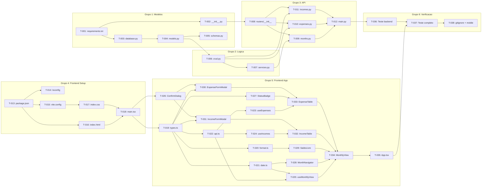

# Plano de Implementacao — Meu Controle (Fase 1)

**Versao:** 1.0
**Data:** 2026-02-06
**PRD Ref:** 01-PRD v1.0
**Arquitetura Ref:** 02-ARCHITECTURE v1.0
**Spec Ref:** 03-SPEC v1.0

---

## Visao Geral

| Grupo | Descricao                | Tarefas       | Status    |
|-------|--------------------------|---------------|-----------|
| 1     | Backend: Modelos e Dados | T-001 a T-005 | Concluido |
| 2     | Backend: Logica de Negocio | T-006 a T-007 | Concluido |
| 3     | Backend: API / Routers   | T-008 a T-012 | Concluido |
| 4     | Frontend: Setup e Infra  | T-013 a T-018 | Concluido |
| 5     | Frontend: Aplicacao      | T-019 a T-035 | Concluido |
| 6     | Verificacao              | T-036 a T-038 | Concluido |
| CR-001 | Migracao PostgreSQL + Alembic | CR-T-01 a CR-T-09 | Concluido |

---

## Grupo 1: Backend — Modelos e Dados

| ID    | Tarefa | Arquivos | Ref | Depende de | Done When |
|-------|--------|----------|-----|------------|-----------|
| T-001 | Criar arquivo de dependencias Python | `backend/requirements.txt` | — | — | `pip install -r requirements.txt` sem erros |
| T-002 | Criar pacote app | `backend/app/__init__.py` | — | T-001 | Arquivo vazio criado |
| T-003 | Configurar engine SQLAlchemy e sessoes | `backend/app/database.py` | ADR-004, ADR-005 | T-001 | Engine cria arquivo SQLite |
| T-004 | Criar modelos ORM (Expense + Income) | `backend/app/models.py` | RF-01, RF-02, ADR-006 | T-003 | Tabelas expenses e incomes criadas via create_all |
| T-005 | Criar schemas Pydantic (request/response) | `backend/app/schemas.py` | RF-01, RF-02, RN-008 | T-004 | Schemas validam corretamente, model_validator funciona |

---

## Grupo 2: Backend — Logica de Negocio

| ID    | Tarefa | Arquivos | Ref | Depende de | Done When |
|-------|--------|----------|-----|------------|-----------|
| T-006 | Implementar camada CRUD (acesso a dados) | `backend/app/crud.py` | RF-01, RF-02, ADR-014 | T-004 | Funcoes CRUD para expenses e incomes operam corretamente |
| T-007 | Implementar servicos (transicao de mes + auto-status) | `backend/app/services.py` | RF-04, RF-05, RF-06 | T-006 | generate_month_data replica corretamente; apply_status_auto_detection funciona |

---

## Grupo 3: Backend — API / Routers

| ID    | Tarefa | Arquivos | Ref | Depende de | Done When |
|-------|--------|----------|-----|------------|-----------|
| T-008 | Criar pacote routers | `backend/app/routers/__init__.py` | — | T-002 | Arquivo vazio criado |
| T-009 | Implementar endpoint visao mensal | `backend/app/routers/months.py` | RF-03, RF-04, ADR-007 | T-007, T-008 | GET /api/months/{year}/{month} retorna MonthlySummary |
| T-010 | Implementar endpoints CRUD despesas | `backend/app/routers/expenses.py` | RF-01, RF-07, ADR-008 | T-006, T-008 | POST, PATCH, DELETE, POST/duplicate funcionam |
| T-011 | Implementar endpoints CRUD receitas | `backend/app/routers/incomes.py` | RF-02 | T-006, T-008 | POST, PATCH, DELETE funcionam |
| T-012 | Configurar entry point FastAPI | `backend/app/main.py` | ADR-003, ADR-012 | T-009, T-010, T-011 | `uvicorn app.main:app --reload` inicia sem erros, health check retorna 200 |

---

## Grupo 4: Frontend — Setup e Infraestrutura

| ID    | Tarefa | Arquivos | Ref | Depende de | Done When |
|-------|--------|----------|-----|------------|-----------|
| T-013 | Criar package.json com dependencias | `frontend/package.json` | ADR-001, ADR-002 | — | `npm install` sem erros |
| T-014 | Configurar TypeScript | `frontend/tsconfig.json`, `frontend/tsconfig.app.json` | — | T-013 | Compilacao sem erros |
| T-015 | Configurar Vite com proxy e Tailwind | `frontend/vite.config.ts` | ADR-009, ADR-011 | T-013 | Vite dev server inicia, proxy funciona |
| T-016 | Criar HTML entry point | `frontend/index.html` | — | T-013 | Pagina carrega no browser |
| T-017 | Configurar CSS com Tailwind v4 | `frontend/src/index.css` | ADR-009 | T-015 | Classes Tailwind funcionam, cores customizadas disponiveis |
| T-018 | Criar bootstrap React + QueryClient | `frontend/src/main.tsx` | ADR-010 | T-016, T-017 | App renderiza sem erros |

---

## Grupo 5: Frontend — Aplicacao

| ID    | Tarefa | Arquivos | Ref | Depende de | Done When |
|-------|--------|----------|-----|------------|-----------|
| T-019 | Criar definicoes de tipos TypeScript | `frontend/src/types.ts` | RF-01, RF-02 | T-018 | Types compilam sem erros |
| T-020 | Criar utilitarios de formatacao BRL | `frontend/src/utils/format.ts` | RNF-07 | T-019 | formatBRL, formatParcela, formatDateBR funcionam |
| T-021 | Criar utilitarios de navegacao de meses | `frontend/src/utils/date.ts` | — | T-019 | getCurrentMonthRef, getMonthLabel, getPreviousMonth, getNextMonth funcionam |
| T-022 | Criar HTTP client (api.ts) | `frontend/src/services/api.ts` | ADR-001 | T-019 | Funcoes HTTP compilam sem erros |
| T-023 | Criar hooks de mutation para despesas | `frontend/src/hooks/useExpenses.ts` | ADR-010 | T-022 | useCreateExpense, useUpdateExpense, useDeleteExpense, useDuplicateExpense funcionam |
| T-024 | Criar hooks de mutation para receitas | `frontend/src/hooks/useIncomes.ts` | ADR-010 | T-022 | useCreateIncome, useUpdateIncome, useDeleteIncome funcionam |
| T-025 | Criar hook principal da visao mensal | `frontend/src/hooks/useMonthTransition.ts` | — | T-022, T-021 | useMonthlyView retorna dados, navegacao funciona |
| T-026 | Criar componente ConfirmDialog | `frontend/src/components/ConfirmDialog.tsx` | — | T-018 | Modal de confirmacao renderiza e funciona |
| T-027 | Criar componente StatusBadge | `frontend/src/components/StatusBadge.tsx` | RF-05 | T-019 | Badge colorido renderiza, click dispara callback |
| T-028 | Criar componente MonthNavigator | `frontend/src/components/MonthNavigator.tsx` | RF-03 | T-021 | Botoes anterior/proximo e label do mes funcionam |
| T-029 | Criar componente SaldoLivre | `frontend/src/components/SaldoLivre.tsx` | RF-04 | T-020 | Card com saldo renderiza, cor condicional funciona |
| T-030 | Criar componente ExpenseFormModal | `frontend/src/components/ExpenseFormModal.tsx` | RF-01, RN-008 | T-019, T-026 | Form cria/edita despesa, validacao de parcelas funciona |
| T-031 | Criar componente IncomeFormModal | `frontend/src/components/IncomeFormModal.tsx` | RF-02 | T-019, T-026 | Form cria/edita receita |
| T-032 | Criar componente IncomeTable | `frontend/src/components/IncomeTable.tsx` | RF-02, RF-03 | T-024, T-031 | Tabela de receitas com CRUD funcional |
| T-033 | Criar componente ExpenseTable | `frontend/src/components/ExpenseTable.tsx` | RF-01, RF-05, RF-07 | T-023, T-027, T-030 | Tabela de despesas com CRUD, status toggle e duplicar |
| T-034 | Criar pagina MonthlyView | `frontend/src/pages/MonthlyView.tsx` | RF-03, RF-04 | T-025, T-028, T-029, T-032, T-033 | Pagina compoe todos os componentes, estados loading/error tratados |
| T-035 | Criar App.tsx (shell) | `frontend/src/App.tsx` | — | T-034 | App renderiza header + pagina completa |

---

## Grupo 6: Verificacao e Refinamento

| ID    | Tarefa | Arquivos | Ref | Depende de | Done When |
|-------|--------|----------|-----|------------|-----------|
| T-036 | Testar backend isolado | — | — | T-012 | Health check 200, Swagger UI acessivel em /docs |
| T-037 | Testar fluxo completo (17 cenarios) | — | Ver 03-SPEC Sec 6 | T-035, T-036 | Todos os 17 cenarios de FT-001 a FT-017 passam |
| T-038 | Criar .gitignore e verificar responsividade | `.gitignore` | RNF-01 | T-037 | Arquivo criado, interface funciona em DevTools mobile |

---

## Diagrama de Dependencias

---

## Grupo CR-001: Migracao PostgreSQL + Alembic

> Ref: `/docs/changes/CR-001-migracao-postgresql-railway.md`

| ID      | Tarefa                                                     | Arquivos                                    | Depende de | Done When                                         |
|---------|------------------------------------------------------------|---------------------------------------------|------------|----------------------------------------------------|
| CR-T-01 | Adicionar psycopg2-binary e alembic ao requirements.txt    | `backend/requirements.txt`                  | —          | `pip install -r requirements.txt` sem erros        |
| CR-T-02 | Refatorar database.py (DATABASE_URL via env var)           | `backend/app/database.py`                   | CR-T-01    | App inicia com SQLite (sem env) e PostgreSQL (com) |
| CR-T-03 | Inicializar Alembic e criar migration inicial              | `backend/alembic.ini`, `backend/alembic/`   | CR-T-02    | `alembic upgrade head` cria tabelas em ambos bancos |
| CR-T-04 | Remover create_all do lifespan (main.py)                   | `backend/app/main.py`                       | CR-T-03    | Alembic e unico mecanismo de criacao de schema     |
| CR-T-05 | Atualizar Dockerfile (alembic upgrade head antes do uvicorn) | `Dockerfile`                              | CR-T-04    | Container executa migrations antes do app          |
| CR-T-06 | Configurar DATABASE_URL no Railway                         | — (config Railway)                          | CR-T-05    | Variavel configurada no painel Railway             |
| CR-T-07 | Testar fluxo completo local (SQLite)                       | —                                           | CR-T-04    | CRUD, transicao de mes e status funcionam          |
| CR-T-08 | Testar deploy no Railway (PostgreSQL)                      | —                                           | CR-T-06    | App funciona sem perda de dados entre deploys      |
| CR-T-09 | Atualizar documentos afetados                              | PRD, Arquitetura, Spec, Plano               | CR-T-08    | Docs refletem nova arquitetura                     |

---

*Documento criado em 2026-02-08. Baseado em SPEC.md v1.0 Sec 8 (Ordem de Implementacao).*
*Atualizado em 2026-02-08 para incluir CR-001 (Migracao PostgreSQL + Alembic).*
