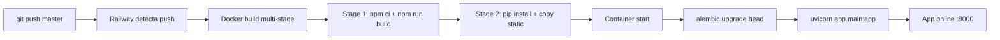

# Guia de Deploy e Release — Meu Controle

**Versao:** 1.0
**Data:** 2026-02-11
**PRD Ref:** 01-PRD v1.0
**Evolucao Ref:** Plano de Evolucao P0-1

---

## 1. Visao Geral da Infraestrutura

### 1.1 Plataforma

| Item | Valor |
|------|-------|
| Hosting | Railway (container Docker) |
| Banco de dados | PostgreSQL (Railway add-on) |
| Build trigger | Push para branch `master` (auto-deploy) |
| Container base | `python:3.12-slim` (backend) + `node:20-alpine` (frontend build) |
| Porta | 8000 |

### 1.2 Pipeline de Deploy



**Detalhamento:**

1. Push para `master` aciona build automatico no Railway
2. **Stage 1 (frontend):** Node 20 Alpine instala dependencias (`npm ci`) e compila React (`npm run build`), gerando `/app/frontend/dist`
3. **Stage 2 (backend):** Python 3.12 slim instala `requirements.txt`, copia codigo backend e frontend compilado para `/static`
4. **Container start:** Executa `alembic upgrade head` (migrations pendentes) seguido de `uvicorn` (servidor)
5. FastAPI serve API (`/api/*`) e arquivos estaticos do frontend (SPA fallback para `index.html`)

### 1.3 Dockerfile Atual

```dockerfile
# Stage 1: Build frontend
FROM node:20-alpine AS frontend-build
WORKDIR /app/frontend
COPY frontend/package.json frontend/package-lock.json ./
RUN npm ci
COPY frontend/ ./
ARG VITE_GOOGLE_CLIENT_ID
ENV VITE_GOOGLE_CLIENT_ID=$VITE_GOOGLE_CLIENT_ID
RUN npm run build

# Stage 2: Production backend + static files
FROM python:3.12-slim
WORKDIR /app
COPY backend/requirements.txt ./
RUN pip install --no-cache-dir -r requirements.txt
COPY backend/ ./
COPY --from=frontend-build /app/frontend/dist ./static
EXPOSE 8000
CMD ["sh", "-c", "alembic upgrade head && python -m uvicorn app.main:app --host 0.0.0.0 --port 8000"]
```

> **Nota:** O `ARG VITE_GOOGLE_CLIENT_ID` e legado. O frontend busca o Google Client ID em runtime via `GET /api/config`. O ARG pode ser removido em futura limpeza.

---

## 2. Variaveis de Ambiente

### 2.1 Desenvolvimento (Local)

| Variavel | Obrigatoria | Default | Onde definir |
|----------|-------------|---------|--------------|
| `DATABASE_URL` | Nao | `sqlite:///meu_controle.db` | `backend/.env` |
| `SECRET_KEY` | Nao | `dev-secret-key-change-in-production` | `backend/.env` |
| `ALGORITHM` | Nao | `HS256` | `backend/.env` |
| `ACCESS_TOKEN_EXPIRE_MINUTES` | Nao | `15` | `backend/.env` |
| `REFRESH_TOKEN_EXPIRE_DAYS` | Nao | `7` | `backend/.env` |
| `GOOGLE_CLIENT_ID` | Nao | Google login desabilitado | `backend/.env` |
| `GOOGLE_CLIENT_SECRET` | Nao | Google login desabilitado | `backend/.env` |
| `GOOGLE_REDIRECT_URI` | Nao | — | `backend/.env` |
| `SENDGRID_API_KEY` | Nao | Loga token no console | `backend/.env` |
| `SENDGRID_FROM_EMAIL` | Nao | — | `backend/.env` |
| `FRONTEND_URL` | Nao | `http://localhost:5173` | `backend/.env` |

### 2.2 Producao (Railway)

| Variavel | Obrigatoria | Provisionamento | Observacao |
|----------|-------------|-----------------|------------|
| `DATABASE_URL` | Sim | Railway add-on PostgreSQL (automatico) | Prefixo `postgres://` convertido para `postgresql://` em `database.py` |
| `SECRET_KEY` | Sim | Manual (Railway Variables) | String aleatoria longa (32+ chars). **Alterar invalida tokens existentes** |
| `GOOGLE_CLIENT_ID` | Sim* | Manual | OAuth app ID do Google Cloud Console |
| `GOOGLE_CLIENT_SECRET` | Sim* | Manual | OAuth secret |
| `GOOGLE_REDIRECT_URI` | Sim* | Manual | `https://<domain>/login` |
| `SENDGRID_API_KEY` | Sim* | Manual | API key do SendGrid |
| `SENDGRID_FROM_EMAIL` | Sim* | Manual | Email verificado no SendGrid |
| `FRONTEND_URL` | Sim | Manual | `https://<railway-domain>` |

> (*) Obrigatorio apenas se a feature correspondente estiver habilitada (Google login, email recovery).

### 2.3 Notas Importantes

- `ALGORITHM`, `ACCESS_TOKEN_EXPIRE_MINUTES` e `REFRESH_TOKEN_EXPIRE_DAYS` tem defaults seguros e raramente precisam ser configurados em producao.
- `VITE_GOOGLE_CLIENT_ID` como `ARG` no Dockerfile e legado — o frontend busca via `GET /api/config` em runtime.
- **Nunca commitar** `.env` no repositorio. O `.gitignore` ja exclui este arquivo.

---

## 3. Checklist Pre-Deploy

### 3.1 Para qualquer deploy

- [ ] Codigo commitado e push feito para `master`
- [ ] App roda localmente sem erros (`uvicorn app.main:app --reload`)
- [ ] Frontend compila sem erros (`npm run build`)
- [ ] Testes backend passando (`pytest`)
- [ ] Nenhum `.env`, credencial ou segredo incluido no commit

### 3.2 Para deploys com migration de banco

Todos os itens da secao 3.1, mais:

- [ ] Migration testada localmente: `alembic upgrade head`
- [ ] Downgrade testado: `alembic downgrade -1` + `alembic upgrade head`
- [ ] Verificar se migration e destrutiva (apaga dados? altera colunas existentes?)
- [ ] Se destrutiva: backup do banco de producao realizado (ver secao 5)
- [ ] Se destrutiva: rollback documentado no CR correspondente
- [ ] Funcao `downgrade()` da migration esta implementada (nao vazia)

---

## 4. Procedimentos de Rollback

### 4.1 Rollback de Codigo (sem migration)

**Quando usar:** Deploy quebrou a app mas nao alterou o schema do banco.

**Opcao A — Redeploy via Railway (mais rapido):**

1. Acesse Railway Dashboard → Servico → Deployments
2. Encontre o ultimo deployment funcional
3. Clique "Redeploy" no deployment anterior
4. Aguarde build + start completo
5. Verificar: acesse a aplicacao e confirme funcionamento

**Opcao B — Git revert (permanente):**

1. `git log --oneline -10` para identificar commits a reverter
2. `git revert <hash>` (um por vez, ou range)
3. `git push origin master`
4. Railway faz auto-deploy
5. Verificar: acesse a aplicacao e confirme funcionamento

### 4.2 Rollback de Migration

**Quando usar:** Migration alterou o schema e precisa ser revertida.

> **ATENCAO:** Avaliar impacto em dados antes de executar. Migrations destrutivas (DROP COLUMN, DELETE dados) perdem dados no downgrade — apenas o schema e revertido. Para restaurar dados: usar backup (secao 5).

**Procedimento:**

1. Fazer backup do banco ANTES do rollback (secao 5)
2. Reverter o codigo (secao 4.1) para a versao anterior
3. Para forcar downgrade da migration, executar via Railway CLI:
   ```bash
   railway run alembic downgrade -1
   ```
4. Verificar: `railway run alembic current` mostra a revisao esperada
5. Verificar: acesse a aplicacao e confirme funcionamento
6. Verificar: endpoints principais retornam dados corretamente

### 4.3 Rollback de Variaveis de Ambiente

**Quando usar:** Nova variavel ou alteracao causou problema (ex: `SECRET_KEY` alterada invalida tokens existentes).

**Procedimento:**

1. Railway Dashboard → Servico → Variables
2. Reverter a variavel para o valor anterior (ou remover se nova)
3. Railway faz redeploy automaticamente ao salvar
4. Verificar: acesse a aplicacao e confirme funcionamento

---

## 5. Backup de Banco de Dados

### 5.1 Backup Manual via Railway CLI

```bash
# Instalar Railway CLI (se nao instalado)
npm install -g @railway/cli

# Login
railway login

# Link ao projeto
railway link

# Dump do PostgreSQL
railway run pg_dump -Fc > backup_$(date +%Y%m%d_%H%M%S).dump
```

### 5.2 Restore de Backup

```bash
# Restaurar backup completo
railway run pg_restore --clean --if-exists -d $DATABASE_URL backup_YYYYMMDD_HHMMSS.dump
```

### 5.3 Quando Fazer Backup

| Situacao | Obrigatorio? |
|----------|-------------|
| Antes de deploy com migration destrutiva | **Sim** |
| Antes de deploy com migration nao-destrutiva | Recomendado |
| Periodicamente (semanal) | Recomendado |
| Antes de alterar `SECRET_KEY` | Recomendado (tokens invalidados) |

---

## 6. Verificacao Pos-Deploy

### 6.1 Checklist de Verificacao

- [ ] Pagina de login carrega corretamente
- [ ] Login com email/senha funciona
- [ ] Login com Google funciona (se configurado)
- [ ] Dashboard exibe dados do usuario
- [ ] Criar/editar/deletar despesa funciona
- [ ] Criar/editar/deletar receita funciona
- [ ] Navegacao entre meses funciona
- [ ] Transicao de mes funciona (navegar para mes futuro sem dados)

### 6.2 Comandos Uteis para Diagnostico

```bash
# Verificar logs do container Railway
railway logs

# Verificar versao atual da migration
railway run alembic current

# Verificar historico de migrations
railway run alembic history

# Testar conexao ao banco
railway run python -c "from app.database import engine; print(engine.url)"
```

---

## 7. Problemas Conhecidos e Solucoes

| Problema | Causa | Solucao |
|----------|-------|---------|
| App nao inicia: "relation does not exist" | Migration nao executou | Verificar logs. Re-deploy ou `railway run alembic upgrade head` |
| 401 em todos endpoints apos deploy | `SECRET_KEY` alterada (tokens antigos invalidados) | Restaurar `SECRET_KEY` anterior ou aguardar usuarios re-login |
| Google login falha em producao | `GOOGLE_REDIRECT_URI` incorreta | Verificar URI no Google Cloud Console e nas Railway Variables |
| `postgres://` vs `postgresql://` | Railway usa prefixo antigo | Tratado automaticamente em `database.py` |
| `passlib` + `bcrypt` 4.1+ incompativeis | Versao do bcrypt | `bcrypt==4.0.*` pinado em `requirements.txt` |

---

## Changelog

| Data | Autor | Descricao |
|------|-------|-----------|
| 2026-02-11 | Rafael | Documento criado (v1.0) |
