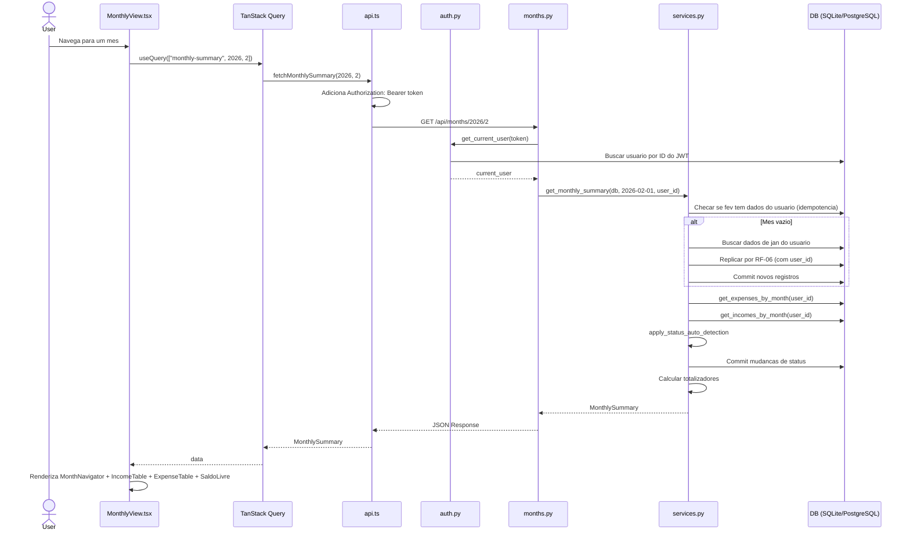
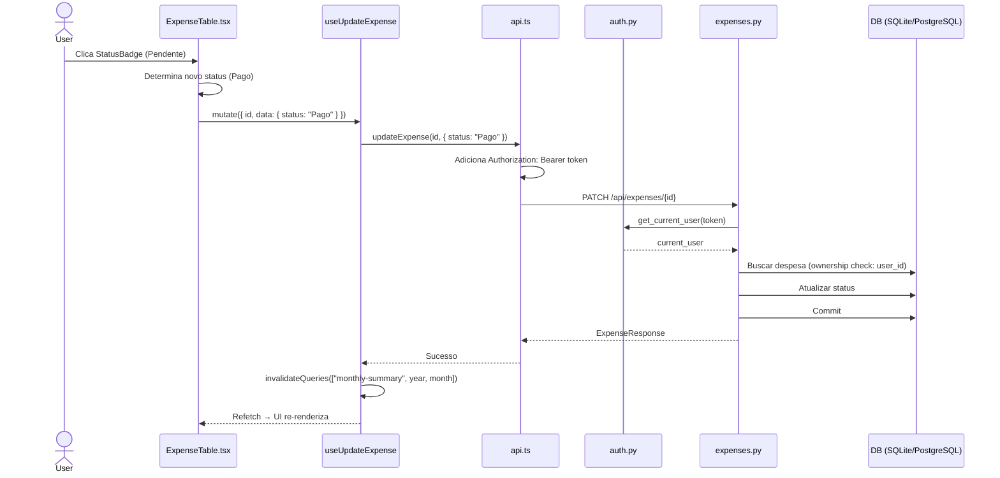
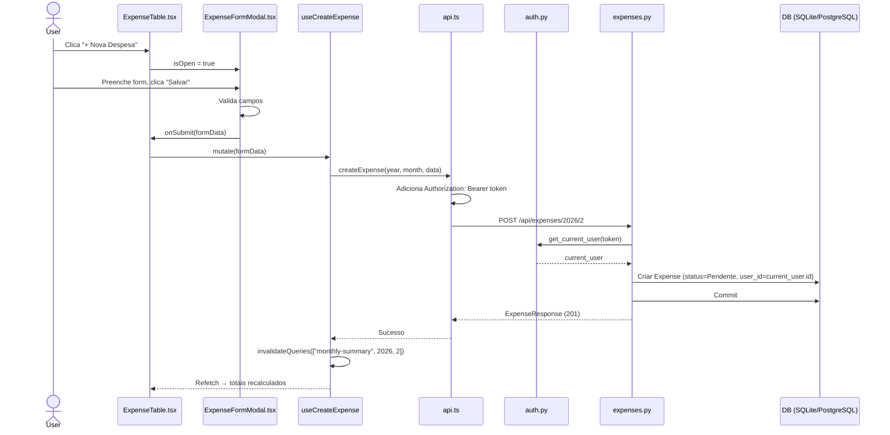
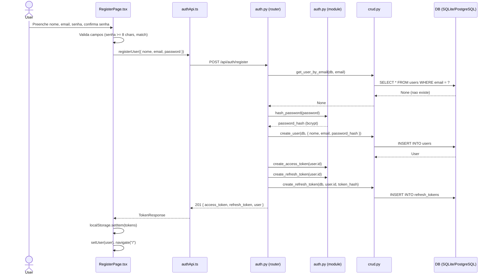
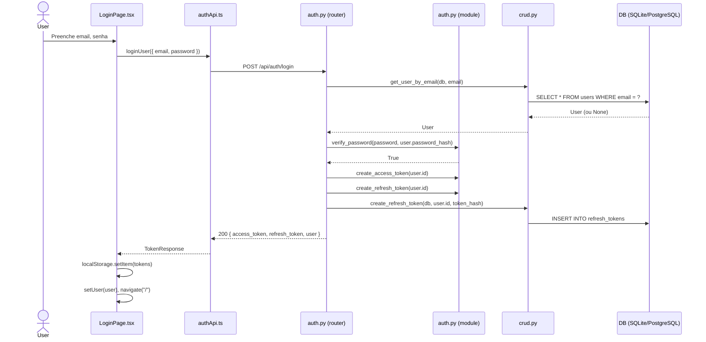
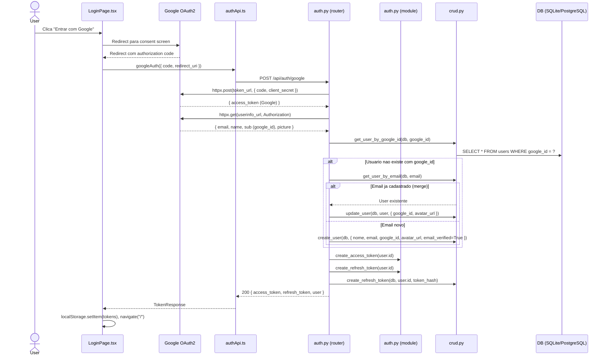
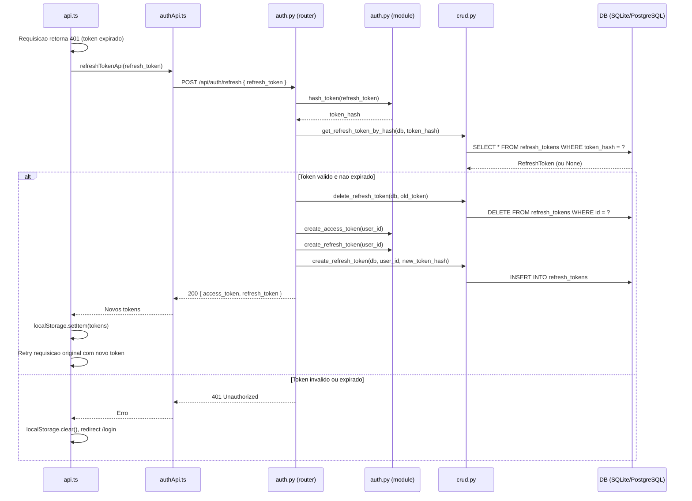
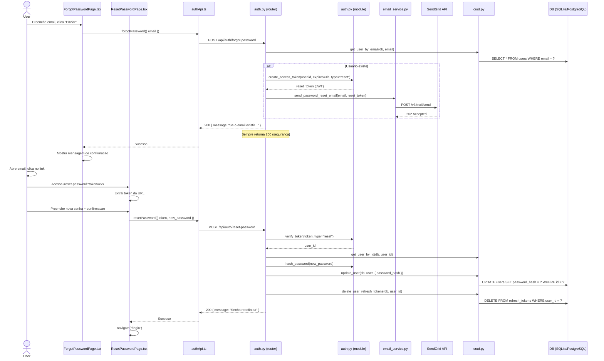

# Spec — Fluxos Críticos, Casos de Borda, Plano de Testes e Checklists

> Extraído de `docs/03-SPEC.md` no CR-038 (conteúdo original preservado). Índice: [03-SPEC.md](../03-SPEC.md)

## 4. Fluxos Criticos

### Fluxo: Carregamento da Visao Mensal

### Fluxo: Toggle de Status

### Fluxo: Criar Despesa

### Fluxo: Registro de Usuario (CR-002)

### Fluxo: Login Email/Senha (CR-002)

### Fluxo: Login Google OAuth2 (CR-002)

### Fluxo: Refresh Token (CR-002)

### Fluxo: Recuperacao de Senha (CR-002)

---

## 5. Casos de Borda

| # | Cenario                                          | Comportamento Esperado                                              |
|---|--------------------------------------------------|----------------------------------------------------------------------|
| 1 | Vencimento dia 31 para mes com menos dias        | `adjust_vencimento_to_month` faz clamp (ex: 31/jan → 28/fev)       |
| 2 | Navegar 2+ meses para frente sem visitar intermediarios | So olha mes anterior; se vazio, nada gerado. Visitar em sequencia. |
| 3 | Usuario cria dados manualmente em mes futuro     | Check de idempotencia: mes com dados nao e sobrescrito              |
| 4 | parcela_atual sem parcela_total (ou vice-versa)  | Validacao Pydantic rejeita: ambos devem estar presentes ou ausentes |
| 5 | parcela_atual > parcela_total                    | Validacao Pydantic rejeita: "parcela_atual deve ser <= parcela_total" |
| 6 | Valor negativo ou zero                           | Validacao Pydantic rejeita: Field(gt=0)                             |
| 7 | Nome vazio                                       | Validacao Pydantic rejeita: Field(min_length=1)                     |
| 8 | Despesa parcelada "11 de 11" na transicao        | NAO e replicada para proximo mes (ultima parcela)                   |
| 9 | Despesa avulsa (recorrente=false, sem parcela)   | NAO e replicada na transicao                                        |
| 10| Despesa com status "Pago" e vencimento passado   | Permanece "Pago" (auto-deteccao so afeta "Pendente")                |
| 11| Cadastro com email ja existente (CR-002)         | 409 Conflict — "Email ja cadastrado"                                |
| 12| Login com credenciais invalidas (CR-002)         | 401 generico — nao revela se email existe ou se senha esta errada   |
| 13| Google login com email ja cadastrado via email/senha (CR-002) | Vincula google_id a conta existente (merge), acessa mesmos dados |
| 14| Refresh token expirado >7 dias (CR-002)          | 401 → frontend limpa tokens, redireciona para /login               |
| 15| Refresh token ja usado (rotacao) (CR-002)        | 401 → token antigo invalido apos rotacao                           |
| 16| Token de reset expirado >1h (CR-002)             | 400 Bad Request — "Token expirado ou invalido"                     |
| 17| Trocar senha em usuario Google-only (CR-002)     | 400 — "Usuario nao possui senha cadastrada"                        |
| 18| Acessar expense de outro usuario via ID (CR-002) | 404 Not Found (ownership check retorna None, nao 403)              |
| 19| Requisicao sem header Authorization (CR-002)     | 401 Unauthorized — "Not authenticated"                             |
| 20| SendGrid nao configurado — sem API key (CR-002)  | Log warning no backend, endpoint retorna 200 (seguranca)           |
| 21| Subcategoria invalida em gasto diario (CR-005)   | 422 Validation Error — "Subcategoria invalida"                     |
| 22| Metodo de pagamento invalido em gasto diario (CR-005) | 422 Validation Error — "Metodo de pagamento invalido"         |
| 23| Acessar gasto diario de outro usuario (CR-005)   | 404 Not Found (ownership check, mesmo padrao de expenses)          |
| 24| Valor negativo ou zero em gasto diario (CR-005)  | Validacao Pydantic rejeita: Field(gt=0)                            |
| 25| Gasto diario sem campos obrigatorios (CR-005)    | 422 Validation Error — campos required                             |

---

## 6. Plano de Testes

### Backend isolado

| ID     | Cenario                        | Metodo/Rota                  | Status Esperado |
|--------|--------------------------------|------------------------------|-----------------|
| BT-001 | Health check                   | GET /api/health              | 200             |
| BT-002 | Swagger UI acessivel           | GET /docs                    | 200 (HTML)      |
| BT-003 | Registro com dados validos (CR-002)    | POST /api/auth/register      | 201             |
| BT-004 | Registro com email duplicado (CR-002)  | POST /api/auth/register      | 409             |
| BT-005 | Login com credenciais validas (CR-002) | POST /api/auth/login         | 200             |
| BT-006 | Login com senha errada (CR-002)        | POST /api/auth/login         | 401             |
| BT-007 | Refresh token valido (CR-002)          | POST /api/auth/refresh       | 200             |
| BT-008 | Refresh token expirado (CR-002)        | POST /api/auth/refresh       | 401             |
| BT-009 | Endpoint protegido sem token (CR-002)  | GET /api/months/2026/2       | 401             |
| BT-010 | Acessar expense de outro user (CR-002) | PATCH /api/expenses/{id}     | 404             |
| BT-011 | Listar categorias e metodos (CR-005)           | GET /api/daily-expenses/categories | 200       |
| BT-012 | Criar gasto diario com dados validos (CR-005)  | POST /api/daily-expenses/2026/2    | 201       |
| BT-013 | Criar gasto diario com subcategoria invalida (CR-005) | POST /api/daily-expenses/2026/2 | 422    |
| BT-014 | Listar gastos diarios do mes (CR-005)          | GET /api/daily-expenses/2026/2     | 200       |
| BT-015 | Excluir gasto diario (CR-005)                  | DELETE /api/daily-expenses/{id}    | 204       |

### Fluxo completo (backend + frontend)

| ID     | Cenario                                                      | Resultado Esperado                                    |
|--------|--------------------------------------------------------------|-------------------------------------------------------|
| FT-001 | Criar receita via "+ Nova Receita"                           | Aparece na tabela, total atualiza                     |
| FT-002 | Criar despesa via "+ Nova Despesa"                           | Aparece na tabela, total e saldo atualizam            |
| FT-003 | Clicar no status "Pendente"                                  | Muda para "Pago"                                      |
| FT-004 | Clicar no status "Pago"                                      | Volta para "Pendente"                                 |
| FT-005 | Editar despesa                                               | Valores atualizam na tabela e totalizadores           |
| FT-006 | Excluir despesa                                              | Some da tabela, totalizadores recalculam              |
| FT-007 | Duplicar despesa                                             | Nova entrada identica com status Pendente             |
| FT-008 | Navegar para proximo mes (sem dados)                         | Dados gerados automaticamente do mes anterior         |
| FT-009 | Despesa recorrente do mes anterior                           | Aparece no proximo mes                                |
| FT-010 | Despesa parcelada "5 de 11"                                  | Proximo mes mostra "6 de 11"                          |
| FT-011 | Despesa parcelada "11 de 11"                                 | NAO aparece no proximo mes                            |
| FT-012 | Despesa nao recorrente                                       | NAO aparece no proximo mes                            |
| FT-013 | Receita recorrente                                           | Aparece no proximo mes                                |
| FT-014 | Receita nao recorrente                                       | NAO aparece no proximo mes                            |
| FT-015 | Despesa com vencimento passado e status Pendente             | Exibida como "Atrasado"                               |
| FT-016 | Formato monetario                                            | R$ 1.234,56 em todos os valores                       |
| FT-017 | Interface responsiva em mobile                               | Funciona em DevTools mobile                           |
| FT-018 | Registrar novo usuario (CR-002)                              | Redireciona para dashboard vazio                      |
| FT-019 | Login com email/senha (CR-002)                               | Dashboard mostra dados do usuario                     |
| FT-020 | Logout (CR-002)                                              | Redireciona para /login, token invalidado             |
| FT-021 | Rota protegida sem autenticacao (CR-002)                     | Redireciona para /login                               |
| FT-022 | User A nao ve dados de User B (CR-002)                       | Isolamento completo de dados por user_id              |
| FT-023 | Transicao de mes so replica dados do usuario (CR-002)        | Dados de outros usuarios nao sao replicados           |
| FT-024 | Refresh token auto-renew (CR-002)                            | Sessao continua sem intervencao apos expiry do access |
| FT-025 | Editar perfil — nome e email (CR-002)                        | Dados atualizados, UserMenu reflete mudanca           |
| FT-026 | Trocar senha (CR-002)                                        | Nova senha funciona no proximo login                  |
| FT-027 | Recuperacao de senha via email (CR-002)                      | Link funciona, senha redefinida, login OK             |
| FT-028 | Login Google — novo usuario (CR-002)                         | Conta criada, dashboard acessivel                     |
| FT-029 | Login Google — email ja cadastrado (CR-002)                  | Vincula Google, acessa mesmos dados existentes        |
| FT-030 | Criar gasto diario via modal (CR-005)                        | Aparece na tabela agrupado pelo dia correto           |
| FT-031 | Visualizar gastos agrupados por dia (CR-005)                 | Dias com header formatado, subtotal e total do mes    |
| FT-032 | Editar gasto diario (CR-005)                                 | Valores atualizam na tabela e totalizadores           |
| FT-033 | Excluir gasto diario (CR-005)                                | Some da tabela, totalizadores recalculam              |
| FT-034 | Navegar entre meses em Gastos Diarios (CR-005)               | Mes anterior/proximo carrega gastos corretos          |
| FT-035 | Alternar entre Planejados e Diarios via ViewSelector (CR-005)| Visao muda sem erro, dados carregam corretamente      |

---

## 7. Checklist de Implementacao

- [x] Criar `backend/requirements.txt`
- [x] Criar `backend/app/__init__.py`
- [x] Criar `backend/app/database.py`
- [x] Criar `backend/app/models.py`
- [x] Criar `backend/app/schemas.py`
- [x] Criar `backend/app/crud.py`
- [x] Criar `backend/app/services.py`
- [x] Criar `backend/app/routers/__init__.py`
- [x] Criar `backend/app/routers/months.py`
- [x] Criar `backend/app/routers/expenses.py`
- [x] Criar `backend/app/routers/incomes.py`
- [x] Criar `backend/app/main.py`
- [x] Criar `frontend/package.json`
- [x] Criar `frontend/tsconfig.json` + `frontend/tsconfig.app.json`
- [x] Criar `frontend/vite.config.ts`
- [x] Criar `frontend/index.html`
- [x] Criar `frontend/src/index.css`
- [x] Criar `frontend/src/main.tsx`
- [x] Criar `frontend/src/types.ts`
- [x] Criar `frontend/src/utils/format.ts`
- [x] Criar `frontend/src/utils/date.ts`
- [x] Criar `frontend/src/services/api.ts`
- [x] Criar `frontend/src/hooks/useExpenses.ts`
- [x] Criar `frontend/src/hooks/useIncomes.ts`
- [x] Criar `frontend/src/hooks/useMonthTransition.ts`
- [x] Criar `frontend/src/components/ConfirmDialog.tsx`
- [x] Criar `frontend/src/components/StatusBadge.tsx`
- [x] Criar `frontend/src/components/MonthNavigator.tsx`
- [x] Criar `frontend/src/components/SaldoLivre.tsx`
- [x] Criar `frontend/src/components/ExpenseFormModal.tsx`
- [x] Criar `frontend/src/components/IncomeFormModal.tsx`
- [x] Criar `frontend/src/components/IncomeTable.tsx`
- [x] Criar `frontend/src/components/ExpenseTable.tsx`
- [x] Criar `frontend/src/pages/MonthlyView.tsx`
- [x] Criar `frontend/src/App.tsx`
- [x] Criar `.gitignore`

### CR-002: Multi-usuario e Autenticacao

**Backend — Novos arquivos:**
- [ ] Criar `backend/app/auth.py`
- [ ] Criar `backend/app/email_service.py`
- [ ] Criar `backend/app/routers/auth.py`
- [ ] Criar `backend/app/routers/users.py`
- [ ] Criar `backend/alembic/versions/002_add_users_and_auth.py`

**Backend — Atualizacoes:**
- [ ] Atualizar `backend/app/models.py` (User, RefreshToken, user_id FK em Expense/Income)
- [ ] Atualizar `backend/app/schemas.py` (auth schemas)
- [ ] Atualizar `backend/app/crud.py` (user_id em funcoes existentes + 9 novas funcoes)
- [ ] Atualizar `backend/app/services.py` (user_id em get_monthly_summary e generate_month_data)
- [ ] Atualizar `backend/app/main.py` (registrar routers auth e users)
- [ ] Atualizar `backend/app/routers/expenses.py` (auth dependency + ownership)
- [ ] Atualizar `backend/app/routers/incomes.py` (auth dependency + ownership)
- [ ] Atualizar `backend/app/routers/months.py` (auth dependency + user_id)
- [ ] Atualizar `backend/requirements.txt` (5 novas dependencias)
- [ ] Atualizar `backend/alembic/env.py` (importar novos modelos)

**Frontend — Novos arquivos:**
- [ ] Criar `frontend/src/contexts/AuthContext.tsx`
- [ ] Criar `frontend/src/hooks/useAuth.ts`
- [ ] Criar `frontend/src/services/authApi.ts`
- [ ] Criar `frontend/src/components/ProtectedRoute.tsx`
- [ ] Criar `frontend/src/components/UserMenu.tsx`
- [ ] Criar `frontend/src/pages/LoginPage.tsx`
- [ ] Criar `frontend/src/pages/RegisterPage.tsx`
- [ ] Criar `frontend/src/pages/ForgotPasswordPage.tsx`
- [ ] Criar `frontend/src/pages/ResetPasswordPage.tsx`
- [ ] Criar `frontend/src/pages/ProfilePage.tsx`

**Frontend — Atualizacoes:**
- [ ] Atualizar `frontend/src/main.tsx` (BrowserRouter)
- [ ] Atualizar `frontend/src/App.tsx` (AuthProvider + Routes)
- [ ] Atualizar `frontend/src/types.ts` (auth types)
- [ ] Atualizar `frontend/src/services/api.ts` (auth header + 401 interceptor)
- [ ] Atualizar `frontend/src/index.css` (--color-google)
- [ ] Atualizar `frontend/package.json` (2 novas dependencias)

### CR-005: Gastos Diarios

**Backend — Novos arquivos:**
- [x] Criar `backend/app/categories.py`
- [x] Criar `backend/app/routers/daily_expenses.py`
- [x] Criar `backend/alembic/versions/004_add_daily_expenses.py`

**Backend — Atualizacoes:**
- [x] Atualizar `backend/app/models.py` (DailyExpense model + User.daily_expenses relationship)
- [x] Atualizar `backend/app/schemas.py` (6 novos schemas)
- [x] Atualizar `backend/app/crud.py` (5 funcoes CRUD)
- [x] Atualizar `backend/app/services.py` (get_daily_expenses_monthly_summary)
- [x] Atualizar `backend/app/main.py` (include_router daily_expenses)
- [x] Atualizar `backend/alembic/env.py` (importar DailyExpense)

**Frontend — Novos arquivos:**
- [x] Criar `frontend/src/hooks/useDailyExpenses.ts`
- [x] Criar `frontend/src/hooks/useDailyExpensesView.ts`
- [x] Criar `frontend/src/components/DailyExpenseTable.tsx`
- [x] Criar `frontend/src/components/DailyExpenseFormModal.tsx`
- [x] Criar `frontend/src/components/ViewSelector.tsx`
- [x] Criar `frontend/src/pages/DailyExpensesView.tsx`

**Frontend — Atualizacoes:**
- [x] Atualizar `frontend/src/types.ts` (6 interfaces)
- [x] Atualizar `frontend/src/services/api.ts` (5 funcoes API)
- [x] Atualizar `frontend/src/utils/format.ts` (formatDateFull)
- [x] Atualizar `frontend/src/App.tsx` (rota /daily-expenses)
- [x] Atualizar `frontend/src/pages/MonthlyView.tsx` (ViewSelector)

---

*Documento migrado em 2026-02-08. Baseado em SPEC.md v1.0 (2026-02-06).*
*Atualizado para v2.0 em 2026-02-09 — CR-002: Multi-usuario e Autenticacao (RF-08 a RF-12).*
*Atualizado para v2.1 em 2026-02-11 — CR-003: Design System e descricoes visuais dos componentes.*
*Atualizado para v2.2 em 2026-02-17 — CR-005: Gastos Diarios (RF-13) — API contracts, feature section, testes, checklist.*
*Atualizado para v2.3 em 2026-02-26 — CR-010: Hardening de Seguranca — TokenResponse.refresh_token opcional, /refresh e /logout leem cookie HttpOnly (sem body), tabela de endpoints atualizada.*

---

