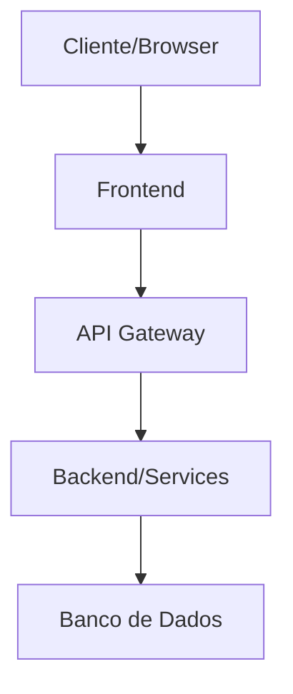
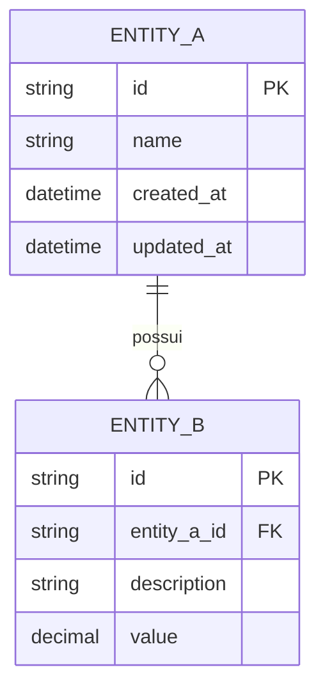

# Arquitetura — [Nome do Produto]

**Versão:** 1.0  
**Data:** YYYY-MM-DD  
**PRD Ref:** PRD v1.0

---

## 1. Stack Tecnológica

| Camada       | Tecnologia | Versão | Justificativa |
|--------------|------------|--------|---------------|
| Frontend     | ...        | ...    | ...           |
| Backend      | ...        | ...    | ...           |
| Banco de Dados | ...      | ...    | ...           |
| ORM/Query    | ...        | ...    | ...           |
| Testes       | ...        | ...    | ...           |
| CI/CD        | ...        | ...    | ...           |
| Deploy       | ...        | ...    | ...           |

---

## 2. Arquitetura Geral

[Descrição do padrão arquitetural adotado e justificativa]



---

## 3. Estrutura de Pastas

```
projeto/
├── src/
│   ├── modules/
│   │   ├── module-a/
│   │   │   ├── module-a.controller.ts
│   │   │   ├── module-a.service.ts
│   │   │   ├── module-a.model.ts
│   │   │   ├── module-a.types.ts
│   │   │   └── __tests__/
│   │   └── module-b/
│   ├── shared/
│   │   ├── types/
│   │   ├── utils/
│   │   ├── middleware/
│   │   └── constants/
│   ├── config/
│   └── app.ts
├── tests/
│   ├── unit/
│   ├── integration/
│   └── e2e/
├── docs/
│   ├── PRD.md
│   ├── ARCHITECTURE.md
│   ├── SPEC.md
│   └── IMPLEMENTATION_PLAN.md
├── scripts/
├── .env.example
├── .gitignore
├── package.json
├── tsconfig.json
└── README.md
```

---

## 4. Modelagem de Dados



### Detalhamento das Entidades

#### ENTITY_A
| Campo      | Tipo     | Restrições        | Descrição |
|------------|----------|-------------------|-----------|
| id         | UUID     | PK, auto-gerado   | ...       |
| name       | string   | NOT NULL, max 100  | ...       |
| created_at | datetime | NOT NULL, default NOW | ...    |

---

## 5. Padrões e Convenções

### Nomenclatura
| Item          | Padrão        | Exemplo              |
|---------------|---------------|----------------------|
| Arquivos      | kebab-case    | `user-service.ts`    |
| Classes       | PascalCase    | `UserService`        |
| Funções       | camelCase     | `getUserById`        |
| Variáveis     | camelCase     | `userName`           |
| Constantes    | UPPER_SNAKE   | `MAX_RETRY_COUNT`    |
| Tabelas BD    | snake_case    | `user_accounts`      |

### Git
- **Commits:** Conventional Commits (`feat:`, `fix:`, `docs:`, `refactor:`, `test:`, `chore:`)
- **Branches:** `feature/xxx`, `fix/xxx`, `hotfix/xxx`, `release/xxx`
- **PR:** Requer descrição e referência à tarefa

### Estilo de Código
- [Definir linter e configuração]
- [Definir formatter e configuração]

---

## 6. Integrações Externas

| Serviço    | Propósito      | Autenticação | Documentação |
|------------|----------------|--------------|--------------|
| ...        | ...            | API Key      | [link]       |

---

## 7. Estratégia de Testes

| Tipo         | Ferramenta | Cobertura Mínima | Escopo                |
|--------------|------------|-------------------|-----------------------|
| Unitário     | ...        | >80%              | Services, Utils       |
| Integração   | ...        | >60%              | API Endpoints         |
| E2E          | ...        | Fluxos críticos   | User Flows principais |

---

## 8. ADRs (Architecture Decision Records)

### ADR-001: [Título da Decisão]
- **Status:** Aceita
- **Data:** YYYY-MM-DD
- **Contexto:** [Por que essa decisão foi necessária]
- **Decisão:** [O que foi decidido]
- **Alternativas Consideradas:**
  - Alternativa A: [Descrição] — Descartada porque [motivo]
  - Alternativa B: [Descrição] — Descartada porque [motivo]
- **Consequências:**
  - Positivas: ...
  - Negativas: ...

### ADR-002: [Título da Decisão]
- **Status:** Aceita
- **Data:** YYYY-MM-DD
- **Contexto:** ...
- **Decisão:** ...
- **Alternativas Consideradas:** ...
- **Consequências:** ...
