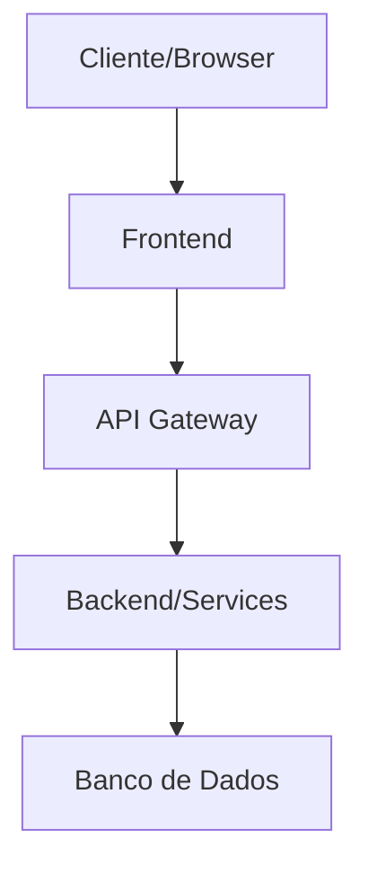
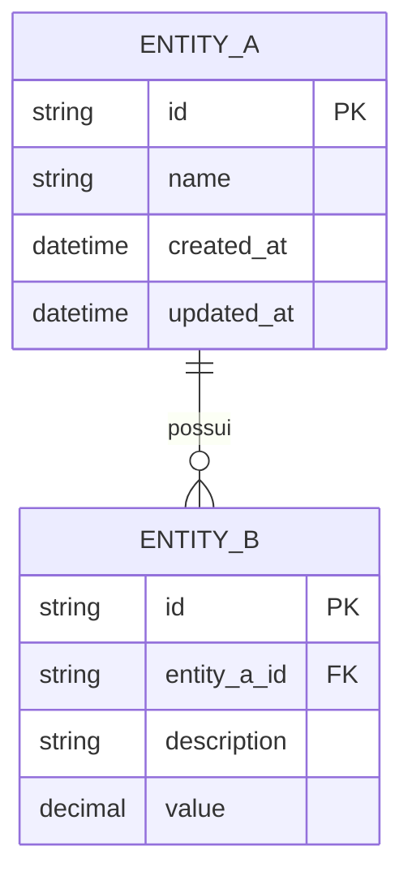
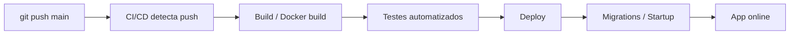

# Arquitetura — [Nome do Produto]

**Versão:** 1.0
**Data:** YYYY-MM-DD
**PRD Ref:** 01-PRD v1.0
**CR Ref:** — *(preencher quando atualizado por Change Requests)*

---

## 1. Stack Tecnológica

| Camada       | Tecnologia | Versão | Justificativa |
|--------------|------------|--------|---------------|
| Frontend     | ...        | ...    | ...           |
| Backend      | ...        | ...    | ...           |
| Banco de Dados | ...      | ...    | ...           |
| ORM/Query    | ...        | ...    | ...           |
| Testes       | ...        | ...    | ...           |
| CI/CD        | ...        | ...    | ...           |
| Deploy       | ...        | ...    | ...           |

---

## 2. Arquitetura Geral

[Descrição do padrão arquitetural adotado e justificativa]


```mermaid
graph TD
    A[Cliente/Browser] --> B[Frontend]
    B --> C[API Gateway]
    C --> D[Backend/Services]
    D --> E[Banco de Dados]
```

---

## 3. Estrutura de Pastas

```
projeto/
├── src/
│   ├── modules/
│   │   ├── module-a/
│   │   │   ├── module-a.controller.ts
│   │   │   ├── module-a.service.ts
│   │   │   ├── module-a.model.ts
│   │   │   ├── module-a.types.ts
│   │   │   └── __tests__/
│   │   └── module-b/
│   ├── shared/
│   │   ├── types/
│   │   ├── utils/
│   │   ├── middleware/
│   │   └── constants/
│   ├── config/
│   └── app.ts
├── tests/
│   ├── unit/
│   ├── integration/
│   └── e2e/
├── docs/
│   ├── PRD.md
│   ├── ARCHITECTURE.md
│   ├── SPEC.md
│   └── IMPLEMENTATION_PLAN.md
├── scripts/
├── .env.example
├── .gitignore
├── package.json
├── tsconfig.json
└── README.md
```

---

## 4. Modelagem de Dados


```mermaid
erDiagram
    ENTITY_A {
        string id PK
        string name
        datetime created_at
        datetime updated_at
    }
    ENTITY_B {
        string id PK
        string entity_a_id FK
        string description
        decimal value
    }
    ENTITY_A ||--o{ ENTITY_B : "possui"
```

### Detalhamento das Entidades

#### ENTITY_A
| Campo      | Tipo     | Restrições        | Descrição |
|------------|----------|-------------------|-----------|
| id         | UUID     | PK, auto-gerado   | ...       |
| name       | string   | NOT NULL, max 100  | ...       |
| created_at | datetime | NOT NULL, default NOW | ...    |

---

## 5. Padrões e Convenções

### Nomenclatura
| Item          | Padrão        | Exemplo              |
|---------------|---------------|----------------------|
| Arquivos      | kebab-case    | `user-service.ts`    |
| Classes       | PascalCase    | `UserService`        |
| Funções       | camelCase     | `getUserById`        |
| Variáveis     | camelCase     | `userName`           |
| Constantes    | UPPER_SNAKE   | `MAX_RETRY_COUNT`    |
| Tabelas BD    | snake_case    | `user_accounts`      |

### Git
- **Commits:** Conventional Commits (`feat:`, `fix:`, `docs:`, `refactor:`, `test:`, `chore:`)
- **Branches:** `feature/xxx`, `fix/xxx`, `hotfix/xxx`, `release/xxx`
- **PR:** Requer descrição e referência à tarefa

### API
- Todas as rotas sob prefixo `/api/`.
- Usar PATCH para atualização parcial — apenas campos enviados são alterados (`exclude_unset=True` em Pydantic / equivalente no ORM).
- 201 Created para criação, 204 No Content para exclusão.
- Derivar contexto de rota a partir de path parameters (ex: `{year}/{month}`), nunca do body.
- Endpoints protegidos requerem header `Authorization: Bearer <token>`.
- Ownership verification: operações em recursos verificam `user_id` antes de permitir.

### Estilo de Código
- [Definir linter e configuração]
- [Definir formatter e configuração]

---

## 6. Integrações Externas

| Serviço    | Propósito      | Autenticação | Documentação |
|------------|----------------|--------------|--------------|
| ...        | ...            | API Key      | [link]       |

---

## 7. Estratégia de Testes

| Tipo         | Ferramenta | Cobertura Mínima | Escopo                |
|--------------|------------|-------------------|-----------------------|
| Unitário     | ...        | >80%              | Services, Utils       |
| Integração   | ...        | >60%              | API Endpoints         |
| E2E          | ...        | Fluxos críticos   | User Flows principais |

---

## 8. ADRs (Architecture Decision Records)

### ADR-001: [Título da Decisão]
- **Status:** Aceita
- **Data:** YYYY-MM-DD
- **Contexto:** [Por que essa decisão foi necessária]
- **Decisão:** [O que foi decidido]
- **Alternativas Consideradas:**
  - Alternativa A: [Descrição] — Descartada porque [motivo]
  - Alternativa B: [Descrição] — Descartada porque [motivo]
- **Consequências:**
  - Positivas: ...
  - Negativas: ...

### ADR-002: [Título da Decisão]
- **Status:** Aceita
- **Data:** YYYY-MM-DD
- **Contexto:** ...
- **Decisão:** ...
- **Alternativas Consideradas:** ...
- **Consequências:** ...

---

## 9. Deploy e Infraestrutura

### 9.1 Plataforma de Produção

| Item | Valor |
|------|-------|
| Hosting | [Plataforma — ex: Railway, Render, AWS, Vercel] |
| Banco de dados | [Banco + provedor] |
| Build trigger | [ex: Push para branch `main` / CI/CD pipeline] |
| Container base | [ex: `python:3.12-slim` + `node:20-alpine`] |

### 9.2 Pipeline de Deploy


```mermaid
graph LR
    A[git push main] --> B[CI/CD detecta push]
    B --> C[Build / Docker build]
    C --> D[Testes automatizados]
    D --> E[Deploy]
    E --> F[Migrations / Startup]
    F --> G[App online]
```

### 9.3 Verificação e Rollback

> Procedimentos detalhados em `/docs/05-DEPLOY-GUIDE.md`.

### 9.4 Health Check

- **Endpoint:** `GET /api/health` — retorna `{"status": "ok"}`
- **Uso:** Verificação manual pós-deploy

---

## 10. Gestão de Dependências

### 10.1 Política de Pinning

| Ecossistema | Estratégia | Formato | Justificativa |
|-------------|------------|---------|---------------|
| [Backend]   | Major.Minor fixo, patch livre | `==X.Y.*` | Permite bug fixes, bloqueia breaking changes |
| [Frontend]  | Caret ranges | `^X.Y.Z` | Padrão npm, permite minor+patch, bloqueia major |

**Pins críticos (não alterar sem testar):**

| Dependência | Pin | Motivo |
|-------------|-----|--------|
| [Pacote]    | [Versão] | [Motivo — ex: incompatibilidade conhecida] |

### 10.2 Processo de Auditoria

Executar periodicamente (antes de cada CR ou mensalmente):

```bash
# Backend
[comando de auditoria — ex: pip audit]
[comando de listagem — ex: pip list --outdated]

# Frontend
[comando de auditoria — ex: npm audit]
[comando de listagem — ex: npm outdated]
```

---

*Documento criado em YYYY-MM-DD.*
