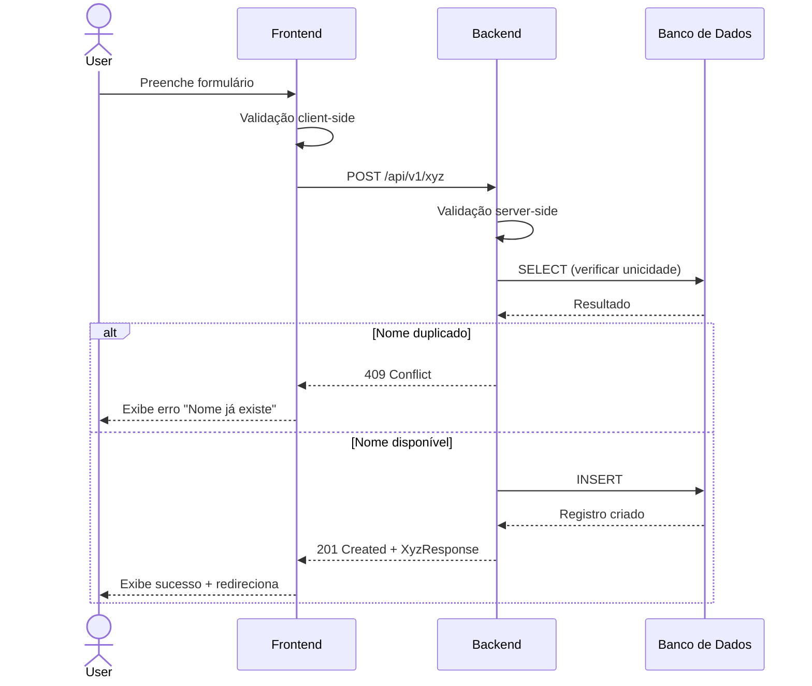

# Especificação Técnica — [Nome do Produto/Feature]

**Versão:** 1.0  
**Data:** YYYY-MM-DD  
**PRD Ref:** PRD v1.0  
**Arquitetura Ref:** ARCHITECTURE v1.0

---

## 1. Resumo das Mudanças

[Descrição geral do que será construído ou alterado nesta iteração]

### Escopo desta Iteração
- [Feature/Módulo 1]
- [Feature/Módulo 2]
- ...

---

## 2. Detalhamento Técnico

### Feature: [RF-001] [Nome da Feature]

#### 2.1 Descrição Técnica
[Descrição detalhada da implementação]

#### 2.2 Arquivos

| Ação      | Caminho                              | Descrição            |
|-----------|--------------------------------------|----------------------|
| Criar     | `src/modules/xyz/xyz.service.ts`     | Lógica de negócio    |
| Criar     | `src/modules/xyz/xyz.controller.ts`  | Endpoints da API     |
| Criar     | `src/modules/xyz/xyz.model.ts`       | Modelo de dados      |
| Criar     | `src/modules/xyz/xyz.types.ts`       | Types e interfaces   |
| Modificar | `src/shared/types/index.ts`          | Exportar novos types |

#### 2.3 Interfaces / Types

```typescript
interface CreateXyzInput {
  name: string;
  description?: string;
  value: number;
}

interface XyzResponse {
  id: string;
  name: string;
  description: string | null;
  value: number;
  createdAt: Date;
  updatedAt: Date;
}

type UpdateXyzInput = Partial<CreateXyzInput>;
```

#### 2.4 Lógica de Negócio

**Criar Xyz:**
1. Receber `CreateXyzInput`
2. Validar campos obrigatórios (name, value)
3. Verificar se já existe registro com mesmo `name`
   - Se existe: retornar erro 409 (Conflict)
4. Persistir no banco de dados
5. Retornar `XyzResponse`

**Atualizar Xyz:**
1. Receber `id` e `UpdateXyzInput`
2. Buscar registro por `id`
   - Se não existe: retornar erro 404 (Not Found)
3. Se `name` alterado, verificar unicidade
4. Atualizar campos enviados
5. Retornar `XyzResponse` atualizado

#### 2.5 API Endpoints

**POST /api/v1/xyz**
```
Descrição: Criar novo recurso
Auth: Requer autenticação

Request Body:
{
  "name": "string (obrigatório, 3-100 chars)",
  "description": "string (opcional, max 500 chars)",
  "value": "number (obrigatório, > 0)"
}

Response 201:
{
  "id": "uuid",
  "name": "string",
  "description": "string | null",
  "value": "number",
  "createdAt": "ISO 8601",
  "updatedAt": "ISO 8601"
}

Erros:
- 400: Validação falhou (campos inválidos)
- 409: Recurso já existe (name duplicado)
- 401: Não autenticado
- 500: Erro interno
```

**GET /api/v1/xyz**
```
Descrição: Listar recursos com paginação
Auth: Requer autenticação

Query Params:
- page: number (default: 1)
- limit: number (default: 20, max: 100)
- sort: string (default: "createdAt")
- order: "asc" | "desc" (default: "desc")

Response 200:
{
  "data": [XyzResponse],
  "pagination": {
    "page": 1,
    "limit": 20,
    "total": 100,
    "totalPages": 5
  }
}
```

**GET /api/v1/xyz/:id**
```
Descrição: Buscar recurso por ID
Auth: Requer autenticação

Response 200: XyzResponse
Erros:
- 404: Recurso não encontrado
```

**PUT /api/v1/xyz/:id**
```
Descrição: Atualizar recurso
Auth: Requer autenticação

Request Body: UpdateXyzInput (campos parciais)
Response 200: XyzResponse
Erros:
- 400: Validação falhou
- 404: Recurso não encontrado
- 409: Name duplicado
```

**DELETE /api/v1/xyz/:id**
```
Descrição: Remover recurso (soft delete)
Auth: Requer autenticação

Response 204: No Content
Erros:
- 404: Recurso não encontrado
```

#### 2.6 Banco de Dados

**Migração:**
```sql
CREATE TABLE xyz (
    id UUID PRIMARY KEY DEFAULT gen_random_uuid(),
    name VARCHAR(100) NOT NULL UNIQUE,
    description VARCHAR(500),
    value DECIMAL(10,2) NOT NULL CHECK (value > 0),
    deleted_at TIMESTAMP,
    created_at TIMESTAMP NOT NULL DEFAULT NOW(),
    updated_at TIMESTAMP NOT NULL DEFAULT NOW()
);

CREATE INDEX idx_xyz_name ON xyz(name);
CREATE INDEX idx_xyz_deleted_at ON xyz(deleted_at) WHERE deleted_at IS NULL;
```

#### 2.7 Validações

| Campo       | Regra                    | Mensagem de Erro               |
|-------------|--------------------------|--------------------------------|
| name        | Obrigatório, 3-100 chars | "Nome é obrigatório"           |
| name        | Único                    | "Nome já está em uso"          |
| value       | Obrigatório, > 0         | "Valor deve ser maior que zero"|
| description | Opcional, max 500 chars  | "Descrição muito longa"        |

---

### Feature: [RF-002] [Nome da Feature]

[Repetir a mesma estrutura acima para cada feature]

---

## 3. Componentes de UI (se aplicável)

### Componente: [NomeDoComponente]

| Prop       | Tipo        | Obrigatório | Default | Descrição       |
|------------|-------------|-------------|---------|-----------------|
| items      | XyzItem[]   | Sim         | —       | Lista de itens  |
| onSelect   | (id) => void| Não         | —       | Callback seleção|
| loading    | boolean     | Não         | false   | Estado loading  |

**Estados:**
- Default: Exibe lista de itens
- Loading: Exibe skeleton/spinner
- Empty: Exibe mensagem "Nenhum item encontrado"
- Error: Exibe mensagem de erro com botão "Tentar novamente"

**Comportamento:**
- Ao clicar em um item, chama `onSelect(item.id)`
- Scroll infinito carrega próxima página ao atingir 80% do scroll
- Itens deletados são removidos da lista com animação fade-out

---

## 4. Fluxos Críticos

### Fluxo: Criação de Recurso



### Fluxo: [Outro Fluxo Crítico]

```mermaid
sequenceDiagram
    [Definir conforme necessidade]
```

---

## 5. Casos de Borda

| # | Cenário                          | Comportamento Esperado                    |
|---|----------------------------------|-------------------------------------------|
| 1 | Nome com caracteres especiais    | Aceitar unicode, rejeitar HTML/scripts    |
| 2 | Valor com muitas casas decimais  | Arredondar para 2 casas                   |
| 3 | Requisição duplicada simultânea  | Primeira cria, segunda retorna 409        |
| 4 | Delete de item já deletado       | Retornar 404                              |
| 5 | Paginação além do total          | Retornar array vazio, total correto       |
| 6 | Campos extras no body            | Ignorar campos não reconhecidos           |

---

## 6. Plano de Testes

### Feature: [RF-001] [Nome da Feature]

#### Testes Unitários

| ID     | Cenário                        | Input                    | Output Esperado      |
|--------|--------------------------------|--------------------------|----------------------|
| UT-001 | Criar com dados válidos        | { name, value }          | XyzResponse          |
| UT-002 | Criar sem nome                 | { value }                | ValidationError      |
| UT-003 | Criar com valor negativo       | { name, value: -1 }     | ValidationError      |
| UT-004 | Criar com nome duplicado       | { name existente }       | ConflictError        |

#### Testes de Integração

| ID     | Cenário                        | Método/Rota              | Status Esperado |
|--------|--------------------------------|--------------------------|-----------------|
| IT-001 | POST com body válido           | POST /api/v1/xyz         | 201             |
| IT-002 | POST sem autenticação          | POST /api/v1/xyz         | 401             |
| IT-003 | GET lista paginada             | GET /api/v1/xyz?page=1   | 200             |
| IT-004 | GET recurso inexistente        | GET /api/v1/xyz/invalid  | 404             |

---

## 7. Checklist de Implementação

- [ ] Criar migração do banco de dados
- [ ] Implementar model/entity
- [ ] Implementar types/interfaces
- [ ] Implementar service (lógica de negócio)
- [ ] Implementar controller (endpoints)
- [ ] Implementar validações
- [ ] Implementar tratamento de erros
- [ ] Escrever testes unitários
- [ ] Escrever testes de integração
- [ ] Implementar componentes de UI
- [ ] Testar fluxos críticos end-to-end
- [ ] Revisar e documentar
