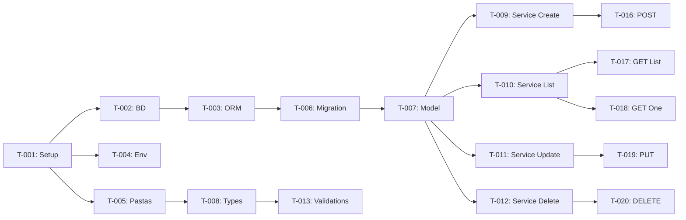

# Plano de Implementação — [Nome do Produto]

**Versão:** 1.0  
**Data:** YYYY-MM-DD  
**PRD Ref:** PRD v1.0  
**Arquitetura Ref:** ARCHITECTURE v1.0  
**Spec Ref:** SPEC v1.0

---

## Visão Geral

| Grupo | Descrição               | Tarefas | Estimativa |
|-------|-------------------------|---------|------------|
| 1     | Setup e Infraestrutura  | T-001 a T-00X | ...   |
| 2     | Modelos e Entidades     | T-00X a T-00X | ...   |
| 3     | Lógica de Negócio       | T-00X a T-00X | ...   |
| 4     | API / Controllers       | T-00X a T-00X | ...   |
| 5     | UI / Frontend           | T-00X a T-00X | ...   |
| 6     | Testes e Refinamento    | T-00X a T-00X | ...   |

---

## Grupo 1: Setup e Infraestrutura

| ID    | Tarefa | Arquivos | Ref | Depende de | Done When |
|-------|--------|----------|-----|------------|-----------|
| T-001 | Inicializar projeto com [framework] | `package.json`, `tsconfig.json`, configs de lint/format | — | — | Projeto roda com `npm run dev` sem erros |
| T-002 | Configurar banco de dados | `docker-compose.yml`, config de conexão | — | T-001 | Container do BD sobe e aceita conexões |
| T-003 | Configurar ORM e migrations | Config do ORM, script de migration | — | T-002 | Comando de migration roda sem erro |
| T-004 | Configurar variáveis de ambiente | `.env.example`, config loader | — | T-001 | App carrega configs do `.env` |
| T-005 | Configurar estrutura base de pastas | Estrutura conforme ARCHITECTURE.md | — | T-001 | Pastas criadas conforme especificação |

---

## Grupo 2: Modelos e Entidades

| ID    | Tarefa | Arquivos | Ref | Depende de | Done When |
|-------|--------|----------|-----|------------|-----------|
| T-006 | Criar migration da tabela [X] | `migrations/xxx_create_x.sql` | RF-001 | T-003 | Migration roda, tabela criada com todas as colunas e índices |
| T-007 | Criar model/entity [X] | `src/modules/x/x.model.ts` | RF-001 | T-006 | Model mapeia corretamente a tabela |
| T-008 | Criar types/interfaces de [X] | `src/modules/x/x.types.ts` | RF-001 | T-005 | Types compilam sem erros |

---

## Grupo 3: Lógica de Negócio

| ID    | Tarefa | Arquivos | Ref | Depende de | Done When |
|-------|--------|----------|-----|------------|-----------|
| T-009 | Implementar service de criação [X] | `src/modules/x/x.service.ts` | RF-001 | T-007, T-008 | Testes unitários de criação passam |
| T-010 | Implementar service de listagem [X] | `src/modules/x/x.service.ts` | RF-002 | T-007 | Testes de listagem com paginação passam |
| T-011 | Implementar service de atualização [X] | `src/modules/x/x.service.ts` | RF-003 | T-007, T-008 | Testes de atualização passam |
| T-012 | Implementar service de exclusão [X] | `src/modules/x/x.service.ts` | RF-004 | T-007 | Testes de soft delete passam |
| T-013 | Implementar validações de [X] | `src/modules/x/x.validation.ts` | RN-001 | T-008 | Testes de validação passam para todos os cenários |

---

## Grupo 4: API / Controllers

| ID    | Tarefa | Arquivos | Ref | Depende de | Done When |
|-------|--------|----------|-----|------------|-----------|
| T-014 | Implementar middleware de autenticação | `src/shared/middleware/auth.ts` | RNF-001 | T-004 | Middleware valida token e rejeita requisições sem auth |
| T-015 | Implementar middleware de erro | `src/shared/middleware/error-handler.ts` | RNF-002 | T-005 | Erros retornam formato padronizado |
| T-016 | Implementar controller POST /x | `src/modules/x/x.controller.ts` | RF-001 | T-009, T-014 | Endpoint cria recurso e retorna 201 |
| T-017 | Implementar controller GET /x | `src/modules/x/x.controller.ts` | RF-002 | T-010, T-014 | Endpoint lista com paginação |
| T-018 | Implementar controller GET /x/:id | `src/modules/x/x.controller.ts` | RF-002 | T-010, T-014 | Endpoint retorna recurso ou 404 |
| T-019 | Implementar controller PUT /x/:id | `src/modules/x/x.controller.ts` | RF-003 | T-011, T-014 | Endpoint atualiza e retorna 200 |
| T-020 | Implementar controller DELETE /x/:id | `src/modules/x/x.controller.ts` | RF-004 | T-012, T-014 | Endpoint retorna 204 |
| T-021 | Registrar rotas e inicializar app | `src/app.ts`, `src/routes.ts` | — | T-016 a T-020 | Todos os endpoints respondem corretamente |

---

## Grupo 5: UI / Frontend (se aplicável)

| ID    | Tarefa | Arquivos | Ref | Depende de | Done When |
|-------|--------|----------|-----|------------|-----------|
| T-022 | Configurar projeto frontend | Config do framework frontend | — | T-001 | App frontend roda em dev |
| T-023 | Criar layout base | `src/components/Layout.tsx` | — | T-022 | Layout renderiza com header, sidebar, content |
| T-024 | Criar componente de listagem [X] | `src/pages/x/XList.tsx` | RF-002 | T-023, T-017 | Lista exibe dados da API com paginação |
| T-025 | Criar formulário de criação [X] | `src/pages/x/XForm.tsx` | RF-001 | T-023, T-016 | Formulário cria recurso e exibe feedback |
| T-026 | Criar página de detalhes [X] | `src/pages/x/XDetail.tsx` | RF-002 | T-023, T-018 | Página exibe dados completos do recurso |
| T-027 | Implementar edição inline/modal | `src/pages/x/XEdit.tsx` | RF-003 | T-026, T-019 | Edição funciona e atualiza a UI |
| T-028 | Implementar exclusão com confirmação | Componente de confirmação | RF-004 | T-024, T-020 | Delete com confirmação funciona |

---

## Grupo 6: Testes e Refinamento

| ID    | Tarefa | Arquivos | Ref | Depende de | Done When |
|-------|--------|----------|-----|------------|-----------|
| T-029 | Escrever testes de integração da API | `tests/integration/x.test.ts` | — | Grupo 4 | Todos os endpoints testados com casos de sucesso e erro |
| T-030 | Testar casos de borda | `tests/integration/x-edge.test.ts` | — | T-029 | Todos os casos de borda da SPEC cobertos |
| T-031 | Testar fluxos E2E (se UI) | `tests/e2e/x-flow.test.ts` | — | Grupo 5 | Fluxos críticos passam end-to-end |
| T-032 | Code review e refactoring | Todos os arquivos | — | T-029 | Código segue padrões do ARCHITECTURE.md |
| T-033 | Documentar README | `README.md` | — | T-032 | README com setup, uso e contribuição |

---

## Diagrama de Dependências

